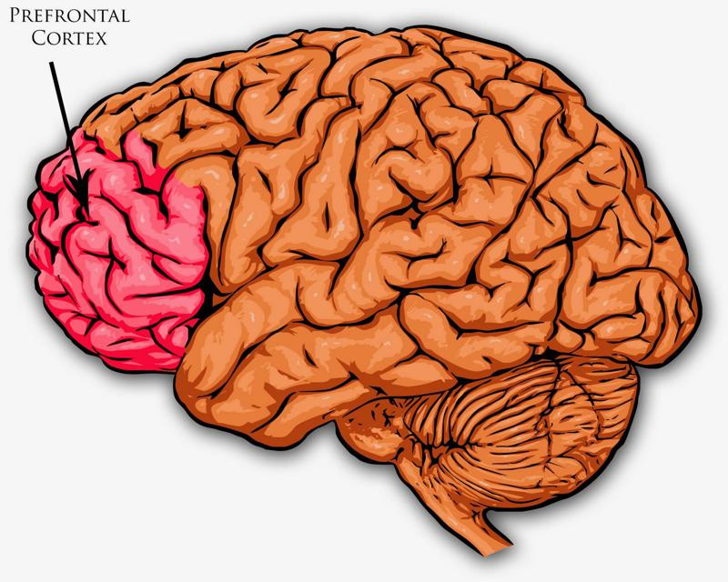
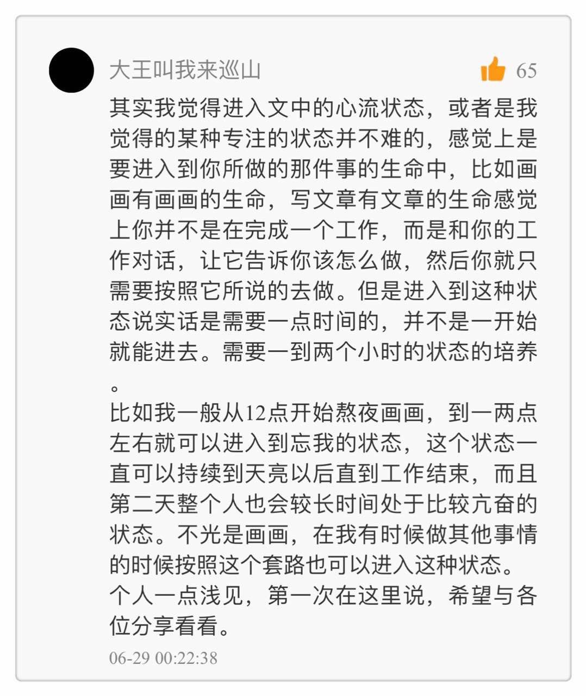
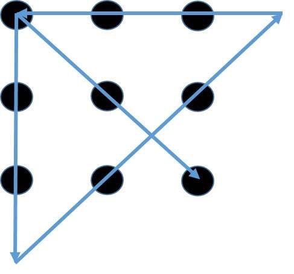

# 0202. 盗火2：禁药的诱惑
> 万维钢·精英日课第一季
2017-06-30

今天咱们继续说科特勒和威尔的《盗火：硅谷、海豹突击队和疯狂科学家正在给我们的工作和生活带来一场革命》这本书。

咱们先来做个小测试。这是一道著名的题，可能你早就做过 —— 

图中是 3 × 3 一共九个点，摆成一个田字形的点阵。现在给你 10 分钟的时间，看你能不能用一笔画四条直线，经过全部九个点。如果你感兴趣可以做做这个题，答案我们放在文章最后。这道题完全不重要，你做没做出来都说明不了什么 —— 我想说的是，现在有一个办法，能把你做这种题的能力提高七倍。 

## 2.1 创造力是状态，不是技能

上次我们讲到，现在美国有很多力量正在积极探索「出神技术」，让人进入「心流」状态。心流的一个好处就是能提升创造性思维，解决复杂问题。麦肯锡咨询公司 2013 年有个报告，根据历时十年、针对大公司高管的调查，这些高管说心流状态可以让他们解决复杂问题的能力提升五倍。

创造力并不神秘。咱们专栏以前有两期讲《到底什么是发散思维》，说的就是创造力。首先你要在头脑中储备大量的相关知识，然后在某一时刻，你建立一个遥远的连接 —— 把表面看上去没有关系的两个东西连到一起，问题可能就解决了。你「啊哈！」一声，这就是所谓的「尤里卡时刻」。

问题在于，尤里卡时刻似乎总是不经意地出现，经常都是大脑比较放松的时候，比如说散步或者是半睡半醒的时候。这使得创造力有点可遇不可求。所以现在有个说法，创造力不是一个「技能」，而是一个头脑「状态」。

上一期我们讲到人的大脑有「β 波、α 波和 θ 波」，而当你进入尤里卡时刻的时候，大脑会有一种更高级的波，叫「γ 波」。咱们把这四种脑波捋一遍 —— 1）β 波：对应前额叶皮层主导的理性思维，保持机警；2）α 波：对应白日梦，更平静的大脑活动；3）θ 波：对应排除外界干扰的深入思考；4）γ 波：对应创造性思维的尤里卡时刻。

想要「出神」，达到心流状态，我们要的是后面这三种波，为此就得设法在一定程度上关闭前额叶皮层的活动 —— 也就是关闭冷认知，让热认知主导。那有没有什么特别的办法呢？ 

## 2.2 两种常规武器

以前有人研究过西藏的僧人，发现他们如果功夫深，可以在打坐中发出 γ 波。但是这个打坐功夫比「刻意练习」还要难，我们常说刻意练习要「一万小时」，而僧人打坐平均需要 34,000 个小时才能达到这样的水平，差不多要 30 年的时间。

那么我们马上就问，以前僧人打坐都是在黑暗中摸索，有没有现代化的方法能缩短训练时间呢？有很多。美国现在非常流行「冥想」，有各种冥想培训班，相关的研究也很热门。冥想我还不太了解，但是据说，参加冥想训练八个星期，就能让人的创造性思维水平显著提高。后来还有人说五个星期就可以，甚至还有说冥想训练四天就有效果。

如果你觉得四天还是太慢，你可以尝试另一种武器。咱们开头说的那九个点的问题，曾经在 2012 年被悉尼大学用来做过一个实验。他们测试的是「经颅磁刺激」（transcranial magnetic stimulation）。这似乎本来是治疗抑郁症的方法，用很微弱的磁脉冲去刺激大脑，把大脑的前额叶皮层暂时关闭。悉尼大学则是使用这个方法让人获得 20 到 40 分钟的心流体验。 

图片未必与内容相关，仅供参考。实验结果是，没被刺激的受试者，只有 5% 做出了这道题；而接受了刺激的受试者，有 40% 的人做出了这套题。美军走得更远，使用一个所谓「神经反馈」设备让人达到心流，据说认知能力和学习能力提高了 4-5 倍。所以以后要想学习好，「头悬梁锥刺股」可能就已经过时了，得直接给大脑上电磁刺激才行！？但这还不是最厉害的。更快更方便的方法，是服药。 

## 2.3 迷幻蘑菇

2012 年，有人对美国几所常春藤大学的学生做过一个调查，其中 1/5 的人为了应付学习和考试使用了「聪明药」。所谓聪明药，其实是一些治疗儿童多动症的处方药，但是从非正常渠道没有处方也能买到。如果这个药能让多动症儿童集中注意力，当然也能让正常人集中注意力。

等到 2015 年，更新的调查表明，全美国大学生中已经有 1/3 的人使用聪明药。现在人们讨论的焦点甚至都不是要不要禁止聪明药，而是服用聪明药应付考试算不算不公平竞争。更厉害的办法，则是用微量的迷幻药。多年以前，有人召集了 27 个从事创造性工作的人，其中有工程师、数学家和建筑师等。这些人的一个共同点是他们当前都遇到了各自工作中难题，一时之间解决不了。这 27 个人在加州某地聚在一起，每人服用了 50 毫克的 LSD。

LSD 是一种强力迷幻药，但 50 毫克是一个很微弱的剂量，不会让你产生幻觉。服药之后，马上对这些人进行认知能力综合测试，结果是都提高了，最高的人提高了 200%。接着给他们每个人 4 个小时的时间解决自己带来的问题 —— 结果其中就有好几个人，真把问题解决了，这可都是第一线的数学和工程问题。

那如果你现在有个什么问题解决不了，有人给你 50 毫克 LSD，你吃还是不吃？据说乔布斯吃了。而且很多人都吃了。 2015 年，CNN 采访了一位这方面的专家，这位专家说，他认识的几乎所有亿万富翁私下都在服用迷幻药来提升思维能力。

还有更厉害的。有一种迷幻药学名叫「裸盖菇素」，它是从一种蘑菇中提炼出来的，所以被称为「迷幻蘑菇」。 

1962 年，哈佛大学神学院的一个研究生，叫沃尔特·潘克（Walter Pahnke），用迷幻蘑菇做过一个非常大胆的实验。在耶稣受难日这天，潘克找了波士顿某个神学院的 20 个学生，分成两组。他第一组十个人服用了迷幻蘑菇，第二组十个人服用了维生素 B3 作为安慰剂。然后这 20 个人一起去参加了耶稣受难日的教堂活动。

回来以后，潘克让着 20 个人评价一下自己的受难日活动体验。结果迷幻蘑菇组都表示有一种很强烈的神秘体验，仿佛真的接触到了神灵一般，而维生素 B3 组就没什么感觉。最让人吃惊的是，这个体验几乎是永久的。到六个月之后，迷幻蘑菇组的学生仍然反映他们现在对宗教有更强烈的信仰。信仰到什么程度呢？这 10 个人里面有 9 个人最终选择当了牧师。要知道从神学院毕业的人也不一定都当牧师，对照组那十个人中就没有一个人去当牧师。

这个效果也太神了。潘克的实验后来被人重复验证了两次。2015 年，有个科学家在《纽约客》杂志写文章说，因为涉及到毒品和道德问题，现在这样的实验已经被强行停止，不让继续研究，也不让讨论，所有资料封存。在现代科学史上，这是非常罕见的事情。  

说到这里，我觉得今天可能说得太多了 —— 该说不该说的都说了。最后强调一句，此书作者指出，你是用冥想也好、戴头盔的技术也行，跟服药的效果是殊途同归。另外，我前几天刚刚在《新科学家》杂志看到一篇相关的报道，「Microdosers say tiny hits of LSD make your work and life better」（6 月 14 日）。这篇报道说的也是现在有很多专业人士在偷偷使用微弱剂量的 LSD 和魔幻蘑菇来提升认知能力和改善情绪。这篇文章基本上说了三句话：

有人用了，说有效。

到底有没有效，目前还没有人做过大规模的严格科学实验。

短期实验表明，微弱剂量的迷幻药似乎对健康影响不大，但是科学家并不建议使用。

## | 由此得到

目前的出神技术有三种：其中两种常规的是冥想和用外部设备刺激大脑，一种特别有争议的方法则是服用违禁药物 —— 而这后一种方法，反而是现在用的最多的。

## | 友情提示

我们《精英日课》坚决反对服用任何形式或者任何剂量的毒品，连沾都不能沾。LSD 和迷幻蘑菇在包括美国在内的很多国家都是违禁药物，在中国携带毒品更是重罪。短期的效果和实验都是靠不住的。也许使用一两次无害，但是长期使用会不会上瘾？人对药物刺激的反应会不会越来越弱，必须不断加大剂量？如果一个宗教或者政治组织，使用迷幻剂招募成员，这难道不是犯罪吗？

冥想和头盔刺激好不好使，我不知道，而且我认为也不需要。比如上一期专栏介绍这本书之后，咱们一位画家读者，叫「大王叫我来巡山」，就分享了自己的经验 —— 进入心流专注状态并不难。 

我们解读这本书，完全是因为现在有个公开的秘密，我认为你应该知道。

九点问题答案： 

本期推荐阅读：

日课119｜到底什么是发散思维（上）

日课120｜到底什么是发散思维（下）

## | 得到更多 尤里卡时刻

「尤里卡」原是古希腊语，意思是：“好啊！有办法啦！”古希腊学者阿基米德，有一次在浴盆里洗澡，突然来了灵感，发现了他久未解决的计算浮力问题的办法，因而惊喜地叫了一声「尤里卡」，从此发现了阿基米德定律。