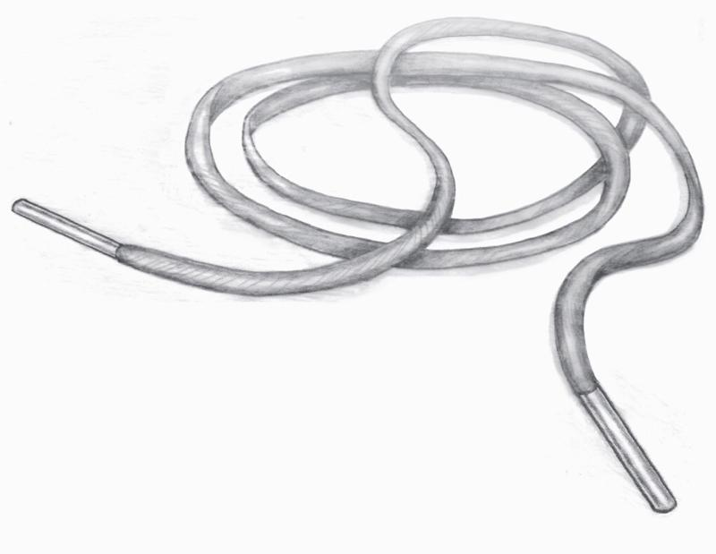

## 1906. 端粒效应6：你我的端粒

2017-07-19

今天咱们把《端粒效应》这本书说完。前面我们一直在讲做什么事能影响自己的端粒 —— 锻炼、健康饮食、正确面对压力 —— 但是人的命运并不完全掌握在自己手中。今天要说的，就是我们掌控之外的因素。

环境肯定对端粒有影响。如果你住的地方附近有绿地，你能经常感受一下大自然的美好，你的心理和生理都会更健康。如果你进一步还能享受到绿色食品那就更好了 —— 我本来对有机食品非常不以为然，但此书作者多次强调普通食品的农药和化学残余对端粒很有害处。也许作者是有点多虑了，我看别的研究都说普通食品非常安全。真正的问题是，有些环境不像有机食品这么容易选择。更重要的环境，其实是人的环境。 

### 6.1 都市丛林里的端粒

德国人做过一个研究。研究者找到一群在城市居住的人，和一群在乡村居住的人，把他们请到实验室里做一个压力实验。这个压力实验的方法是让你做数学题。你一边做题，实验人员一边通过耳机去督促你抓紧做，弄得你非常紧张。与此同时，实验者用功能性核磁共振扫描受试者的大脑，观察他们的大脑中对压力的反应。你猜是城市居民，还是乡村居民更能适应压力？结果是城市居民更容易把压力视为威胁。他们大脑中「杏仁核」这个部位的活动明显更活跃，而这个部位负责的是恐惧感。对比之下，乡村居民面对压力表现得更轻松一点。

西方国家的城市和乡村格局，跟中国很不一样。中国是城市经济条件远远好于农村，而西方国家城市里有些区域简直就是都市的贫民窟，治安非常差。这本书的作者布莱克本以前在耶鲁大学做过博士后，她说住在耶鲁附近你都不敢骑自行车上下班，因为直接就会被抢。长期生活在城市里的人，学会了时刻保持警觉。

这种警觉感是一种生存本能，但并不是抑郁。科学家把抑郁症的因素排除掉，剩下的这个警觉感，仍然能让端粒缩短 —— 因为这是对压力的威胁反应。长期保持警觉有利于在不安全的地区生存，可是「生存」不是「生活」，这是为了生存而牺牲健康。

我们知道美国现在基本上是个贫富隔离的状态，穷人住穷人区，富人住富人区。你甚至能从一个小孩出生地的邮政编码，大体判断他的受教育水平和未来的经济状况。而现在还要再加上一个端粒长短。

不过从端粒角度来说，「好社区」不等于有钱的社区。关键词叫「社会凝聚力」 —— 社会凝聚力强的社区，人和人之间能互相帮助、互相信任、相处融洽、有相同的价值观，有问题能互相依靠。咱们想想几十年前的中国，大家都不富裕，但是因为贫富差距很小，社会凝聚力比较强，大家身心就比较健康。而如果一个国家贫富分化严重，治安恶化，那可能就连有钱人也不会感到幸福。 

总体来说，贫困对端粒很不好。但只要能满足基本生活需求，金钱对端粒的直接影响并不大。社会关系比金钱重要。如果一个人住在凝聚力高的社区，跟家人和朋友相处融洽，那就算钱少点也没关系。但是另一方面，受教育程度非常重要 —— 研究发现受教育程度对端粒的影响上不封顶，受教育程度越高，端粒就会越长。这个结论跟我以前看到教育对老年痴呆症的影响一样，所以上大学真得算是一种福利啊。

职业也很重要，而且可能比收入还重要。一个坐办公室的白领，哪怕是个工资不高的底层员工，他的端粒也会比一个收入更高的体力劳动者长。有人调查过同卵双胞胎，基因一样、从小的生活环境也差不多的两兄弟，一个成了白领，一个成了蓝领，白领的端粒要比蓝领的长。这就是不同社会地位对端粒的影响。更可怕的是，这种影响是会遗传的。 

### 6.2 贫困病的遗传原理

露西是个美国的女高中生，她是个黑人，生活在一个单亲家庭，母亲带好几个孩子疲于奔命，不怎么管她。17 岁这年，露西怀孕了。男朋友一走了之，母亲气愤之余拒绝帮忙，但是坚强的露西决心一个人把孩子养大。她离开家自己租了个小公寓，为了支付房租和生活费不得不从高中退学，在一家超市当上了收款员。露西面临很大的生存压力。我们大概可以想象，露西的端粒不会很长。那么请问，露西的孩子的端粒，将会是什么水平呢？从端粒角度，父母对孩子的影响有三个方面。

首先是遗传。端粒长度是可以不通过基因遗传的，称为「直接传递」（direct transmission）。也就是说，如果怀孕时候父母的端粒因为后天环境原因比较短，那么哪怕双方都不携带什么能让端粒变短的基因，他们的孩子的端粒，也会一出生就比较短。特别是母亲的影响更为重要。我们前面讲过小孩一出生的端粒长度都在一万个碱基对左右，比父母的长。但父母的端粒对孩子的端粒有影响。一个卵细胞的染色体端粒如果短的话，通过染色体配对变成受精卵的时候，受精卵的染色体端粒也会就比正常的小孩要短。咱们专栏以前有一期叫《贫困病》，这就是为什么贫困病会遗传。露西的孩子的端粒，从受精卵状态就比别的孩子短。但孩子的坏运气才刚刚开始。

露西影响孩子的第二个方面是孕期的心理压力。我们前面讲过人在面对压力的时候肾上腺会分泌皮质醇。过多的皮质醇对胎儿非常不好，会带来一系列症状，比如说胰岛素抵抗。有研究发现，怀孕期经历了亲人去世和离婚这种人生重大打击的女性，孩子的健康状况差、端粒短。

第三重打击是在孩子出生以后。家庭环境不好，缺少父母关爱、甚至可能被父母忽略的孩子，会有一系列身体和精神问题，端粒短只是其中之一。

这是一个可怕的恶性循环。露西的生活非常艰难，她的端粒本来就短，她生下来的孩子的端粒从一出生就很短，孩子生活这样一个不稳定的家庭里面，将来的端粒只会越来越短。那么这个孩子的孩子，会不会比她自己、比露西、比露西的妈妈都还要短？如果就这样一代一代传下去，这不就是家族式的贫困陷阱吗？

以前我看戴维·布鲁克斯的《社会动物》这本书提到一个数据：美国中产阶级的孩子超过三分之二生活在完整的双亲家庭中，而穷人则有三分之二生活在单亲家庭里。现在又加上一个贫困病可以遗传，那美国穷人还有希望吗？

我在前面说过，健康并不是什么竞争性的项目，人用不着拼死拼活，就能获得健康长寿 —— 不过今天得补充一句：前提是你的运气得比较好。如果你生长在一个充满关爱的家庭环境中，你周围的亲朋好友对你是非常支持的态度，你的环境充满了社会凝聚力，你有足够的安全感，在这种情况下，你想要获得健康是一件很容易的事儿。但是别忘了，有很多不幸的人没有你这样的条件，他们想要获得健康可能就很困难了。我觉得相对于西方国家的人来说，中国人有一个非常大的优点，就是特别热爱生活，永远认为日子有奔头，特别是想方设法给孩子一个比自己更好的生活。这个优点，大概就是让中国人摆脱贫困病命运的关键。

一个好家庭是什么样的呢？在怀孕之前，夫妻双方都是比较靠谱的人，他们的端粒不应该太短。在怀孕期间，要保证充足的营养，要保证一个没有压力的环境。孩子生下来之后，给孩子足够的支持和关爱。这些就是每个人生活的责任。就算端粒长短能遗传，人的命运也不是一出生就定死了。我们总能主动选择按照书中说的方法做一些事儿，主动选择让自己和别人的端粒更长。你的端粒不是你自己能左右的，它也是你周围所有人的事儿。反过来说，别人的端粒，也是你的事儿。

最后让我们再看一眼这根鞋带 ——  

这就是你的端粒的样子。人生在世要活得潇洒一点，没必要时时刻刻担心健康 —— 但是我希望，至少我们每次系鞋带的时候，都想想自己的端粒。
