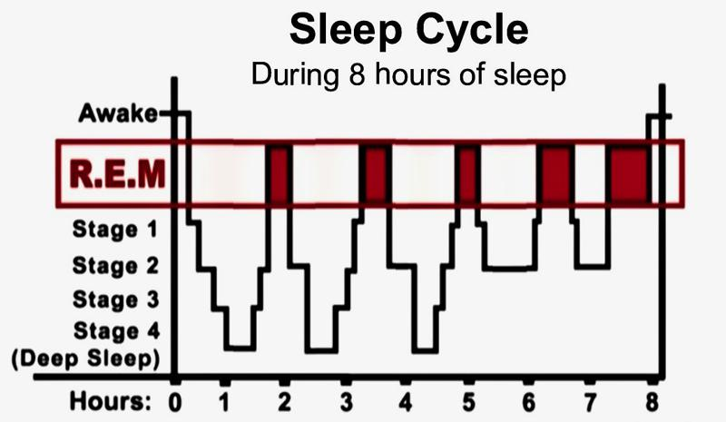
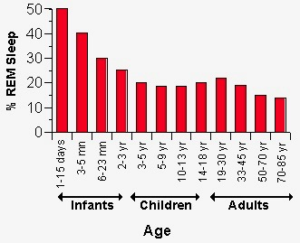

# 2104. 巅峰表现4：哪种睡眠最宝贵
> 万维钢·精英日课第一季
2017-08-07

今天咱们继续说史托伯格和马格内斯的《巅峰表现》。几十年以前的人从来不认为睡眠是个值得讨论的问题，而今天的人非常关注睡眠话题 —— 这主要是因为现在人们普遍睡眠不足。一部分原因是为了工作，一部分原因是为了娱乐。这是一个晚上有太多好玩的事情可做、实在不想睡的年代。

1942 年美国人平均每天睡 7.9 个小时，今天则是 6.8 个小时。专家建议的成年人「充足睡眠」是每天睡 7-9 个小时，而 65% 的人做不到。为了少睡，人们发明了各种做法。比如有个据说是达芬奇发明的「多相睡眠法」，说睡觉不要连续睡长觉，应该把一天 24 小时分成六块，在其中每 4 个小时睡半小时，这样你一天的实际睡眠时间只有三个小时，还能保持精力充沛。

这种少睡的方法可能都不靠谱。要知道该怎么睡，我们得先知道人为什么要睡觉。在原始的野外生活中，晚上睡觉等于是把自己置于危险之中 —— 所以一定是有特别重要的理由，进化才让我们保留了睡觉这个功能。睡觉的功能，可不仅仅是消除疲劳。 

## 4.1 睡眠的周期

首先我们得说科学家仍然没有完全理解睡眠 —— 因为科学家并没有完全理解大脑，我们在很大程度上是把人体当成一个黑盒子去观测。但有些知识是千锤百炼非常明确的。比如说，我们知道，人睡觉的时候并不是一成不变地就睡在那里，而是呈现周期性的变化。下面这张图，是 8 个小时睡眠时间内，典型的睡眠周期状况。 

我们看到，在每个周期内，睡眠被分成不同的阶段。第一和第二阶段是「浅睡」，第三和第四阶段是「深睡」（也有人把整个「深睡」算是一个阶段），红色的区域则是「快速眼动」（Rapid Eye Movement，简称 REM）睡眠。我们是从浅睡，到深睡，到 REM，完成一个周期，然后又回到浅睡，以此类推。

浅睡的时候，你睡得……比较浅。第一阶段只有 10 分钟左右，你的眼睛闭着，可以说是睡着了，但是随时可以醒过来。到第二阶段，你的心率开始变慢，你的体温开始降低。这个时候如果有人叫醒你，你很容易就能起来。

进入深睡，你的身体就开始修复工作了。你的肌肉组织和骨骼开始生长，你的免疫系统也会得到加强。你的心跳很慢，你的呼吸很沉，你的肌肉已经松弛下来。在这个阶段你不会做很多梦，就算做梦了也记不住。这时候如果有人看见你睡觉的样子，会认为你睡得非常香甜。如果叫醒你，你会非常难受，迷迷糊糊根本不愿意醒过来。

但是深睡还并不是最重要的睡眠阶段。接下来发生的快速眼动睡眠，才是最宝贵的。深睡了一段时间之后，你又开始向浅睡转变。你的心率增加，你的血压升高，你的呼吸变得急促，你的大脑同时发出 α、β 和 θ 波 —— 一句话，你就好像醒了一样。

事实上，如果测量这个阶段你的大脑消耗氧气的情况，会发现比你清醒状态下做一道最复杂的数学题的时候还多，这说明你的大脑正在高速运转 —— 唯一不同的是，你的肌肉现在比深睡的时候更松弛了，几乎是瘫痪的状态。

也许这个肌肉瘫痪而大脑活跃的局面，就是有人在睡梦中会感到「鬼压床」的原理。科学家管这个阶段叫做「快速眼动睡眠」（REM），因为他们发现人在这个阶段中，眼球一直在快速运动，就好像一直在到处「看」东西一样。有这样的视觉感受，是因为你正在做梦。人在这个阶段会做各种复杂的梦，而且这些梦容易被记住。

人在 REM 睡眠期有时候会醒过来，但是片刻之后会继续入睡，这大概就是为什么有时候你做了一个梦，中间醒过来想想，然后还能接着做。REM 期被叫醒也不是很难受的体验，最大的遗憾可能就是一个好梦没做完。我以前用过一个手机 APP（叫 Sleep Time），你设一个闹钟，它不是正好在你设定的时间叫你，而是特意观察到你处在 REM 期的时候才叫你。

下面这张图的左边是非 REM 期的大脑活动情况，右边是 REM 期的情况。图中红色表示更活跃，蓝色表示不活跃。非常清楚，在快速眼动睡眠期，我们的大脑非常、非常活跃。 

这么活跃，可不仅仅是因为做梦。

## 4.2 快速眼动睡眠的好处

睡眠的几乎所有重要好处，都是因为 REM 睡眠。我们说锻炼的原理是因为人体是个反脆弱系统。白天锻炼，身体经历的是所谓「分解代谢」，你的肌肉会被一定程度的撕裂。晚上睡觉的时候身体会经历所谓「合成代谢」，对肌肉和骨骼进行修复 —— 所以运动员必须特别重视睡眠。我们刚才说在深睡期人体就开始了修复工作，是我在网上看到一处资料的说法。而《巅峰表现》这本书说，得先经历一次 REM，是 REM 期间分泌的合成代谢荷尔蒙，才能让此后的合成代谢工作开始。

但是 REM 睡眠最重要的工作是发生在大脑中。我们专栏之前在《到底什么是发散思维（下）》这期讲过，白天学的技能和知识，需要大脑在晚上消化、重组一番，才算真正「长」在了我们身上。这个消化重组的过程，就发生在 REM 期间。

大脑在 REM 期如此活跃，是因为它在处理白天收集的信息。它要把新信息强化一番，存储在相应的地方，变成长期记忆。它还会回忆白天发生的各个事件，特别是引起感情波动的那些事件，形成更深入的理解和认识。也就是说，睡眠不仅仅是让身体恢复，更是让身体、特别是让大脑成长。而 REM 睡眠，就是成长的关键期。

我看有很多人做梦多了就有点担心，觉得做梦太累，影响了睡眠质量 —— 其实恰恰相反，做梦多代表经历了更多的 REM 睡眠，是高质量的表现。想要更多的 REM 睡眠，你就需要更长的睡眠时间。下面这张图是各年龄段人的 REM 睡眠所占比例 ——  

小婴儿百分之四、五十的睡眠都是 REM，而到了成人阶段，就只剩下了 20% 左右。咱们再看看前面第一张图，每个睡眠周期的长度是越来越长的，而且 REM 睡眠占总睡眠时间的比例也是越来越大。这就是为什么我们前半夜梦少，后半夜、特别是临近起床的时候，梦最多。也就是说，睡眠越往后，才越是黄金时段，我们必须睡得足够长，才能抓住更大比例的 REM 睡眠。

所以睡得少真不行，就算你表现出来精力挺充沛，但是你的 REM 睡眠不够。科学家建议的睡眠时间是每个晚上 7-9 个小时，具体长短因人而异，以不用闹钟、睡到自然醒为最好。各种研究发现，睡眠不足的人自控能力会变差，会更轻易地服从于短期冲动，不能合理决策，注意力也不集中。如果我们晚上实在睡得不够，白天打个盹补充一下行不行呢？ 

## 4.3 打盹的作用

关于打盹科学家也有很多研究。首先我们得明确一点，打盹不能真正「补充」睡眠 —— 因为你仍然错过了 REM 睡眠。打盹没有让大脑和身体生长的作用。但是打盹可以让人恢复能量和注意力。如果你白天感到又困又累，打个盹的确是快速有效的办法。NASA 做了很多有关打盹的实验，发现小睡 25 分钟，就能让判断力增加 35%，机警能力增加 16%。10-25 分钟的打盹相当于一大杯咖啡的兴奋作用。

请注意，打盹时间太长反而不好。有一派科学家认为打盹的最佳时间长度是 10 分钟！一般认为 10-30 分钟都是可以的。你甚至不需要真的睡着，就闭一会儿眼睛养养神都有效果。关键是一定要把打盹保持在浅睡状态。如果超过 30 分钟你就会进入深睡，你就很不容易醒，产生「睡眠惯性」 —— 强行被闹钟叫醒了，没睡够的感觉会非常强烈，精神状态反而不行。

所以打盹是个非常有意思的功能。小睡片刻就能起到很大的作用，这大概就是为什么有人每四小时睡 30 分钟，每天总共只睡三个小时就能保持很好的精力 —— 唯一的问题是他们可能失去了宝贵的 REM 睡眠。这本书中还给了一些良好睡眠的建议，咱们统一列举一下 ——  

## 由此得到

睡眠的作用不仅仅是消除疲劳，更重要的是让身体和大脑「成长」；睡眠是周期性的，每个周期末端的「REM 睡眠」，是最宝贵的睡眠阶段；打盹的作用仅限于恢复能量和注意力，打盹的时间不要超过 30 分钟；为了保证良好睡眠，晚上最好不要从事剧烈的脑力劳动，睡前不要喝酒；如果心静不下来，睡前可以用冥想的方法切换状态；睡前不要使用手机、电脑或者 iPad 之类的电子产品！这些东西的屏幕会给人一种「蓝光」照射，影响褪黑素分泌，让人不愿意入睡。

人到底应该睡多长时间？似乎是越长越好。有人拿斯坦福大学校篮球队的运动员做过一个实验，强迫他们每天必须睡十个小时，结果短跑速度提高了 4%，投篮命中率提高了 9%，而且反应时间也大大加快了。要知道这可都是专业运动员啊！ 

## 我的评论

所以你能每天睡十个小时吗？我肯定是无法做到，读了这段书之后深受震动。我喜欢在晚上工作，对着各种发射蓝光的显示屏……白天有时候还睡一个小时「补觉」 —— 可以说是每件事都做错了。不过我还是多做了一点调研。如果你睡觉少，也许不至于就损失了很多很多 REM 睡眠。有个现象叫「REM 反弹」（REM rebound），说对缺觉的人来说，REM 在睡眠周期中所占的比例会提高，REM 出现的时间也会提前。如果你平时连续缺觉，周末睡个长觉，你这个长觉的 REM 所占比例就能从平均 19.4% 提高到 26.6%。人体毕竟是个反脆弱系统，有人甚至提出用偶尔的睡眠不足来练习增加 REM 比例！但不论如何，能享受充足睡眠是最好的。 

本期推荐阅读：

日课120 | 到底什么是发散思维（下）