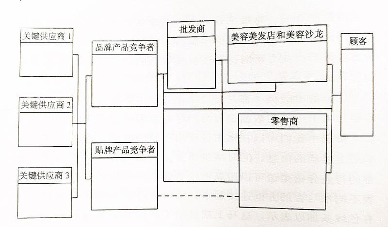
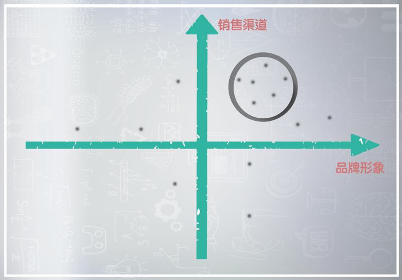
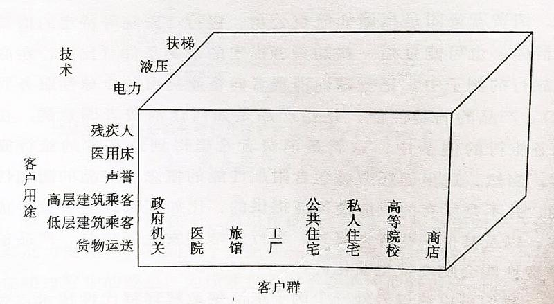

# 0905. 战略集团 | 如何看清对手

宁向东的管理学课

2017-12-22

每个人都有竞争对手，每个企业也有竞争对手，竞争对手分析几乎是我们每天都要做的事情，所以，这一讲的课，我们就讨论一下如何进行竞争对手分析。

## 5.1 战略集团

竞争对手分析的第一步，就是要搞清谁是你的竞争对手。你也许会说，我天天都在和人竞争，难道竞争对手是谁，我还搞不清吗？我和你讲，你可能还真搞不清。至少我当年就没搞清，后来我才知道其实很多人都没有搞清。

以前，我曾经说过，我读中学的时候，一直把我的同班同学、同年级同学当成竞争对手，他们也是一样，于是，大家互相防范。每次期末考试，都想争班级里、年级里的第一名，所以，平时都是彼此戒备着。后来，我进了清华才知道，原来大家根本就不是对手，而应该是合作伙伴。我们每个人的真正对手，其实在高中的时候根本就没有出现过。

为了能够让每一个企业都找到竞争对手，管理学里出现了一个专用的词汇「战略集团」。这个词的英文叫 strategy group，来自于上一讲课中讲过的大师波特，但这个名词翻译成中文有一点变味，它的准确意思就是「竞争对手群」。按照波特的想法，凡是竞争战略相似的，就属于一个战略集团，而属于一个战略集团的，都是竞争对手。简言之，波特就是希望用这样一个词，来帮助你识别出真正的竞争对手。

## 5.2 搞清竞争对手是谁

搞错了竞争对手，结果就是致命的。比如，我们讲的由波特教授亲手创立的咨询公司「Monitor Group」，你说谁是它的竞争对手？你可能会想到麦肯锡、贝恩、BCG 这些大牌咨询公司。Monitor Group 在全世界所有的咨询公司里面排名第九，所以，说它和麦肯锡是竞争对手，也没有什么不对。但是，所有传统的咨询公司现在遇到的最大对手，并不是它们彼此，而是IBM等新兴的咨询公司。

IBM 这些新兴的咨询公司，它们的竞争力就在于：传统管理咨询公司的那些套路，这些新公司全会。这是因为，这些新型咨询公司都是从做业务转型做的咨询。就以IBM为例，最初它是做产品的，后来改做服务，自己做服务做得不错，转型完成得不错。他们就用自己的转型经验去做咨询，于是，就有了和业务高度结合的咨询经验。咨询方案的落地，就更有保障、有基础。有关这方面的内容，你如果有兴趣，可以去看 IBM 的前 CEO 郭士纳的书《谁说大象不能跳舞》。

其实，国际上四大会计师事务所的咨询业务也从各自的审计业务中分离了出来，它们的咨询也和传统的管理咨询公司形成了差异。我总是隐约地觉得：如果 Monitor Group 早一点转型，把竞争对手定位在后边这一类咨询公司身上，结局不一定会是被迫卖掉。所以，搞清你在哪个战略集团之中，搞清你的竞争对手是谁，非常重要。

## 5.3 竞争对手分析

那么，搞清了竞争对手之后，要做什么呢？这个问题不用我回答，你也知道，就是灭掉它。一时做不到，就要从长计议，等待时机灭掉它！当年朱升对朱元璋说：高筑墙、广积粮、缓称王。最后还是要称王，只是现在时机不到，等一段时间再说嘛。朱元璋等了15年。这不容易，朱元璋相当于卧薪尝胆15年，没有轻举妄动。但是，朱元璋一动手，朝代就换了。

如果你熟悉明史，你会发现朱元璋15年所做的事，和今天战略管理课程所教的内容是一致的。就是：确认竞争对手最容易受到攻击的领域，然后，不断评估自己的战略性行动，积攒实力，逐渐从对竞争对手的劣势，到相对优势，再到绝对优势，最后取而代之。这叫「攻击策略」。同时，还要确认竞争对手可能采取的、会威胁到自己市场地位的举措，采取措施，积极防范。这叫「防御策略」。

我们在之前的课中讲了，竞争的最高境界是心中只有一个对手，就是自己。战胜自己，这是基业长青的一个法宝。但是，对于更多的企业，除了战胜自己之外，往往还有一些非常明确的竞争对手，所以，还必须要在竞争对手分析的基础上，找到自己的防御策略和进攻策略。

2003 年，我主持翻译了一本叫做《竞争对手分析》的书，我帮你从书中截出了两个图。一个是行业的轮廓图，可以作为昨天课程的一个补充，你可以用这个图来梳理一下行业上下游的关系，也可以想想跨界有可能从哪个方向上发生。

某种化妆品的行业轮廓图

另外一张图，就是有助于你来理解怎样找到竞争对手的。这个图示最早来自于波特，就是找两个战略维度，比如一个坐标轴是公司的品牌形象，另一个坐标轴是公司的销售渠道。于是就形成了更加细分的市场。市场的大小可以画成不同直径的圆圈。然后，可以把符合相同特征、条件的企业，画在同一个圆圈之中。在同一个圆圈之中的，就是竞争对手。

下面的图来自于我翻译的那本书。例子是关于电梯行业的，三个维度都是从客户性质的角度去划分的。当然，我们也可以采用其它一些划分方法。不过，从客户的角度来寻找竞争对手，我觉得是最直接、最有效的方式。

我们前面讲到过客制化。你可能不知道，电梯就是典型的客制化产品。我自己曾经访问过电梯公司的高管，了解过这个行业的一些细节。你知道吗？从理论上讲，这个世界没有两个电梯是相同的，因为每一个楼宇都是独特的。看上去外观上完全相同的电梯，实际上它的控制系统可能是完全不同的。因为每个楼的用户不同，各个楼层使用电梯的人数不同，使用高峰的时间不同，所以，电梯这个貌似相同的产品，后台的东西可以完全不同。但是，这位高管和我讲，中国的用户里面真正把电梯的后台系统利用起来的，不到 10%。所以，客户的不成熟也使他们的竞争逻辑完全不同。

## 5.4 召开战略研讨会

回到我们的主题，当你明确了自己的竞争对手，你就要经常算计这个对手。又到年底了，很多公司要开战略研讨会。我有时候会客串去主持这种战略研讨会，我总是带着大家问这样一些基本的问题：

1、我们的竞争对手，这一年来和我们自己相比，差距是不是拉大了？彼此的竞争态势是不是发生了一点变化？如果有变化，在哪一点上可以明确地判断，确实发生了变化？

2、这些变化，是因为竞争对手的目标和战略发生变化而引起的吗？

3、在对手的客户满意度、销售额和盈利上，我们能够看到产生这些变化的原因吗？

4、这个行业在整体上有没有发生变化？在竞争对手的变化中，能不能找到一些痕迹，让我们意识到这个行业正在朝向某个趋势变动？而竞争对手的变化是对这个趋势作出的反应吗？

5、考虑到主要竞争对手的状况，我们有没有必要改变我们的策略，重新思考我们的努力在方向和节奏上是不是恰当的？

6、我们在这个行业是进步了，还是落后了？影响这种竞争地位变化的关键因素是什么？

在我引导着大家思考和讨论这些问题的时候，我发现了一个比较大的问题。就是很多公司并不了解它们的竞争对手。对手的信息都有，但是分布在组织内部的不同人员、不同部门之中，并不够集中。所以，我常常建议一些企业应该责成专门人员去系统搜集竞争对手的信息，并且有一个关于搜集竞争对手信息的协调人。

搜集竞争对手信息的方法，包括两大类：

从公开资料上进行分析。比如，分析关于对手活动的文章，竞争对手所在地的报纸、网站、招聘广告、政府文件等等，都会透露出一些有价值的信息；

必须要通过实地调查才能得到的信息，这就需要有针对性地索取，包括从销售、工程、分销渠道、供应商等处去索取，甚至有时还需要动用市场调查公司等等。

我熟悉的一家企业更加神奇，他们了解其竞争对手信息的方式，竟然是通过对手常常使用的猎头公司，通过该公司对技术人员的招聘来判断对手的技术方向。

课后思考：这一讲，主要讨论了竞争对手分析。课后，请你思考一下，我们用来做竞争对手分析的套路，是否也可以用于内部不同业务部门为了完成业绩目标的竞争呢？这个问题的本质就是，我们能不能把兄弟部门，看成竞争对手去了解、学习和超越呢？