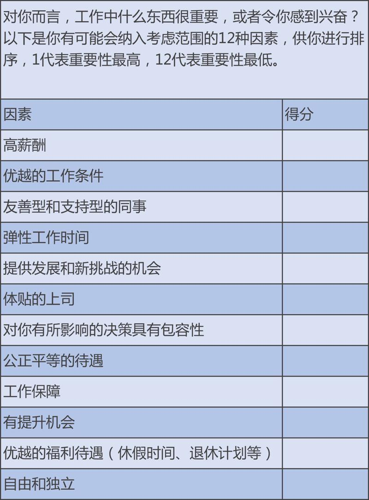

# 1301. 动机理论 | 是什么在激励着你
> 宁向东的管理学课
2018-03-26

从这一讲起，我们开始一个新的模块，激励。要讲清楚激励，就必须要从动机这个概念开始，因为人类的所有行动，都是出自于某种动机。首先，我想和你强调的是：在中国，一谈起激励，大家就会很自然地联想到奖金、工资、股票、期权这些物质性的激励，这是一个误区。

尽管我们后面的课程也会花很大力气向你介绍这些物质激励的方式，但是，我也希望你能够了解一些非物质激励的方式。比如，增加工作的新鲜感，可以是一种激励的方式；再比如，设定较高的目标，而且这个目标是员工愿意接受，他愿意为此去挑战的，这时也会产生较强的激励。

## 01. 三种典型的动机

上面有一个表格，依次涉及到薪酬、老板、同事、工作条件、工作时间、福利待遇、升职机会等等因素。我希望你课后抽时间看一下，填一下，说不定可以让你更了解自己的状态。

我下面讲三种动机和激励的状态。

比如，你现在也许正在地铁上，或者在公交车上听我讲课，周边的环境拥挤嘈杂，你为什么还会坚持学习？这和动机有关。你正是基于对自己的某种期许，坚持每天早上第一时间收听我的管理学课。这是一种来自于你自己的动机，非常简单，「天生我材必有用」，这种动机让你有足够的激励，每天早上收听，每天晚上复习，学习这一门管理学课。没有外界的压力，但你坚信，总有一天你会走上管理岗位，你需要最综合的管理学训练。

再比如，你也许昨天没有回家，在办公室打地铺加班。为什么？因为你要对得起投资人，对得起和你一起创业的兄弟姐妹们，你一定要在下一轮融资到来之前，达到看上去还很遥远的业绩。你不想让大家失望，更不想让亲人失望。这也是一种动机。这种动机来自于他人，它也形成了一种激励。

还有一种情况，你昨天也许被老板骂了个狗血喷头，但你今天还是怀揣郁闷，按时上班。为什么？因为你的报酬还不错。昨天，你也许就想过摔门而去，说上一声：老子不伺候了。但想想在其它地方不容易挣到的薪酬，你还是忍住了。你在心里对自己说：看在钱的份上，算了。高薪酬，毫无疑问在这时就是一种动机，这种动机让你产生了继续工作的激励。

总之，所有的人类行为都是因为受到了某种激励，而激励的背后最根本的因素是动机。

## 02. 洞悉下属的心理状态

那么，作为管理者，关于动机，你需要知道什么呢？

首先，你必须要知道，动机是一种心理状态，这种心理状态可以因为内在的，或者外在的因素而被激发，它可以让人一直朝向目标的方向而努力。强烈的动机可以维持高强度的努力，这种努力可以非常持久。而一旦动机消失了，努力也随之消失。

其次，不同的人也许做相同的事情，但他们的动机可能是不一样的。对一些人非常起作用的激励方式，对另外一些人来说，可能作用微乎其微。所以，激励方式应该因人而异。要成为有效的管理者，必须要了解每一个员工的动机，用最适合他们的激励方式去促使他们努力工作。

以前有一本书，叫做《首先要打破所有规则》。书的作者是著名的盖洛普公司的研究员，他在这本书中描述到：伟大的管理者会是这样的一种人。他会说：来和我一起工作吧，我将尽全力帮助你成功，我想让你比我还成功。所以，和这种伟大的管理者一起工作，员工会有激励，忍受很多工作中的不如意。这就是非物质激励的例子。

下面，我讲一个案例，帮你强化理解一下有关概念。

在组织中，我们常常会遇到一些下属，他有没有能力呢？确实有能力，但是，他不够卖力。一个人在工作中不够卖力，表现出来的情况非常多，比如用各种托词拒绝任务，比如不愿意和同事配合，等等。但他在这些表象背后的原因可能只有一种，就是完成任务，和他自己的成就感是没有关系的。

解决这种问题，很容易让人想到的办法，就是加钱。一般来说，把钱加到足够高的程度，没有人会有能力，但不出力。但是，加钱这种办法，是有很大问题的。

首先，是没有办法摆平各种人之间的关系。给一个人加了，给别人加不加？坦率地说，一个组织如果形成了靠加钱来解决问题的局面，后面的麻烦就多了。最大的麻烦就是加钱会有一个天花板，加到市场价，就加不上去了。而且，今天靠钱解决了激励的问题，明天遇到麻烦，难道再加钱吗？

我有一个朋友，是个激励高手，他一般都不愿意用钱解决问题，即使有时候要用钱，他也要匹配其它的手段。他和我分享他的经验，他的观念其实特别简单。他认为，一个有能力的人，不肯高水平地完成工作，就是因为，这件事不足以满足他的成就感。

我的朋友认为，一个人要倾尽全力地工作，一定要有在金钱之外的收益。很多人倾尽全力的动机，都是在于要为了获得承认。我的这位朋友特别向我强调，你千万不要因为在你的内心中，觉得已经承认他了，就 OK 了。他说，人不仅要在心目中能感受到「你的承认」，而且还要感受到你的承认是真诚的，是「发自内心的、五体投地的承认」，他才会给你卖命。

我的朋友曾给我举过一个例子，来介绍他的激励术。当时遇到的情况，就是大区的副总经理本来要被调到总部去，担任一条职能线的副总，虽然是平级调动，但毕竟去了总部。但我这个朋友生生把这个调动给拦下了。于是，这位大区副总就不肯卖力了。我的朋友先找这位大区副总进行个人谈话。他说：我觉得这个大区离不开你，很多事情只有你可以做好。如果你做不好，我不相信还有谁可以做好。

然后，我的朋友当着大家的面，讲他为什么不放那位兄弟走的原因。他丝毫不忌讳。他说，前段时间公司准备把某某总调到总部去，我给拦住了。为什么呢？因为我对上面的领导说，你要找一个在总部机关负责这个岗位的人，不难找，可以在全公司里面至少找到十几位。但是，你要找到能够负责我们这个大区业务工作的领导，全公司恐怕找不出第二个。我的朋友这番话一说，相当于把他对于某某的认同，上升到公司层面百里挑一这样一个高度了。结果，这些话让那位大区副总，深刻地感受到了老总的认同感，又重新开始卖力干活。

这就应了那句古话：士为知己者死。为知己者死，是一种动机充沛的状态，而知己，则是激发出这种状态的激励手段。我举这个例子，就是希望你能够理解激励和动机的含义。要想有效地激励他人，你必须要首先了解他人的动机。对于这个副总，如果用钱来解决，怎么也不会达到那样的一个效果。而我的这位朋友通过事业留人，让这位副总感觉自己的重要性，是无可替代的。这就达到了比用钱解决还要有效得多的状态。

## 03. 三种典型的激励

总之，如果你做了测试题，稍加总结，你大概会知道：人们的动机和激励一般来自于这样几个方面，请你以后在工作中注意：

是来自于对于领导者的信任。这也就是为什么，很多学者强调：要成为一个好的领导者，首先要在员工中建立信任，给员工以信心。有的领导者喜欢经常见到他们的员工，让员工有机会和他们进行比较私密的、一对一的交谈。这种互动会形成员工的信任感，而基于这种信任感，一条短信、一个朋友圈中的点赞，都会促成强有力的动机意识。

是工作内容和组织环境。比如，内容丰富的工作比单一的工作更具有激励性。再比如，赋予工作的意义感，满足员工的成长需求，就可以产生激励效果，刺激员工形成良好动机。有一本书叫《工作的内在动机》，作者经过研究后发现：员工能够根据自己的判断，用创新的方式去解决问题，他们对于工作的投入度就比较高。这就是我们常说的「主人翁」的意识和责任感。什么是主人翁意识和责任感？就是看在我们平时的工作中，有多少事是我们可以自己做主的。

就是物质激励。有关这个内容，我们今天不去细讲，后面的课程，我们有大把的时间要讲这个问题。

## 课后思考

课后，请你深入思考自己的问卷答案，说不定你可以从中悟到什么。