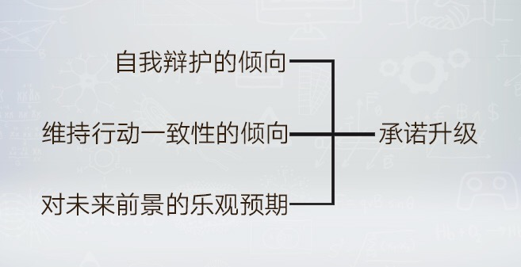

# 1303. 承诺升级 | 最强大的激励
> 宁向东的管理学课
2018-03-28

这一讲我们讨论的核心话题，是承诺升级。这是管理学非常前沿的一套理论体系，它对于我们理解人的激励机制是有很大帮助的。我先简单地和你分享一下什么是「承诺升级」。我们曾经讲过一部电视剧《潜伏》，其中讲了两个人物：李涯和马奎。我给他们的定义叫「一根筋」，一根筋，形象地说，就是承诺升级。

复习：跟着电影学管理 | 《潜伏》

## 01. 承诺

承诺是什么意思呢？就是我们干任何事，都有做这件事的收获，都有做这件事的苦痛。比如，读书对很多人来说，是一件痛苦的事。但是，对于那些对学习知识特别有兴趣的人来说，它的收获感远远大于它给我们带来的苦痛。所以，做有兴趣的事情，对这些人来说，具有真正的内驱力。做这件事，有着出于肉体和心灵的内在驱动力。这就是一种出于灵魂的「承诺」。

「承诺」这个词，在管理学中是个重要的概念。在最后一个模块，讲变革的时候，我们还会深入挖掘这个概念。这一讲，我们只给出它最表层的含义，就是我们在行动的时候，通常都会考虑做这件事对我们有什么好处。有些事情，是我们特别想干的，它源自于我们对于自己生命意义的认识。换句话说，就是我们觉得把自己的生命放在这件事上面，很值，我一辈子就干这件事，无论结果如何，我都认了，我都觉得这辈子值了。这就是承诺的来源。

承诺，会把你自己和一件事，以及你预想的做这件事的目标紧密地联系在一起。甚至，不给钱我也会去做。更极端的情况，为了这件事，我倒贴钱、牺牲个人的生命，都愿意。这就是承诺。有了这种承诺，人就会一根筋。一根筋，其实是激励的最高境界。李涯睡在办公室，把委员长的事情当成自己的事情，不遗余力、不计后果地投入，这种心理状态，这种动力机制，就是最完美的激励。所谓自驱力，莫过于此。

## 02. 承诺升级

在管理学领域，有一位非常著名的学者，翻译成中文叫斯托。1986 年，他和另外一位学者发表了在这个领域中的一篇重要的研究论文，讨论的是 1986 年在加拿大举办的世界博览会。最开始，加拿大申办世博会的时候，计划的项目预算是 7800 万美元。做任何计划，都要考虑最好的情况，和最坏的情况。在财务分析时，有一个专门的术语，叫做「情境分析」。

你知道在情境分析里面，预想中的最坏情况是什么样的吗？最坏的情况是亏损 600 万美元。于是，就在这样的一个情况下进行申办，申办成功后进行有关场地的建设。最开始的时候，绝大多数人都认为预算没有问题，对于成本和未来的收入的估计都是出于一种乐观状态的。但很快，财务状况开始恶化了，批评的声音一浪高过一浪。于是，官员们出来解释为什么会导致这样一种局面。

由于承办世博会所在州的州长把自己的政治生涯，甚至州长所在党派的政治前景，都太多地与世博会能否成功举办紧密相关，一根筋的情况开始出现。州长和所在党派不断地增加他们在世博会话题上的声音，下注越来越大。

最有趣的是，随着世博会的牵涉面越来越大，各种经济团体和各种民间组织都开始和世博会发生联系。如果你还记得我前面讲过的认知不协调那一课，我说过一句话：当你想改变一个人的看法，需要先让他做出行动。不是观念改变，行动就能改变。很多时候是因为有了行动，观念随之改变，即使这种改变可能是辩护性质，他也会竭力坚持自己的第一步行动。这种情况就出现在这些参与的经济团体和民间组织身上。当这些机构和世博会发生了联系之后，他们就成为了世博会的助力机构。各种力量合在一处，大家都坚持完成，没有放弃最初的承诺。

你猜猜为了在预定的时间之前完成项目，最后花费了多少钱？最早的预算是 7800 万美元，最后花费了 15 亿美元，接近最初预算的 20 倍。财务收益呢？最初估计最坏的情况是损失 600 万美元，实际上最后的亏损达到 3 亿多美元。斯托的研究发现，这一切都是因为承诺升级所致。我们常常以为很多决策错误，问题是出在最初的决策错误，而无论是在实验室条件下对人们决策之后行为过程的研究，还是在加拿大世博会这样一个实际案例中，行为过程的承诺升级更是一个真正的动因。

## 03. 最强大的内在激励

这个案例，在课程的最后一个模块中，我会继续讲。这一讲，我主要从内在激励的角度告诉你，承诺，或者我们换一个词，相对稳定的动机和需要，是一种行为能够持续的根源。所以，什么是最内在的激励？就是那些人们强烈追求的结果，反映自己偏好的结果，能够让自己的身份得到各方面认同的结果。这种倾向是由自主神经系统调节的，由情感状态表达的，所以，具有内在的持久性。

这些话说得太学术化。下面我试着用白话来解读一下。最近好多人都说：读书是反人性的，我自己深表同意，也强烈反对。为什么这样讲？从我自己的学习过程来看，我自己经历过三个阶段，也算是三种境界。

第一个阶段，就是读书并不完全是为了自己的喜好。在读中学、读大学的时候，很多课是我不喜欢的，但没办法，是必修课，所以，必须要强迫自己去上课、去学习。你知道上课时我看的最多的是什么？是手表。我迫切期望早点下课，结束煎熬般的学习。这个阶段，我的动机不是内在的，兴趣也不够强，自然而然地，学习就是苦差事。

第二个阶段，读了研究生，特别是进入学完课程、写论文的阶段，对读书这件事就有了更多的决定权。因为研究方向是自己选的，对这个话题就有兴趣，内在的激励加大了，读某些专业书籍就开始像读小说一样，也不觉得它是一个苦差事了。我开始觉得读书是生命中内在的东西，也就不觉得它有多么反人性了。

当然，读一些技术性的书，还是会有问题，因为带有功利目的的东西，行为动机还不是内在的。比如说，看那些逻辑性特别严谨的学术著作，看含有数学模型的工具书。

再比如说，我 30 岁之后，偶尔还会去旁听一些其它系的课程。旁听课程，是为了得到一点跨学科的启发，这时候，对于很多知识，获取它的内在动机就不够强，于是，还是会有苦差事的感觉。

第三个阶段，就是评上了正教授之后，没有发表论文的压力了，这时的学习就有更加主动的心态，也不觉得苦了。有些人夸张地说，评上了正教授，你每天睡大觉，每天出去玩，都没人管你。但就我和我身边的人来说，情况不是这样。评上了正教授，很多时候是更累了。

为什么呢？因为评上正教授，你还是要做研究，这个时候做研究，不是为了评什么职称。也就是说，动机不是来自于外部的，而是来自于你自身内在的需求。这个时候，当你不觉得这件事是个苦差事，也就更不会患得患失，功利性地去算计。从我自身的经验看，其实，最累的时候不是在评职称之前，而是在评职称之后。

我再举一个例子。我的博士导师在他的专业领域里面，是那一辈中国人顶级的学者。他 65 岁退休，改去钻研历史学。退休那天，他对我说，要用十年时间，研究中国历史上非常重要的十年。他的研究成果虽然现在还没有出版，但他跑了几十个县，我在电脑上看过他拍摄的照片、复印的原始资料，我也见过他手抄的档案记录。他的资料笔记出来了，送了我一套几百万字的原始资料。后来，他的研究笔记出来了，又送了我一套，也有 100 多万字。

他坐火车，住最便宜的招待所。学生在省里做官，要主动安排，他坚辞不受，从来不用学生打电话联络，自己就凭着身份证和介绍信去档案馆查资料，碰到不礼貌的档案馆职员，他就掏出《中华人民共和国档案法》和人家理论。你说他图什么，他的激励又在哪里？我觉得，就是内在动机在起作用，就是要对得起自己给自己的承诺。我猜这个承诺还在一步一步升级。

上面有一个斯托关于「承诺过程模型」的逻辑图，来自于他在 1981 年发表的一篇论文，请你课后看一下。在这个模型中，维护先前决策的动机，会极大程度地形成在行动过程中的承诺，进而唤起极为强烈的心理动机，形成强有力的承诺。

## 课后思考

课后，请你思考一下：创业者在创业过程中的很多行动，固执己见，坚定不移，是不是都属于为了实现他最开始的承诺呢？这个话题，我们在最后一个模块接着讲。