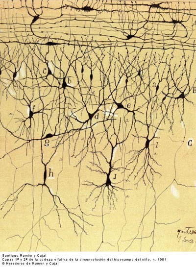

# 0703. 学习的本质：单身派对定律

王立铭·生命科学50讲

2018-06-25

这一讲，我们继续来思考：学习到底是什么。上一讲，我们有了很大进展，知道了学习不是人类独有的，完全可以在动物里进行研究。在宏观的动物行为层面，学习的本质就是把原本不相关的东西联系在一起。那么这一讲，我们就来思考一下，在学习过程中，动物的大脑、我们的大脑里面到底发生了什么，学习在微观层面的本质是什么。很有意思的是，你会发现，学习产生的大脑变化，竟然有点像公司组织的单身派对。

## 3.1 大脑是复杂的三维信号网络

为什么这么说呢？我们得先了解一下大脑里到底是什么样的。在前面一个单元，我简单介绍过大脑里面神经细胞长什么样子，又是怎么形成的。关于这些信息，我们得感谢西班牙科学家，公认的神经科学之父卡哈尔（Santiago Ramón y Cajal）。实际上卡哈尔和巴甫洛夫两个人年龄相仿，做出科学发现的年代类似，甚至性格也有些类似。只不过呢，在巴甫洛夫在冰天雪地的俄国折腾小狗的时候，卡哈尔是在四季如春的西班牙，天天对着显微镜，观察脑袋里究竟是什么。

卡哈尔的研究听起来有点无聊，他每天做的事情就是把各种各样动物的脑袋解剖出来，切成极薄的标本，然后用一种特别的染色方法，把标本里面一小部分神经细胞给染成黑色。之后呢，他就天天对着显微镜，观察标本，再用笔把他们一丝不苟地画出来。顺便说一句，卡哈尔的显微绘画一直到今天，都还是生命科学历史上重要的财富。在很多学术会议的报告里，卡哈尔的图片是常用的开场白。而且到今天，还仍然有人继续分析他留下来的成百上千的图片。

卡哈尔绘制的大脑显微图片，字母标识了一个个神经细胞

我们说回主题。你可以想象，卡哈尔能直接看到的信息，实际上非常有限。他看到的就是在动物的脑袋里，层层叠叠堆砌着数以百亿计的细小神经细胞。但是，这些神经细胞和我们通常看到的细胞不太一样，不是规整的球形，而是从圆圆的细胞体那儿伸出不规则的突起。

有的像树杈一样层层伸展——卡哈尔叫它树突；有的像章鱼的触手一样长长延伸——卡哈尔叫它轴突。也就是如此而已。但是卡哈尔的天才在于，他居然就从这么一丁点信息里，非常准确地猜测出了神经系统的工作原理。在卡哈尔看来，这些长相怪异的神经细胞，肯定就是靠这些突起彼此联系在一起的。树突是信号接受端，轴突是信号输出端。它们彼此相连，形成了一张异常复杂的三维信号网络。

我们说过，人脑里神经细胞的数量大概在 1000 亿这个数量级。任何一个神经细胞产生的生物电信号，平均要传递给上万个与之相连的神经细胞。反过来，任何一个神经细胞的活动，也受到上万个与之相连的神经细胞的影响。所以，你可以想象这样的情景：挥动魔杖随意点亮大脑中一个神经细胞，它的电信号产生的微弱涟漪将迅速一层层地传遍整个大脑。

神经细胞传递电信号模拟图

卡哈尔具体是怎么产生这些天才构思的，我们先不说。我们来看看，这个大得惊人的三维信号网络，和学习到底有什么关系。换句话说，在学习之前和之后，动物脑袋里这个三维信号网络到底出现了什么变化？这些变化，是不是就是微观层面上学习的本质呢？

当然从逻辑上说，有很多种可能的变化。比如：神经细胞的总数发生了变化；某些神经细胞的形状发生了变化，等等。但是实际上，这两个解释的可能性都不是很大。因为，根据卡哈尔的观察，成年动物大脑里的神经细胞是比较稳定的，不管是数量还是形状都不会发生什么剧烈的变化。

这样一来，就产生了一个矛盾。一方面，根据巴甫洛夫和斯金纳的动物行为研究，我们知道在反复训练之后，动物肯定是能够学会，并且记住一些东西的，这些东西只能发生在大脑内部。另一方面，卡哈尔的研究显示，动物的大脑又是一个看起来很稳定的器官，不像是能随随便便发生什么剧烈的变化。那既然如此，一颗看起来一成不变的大脑，怎么可能装进去时时刻刻都在发生的学习过程呢？

## 3.2 赫布定律：解释学习的完美微观模型

这个矛盾到上个世纪中期才开始被解决。解决的方法，就是咱们开头提到的「单身派对定律」。这个定律的提出者，是加拿大的心理学家唐纳德·赫布（Donald Olding Hebb）。这个人很有意思，他同时是巴甫洛夫和卡哈尔两个人的粉丝。所以，在深入学习两个人的理论之后，他敏感地意识到，两个人的研究实际上存在深刻的矛盾，就是我们刚刚说到的——不变的大脑和时刻变化的学习过程之间的矛盾。

思考的结果是，赫布给出了一个试图调和两者的理论。他认为，在学习过程中，神经细胞的数量、形状确实都没发生变化，但是，神经细胞之间的联系强度发生了变化。这种变化，才是学习的微观本质。具体而言，赫布说：如果脑袋里的两个神经细胞总是同时被激发，那它们之间的连接就可能变得更强，信号传递就可能更有效率——这就是著名的赫布定律。

所以，巴甫洛夫在动物身上观察到的学习行为，不光和卡哈尔的发现不矛盾，反而完全可以用卡哈尔提出的三维神经网络加以解释。这话听起来有点难以理解。不过不要紧，我们重新回顾一下巴甫洛夫的狗的实验，同时试着用赫布定律来解释一下。

在巴甫洛夫的实验里，狗粮的出现，本身就能让狗流口水，而如果在拿狗粮的同时总是摇铃铛，狗就会把铃铛声音和狗粮，这两件本来毫不相关的事也联系在一起。所以在那之后，只要它听到铃铛的声音，就会流口水。

现在我们开始套用赫布定律的解释。在狗的大脑中，我们可以想象有一个控制唾液分泌的神经细胞，我们可以叫它口水细胞。口水细胞能够被狗粮的气味激发，从而命令唾液进行分泌。同时，狗的大脑中还有一个负责听铃铛声音的细胞，我们叫它铃铛细胞。这个细胞能够被铃铛的声音激发。

在学习开始之前，这个铃铛细胞和这个口水细胞，一点关系都没有。狗粮能激发这个口水细胞，让狗流口水，但是铃铛就不行。但是，如果总是一边给狗粮一边摇铃铛，我们就可以想象，在狗的大脑中会发生这样的事：一方面，口水细胞会被激发，因为狗粮出现了嘛；另一方面，同时那个铃铛细胞也会被激发，因为铃声也出现了嘛。

好，现在我们再引入上面的赫布定律——两个总是同时被激发的细胞，之间的联系就会增强。那么基于这个定律，口水细胞和铃铛细胞之间的联系，就会从无到有地建立起来。而等到两者之间的联系强到一定程度，我们就能想象发生这样的事：一旦铃铛细胞被激发，它就能够把口水细胞也顺手给激发了。你看，这不就是巴甫洛夫的实验中观察到的现象吗？一摇铃铛，狗就流口水。

赫布定律简单一句话的威力，居然把宏观尺度的动物行为变化，和微观尺度的神经细胞网络直接联系在了一起。

实际上，相比赫布定律，我更喜欢用「单身派对定律」这个更通俗的词。现在很多公司和组织都会搞所谓的单身派对，让还单身的男生和女生来参加，还强行把他们安排在一起做游戏、搞活动、表演节目。这些单身男女可能在派对之前，彼此形如路人，完全不认识。但是通过这些派对，非要把他们一对一地随机搭配在一起，还要求他们合作完成某项活动。

这些安排是有它的道理的。这样一来二去，很多男生女生之间还真能产生联系，甚至感情，真正走到一起。你看，这不就是人类生活中的赫布定律吗？总是同时被激发的人类男女，他们彼此之间的连接强度就会被增强。

好，我们言归正传。赫布定律在提出的时候，当然仅仅是个理论猜测，但他的思想为科学家们寻找学习的微观本质，提供了最直接的指导：如果赫布是对的，那人们应该能在学习过程中，直接观察到神经细胞之间的连接强度变化；反过来，如果人们操纵神经细胞之间的连接强度，就应该能够增强或者破坏学习。

这些证据慢慢地积累起来，到现在，赫布定律已经被牢固地建立起来，它已经不是单纯的一个理论猜测了。我举一个很经典的例子。生物学家们在动物大脑里找两个一前一后相连的细胞，但是它们之间连接强度很弱，激发前一个，后一个还不会被激发。这个时候，他们给这两个细胞分别插入一根非常细的电极，往这两个细胞里面通电，人为地来激发这两个细胞。

科学家果然发现，如果总是差不多同时通电激发这两个细胞，特别是如果激发前面这个细胞的时间，比激发后面那个细胞的时间稍微提前几十毫秒，两个细胞之间的连接强度，就会得到非常明显地增强。你看，这本质上就是在人工模拟赫布定律的实现。顺便插句话，关于这一系列研究，有几位中国科学家起到了非常重要的作用，比如：中国科学院上海神经所的蒲慕明教授，中国科技大学的毕国强教授，清华大学的宋森教授。你如果有兴趣，可以去查阅他们的资料。

我来简单总结一下。 这一讲里，我们讨论了学习是怎样在大脑里发生的。赫布定律，或者单身派对定律，提供了一套能够完美解释学习的微观模型：只要两个神经细胞总是差不多同时被激发，那么它们之间的联系就会被增强，这就是学习的微观解释。

现在，可以说我们已经大概知道了学习是什么。但是我想问你一个新的问题：1）为什么会存在这个单身派对定律呢？2）为什么两个神经细胞如果差不多同时被激发，它们之间的联系就会增强呢？这个问题已经开始触及学习的最后核心，我们留到下一讲讨论。