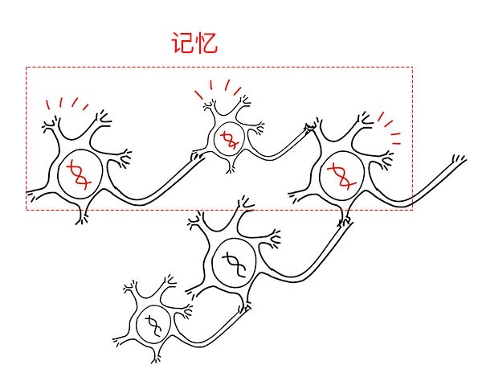
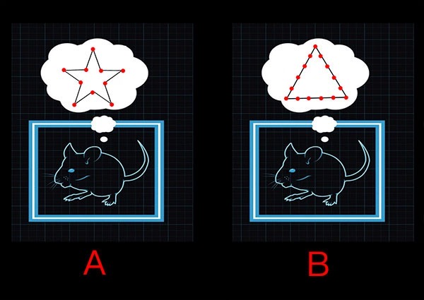

# 0705. 假如记忆可以移植

王立铭·生命科学50讲

2018-06-27

今天是我们学习单元的最后一讲。在前面的几节课里，我们讨论了学习的生物学本质，也讨论了如何人为地增强或者削弱学习的能力。今天，我们讨论一个更科幻，也是你更关心的问题，我们有没有可能在大脑里制造一段虚拟记忆，甚至移植一段别人的记忆呢？

这个问题虽然听起来科幻，却是人类永久的话题。就连中国高考语文作文，都曾经在 1999 年使用过《假如记忆可以移植》这个题目。为什么我们那么想创造出虚拟记忆，甚至想要直接移植记忆呢？原因很简单，现在是一个信息爆炸的时代。每一天，人类世界生产出的数据都超过了古代社会上千年的总和。这么多信息，怎么生产、存储、传输，就已经是非常大的技术问题了。更要命的是，我们人类的大脑该怎么适应这个信息指数增长的时代？

要知道，人类大脑的体积和结构，从人类出现到现在二三十万年的演化中，都没有发生过显著的变化。这颗大脑里面处理信息、学习和记忆的能力，应该也不会有什么飞跃。那么这样一来，人类社会信息生产的能力，和人脑学习功能之间的差距只会越来越大。因此，如果能有个办法实现人工模拟学习，甚至是人为唤醒和移植记忆，那就太好了，一劳永逸地解决了问题。

好消息是，赫布定律也确实给我们提供了一个理论上的可能性。你看，根据赫布定律，学习的本质就是两个总是差不多同时活动的神经细胞，它们之间的联系会被增强。也就是说，如果我们有办法能够人为地让不同的神经细胞总是同步活动，我们就可以人为地增强它们之间的联系，从而创造出虚拟的学习和记忆来。

前面几节的课程里，我们也讲过类似的思路。比如：我们可以在神经细胞里插入微电极，通过放电的方式激活神经细胞。打个比方，我们如果能在巴甫洛夫的狗的大脑里，找到口水细胞和铃铛细胞，然后在这两个细胞里面，分别用微型电极通入电流进行训练，就可以完全不依赖狗粮，也不依赖铃铛，让这条可怜的狗在听到铃铛的时候流口水。

但是，这个思想实验听起来挺好，却没有什么可操作性。这主要是因为两个原因：第一，动物大脑里的神经细胞实在是太多了，根本不可能找到哪些细胞是负责干什么的，代表了什么记忆。第二，在动物脑袋里插电极是一个破坏性很大的手术，在活的动物脑袋里，扎上成百上千的电极，动物根本不可能保持活蹦乱跳和清醒。

## 5.1 两种武器：定位记忆和唤醒记忆

没想到，过去几十年里，神经科学家们居然获得了两个非常强大的武器，把这两个技术难题都给解决了。

这第一个武器，能让神经科学家们准确地找到代表一段记忆的神经细胞。这件武器的原理是这样的。我们已经知道，一段记忆在大脑中的呈现方式，大概就是很多相互联系的神经细胞的集体活动。但是，怎么找到这群总是一起活动的细胞呢？人们发现，神经细胞被激活之后，会立刻启动细胞内部某个基因的活动。

这个基因具体是干什么的，我们暂且不讨论，但是我要强调，利用分子生物学技术，基因的活动是可以被准确追踪的。因此，只要在动物的大脑里，看这个基因在哪些神经细胞里被启动了，我们就可以反过来推测，这些神经细胞刚刚被同时激发了。而这些细胞当然就代表着刚刚发生的一段记忆。

第二个武器，是让神经科学家们能够遥控神经细胞的活动。这个武器实际上是一个来自海藻的蛋白质分子。这个蛋白质分子被太阳光照射之后，能发生结构变化，在海藻细胞里产生一个电信号。对于海藻来说，这个蛋白质是很重要的，它能帮助准确地找到太阳光的方位，进行光合作用。

而它对人类科学家更重要。只要把这个蛋白质拿出来，放在动物的神经系统里，动物的大脑就具备了海藻的本事：能够被光激活。有了这个蛋白质做秘密武器，神经科学家们就不再需要微电极了，他们只需要在神经细胞里面放上这个蛋白质分子，然后远远地照上光，就可以人为地控制这些神经细胞被激发的时间。

这两件武器加在一起，能产生巨大的威力。这第一个武器能够告诉我们，某一段记忆，在动物的大脑里具体是由哪些神经细胞代表的。第二个武器呢，能够让我们利用光，准确地操纵许多个神经细胞的活动。那我们是不是可以用第一种武器，在动物大脑里定位一段记忆，然后用第二种武器，随时随地唤醒这段虚拟记忆呢？甚至，利用同样的思路，我们是不是还可以把一只老鼠的记忆，移植到另一只老鼠的大脑里呢？

## 5.2 移植记忆：身临其境的实现

就在过去几年，美国麻省理工学院的利根川进（利根川進）实验室，首先做了这方面的探索。他们的做法可以分成两个步骤，其实也就是先后利用这两种武器的过程。

首先，他们把老鼠扔到一个全新的环境中。利用第一种武器，他们就可以知道在老鼠的脑袋里，哪些神经细胞同时开始活动了。这些信息就代表着对这个新环境的一种场景记忆。打个比方：如果老鼠大脑里只有 100 个神经细胞，在 A 笼子里，有 10 个神经细胞同时开始活动，其他的 90 个保持沉默。这 10 个神经细胞，排成了一个五角星的形状；而在 B 笼子里, 有 15 个神经细胞同时开始活动，其他 85 个没反应。这 15 个神经细胞排成了一个圆圈的形状。

我们就可以说，这 10 个组成五角星形状的细胞，或者这 15 个组成圆圈的神经细胞，就代表了老鼠对这两种笼子的记忆。然后呢？在第二步里，他们就利用第二种武器，人工去激活这些代表场景记忆的那十个或者 15 个细胞。

你可以想象一下，激活这些细胞的时候，老鼠会产生什么感受呢？结果当然就是，不管这个老鼠此刻正身处哪里，只要照亮了那十个排成五角星的神经细胞，老鼠就会以为自己身处 A 笼子当中；而只要照亮了 15 个排成圆圈的神经细胞，老鼠就会以为自己跑到了 B 笼子里。所以利根川进他们就这样，成功地把老鼠带入到一段虚假的记忆当中。

这个研究有着非常重要的现实意义。利根川进他自己就说，也许这个研究未来用在人体内，可以帮助那些刚从战场归来的士兵们，彻底擦除战场的可怕记忆。而实际上，在未来，在正常人当中，这个技术也会很有用。毕竟人类文学艺术作品的一大追求就是现场感，能让人感同身受，进入一个从未经历的场景中去。而利用这两种武器植入虚拟记忆的方法，肯定是最直接，最有现场感的。

当然了，在你欢欣鼓舞之前，我还是得泼一盆凉水。我们必须知道，在利根川进的实验中，其实人类能做的还仅仅是产生虚拟记忆，让老鼠进入虚拟的一个场景，做不到虚拟更加复杂的记忆，比如：一段包含着各种感觉输入，包含着自身体验的完整的记忆。而且，我们现在还做不到让记忆在不同老鼠之间移植，更加做不到在计算机里从无到有地生成一段记忆，然后再植入一个人的脑海。

当然了，根据赫布定律，这些事情在理论上应该都做得到。但是必须得承认，今天的神经科学发展，距离这个目标还非常遥远。对于学习和记忆，我们还有太多事情不知道，仍然在等待着更多的研究。 下一单元，我们来讨论构成智慧的第三个元素——社交。

## 回顾总结

1、生物体为什么需要学习功能？

为了解决刺激——反射模式的两个缺陷。第一，局限性。遗传物质能够编码的模式有限，只能为生死攸关的事做准备。第二，盲目性。这种模式重复多次，也无法变成能够积累的经验。

2、学习的本质是什么？

宏观层面：在原本不相关的东西之间建立新的联系。微观层面：单身派对定律——总是同时被激发的神经细胞，它们之间的联系就会增强。

3、如何增强学习能力？

学习意味着神经细胞联系的增强，而神经细胞联系的变化取决于「裁判蛋白」。增加「裁判蛋白」的含量，可以增强学习能力，反之减少可以抑制学习能力。

4、如何虚拟记忆？

利用两个技术武器：第一，定位记忆。追踪被激活的基因——定位这些基因所在的神经细胞——这些细胞代表一段记忆。第二，唤醒记忆。在生物体内容植入能被光激活的蛋白质——利用光操纵神经细胞的活动。