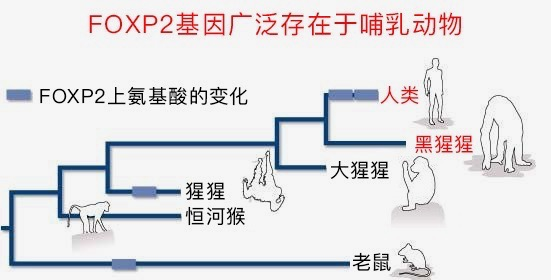

# 0803. 语言：伟大社会的基础

王立铭·生命科学50讲

2018-06-30

我们继续讨论生物社会和社交的生物学。

上一讲，我们介绍了蜜蜂的利他主义行为背后，不是什么集体主义，而是生物学的精密计算，仍然是为了最大化它自己遗传物质的传递。

很明显，这种形式是有竞争力的，但是，人类为什么没有走上蜜蜂社会一样的道路呢？

人类和其它地球生物，到底有什么本质的差别，导致只有我们人类能够创造文学艺术，能够发展科学技术，能够建设辉煌的文明呢？

可能有一个地方，能让我在人类和其它地球生物之间画一条分界线，那就是人类语言。

这一讲，我就来带你看看这个让人骄傲的分界线。

## 01. 语言能力并不特别

其实，语言能力本身并不特别。生物个体之间任何形式的交流，都可以看成是某种形式的语言。

比如：在前面两节课里面，发光细菌利用「存在感信号」来相互识别；蜜蜂的蜂后分泌一种化学物质，阻止其它蜜蜂继续变成蜂后，这就是某种化学语言。

除了化学语言，动物还演化出了更复杂的交流方式。比如：著名的蜜蜂舞蹈。

你也会想到，几万只工蜂想要形成分工合作，总是需要彼此共享信息的。

早在上个世纪40年代，奥地利科学家——弗利希（Karl Ritter von Frisch）就已经发现了蜜蜂之间可以通过身体语言交流信息。

比如：采蜜归来的工蜂，会一边快速摆动尾部，一边在蜂巢上沿直线爬行。这个动作可以周而复始，重复很多次。

弗利希的研究说明，这个特定动作携带了非常丰富的信息。蜜蜂爬行的直线和太阳光之间的角度，就标注了食物的方向。而舞蹈的总时间，就标志着食物的距离。

其他的工蜂看懂了这种身体语言，就能够集体出发采蜜，帮助它们更好地找到食物。

类似的例子还有听觉语言。

鸟类世界里，有差不多一半的物种，有非常发达的鸣叫能力，而且更重要的是，它们可以发出不同的叫声，传递不同的信息。

一个很经典的研究是鸡的叫声。

研究发现，鸡在看到天敌来袭的时候，会发出报警声，而且天敌如果从天而降，比如老鹰，或者从旁边过来，比如狐狸，鸡发出的报警声是不一样的。

而听到这些声音之后，其他的鸡反应也不一样。

如果听到说天敌从天而降，其他的鸡会四散奔逃，寻找能藏身的地方；如果是从旁边过来，鸡会左右扭头，寻找敌人的方位再逃跑。

虽然这些语言很精巧有效，但是它们能够传递的信息还是非常有限的。

这就像是我们讨论过的本能行为一样，躲避危险、交配求偶、吃饭睡觉，这些简单的，对生存至关重要的行为，可以用遗传物质来编码。但是更多更复杂的行为，还是需要后天的学习，需要大脑的灵活性和可塑性。

而人类语言，提供了一个完美的，甚至是唯一的解决方案。

## 02. 人类独特的语法能力

就像我开头说的，人类的语言，能在人类和其他所有地球生物之间，画出一条分界线。

虽然刚才列举的那些生物，甚至是发光细菌这样的简单生物，也有语言能力。但是只有人类发展出了一种能力，可以将不同的词汇，按照特定的结构和顺序组装起来。

打个比方，就像是把词汇当成各种形状的积木，用积木搭建一个城堡。这种能力就叫语法。

我们用一个真实的故事，来说明语法这种能力是怎么回事。

1973年，一只在美国刚出生的黑猩猩，被起了一个名字叫尼姆.猩姆斯基。这个奇怪的名字我后面再解释。它被送到一个人类家庭，开始过人类生活。除了穿衣服、戴尿布，还和一家人一起吃饭玩耍。之后，研究者开始教猩猩学习人类的手语。

这项研究的目的很明确。黑猩猩是人类的近亲，两个物种遗传物质的相似性高达98.8%。黑猩猩也确实能够掌握不少人类的技能，比如：利用复杂工具，权衡利弊，自我意识等等。

那么，如果在把它的生活环境也人类化，黑猩猩能不能彻底掌握人类的语言呢？

答案是不能。而不能的原因，恰恰就是语法。

经过学习，据说这只叫尼姆的黑猩猩掌握了125个手语手势，也确实能够表达苹果、酸奶、吃、喝这样的词汇。

但是，把词汇像搭积木一样组装成句子的能力，这条边界线，尼姆却终其一生也没能跨越。

比如「我吃苹果」，这么一个简单的意思，尼姆可以轮换着用：我吃苹果、苹果吃我、苹果我吃、我苹果吃这样的表达。一个三岁的小朋友都知道这些表达是胡说八道，但是，尼姆就是无法理解其中的差别。

而缺乏语法能力，有什么问题呢？

这问题可就大了。这就意味着除了人类之外，所有的生物都只能用有限的单个词汇来交流信息，表达思想，而大千世界无奇不有，有限的单个词汇是很难包罗万象的。

用词汇来代表安全、危险、吃的、喝的、睡觉，甚至我爱你，可能都问题不大。但是你想想看，如果每个信息，每种思想都发明一个词，那得有多少词汇才足够一个文明世界使用？比如：

「我看到一辆轿车，从左边以50公里的时速开过来」，这个想法需要一个专门的词；

「三角形的内角和等于180度」，这个想法需要一个专门的词；

「我们要去登月，不是因为它简单，恰恰是因为它无比困难「，这个想法也需要一个专门的词。

甚至，我们还得给从来没发生过的事情造词，比如：「如果月球变成立方体，它一定会有八个角」。

先不说这句话能不能造词，就算造出来了，怎么让别人理解你试图表达的，是一个「从未有过」的意思呢？

所以你看，人类语言和人类文明，可能有着密不可分的联系。

## 03. 人类的语言能力源于基因突变

那么，一个难题就来了，这么神奇的人类语言是怎么来的呢？

你想一想就会意识到，这个问题回答起来，真的难比登天。有两个原因：

第一，既然只有人类具备这种特殊的，用语言搭积木的能力，那就意味着，你根本不可能在动物身上研究它，但是，你又不可能天天解剖活人做研究。

第二，语言是一种无形的东西，它不会形成化石，这也就意味着我们也不可能通过分析人类祖先的历史变化，找出语言功能的源头。

所以，著名的语言学家诺姆·乔姆斯基（Avram Noam Chomsky）甚至说过这么一句半开玩笑的话：

也许就是几十万年前，一次突如其来的宇宙射线照射地球，改变了我们某个祖先的基因和大脑，人类才突然具备了语言能力的。

这个观点本身当然是没有什么证据支持。但是问题恰恰就出在这里，因为想要解释人类语言的生物学，我们能够用到的证据实在是太少太少了。

顺便说一句，乔姆斯基是20世纪最著名的语言学家，他相信，人的语言功能是天生的，是人类独有的。

而刚才咱们提到的那只黑猩猩，尼姆.猩姆斯基，它的名字是不是和诺姆.乔姆斯基非常像？其实，这个名字就是为了嘲笑诺姆.乔姆斯基的，因为这项猩猩实验的出发点，就是为了证明猩猩也能在人类家庭里学会语言，乔姆斯基是错误的。

可惜，实验结果我们已经看到了，乔姆斯基还是笑到了最后，人类语言果然是一座无法逾越的高峰。

我们言归正传，继续思考人类语言是怎么来的。虽然有那么多困难，但是科学家仍然找到了和人类语言相关的一些线索。

在19世纪下半叶，有个叫布罗卡（Pierre Paul Broca）的法国医生，收到了一个非常奇怪的病人。

这个病人智力正常，也能听懂别人说话，声带的发音功能也没问题，但就是当他自己说话的时候，没办法把词汇组装成句子。

用中文来打个比方，如果他想要说「我今天中午想吃面条」，那他大概会说成「面条…今天…吃…我…中午」，这个样子。

在这个病人死后，布罗卡医生为他做了解剖。发现他的大脑里某个区域，大致是大脑左半球，额头下面靠后一点的位置，受了严重的内伤。所以布罗卡医生就猜测，也许这个区域专门负责语法，也就是利用词汇搭积木的能力。

为了纪念这个法国医生的发现，这个可能负责语法的大脑区域，后来就被叫做布罗卡区。

而且，还有个特别有意思的现象，对比人类和我们的近亲黑猩猩和大猩猩，像布罗卡区这样的大脑区域，在人类中明显更大、更复杂。

所以，也许这个差别就能解释，为什么尽管我们和猩猩们在很多地方非常相似，但是只有人类发展出了独一无二的语言功能。

当然，我们可以进一步追问：人和猩猩之间的这个大脑结构差别，又是从何而来呢？

对这个问题的研究长时间陷入了僵局，直到近年来，一个名叫FOXP2的基因引起了大家的注意。

2001年，英国科学家发现，如果人体当中的FOXP2基因出现了缺陷，病人的表现就和布罗卡区出现损伤的患者差不多，说话缓慢，吐字不清，而且语法乱七八糟的。

更有意思的是，这个基因在黑猩猩体内也有，但是和人有非常微小的差别，只相差区区两个氨基酸。根据进化生物学家的推测，这点差别出现的时间很短，最多也就是10万年。

那会不会有这么一个可能性，现代人类之所以能够超越我们的灵长类亲戚，发展出先进的文明，形成复杂的社会，就是因为这个FOXP2基因的变异，创造了更发达的布罗卡区，和人类高超的语言功能呢？

这是一个充满诱惑力的可能性，但是，仍然需要更多的研究。

而有一点是可以肯定的，对于地球人类而言，语言以及依附于语言的文字功能，对于我们人类收集、分享、和创造信息，对于人类个体之间的分工和协作，都是至关重要的。

如果我们结合上一个单元的讨论，就可以发现：语言实际上大大延伸了人类学习的时空范围，让一个人类个体积累的生活经验和智慧火花，能够迅速地被传播出去，也能够跨越时间，在历史上流传下来。语言让人类站在巨人的肩头，能够看得更远。

在这一讲里，我们首先讨论了各种各样的动物语言，然后了解了人类语言——这个地球生物圈里独一无二的存在，以及人类语法的能力。最后，猜测了人类语言的生物学基础，人类的文明也许只是源于基因的偶然突变。

到这一讲为止，我们已经花了三节课时间，讲了从细菌、昆虫到人类，越来越复杂的社交行为，也讨论了他们的生物学意义。

实际上，除此之外，地球生命也演化出了另一套和性别相关的社交行为，特别是同性之间的竞争和异性之间的追求。

这些性别社交，让生物社会变得异常丰富多彩，更是直接帮助了生物更好地繁衍后代。

所以，从下一讲开始，我们就来仔细讨论性别的出现，讨论和性别相关的社交行为。