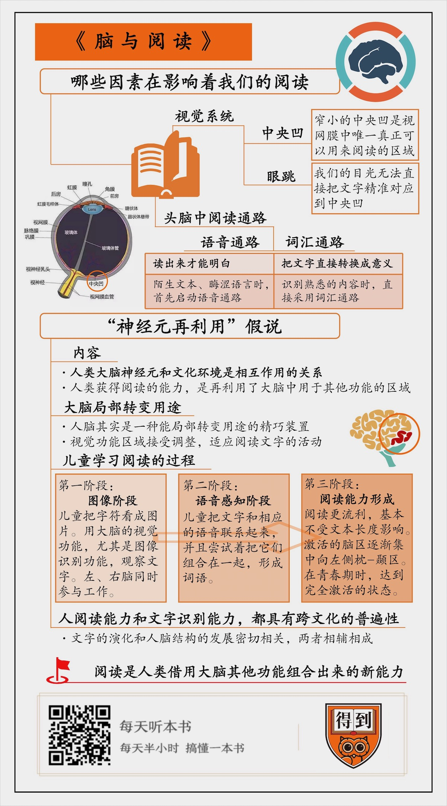

# 2019233. 脑与阅读
> 《脑与阅读》| 袁泽解读

## 关于作者

全世界极具影响力的认知神经科学家之一，欧洲脑科学研究领域的领头人，世界脑科学领域大师级的人物，已在《自然》《科学》等知名期刊上发表 300 多篇文章。2014 年，与其他两位科学家共同获得有「神经科学界诺贝尔奖」之称的大脑奖（The Brain Prize）。

## 关于本书

这本书，为我们提供了一个全新的理论，来解释人类是如何在相对较短的时间里，获得阅读能力的。这个新理论叫做「神经元再利用假说」，认为人之所以可以在相对较短的时间里获得阅读能力，是因为是再利用了大脑中用于其他功能的区域，尤其是负责视觉功能的区域。从这个角度来看，人脑，其实是一种能够在局部改变用途的精巧装置。

## 核心内容

第一，我们在阅读的时候大脑是如何工作的？限制我们阅读速度的生理因素都有哪些？

第二，阅读能力是我们与生俱来的能力吗？我们是怎样获得阅读能力的？

第三，从「神经元再利用假说」的角度出发，阅读和人类大脑究竟有着怎样的关系？

## 前言

今天我要为你分享的这本书叫做《脑与阅读》。这本书通过研究人们的阅读行为，为我们认识人类大脑，提供了一个全新的视角。

在说书的内容之前，有必要先说说作者。本书的作者，是全球最有影响力的认知神经科学家之一，斯坦尼斯拉斯·迪昂。他目前是欧洲脑科学研究领域的领头人，法兰西学院实验认知心理学教授，曾在《自然》《科学》等国际权威期刊上发表过 300 多篇文章。在 2014 年，他还获得了有「神经学诺贝尔奖」之称的大脑奖。

作为在科学领域里有如此巨大影响力的学者，迪昂教授在这本书里，会带给我们哪些独特的观点呢？

我们都知道，一个人就算一辈子没有受过正规教育，正常说话也什么没问题。掌握一门语言，与人沟通，是人类与生俱来的能力。但是，阅读就不一样了。如果不经过后天训练，想认字基本上是不可能的，更不用说去大量地阅读了。

从整个人类进化的尺度上看，也是如此。从人类诞生到现在，大约经历了几百万年的时间。可是最早的文字，仅仅出现在 5000 多年前。这样的时间跨度在人类的演化史中，是微不足道的，远远不足以让人脑进化出一套专门的阅读机制。我们灵长类动物的大脑，原本是为了适应狩猎 - 采集的生活而「设计」的。

但是，一个很有意思的现象是，通过现代脑成像技术，科学家们发现，人们在阅读的时候，无论用的是哪种语言，大脑的神经元都活跃在相同的区域。这个功能区，如果不是天生就负责阅读的，又该怎么解释呢？

对于这个问题，本书的作者从脑科学的角度，提出了一个叫做「神经元再利用」的假说。他认为：人类之所以能够在这么短的时间里，获得识别符号和文字的能力，是再利用了大脑中用于其他功能的区域，尤其是负责视觉功能的区域。从这个角度来看，人脑，其实是一种能够在局部改变用途的精巧装置。关于这个「神经元再利用假说」，我在后边会为你详细讲述。

接下来，我将分成两个部分，为你分享这本书。第一部分，我们从认知心理学的视角，来说说阅读是如何发生的？究竟是哪些因素，在影响或者制约着我们的阅读。有了第一部分作为基础，在第二部分，我们具体来说说，作者提出的「神经元再利用假说」是怎样的。从这个角度来看，人类大脑和阅读行为，究竟有着怎样的关系？

## 第一部分

我们先来看第一个问题：究竟是哪些因素，在影响着我们的阅读。

不妨回想一下，我们自己平时阅读的过程是怎样的。通常来说，我们的目光会停留在某个词上，这个时候，几乎不需要太动脑筋，大脑就能轻而易举地提取出这个词的意义和读音。把这些词连贯起来，我们就毫不费力地读懂了一句话的意思。

但是，这个看似毫不费力的阅读过程，从进化的角度上看，还远远不是一套精细、完美的系统，相反，我们在阅读的时候，反而受到很大的限制。现实生活中，几乎没有人可以一目十行的同时，还能深入了解书中的细节。更不可能在 20 分钟内，读完整部《战争与和平》。那究竟是什么因素在影响着我们的阅读呢？

这本书告诉我们，影响我们阅读的因素，有两个。第一是我们视觉系统。第二，则是我们的头脑中的阅读通路。我们一个一个来说。

先来看视觉系统是如何影响阅读的。阅读开始于视觉感知。而我们的视网膜，并不是一个均衡的感受器。在视网膜中，有一个叫做「中央凹」的区域，只有这个中央凹的中心地带，才拥有视网膜中唯一密集的、高分辨率的视觉细胞。视网膜的其他区域，分辨率就会低很多。这也就意味着，中央凹是视网膜中唯一真正可以用来阅读的区域，而这个区域，仅仅是角度很窄的一部分。

所以，我们在阅读的时候，需要自动地把文字放在中央凹内来加工。我们的眼球在阅读的时候需要不断移动，用视觉中最敏感的区域来「扫描」文本。更不方便的是，我们的目光，并不是在书上匀速的运动。恰恰相反，我们的目光，总是一小步一小步地，从一处跳向另一处。有一个专门的术语来形容这个过程，叫做「眼跳」。

眼跳对阅读速度来说，是一个很大的限制。它会导致我们无法直接把文字准确无误地对应到中央凹的最佳位置。要知道，我们的眼睛，只对正好落在注视中心的那一个点，有最精细的感知。而注视中心的外围，则会越来越模糊。也正是因为如此，我们一次注视的信息，最多只有 7~9 个字母，对应到中文，也就是三个汉字左右。

视野范围有限，所以我们一次加工的信息也不多，这是影响阅读速度的一个重要原因。当然，我们可以通过训练来优化眼动的模式，但每分钟阅读四五百个词，是我们的生理极限，不会再有什么提高的空间了。

有一项实验能够很好地证明，这种眼动的模式，就是影响阅读速度的罪魁祸首。实验是这样的：研究者让人盯着一个屏幕，屏幕上呈现的，并不是完整的段落，而是一个词语接着一个词语地呈现。而且，这些词都精确地落在了参与实验人员的注视点上。结果发现，一个平时有着良好阅读习惯的人，可以达到每分钟阅读 1100 个词语，最优秀的，甚至可以达到每分钟 1600 个词，这是正常阅读速度的 3~4 倍。

这就意味着，对于词语意思的理解，并不是影响阅读速度的最重要因素。眼跳，才是限制阅读速度的最主要原因。

只要文字还是一行行地写在纸上，或者打在屏幕上，这种通过注视来获取信息的方式，就一定会让我们的阅读速度降低，形成一道不可跨域的壁垒。也正是因为如此，当你再看到那些号称能把你的阅读速度训练到每分钟 1000 词的广告时，保持怀疑的态度，还是很有必要的。

视觉系统完成了对文字的扫描，仅仅完成了阅读生理过程的第一步。接下来，还有更加重要的一项机制，在影响着我们对文字信息的加工，那就是我们头脑中的「阅读通路」。

首先，我想请你先思考一个问题：我们都知道，文字是记录语言的工具。而语言的最基本形式，是我们发出的声音。那么你在阅读文字的时候，是会先将文字转化成读音，再理解它的意思，还是可以直接从文字直达语义，完全不需要想它的读音呢？

这是一个很有争议的问题，对于这个问题的回答，也决定着我们头脑中的阅读通路，也就是大脑加工文字信息的方式，到底是怎样的。

一些研究者认为，从文字到语音的转换是必经的一步。书面语言，只不过是口语的一种副产品，因此我们必须通过一种「语音通路」，把词给读出来，然后才有可能明白文字的意思。还有一部分人认为，把文字读出来，只是初学者具有的特点。对于更加成熟的阅读者来说，还有一条更加直接的「词汇通路」，也就是说，大脑可以把文字直接转换成意义。

这种争议经过了 30 多年的讨论，到现在，研究者们基本上达成了共识：对于成人来说，这两条通路都存在，而且，它们是同时运行的。这也就是为什么，我们在阅读的时候，好像确实会感觉到，自己是在「读」眼前的这些文字，但是速度却又比一字一句地朗读要快得多。通过大量的实证研究表明，即使是最熟练的阅读者，也会利用文字的发音。然而，这并不是说我们真的要把看到的信息，一词一句地读出来，甚至不必动嘴，更深层的加工中，我们就会自动提取出文字的语音信息。

虽然我们头脑中的这两条阅读通路在同时起作用，指导我们流畅地阅读。但是，根据我们所读的内容不同，以及阅读任务的不同，每一条通路所发挥的作用大小是不一样的。相信你也会有这样的感受，读有些内容的时候，好像一点也不费力气，看到的文字就会自动转化成意义，一看就能理解。还有的时候，只有一句一句仔细地默读，甚至是读出声音，才会明白这话是什么意思。这又是怎么回事呢？

这本书告诉我们：当你在阅读陌生的文本，或者是比较晦涩的语言时，首先启动的，就是「语音通路」。最典型的例子就是，你想想自己在读古诗的时候，尤其是读一首你不曾见过的，陌生的诗句时，是快速浏览一遍，就能明白它的意思；还是说要把它读出来，才能知道写的是什么？大多数人的答案，一定是后者。这是因为，当我们在接触一项不熟悉的语言、不熟悉的文字时，我们无法做到直接提取意义。我们所能做的，就是将其转化为读音，然后才会发现这个读音模式是可以识别的。

而当我们看到常见的词语，或者是自己熟悉的内容时，往往会直接采用词汇通路，直接识别出词语的意思，再利用词义信息去提取它的发音。比如说，你在读童话，或者小说的时候，很多情节是不是一扫而过，却也在你的头脑呈现出了完整的画面？这说明，你并没有把每个字转化成声音，而是快速扫描后整体感知所读文字的意义。

听到这，你可能会问，词汇通路的确能够很容易地帮助我们识别出文字的含义。但它是如何做到的呢？答案是：靠调取已经存在于我们头脑中的词汇库，认知心理学家将这种词汇库称之为：心理词典。

心理词典中的词条数目相当庞大。普通人的词汇量往往能达到数万之多。这说明，我们每个人都能轻而易举地，从至少几万个候选词中找到合适的意义，来匹配看到的文字。这一过程，只需要花零点几秒，而它所依赖的，只不过是视网膜上的几道光而已。

以上就是我要分享的第一部分，都有哪些生理因素，在影响着我们的阅读活动。首先，我们的视觉系统决定了我们只能通过眼跳的方式，去「扫描」文字信息。但这也会导致阅读速度变慢。第二，在视网膜上收集到了文字信息之后，「语音通路」和「词汇通路」共同起作用，帮助我们完成阅读理解。

## 第二部分

有了上一部分的知识背景作基础，接下来，我们就来说说，作者提出的「神经元再利用」假说，具体是怎样的。通过了解这个假说，我们可以从一个全新的视角来认识大脑的构造以及工作方式。简单来说，就是你天生能说话，但是必须上学才能认字，这是人类的大脑结构决定的。阅读不是先天能力，没刻在你的基因里，是人类借用大脑其他功能组合出来的新能力。

在认知神经科学，以及脑成像技术等发展起来之前，大脑对于人类，一直是一个黑箱般的存在。直到最近几十年，一些科学家才认识到，脑科学与人类获得阅读、算术或者推理能力有着非常紧密的关系。

直到今天，还有相当一部分人认为，大脑是一种具有无限可塑性的器官，也就是我们通常所说的「白板说」。「白板说」认为人脑就像是一张白纸，总是可以适应新的环境，吸收新的文化，进化出带有新功能的新结构。人类大脑的发展，完全由后天的环境来决定。这有点像是给大脑加外挂，遇到一个新环境，就发展出一个外挂，安在你的脑子里，应对新问题。而迪昂教授提出的「神经元再利用」假说，就是对这种「白板说」的批判。

总的来说，「神经元再利用」假说认为，人类大脑的神经元和后天的文化环境，是相互作用的关系，不是机械地加上新外挂那么简单。人类之所以能够获得阅读的能力，只是再利用了大脑中用于其他功能的区域，尤其是负责视觉功能的区域，这只是对大脑原有功能的最小调整。这话听起来可能有点难，下面我会为你具体解释。

我们都知道，人类天生就具有学习语言的能力，而阅读能力的形成，则需要经过后天的教育。通过阅读，我们能够超越时间和空间的限制，获得其他人的智慧，这无疑是一项非常重要的能力。从整个人类演化的尺度上看，我们大概经历了几百万年的进化史，但是最早的文字，也仅仅诞生在 5000 多年前。

在这么短时间里，人们之所以能够学会阅读，逐步形成识别文字符号能力，不是真的受后天影响，演化出了一个专门用来阅读的功能区，而是将原来负责其他功能的脑区，进行了再利用，来为阅读文字服务。其中，最重要的就是我们人类的视觉功能区域。通过后天的阅读教育，人脑把我们与生俱来的，可以识别图像形状的功能，做了最少量的调整，来适应阅读文字的活动。从这个角度来说，人脑，其实是一种能够局部转变用途的精巧装置。

我们可以通过观察儿童在学习阅读时，大脑结构会发生怎样的变化，来进一步证明这个观点。

总体来说，儿童学习阅读的过程，可以分为三个阶段。

第一个阶段是图像阶段，儿童只是把一个一个的字符，看成是图片。这个时候，并没有出现明确的大脑定位，大脑的两个半球，也就是左脑和右脑，同时参与工作。这也就是说，儿童在这个时候，还是用大脑中的视觉功能，尤其是图像识别功能，来观察文字。

第二个阶段，是语音感知阶段。在这个阶段，儿童看再文字的时候，就不像是看画了，而是把文字和相应的语音联系起来，并且尝试着把它们组合在一起，形成词语。

而再过几年，到了五六岁的时候，也就到了第三个阶段，阅读能力就此形成。他们的阅读会变得更加流利，基本上可以做到不受文本长度的影响。而正是在这个阶段，科学家们发现，随着专业阅读技能的提高，激活的脑区也逐渐变得更加集中，慢慢向左侧枕 - 颞区集中。这个区域，就是成人阅读时，用来识别词汇，加工文字的地方。随着阅读量的增加，这个区域，在青春期的时候，才会达到完全激活的状态。

这就说明，人类的大脑中，原本并不存在一套阅读机制。人天生有识别物体的视觉能力，大脑正是对这个区域进行了再利用，从而获得了阅读文字的能力。

作者说，有大量的研究表明，正是通过后天的阅读训练，我们才能够更加敏锐地感知到外部的信息。从这个角度来说，正是教育将我们祖先大脑中负责狩猎和采集的功能，转变为加工新文化的能力。教育对于人类文化能力的形成，具有非常重要的作用。

不但如此，作者还发现，人类识别文字的能力，并不像「白板说」所认为的那样，会因后天环境影响，产生非常大的差别。恰恰相反，人类的文字识别能力，具有跨文化的普遍性。作者深入考察了人类文字的诞生发展过程，他发现，不同的文字系统都拥有一部分共同的特征。不但如此，这些共同的文字特征，都非常符合人脑加工信息的工作特性。

在普通人看来，各种文字的形状千差万别，哪里有什么共性可言？但作者告诉我们，不同文化的文字之间，真的存在相同的深层结构。比如，迪昂教授说，所有的文字都基于一些比较小的基本形状，像是一个个字母，或是汉字的偏旁部首，这些小的形状，按照层级组合，形成了完整的文字。这种层级化的结构恰好适应了大脑皮质中，视觉信息加工的层级结构。不管文字的产生是源于人类的设计，还是源于某种非凡的直觉，最早出现的文字似乎都有意地选择了那些阅读起来最简单的形状。

还有，所有的文字系统都趋向于同时表示语音和意义。而在人的大脑中，负责语音编码的区域，与负责意义编码的区域距离并不远，刚刚提到的左侧枕 - 颞区，我们姑且叫它「文字盒子区」，刚好可以成为它们之间最合适的枢纽。

总的来说，无论是像英语一样的拼音文字，还是像汉字这样的语素文字，它们的特性，都非常易于大脑的加工。这些所有的文字系统，都显现出一些跨文化存在的普遍规律，而这些规律又最终会追根溯源到人脑的限制性上。

结合上面提到的文字的特性，我们基本上可以得出：人类的阅读能力，还有文字识别的能力，都具有跨文化的普遍性。文字的演化和人脑结构的发展密切相关，两者相辅相成。这也从另一个层面证实了，「神经元再利用假说」提出的观点：人类大脑的神经元和后天的文化环境，是相互作用的关系。

## 总结

总结一下：

首先，影响我们阅读行为的因素有两个：视觉系统和头脑中的阅读通路。视觉系统决定了我们只能在同一时间内加工有限的信息，这是我们「读书慢」的最重要原因。在视网膜上收集到了文字信息之后，「语音通路」和「词汇通路」共同起作用，帮助我们完成阅读理解。

关于人类如何获得阅读能力的问题，作者提出了「神经元再利用假说」。作者认为，人类之所以能够在相对较短的时间里，获得识别符号和文字的能力，是再利用了大脑中用于其他功能的区域，尤其是负责视觉功能的区域。人类的大脑，其实可以看做是一种能够局部转变用途的精巧装置。同时，这本书通过对人类阅读行为的研究，也告诉了我们教育的重要性。教育将我们祖先的大脑中，负责狩猎和采集的功能区，进行了再利用，从而转变为加工新文化的能力。教育对大脑文化能力的形成，具有非常重要的作用。