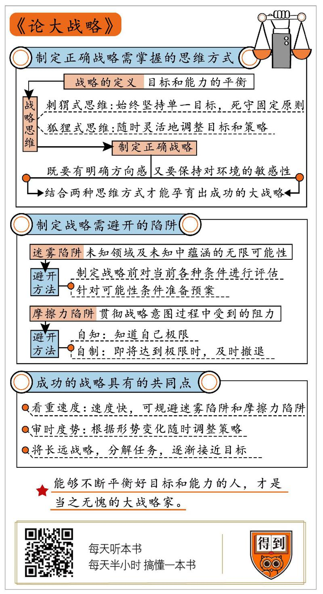

# 2019642. 论大战略
> 《论大战略》| 卞恒沁解读

## 关于作者

约翰·刘易斯·加迪斯，著名的冷战史学家和大战略研究家，曾被《纽约时报》称作「冷战史学泰斗」，现为耶鲁大学罗伯特·A.拉韦特讲座教授。

## 关于本书

《论大战略》一书从 2500 多年前的希波战争，写到 20 世纪的第二次世界大战；从雄霸古地中海的罗马领袖，写到改变美洲新大陆的美国总统。文献丰富，思想深刻，既有对寓言的深度解读，也有古今中外诸多军事家的战略思想精华分析。在作者加迪斯眼中，大战略就是目标与能力能够达成一致，并根据环境的变化适时做出调整。

## 核心内容

第一，要制定正确的战略，需要掌握怎样的思维方式？

第二，制定战略时需要避开哪些陷阱？

第三，成功的战略都有哪些共同点？

## 前言

你听这个书名「论大战略」，是不是特别高大上？作者到底是谁，能够驾驭这种级别的题目呢？作者名叫约翰·刘易斯·加迪斯，是耶鲁大学的教授。他是冷战史领域的权威，曾被著名的《纽约时报》誉为「冷战史学泰斗」。

要知道，冷战时期，那可是大战略家辈出的时代。人类有史以来关于战略的一切智慧，都在美苏这两个大国的争霸过程中发挥得淋漓尽致。很多超一流的战略家，比如美国前国务卿基辛格这种人，都是在冷战时期崭露头角的。今天这本书的作者加迪斯，作为冷战史的名家，对于战略学拥有很深的心得体会。这本《论大战略》可以说是他毕生心血的结晶，所以刚一问世，就获得学界的广泛关注。

你可能觉得，战略那是大人物才应该关心的事，但无论你从事什么行业，都将从这本书中有所收获，因为这本书写得特别实在，特别接地气，特别具有可操作性。就拿「战略」这个词的定义来说吧，我们经常提起这个词，但如果忽然被问到「战略究竟是什么」，我们可能很难三言两语就讲明白。

今天这本书一上来就给战略提出了一个特别简明扼要的定义：「所谓战略，就是目标和能力的平衡。」

说白了，就是根据自己的能力去制定目标，不断完成一个个小目标，同时提升自己的能力，不断接近那个梦想中的大目标。你可不要小看这句话，古往今来不知有多少英雄豪杰，都死于没能把握好目标和能力的平衡。比如叱咤风云的拿破仑，差点统一整个欧洲，但就是因为不自量力，率领大军远征遥远而寒冷的俄国，最终满盘皆输。拿破仑的失误，归根结底就是战略判断的失误。能够不断平衡好目标和能力的人，才算得上是当之无愧的大战略家。

道理都懂，具体该怎么做呢？怎样才能避免重蹈前人的覆辙，让自己的人生旅途更为顺利呢？

我将从以下三个方面，来把作者毕生的智慧传达给你：第一，要制定正确的战略，需要掌握怎样的思维方式？第二，制定战略时需要避开哪些陷阱？第三，成功的战略都有哪些共同点？

## 第一部分

我们先来看第一个方面，正确的战略首先表现为一种「心法」，也就是思维方式。那么这种思维方式究竟是什么呢？

作者指出，每个人的心里都可能有两种人格在打架，一种叫「狐狸」人格，另一种叫「刺猬」人格。这最早出自一句古希腊谚语：「狐狸多机巧，刺猬只一招。」意思是说，狐狸很狡猾，花招很多。刺猬对付谁都只有一招，就是缩成一团。

当代英国有一位著名哲学家，名叫以赛亚·伯林，他在 1953 年出版了一本书，书名就叫《刺猬与狐狸》。书里对那句古希腊谚语做出了引申，用它来描述两种思维的差异。所谓狐狸式思维，就是随时灵活地调整目标和策略。所谓刺猬式思维，就是始终坚持一个单一的目标，死守一个固定的原则。

今天这本书的作者则认为，刺猬和狐狸，分别代表两种最基本的战略思维。刺猬的可贵之处在于做事的方向感，狐狸的可贵之处在于对环境的敏感性。只有把这两者结合起来，才能孕育出成功的大战略。

作者为什么这么说呢？我们下面来看看，如果不能平衡好狐狸和刺猬这两种思维，会有怎样的后果。一位领导者如果只有狐狸人格，缺乏刺猬人格，做事缺少方向感，那会怎么样呢？为了方便你理解，我来给你举一个中国的例子。

单纯的狐狸人格，在中国历史上有一个对应的词，叫「流寇主义」。所谓流寇，就是四处流窜，打一枪换一个地方，没有清晰的目标，也没有长远的规划。中国历史上的很多农民起义军，都犯过流寇主义的错误，最典型的就是闯王李自成。

李自成这个人的特点是，特别擅长对近在眼前的状况做出反应，但始终没有一个长远的目标。比如他曾经被明朝军队围困在一条狭窄的峡谷中，面临全军覆没的危险。结果他向明军诈降，走出峡谷以后，就重新反叛，逃出生天。这个时候的李自成，就和狐狸一样，诡计多端。

后来李自成率军打到北京城下，眼看就可以灭掉明朝，却又做了一件莫名其妙的事。他派人去跟崇祯皇帝谈判，说能不能把西北一带封给我，让我在那里当个诸侯王。要是你同意，我马上退兵。

很多历史学家认为，李自成这种行为说明他根本没有取代明朝的计划，打到哪算哪。崇祯的反应也很有意思，他认为和反贼谈判太丢人，就没有答应。结果李自成攻破了北京城，崇祯也上吊自杀了。这个时候，李自成身上流寇主义的习性彻底暴露了。打了这么多年仗，究竟为了什么，仗打完了，又该做些什么，他完全没有规划。进了北京以后，他的军队以为大功告成，迅速腐化堕落，结果李自成在北京城只待了短短 42 天，就被迫离开，最后兵败被杀。

李自成的悲剧说明了，一个领导者身上如果只有狐狸人格，缺少刺猬人格，没有对于方向感的把握，就很难取得最后的胜利。那么反过来又会如何呢？一个领导者要是只有刺猬人格，喜欢认准一条路走到黑，缺少狐狸那种对外部环境的敏感性，最后会是怎样的结果呢？

作者在书里举了例子，主角是波斯帝国的皇帝薛西斯一世。

说起薛西斯一世，你可能觉得有点陌生，但他在西方可是赫赫有名，因为他曾经率领波斯大军，发动了对古希腊的战争。古希腊的各个城邦，比如雅典、斯巴达，为了自卫，组成了联军，共同对抗波斯大军。前几年有一部电影叫《斯巴达三百勇士》，讲的就是斯巴达王国的三百名士兵，为了守卫温泉关这个重要关隘，和波斯军队展开殊死搏斗，最后全部战死的故事。三百勇士当时面对的敌人，就是薛西斯一世。

从电影中可以看出，战争双方的力量对比很悬殊，波斯军队要强大得多，事实也确实如此。根据古希腊历史学家希罗多德的记载，薛西斯一世当时率领的军队高达 150 万人，这个数字可能有夸张的成分，一些学者估计，波斯军队最多 50 万人，即使这样，这也是一支可怕的军事力量。那希腊联军有多少人呢？

根据历史学家的考证，当时希腊联军总共有重装步兵 4 万人，轻装步兵 7 万人，加起来不过 11 万人。你看，兵力对比明显对波斯有利，但战争的结果却是希腊取得了胜利，薛西斯一世率领残军败将，回到波斯，不久以后，死于一场宫廷政变。为什么波斯军队明明占据优势，最后却失败了呢？薛西斯一世本人要负很大的责任。

根据现有的历史记载，薛西斯一世是一个好大喜功的人，他充满自信，认为自己站立在世界之巅，芸芸众生只能像蝼蚁一样，在自己面前顶礼膜拜。在这种心态下，他认为希腊联军不堪一击，希腊是自己的囊中之物。战争一开始似乎的确很顺利，薛西斯一世指挥下的波斯军队节节胜利。

这个时候，他对于外部环境的变化失去了敏感，也对目标和能力之间的距离失去了感知。他当时甚至说，征服了希腊以后，还要再征服整个欧洲。当时薛西斯一世身边有一位名叫阿尔达班的大臣，对战争表示了担忧。他说要率领大军穿过大片的陆地和水域，需要面临极大的风险，比如通信可能受阻，供给可能被切断，士气可能受损。但是薛西斯一世却拒绝接受劝告，最后在一场海战中被希腊联军彻底击败，这场战争以波斯帝国的失败而告终。

薛西斯一世的失败，后来又在无数历史人物的身上得到了重现。我在开头提到的拿破仑，就因为率领大军进攻沙俄，最后惨败。一度统一日本的丰臣秀吉，也曾经试图征服朝鲜和明朝，结果一败涂地。这些人物的根本问题，都在于他们身上的刺猬人格太过突出，过分执着于某个目标，而不顾自己的能力能否匹配。

总之，战略是目标和能力的平衡，领导者想要制定正确的战略，首先需要在内心平衡好「刺猬」和「狐狸」这两种思维方式。缺乏刺猬思维，就会失去方向感，找不到目标。缺乏狐狸思维，就会失去对外在环境的敏感性，做出不自量力的蠢事。

这听上去很容易理解，但古往今来还是有无数英雄豪杰，平衡不好这两种人格，犯下类似的错误。这到底是为什么呢？作者指出，这是因为他们掉进了类似的陷阱。下面我们就来看看，这些陷阱究竟是什么。

## 第二部分

作者指出，要制定正确的战略，需要避开的第一个陷阱，叫作「迷雾」。所谓迷雾，就是未知的领域，以及未知中蕴涵的无限可能性。

如果你玩过《魔兽争霸》《星际争霸》之类游戏，应该会比较熟悉一样东西，叫作「战争迷雾」，就是地图上仿佛笼罩着一层雾，你没有到达的地方，你就看不到，你不知道那里隐藏着什么。

即使你没玩过类似的游戏，你在生活中也应该会有类似的感受。事情到了眼前，总有些情况不了解，让人忐忑不安。作者指出，要想制定正确的战略，首先要搞清楚，哪些条件是可以把握的，哪些条件正笼罩在迷雾之下。

为此就要对当前面临的各种条件进行评估，把这些条件归纳为三大类：一是已知，二是未知，三是可能性。已知和未知都很容易理解，最难把握也最重要的，就是所谓的「可能性」。可能性意味着概率，意味着随机，它可能发生，也可能不发生。一个事先没有预料到的可能性，如果成为了现实，就可能带来灾难性的后果。说到这里，我再给你举一个中国的例子，这个故事发生在中日甲午战争时期。

说起甲午战争，我们都很熟悉。甲午战争中最关键的一战，是黄海海战，北洋舰队就是在这一战中败给了日本联合舰队。那么北洋舰队为什么会战败呢？

你可能听说过很多原因：比如北洋舰队的军费被慈禧拿去建颐和园了，舰队没钱更新装备；再比如，北洋舰队的军官们贪污军费，炮弹没买够，打着打着就没炮弹了。

这些解释都有道理，但如果我们还原一下黄海海战的全过程，就会发现还有一个重要原因：在这场海战中，北洋舰队根本没有最高指挥官，所有军舰都是各自为战。

我们都知道，这场海战中，民族英雄邓世昌指挥自己所在的军舰撞向日本军舰「吉野」号，想要同归于尽，因为中了鱼雷，才没有成功。但你有没有想过，邓世昌为什么可以自作主张，下令和敌人同归于尽呢？这是因为当时根本没有人管他。

那问题就来了，指挥官去哪了呢？北洋舰队原本是有个最高指挥官的，名叫丁汝昌，可是双方舰队刚刚交上火，丁汝昌就被一发炮弹的碎片击中，身受重伤，没法指挥了。最高指挥官没了，那谁来接替他呢？没人接替他，因为丁汝昌就没想过自己受伤这种可能性，没有做好相应的预案。于是黄海海战从头到尾，北洋舰队都没人统一指挥，失败也就难以避免了。

你看，这就是可能性造成灾难的经典案例。丁汝昌没有预估到自己不能指挥的可能性，北洋舰队才遭遇惨败。战略就是可能性的艺术，我们常说一个人「老谋深算」，说的其实就是这个人经验老到，能够预估到各种可能性。那要怎样才能做到老谋深算呢？

这就需要在制定战略之前，先对各种条件进行预估，哪些是已知，哪些是未知，尤其要注意罗列出那些可能性，然后针对可能性准备预案。

这个过程在现代战略学中叫作「净评估」。评估好理解，这个「净」是什么意思呢？「净」首先是指彻底，就是尽力获取一切可以获取的信息。「净」字还含有干净的意思，就是去除那些不真实的干扰信息，保留真实的，有用的信息。「净」字还可以指纯净，就是要对信息进行思维加工，看到信息背后的本质问题。

最后，「净」字还有一层意思，稍微比较难理解，我说慢一点，它还可以指我方相对于敌方的优势所在，也就是数学上所谓的「净差」。为了做到这一点，就要把敌我双方的优势劣势全盘摊开，进行沙盘推演，找到我方优势最明显的地方，然后在双方交火的时候，尽全力把我方优势发挥到极致。

如果你还是觉得「净评估」这个概念比较难记，那也不要紧，毛泽东在 1936 年写过一篇文章，名叫《中国革命战争的战略问题》，里面有这么一段话，对净评估的步骤有完整的概括，你可以拿来就用。

这段话是这么说的：「指挥员应使用一切可能的和必要的侦察手段，将侦察得来的敌方情况的各种材料加以去粗取精、去伪存真、由此及彼、由表及里的思索，然后将自己方面的情况加上去，研究双方的对比和相互的关系，因而构成判断，定下决心，作出计划。」

你看，在这段话里面，「使用一切可能的和必要的侦察手段」，就是要尽力获取一切可以获取的信息，也就是所谓的「彻底」。

「去粗取精，去伪存真」，说的就是要去除那些干扰信息，保留真实有用的信息，也就是所谓的「干净」。

「由此及彼，由表及里」，说的就是要对信息进行思维加工，看到信息背后的本质问题，也就是所谓的「纯净」。

最后还要「研究双方的对比和相互的关系」，就是要兼顾敌我双方的情况，做好沙盘推演，找到我方优势最明显的地方，也就是所谓的「净差」。 

如果能够兼顾这四点，事先做好净评估，就可以最大限度地事先发现那些隐藏的可能性，并作出预案。刚才我给你讲了黄海海战的例子，如果丁汝昌能够做到最后一点，做好沙盘推演，就很可能发现指挥官负伤以后舰队由谁指挥的问题，北洋舰队也不会陷入群龙无首的境地。

好的，以上就是制定战略需要避开的第一个陷阱：迷雾之下的各种可能性，为此需要做好净评估。除此以外，制定战略还需要避开另一个陷阱，这个陷阱叫作「摩擦力」。

摩擦力这个词你肯定听过，在物理学上，它指的是阻碍物体相对运动的力。其实，摩擦力不仅存在于物理学中，还存在于其他很多领域。战略学也借用了摩擦力这个概念。大战略家克劳塞维茨就指出，战略学中的摩擦力，是指贯彻战略意图的过程中受到的阻力。这样听起来有点抽象，举个例子你就明白了。

军队在行军过程中，行进的距离越长，就越是要面对供给不足、体力透支、士气下降这些问题，这些统统属于战略学中所谓的「摩擦力」。

中国有一句老话，叫「强弩之末，不穿鲁缟。」意思是说，强有力的弩射出的箭，飞着飞着飞到最后，就连鲁国产的缟也射不穿了。所谓缟，是一种绢布，鲁国产的缟是有名的薄，但箭居然射不穿它。这个成语比喻的，就是摩擦力对于战略执行的影响。

在战争史上，我们经常看到强弩之末的案例。比如在中国的三国时期，曹操率领大军南下，占领了荆州，打算消灭江东的孙权集团。孙权这边的谋士们都很惊慌，只有周瑜站出来说，曹操虽然人多，但并不可怕，因为他有这么几个弱点：首先是曹军长途跋涉，早已疲惫不堪；其次是眼下天气寒冷，曹军的战马没有草料，根本打不了仗；再有北方人来到南方，水土不服，容易生病。

总之，只要我们指挥得当，完全可以打败曹军。你看，周瑜列举的这几个问题，全是曹军面临的摩擦力。可以说，周瑜最后能够打败曹操的关键，就在于曹军因为受到摩擦力的影响，早已实力大减，失败是必然的结局。

领导者要想避开摩擦力的陷阱，就要做到两点：自知和自制。

自知，就是知道自己的极限在哪里。自制，就是在即将到达极限的时候，及时撤退。

这说起来简单，做起来却很难。领导者在制定战略的时候，就要学会动态地分析问题，把队伍因为摩擦力遭到的损耗预先计算进去。领导者在执行战略的时候，要随时注意队伍因为摩擦力而发生的微妙变化，一旦发现极限即将到来，就要赶紧抽身。请注意，摩擦力陷阱最可怕的地方在于，越是军队势如破竹高唱凯歌的时候，越可能接近摩擦力的极限。

说到这里，我再给你举一个中国的例子。1962 年，我国在中印边境进行了一次对印度的自卫反击战，这一战可以被视为避开摩擦力陷阱的样本。当时我军在对印度军队的战争中取得全胜，但就在这时，领导层却下令主动撤军。

这个举动看上去不可思议，但其实也很容易理解，中印边境所在的青藏高原地区道路崎岖，运输不便，加上冬季即将到来，到时会出现大雪封山的局面。我军越是深入印度一方，面临的摩擦力就越大，一旦战线拉得太长，就有全军覆没的危险。所以，领导层决定及时撤军，见好就收，这就是自知加自制的体现。

好的，制定战略需要避开的两个最主要的陷阱：迷雾和摩擦力，就为你讲到这里。虽然战略家需要面对这些凶险的陷阱，但还是有不少人制定了成功的战略，笑到了最后。这些成功的战略虽然看上去千差万别，但在本质上还是有一些共同点。知道了这些共同点，你在为自己制定战略的时候，思路就可能更清晰。下面我就带你看看，这些共同点到底是什么。

## 第三部分

所有成功战略的第一个共同点，在于看重速度。中国有一句老话，叫「兵贵神速」。前面提到的克劳塞维茨也曾经提出大型战役中的四条原则，其中之一就是「不可浪费时间，行动一定要快。」

你看，东西方的战略家们可以说是英雄所见略同。过去我们都听过兵贵神速的道理，但不一定清楚这背后的原理。听了前面的解读，你对这四个字可能会有更深刻的认识。之所以兵贵神速，是因为「神速」可以带来两个好处：

第一，速度越快，需要面临和处理的各种可能性就越少，风险相应也会减少。

第二，速度越快，需要面对的摩擦力也越小，因为摩擦力而导致失败的可能性也越低。

你看，速度可以帮助我们规避前面提到的两大陷阱，所以「兵贵神速」一向是各种成功战略的最大共同点。

成功战略的第二个共同点，在于审时度势，随时调整策略。作者指出，战略虽然具有指导全局的功能，但在战争过程中，需要面临各种可能性和摩擦力，所以绝对不能拘泥于既定的战略，要根据形势变化随时调整策略。

拿破仑就是因为过分执着于征服俄国的目标，才导致满盘皆输。相比之下，美国总统林肯是一个正面的案例。说起林肯，我们都知道他是黑人奴隶的解放者，领导美国北方取得了内战的胜利。

但在美国内战刚刚爆发的时候，林肯其实并没有废除奴隶制的实际举动。这是因为当时美国有几个州还在南北双方之间左右摇摆，这几个州也实行奴隶制，要是果断消灭了奴隶制，可能会把这几个州推向敌人的怀抱。

但随着战争的进行，形势对北方越来越不利。林肯这时果断调整策略，颁布《解放黑人奴隶宣言》，宣布废除奴隶制，动员了大批获得自由的黑人加入北方军队。美国内战的性质到这里发生了根本改变，从一场维护国家的统一的战争，演变为解放黑奴的革命战争。广大黑奴翻身以后热情地加入战斗，终于扭转了局势，使北方获得了胜利。

你看，林肯可以说是审时度势，调整策略的典型。当然，审时度势的前提，是能够感知到形势的微妙变化。作者指出，这需要对局势的洞察力，这种洞察力是一种类似艺术家的能力，需要在长期的实践中去获得。一些身经百战的指挥官常常会拥有第六感，随时把握瞬息万变的战场局势，这就是洞察力的体现。

成功战略的第三个共同点，在于分解任务，逐渐接近目标。一个长远的战略，通常都具有宏大的目标，但领导者千万不能有「毕其功于一役」的思想，就是不能心浮气躁，想着一下就把事给办了。这样想的人，通常会失败。因为这样做会导致领导者面临的风险和摩擦力全部最大化，一旦驾驭不住，就会遭遇惨败。这样的反面典型数不胜数，这里不再多说了，我来给你讲一个正面的案例。

今天这本书的作者特别推崇罗马帝国的第一位元首屋大维，将他视为战略学的典范。屋大维是恺撒的养子，恺撒试图大权独揽，得罪了一批罗马贵族，结果被杀。恺撒曾经在遗嘱中指定屋大维做他的继承人，所以屋大维本来最有资格继承恺撒的权力。但在当时，屋大维的势力还很弱小，所以他只好忍气吞声，和恺撒的两名老部下结成同盟。

这两名老部下一个叫安东尼，另一个叫雷必达。屋大维和他俩结成同盟，稳住了自己的基本面。随后，他又把自己的亲妹妹嫁给安东尼，以此拉拢他，孤立了雷必达。接着，屋大维就恐吓雷必达，说他对国家不忠诚，让他交回军权。雷必达无力同时对抗屋大维和安东尼两个人，只好乖乖交权，归隐田园。

这时，屋大维只剩下安东尼一个敌人了。偏偏安东尼当时头脑发热，犯了一个大错，他和著名的埃及艳后谈起了恋爱，还许诺要把罗马的一片土地送给埃及艳后的儿子们。屋大维抓住这件事不放，说安东尼是卖国贼，煽动罗马人一起反对他。于是，安东尼变成了罗马的全民公敌。屋大维见时机已到，正式向安东尼宣战。安东尼节节败退，最后和埃及艳后双双自杀。屋大维终于大权独揽，成为罗马帝国的第一位皇帝。

你看，屋大维在制定战略的时候，并不急于一时，而是分解任务，先完成一个个小目标，最后大目标也就成为囊中之物了。古往今来那些成功的战略，一般都是这样做的。说到这里，和大家分享日本风云人物德川家康的一句名言：人生就像背着重物出远门，千万不能急躁啊！这句看似朴实的话，其实点出了成功战略的精髓所在。

## 总结

好的，今天这本书就为你讲到这里。下面总结一下今天的知识点：

第一，领导者要想制定正确的战略，首先需要平衡好「刺猬」和「狐狸」这两种思维方式。既要拥有明确的方向感，又要保持对环境的敏感性。只有把两种思维方式结合起来，才能孕育出成功的大战略。

第二，正确的战略还需要避开两个陷阱。首先是避开迷雾下的各种可能性，为此需要对各种条件进行净评估。其次是避开摩擦力陷阱，为此需要保持自知和自制。

第三，历史上那些成功的战略都具有这么几个共同点：首先是看重速度，其次是能够审时度势，随时调整策略，最后是分解任务，逐渐接近目标。

