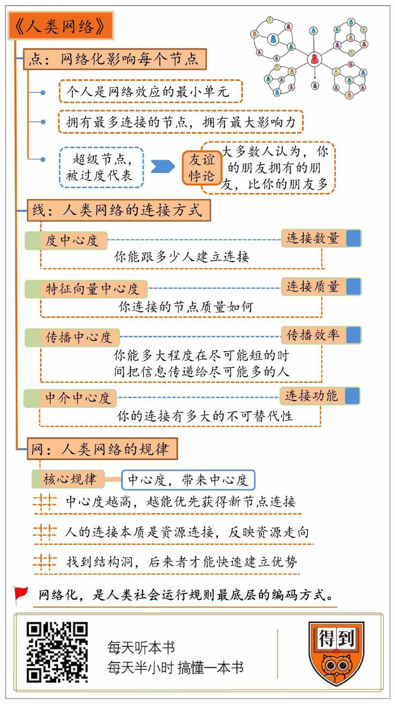

# 2019713. 人类网络

《人类网络》| 李南南解读

## 关于作者

马修·杰克逊，斯坦福大学经济学教授，美国科学院院士，经济与社会网络研究领域的领军人物，也是诺贝尔经济学奖的热门人选。

## 关于本书

这是一本讲述社会网络的特点，和人们在其中的位置如何塑造我们的观念和行为的书。作者马修·杰克逊对人类网络的观察与分析，结合了心理学、社会学、历史学、生物学、计算机科学、行为经济学等多个学科的成果，通过精彩纷呈的案例、逻辑、游戏与图示，给我们讲述人类社会网络的精彩故事。

## 核心内容

一、网络化，是怎么影响每个节点，也就是我们个人的？

二、人类网络的连接方式有哪些？各自有什么特点？

三、节点通过线连接起来，组成一张网之后，人类网络会呈现出什么样的规律？

## 前言

这本书主要说的是，我们应该怎么突破个体的局限，用网络的视角来理解世界？这是中信出版集团，2019 年的重点图书之一。早在上市前的一个月，我就听中信出版集团的副总编辑，资深出版人方希老师推荐过，说这本书，是一本能让你一秒钟，洞察世界真相的书。

在正式开始说这本《人类网络》之前，我们得先知道，什么叫网络化？简单说，你可以把网络化，当成是人类社会最底层的编码方式。你看，人类社会，包括整个文明的演进，本质上就是一个不断实现连接，不断网络化的过程。人类最初，是一个个孤立的点。后来，点和点之间形成连接，人类构成了新的网络，也就是部落。部落和部落连接，又构成了村庄。再往上，村庄组成了城市，城市组成了国家。到了大航海时代，国家和国家连接，整个世界都变成了一张网。你看，人类社会的演进，就是点跟点之间连成线，线跟线之间又组成网，这个网络化不断深入的过程。这就是为什么说，网络化，是人类社会最底层的编码方式。

那么，这个编码方式，又是怎么反过来，影响我们的呢？简单说，它是从点、线、网，这三个维度，塑造着人类社会的运行规则。举个发生在我身边的例子。我曾经做过导演。我发现，在影视圈，有个有趣的现象。就是这个行业里，有 80% 的灯光师，用行话说，叫灯爷。有 80% 的灯爷，都来自于河南省许昌市的一个县城，叫鄢陵县。不管你是拍电影、电视剧还是广告，剧组里的灯爷们，大概率上都来自这个地方。光线传媒的总裁王长田曾经说过，河南的灯光师，一个村一个村的，控制了整个中国的影视灯光行业。这就奇怪了，一个小小的县城，为什么几乎能垄断一个行业呢？要想解释这个问题，咱们就得用网络化的视角，从点、线、网，这三个层面去分析。

首先，大概 30 年前，鄢陵县有少数几个农民，来北京闯荡。他们特别能吃苦。当时，老式的灯光器材特别重，灯光师是个体力活。再加上北京的第一批灯光师，正好要退休，本地的很多年轻人不愿意接这个苦差事。于是，这个机会就被一些鄢陵县出来的师傅给抓住了。你看，到这一步，最初的节点就出现了。然后，这批灯光师，又作为初始节点，找老乡，连接其他的人。就这样，一批鄢陵人被带出来了。鄢陵的灯光师们彼此连接，就组成了一张网。注意，一旦网络形成，别人再想进这个行业，就没这么容易了。因为这张网，不仅连接着中国最大的灯光师群体，它还连接着这个产业的上下游。你看，你要想进入这个行业，首先得能接到订单吧？假如你是导演，你会把订单给谁？肯定是合作过的，信得过的灯光师。那么，谁最信得过？显然，是已经合作过很多次的鄢陵灯爷。你看，上游的入口，就被鄢陵的灯光师们占据了。再看下游，也就是劳动力。要知道，一个剧组，动不动就要用几十个灯，灯光这个活，一两个人根本干不了，必须得人多。那么，谁能保证，能马上找来这么多人？显然，还得是鄢陵人。因为附近十里八村都在从事这个行业，你找我，我找他，多少人都能给你叫来。就这样，这张网越来越大，最终就占据了整个行业。

你看，从这个例子就能看出，很多圈子、行业、领域的运行规则，都是在网络化的过程中形成的。而要想理解这些规则，我们就必须知道，人类网络的核心逻辑。这本书，主要讲的就是这个核心逻辑。

这本书的作者，是美国斯坦福大学的经济学教授，叫马修·杰克逊。他也是美国科学院的院士，是社会网络领域领军人物。他曾经出版过一本书，叫《经济与社会网络》，堪称是这个领域的必读书。这回，这本《人类网络》，是对之前作品延伸和升级。当然，这本书的内容非常丰富，很难用半小时讲完。今天的解读，相当于为你打开一扇窗户。假如你有进一步探索的愿望，也欢迎你阅读原书。接下来，我就从点、线、网，这三个维度出发，分成三部分，为你解读这本书。

## 第一部分

首先，第一部分，我们说说点。网络化，是怎么影响每个节点，也就是我们个人的？这是网络效应的最小单元，也是理解人类网络的基础。把这些影响用一句话总结，就是拥有最多连接的节点，在网络中，拥有最大的影响力。

乍一听，你可能会觉得，这个结论好像稀松平常。类似的现象也很常见。比如，很多人都模仿明星的穿着，就是因为明星这个节点，连接着很多粉丝的注意力。但是，假如我不追星，不就不受影响了吗？其实，这只是你的错觉。假如我们更深入一步，用专业眼光去看这件事，你就会发现，这个影响比你想象得要深刻。更重要的是，对这个深刻的影响，你很可能察觉不到。

要想知道这个结论是怎么得出的，咱们得先从一个社会学悖论说起。这个悖论叫作，友谊悖论。简单说，就是大多数人总是会觉得，你的朋友拥有的朋友，比你的多。乍一听这句话可能有点绕，其实说白了，就是你总会觉得，你的朋友比你的人缘好。这个结论乍一听好像只是一个感受，当我们用数学来统计这个现象时，悖论就出现了。

假设，一个学校有 100 个人，你问每人两个问题。第一个问题是，你觉得自己有多少朋友？问完后，算出一个平均值，比如 20。第二个问题是，你觉得自己的朋友，他有多少朋友？问完后，再算出一个平均值。你会发现，这个数字肯定比 20 要高。比如可能是 30。到这一步，悖论就出现了。

因为本质上，这两个问题其实是同一个问题。因为你自己，本身也是别人的朋友。换句话说，一个问题，通过两种询问方式，获得了两个不同的结果。那么，为什么会有这种偏差？就是因为，拥有更多连接的节点，被放大了。当你在思考，你的朋友有多少朋友时，你想到的，其实并不是你所有的朋友，你往往只会想到，人缘最好，也就是拥有最多连接的那几个朋友。这些拥有最多连接数的节点，被称为超级节点。

在美国，还有一项调查，研究的是，为什么参加过聚会之后，原本不喝酒的人，会开始喝酒？当你问当事人，他们会回答，因为其他人都在喝酒。但是，当你真正调查聚会，会发现喝酒的人其实并没有那么多。但是，这几个爱喝酒的人，往往是聚会里最活跃，曝光度最高的人，是聚会上的超级节点。你之所以会觉得别人都在喝酒，只是因为，这些超级节点，被过度代表了。

换句话说，你以为你在追随大多数。但事实上，你只是在追随少数的超级节点。再比如，书里还提到一个研究，说的是，找一群人，让他们从 100 张女性的照片里，选一张最美的面孔。你可能会觉得，每个人都会选自己最喜欢，看着最顺眼的那个。事实上，正好相反，很多人选的都不是自己喜欢的。

你看，当你让别人选择最美的面孔时，这个命题其实还隐含另一个问题，那就是，到底什么叫最美？显然，你会觉得，最美的，一定是在这个问卷调查中，得票最高的那个。换句话说，选最美的本质，其实是在猜，别人会选哪个？到这一步，又引出另一个问题，这个别人，指的到底是谁？大多数人想来想去，首先都会想到，自己的朋友里，存在感最强，人缘最好的那个。然后揣摩他的喜好，做出选择。

你看，在一次再平常不过的思考中，我们其实也受到了超级节点的影响。在人类网络中，点跟点之间的连接，形成了超级节点。而超级节点，又无声无息的影响着其他节点。

以上就是第一部分内容。到这一步，你可能会问，拥有连接数最多的节点，是不是人类网络中，影响力最大的节点呢？这本书给出的答案是，未必。怎么讲？别看我们都在建立连接，但是，连接跟连接之间还不一样。你只有弄明白了，人类网络中，有多少种连接方式？每一种连接，有哪些特点？你才能判断，哪个节点才最有价值？

## 第二部分

接下来，第二部分，我们从节点之间的连接，也就是线这个维度来说说，人类网络的连接方式有哪些？各自有什么特点？

作者认为，连接的方式，主要分成四种。作者把这四种方式，总结成了四个中心度。

第一个中心度，叫作「度中心度」。这个名字有点绕，第一个字跟第四个字一样。它反应的是连接的数量。也就是，你能跟多少人建立连接。比如明星、大V、公知，他们能同时跟很多人发生连接，都是度中心度很高的人。但是，千万别以为，度中心度最高，拥有最多连接，你就一定是影响力最大的人。很多时候，我们看的并不是连接的数量，而是质量。也就是，不看你到底有多少朋友，而是看，你的朋友里，有多少牛人。

这个描述连接质量的中心度，叫作特征向量中心度。这也是咱们要说的第二个中心度。在现实世界中，它比度中心度更有参考价值。比如，某个人，有 200 个酒肉朋友，都没什么正当职业，数量多，但质量不高。显然，这个连接数就没什么意义。反过来，某人可能只有几个朋友。但这几个人，都很有社会声望。那么这个人的社会影响力会更大。

顺便一说，这不光是现实世界的逻辑。人们还把这套评判标准，照搬到了网上，并且制定了一套专门的算法。比如，我们都知道，谷歌的搜索算法很强，但是很少有人知道，这个算法到底厉害在哪。其实，这套算法的核心，就是衡量特征向量中心度。

假设你在谷歌上搜索「巧克力」，可能会搜到上百万个结果。这些结果怎么排序？最初的算法，是按照度中心度，也就是，按照数量排序。哪个网页里关键词的数量最多，它排名就最靠前。但是，这就带来一个问题。你看，假如我在一个网页里，输入 100 遍巧克力，这个网页就排在第一，但这个结果没有任何意义。

所以，谷歌换了一种算法，不按数量排名，而是按照网页质量排名。不看这个网页本身包含多少个关键词，而是看，连接到这个网页的，都是些什么样的网站。比如，有 10 个门户网站，都连接到这个网页，那么这个网页的排名就会很靠前。换句话说，这套算法看的，不是你有多少关键词，而是看，有多少权威网站愿意为你背书。本质上，它衡量的就是特征向量中心度。把这套算法对应到我们的生活中。假如你刚刚步入职场，先别忙着拓宽人脉。而要先想想，哪些人脉最有价值，最值得你结交。提升自己的特征向量中心度，这才是更重要的。好，这是第二个，特征向量中心度。

第三个，叫传播中心度。它描述的是，你传播信息的效率。也就是，你能在多大程度上，在尽可能短的时间里，把一个信息传递给尽可能多的人。

比如，有 10 个村子，都特别落后，没有电视，没有网络。你想在这十个村子里，传播一条消息，你应该找谁？显然，每个村子里，度中心度最高的人是村长，他认识村里所有人。特征向量中心度最高的人，可能也是村长，也可能是村里的其他长辈。但是，这些人都有个局限，就是只认识自己村里的人，出了村就不管用了。你看，要传播这个消息，度中心度和特征向量中心度都不是最有效的。这时，你就要找到，那个传播中心度最高的人。这个人，很有可能是村里的媒婆。因为她经常在各个村子里走动，所有村子的人她都认识，她能够把一条消息，带给每个村子。当然，作者也说了，传播中心度，这个指标的应用场景并不多。它只在我们需要传播消息的时候要用到。所以，咱们了解一下就行，就不多说了。

第四个，叫中介中心度。它描述的是，你在社会网络里的连接功能，有多大的不可替代性。比如你同时认识张三和李四，但他们俩互相不认识，必须得通过你才能找到对方。那么你就具备了中介中心度。像张三李四这样的人越多，你的中介中心度就越高。

这个中介中心度有什么用呢？简单说，它可以让我们整合不同圈子，不同领域的资源。说白了，就是给你一种，组队攒局的能力。把这个能力用好了，就会带来巨大的影响力。比如，在 15 世纪的佛罗伦萨，有个家族叫美第奇家族。这是当地影响力最大的家族。达·芬奇曾经说过，美第奇家族创造了我，同时也毁灭了我。当然，咱们不去追溯这段故事到底是怎么回事，只是想从这句话里感受一下，美第奇家族有多大的影响力。

你可能会觉得，这个家族要么是特别有权，要么特别有钱。其实，他们在政治和金钱上，都不是最有实力的家族。他们厉害的地方在于，有很高的中介中心度。也就是，连接着不同领域的资源。你想找任何一个领域里的资源，他们都能帮你找到。比如，一个政客想找艺术家画幅画，得找他们；一个商人想托政客办点事，搞点利益交换，也得通过他们；一个艺术家想搞个画展，通过商人筹集经费，还得找他们。换句话说，美第奇家族虽然没有直接掌握这些资源。但是，他们却掌握着通往这些资源的路，谁都绕不开。这是第四种连接节点的方式，做中介。我们用中介中心度来描述它。

以上就是第二部分内容。我们说了四种，点跟点之间的连线方式。它们对应着四个指标，分别是，连接的数量、质量、信息传播的效率，还有你建立的连接，有多大的中介功能。

## 第三部分

说完了点和线，接下来，第三部分，我们说说网。也就是，当这些节点通过线连接起来，组成一张网之后，这张人类网络，呈现出什么样的规律？

在这本书里，作者提到了很多规律。咱们在这，只说一种，在书里篇幅占比最大，也是作者认为，最重要的规律，叫作「中心度，带来中心度」。乍一听，你可能有点懵。其实说白了，就是赢家通吃。人缘好的人，人缘会越来越好。受关注的人，会越来越受关注。有钱的人，会变得越来越有钱。最终，少部分的人，会掌握大部分的资源。

其实，这个现象并不难理解。在前面的讲述中，你可能已经隐约感觉到，中心度越高的人，越能优先获得新节点的连接。比如，你到一个陌生环境，想交朋友，你很可能会最先结交，那个人缘最好的人。一是他存在感强，容易被你注意到。二是他可能很开朗，会主动跟你建立连接。再比如，你想去一个陌生的地方做生意，你会跟谁合作？肯定是口碑最好的人。换句话说，人类网络在不停的生长，节点之间不断产生新的连接。但是，这些连接不是随机发生的，而有选择的。中心度越高的节点，越能获得优先连接。要知道，人的连接，它本质上也是资源的连接。你的连接取向，也反映了资源的走向。

比如，在网上有个段子，说的是，某富豪，钱根本花不出去。因为他花的每一分钱，最终都会回到自己手里。从网络的角度看，其实不难理解。你看，只要你占据了这个网络里的关键节点，它获得的连接足够多，质量足够高。那么这花出去的钱，不管怎么流动，都很可能会再次经过你这个节点。你看，钱不就回来了吗？

比如，一个房地产大亨，买了一斤猪肉。而卖猪肉的人赚钱，就是为了买房子。这一斤猪肉的钱，就早晚会回到房地产大亨的兜里。当然，这是个简化过的例子，真实世界里的资源流转，要复杂得多。

说到这，你可能会问。既然中心度会带来更多的中心度，所有的资源都汇集在少数人手里。那么，后来的人是不是就没机会了呢？当然不是。在社会网络里，有一个概念，叫结构洞。找到结构洞，后来者也能快速建立优势。

什么叫结构洞？简单说，就是两个网络之间，不存在任何连接，那么从结构上看，这里就存在一个空洞。它就叫结构洞。你可能觉得这个概念有点笼统，咱们通过一个思想实验，来仔细说说。

问你，假如地球上有一个人，能跟外星文明建立联系。注意，是只有这一个人能。那么，这个人的权力有多大？你可能会说，他应该会很富有，因为他可以做中介，在地球人和外星人之间做点生意，赚个差价。假如生意做大了，没准能成为大富豪。但是，假如你这么想，可就低估了这个结构洞的价值了。事实上，假如真有这么一个人，他可能会成为，地球上最有权势的人。

你可能会觉得奇怪，只是做个中介而已，为什么会带来那么大的权力？咱们一步步推演。你看，首先，一旦外星人出现，地球人肯定会琢磨，对方到底是善意还是恶意。为了弄清，总得先建立外交关系。怎么建立？显然，不能把这个事情，交给某个国家，必须得全人类一起来。你看，这么一来，各个国家的政要，都会聚集在你这儿，并且以你为中心，建立起一个外星文明联络部。不管人类有什么意图，或者想弄清外星文明有什么意图，都得通过你。注意，到这一步，你等于已经是地球上，最有名的人。同时，地球上最有权的一批人，你也全都认识。前面说的四种中心度，你都是地球上最高的。你不管说什么，别人都会重视。

其实，类似的事情，早在几千年前，就已经发生过。你看，过去统治者说自己是被神授命的，只有自己能跟神沟通。本质上，其实就是占据了人和神，这两个网络之间的结构洞。这个思想实验的目的，是想把结构洞的力量，放大到极致。只有放大，才能引起注意。因为在现实中，并没有这么大的结构洞。以至于，我们很容易忽略，身边的那些，小结构洞的力量。

比如，在公司里，部门跟部门之间，就存在结构洞。假如你能连通两个部门，你就占据了这个结构洞。再往上，公司跟公司之间，行业跟行业之间，都可能存在结构洞。你占据的结构洞越大，连接的网络之间的距离越远，它带来的收益就越大。

好，以上就是第三部分内容。人类网络呈现出什么样的规律？我们主要说了一种，叫作中心度带来中心度。说白了，就是赢家通吃。在人类网络的扩张中，你已经获得更多连接的节点，将在未来获得更多的优先连接。而对后来者来说，机会往往隐藏在结构洞中。找到两个尚未建立连接的网络，占据这个结构洞，建立新连接，就能获得收益。

## 总结

这本《人类网络》咱们先讲到这。再次强调，这本书原本的内容，要比我今天的解读丰富得多。我觉得，假如你想了解社会网络，那么这本书可以作为首选。