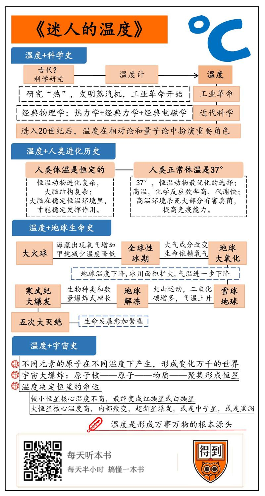

# 2019736迷人的温度

《迷人的温度》| 曹天元解读

## 关于作者

本书作者是美籍意大利物理学家吉诺·塞格雷，他是诺贝尔物理学奖得主埃米利奥·塞格雷的侄子，本人在宾夕法尼亚大学担任物理教授。塞格雷家族在二战前由意大利移民美国，因此也对二战前后的欧洲科学史相当关注。吉诺·塞格雷曾经撰写过广受好评的关于费米、玻尔、伽莫夫等人的传记，而这本《迷人的温度》则是他从温度的角度出发，为宇宙、地球和生命撰写的一本「大历史」。

## 关于本书

本书以温度为线索，从各种不同的方面去讲述了关于宇宙、地球和生命的历史。从科学、人类、生命、地球、宇宙等等不同的角度，塞格雷为我们全面阐述了温度在其中起到的作用。通过这本书，你会发现，「温度」原来是一个这么奇妙的概念，它几乎决定了这个世界上一切事物的命运。

## 核心内容

「温度」是我们日常最熟悉的词汇之一，然而，这个概念其实在历史上只出现了 300 多年。对温度的研究不但是近代科学诞生的重要因素之一，也将在未来继续促进超导、超流等一系列前沿科技的发展。

从进化的角度来看，保持稳定的 37 度体温让人类和哺乳动物得以发展出精密的大脑，最终导致了智慧生命的出现。温度的变迁深刻影响了地球演化的历史，一次次的冰期变迁让生命的形态不断产生变化，在这个过程中，它们改变了地球大气成分，并最终形成了今天的样子。最后，温度不但决定了宇宙的起源，也是各种不同的原子核形成的根本原因。可以说，这个世界上几乎所有的事物，它们的起源和命运都与「温度」息息相关。

## 前言

你好，欢迎每天听本书。本期音频我们要讲的书是《迷人的温度》，它还有个副标题，叫作「温度计里的人类、地球和宇宙史」。很明显，从书名你就可以听出来，这是本讲「温度」的科普书。

不过，它和其他科普书最大的不同之处，就是别的科普书，讲物理的往往只讲物理，讲生物的往往只讲生物。但是这本书以「温度」为线索，从宇宙讲到地球，从生命讲到人类，物理、化学、生物、地质，几乎无所不包。不听这本书，你一定不知道，「温度」原来是这样一个神奇的概念。从最大的宇宙到最小的原子，从地球的演变到人类的进化，温度几乎决定了这个世界上发生的一切。听完了这本书，你也可以感受到大自然的奇妙之处：它在各个方面，在各个层次上，原来都是互通的。只要把握住「温度」这个核心概念，你就可以把万事万物都串到一起。这才是这本书真正「迷人」的地方。

在开始之前，我们先来介绍一下本书的作者吉诺·塞格雷，他是一位美籍的意大利物理学家有句老话叫作「将门出虎子」，在科学史上有很多的「科学世家」。比方说著名的伯努利家族，就是在同一个家族里出了好几位大数学家。

本书的作者吉诺·塞格雷，则出生于一个典型的「物理世家」。他本人是宾夕法尼亚大学的物理教授，他的叔叔埃米里奥·塞格雷更加有名，曾经拿过诺贝尔物理学奖。另外他的兄弟、外甥、表叔等等都是研究物理的。不仅如此，吉诺·塞格雷的夫人也同样出自物理世家，他的岳父、连襟等人在物理界都很有名气。所以连塞格雷自己都说，搞物理其实就相当于他的「家族事业」。

不过，吉诺·塞格雷的才华并不仅限于物理，他对历史也很有研究。这就可以让他以「温度」为线索，信手拈来，全方位地去讲述一段关于自然的「大历史」。接下来，就让我们跟随他的脚步，围绕着温度这个主题去探索四段不同的历史。它们分别是科学史、人类史、地球生命史以及宇宙史。

## 第一部分

首先，我们来回顾一下科学的历史，这就要从「温度」这个概念本身说起。在今天，「温度」已经是一个日常用词，大家说着说着，早就习惯了，不会觉得这个词有什么特别的。但是你可能不知道，其实「温度」这个概念在历史上才出现了三百多年。在古代，人们知道冷，也知道热，但是从来没有「温度」的概念。换句话说，古人从来没有想到过，「冷」和「热」是一种可以被量化的东西。

事实上，「温度」这个词的提出是科学史上非常重要的事件，它直接导致了近代科学的重大革命。而这一切的导火索，却是一种看上去不起眼的小小仪器，就是温度计。

最早的温度计是谁发明的，有很多种不同的说法。不过可以肯定的是，它的发明时间大概在公元 1600 年之后，那时正好是近代科学革命爆发前的关键时刻。在这个时间段，出现了好几种非常重要的发明，包括望远镜，显微镜，还有就是温度计。望远镜帮助人们提高了天文观测精度，促成了牛顿力学的诞生。显微镜帮助人们发现了细胞等微小结构，促成了近代生物学的诞生。而温度计呢？它带来的革命虽然要晚一点，但是重要程度和它们不相上下。它第一次让人们有了「温度」这个概念，也就是我们可以把冷和热定量化、数字化。大家熟悉的「摄氏温度」，「华氏温度」就是那个时候定下的两个量化标准，一直沿用到今天。

为什么说「定量化」非常重要呢？可以说没有定量化，就没有科学研究。温度计发明以后，有了温度的概念，人们才第一次得以对「热」这个东西展开系统的研究。这是一段非常精彩和曲折的历史。而关于这段历史，你只要记住两点就行了。

第一，在对「热」的研究过程当中，人们发明了一种蒸汽机，直接导致了工业革命的开始。第二，对于热的研究最后导致了一门叫作「热力学」的学科出现，它和经典力学、经典电磁学一起，构成了经典物理学的三大支柱。

所以，从某种意义上讲，对于「温度」的研究，是工业革命和近代科学爆发的一个关键因素。经常有人问，为什么中国古代没有爆发工业革命，没有诞生科学？

其实除了缺乏历史传统和思想基础之外，还有人提出了一个很重要的技术原因，就是中国古代的玻璃制造技术不行。为什么这么说呢？

你看，不能造玻璃，你当然也就造不出望远镜，显微镜，还有温度计这些仪器。而没有这些仪器，你就没法精确地量化一个概念，也就谈不上科学研究。所以，千万不要小看温度计这个东西，正是它给我们带来了近代科学的重大革命。从此，我们有了「温度」这把尺子，对于科学家来说，这就好像是打开了一扇新世界的大门。

如果说温度对于科学的起源有重大帮助，那么，它对于科学的未来也同样不可或缺。因为进入 20 世纪后，物理学界又爆发了两场新的革命，一个是相对论，一个是量子论。而这一次，「温度」同样在其中扮演了重要的角色，尤其是对于量子论而言，温度更是一个核心因素。在量子世界里，物质在接近绝对零度的超低温状态下，会展现出非常奇妙的性质，我们经常听到的「超导」、「超流」，以及由此衍生开来的一系列前沿技术，都是量子效应在低温下的宏观体现。我们也能想象，在未来温度仍然会是科学研究里最重要的课题之一，它几乎牵涉到一切重大的物理和化学问题。可以说，「温度」贯穿了整部科学史，甚至毫不夸张地说，它是人类作为一种智慧生物，在历史上发现的最重要的科学概念之一。

以上是第一点，我们围绕着温度回顾了科学史。接下来，让我们同样从温度出发，来重新审视一下人类，也就是我们自己的进化历史。

## 第二部分

我们知道，一个人的正常体温大约是 37 摄氏度，不管你是男是女，皮肤是黑是白，也不管你是个婴儿还是百岁老人，住的地方是赤道还是北极，所有人都有着相同的体温。你可别觉得这就是个常识，如果我们把镜头拉远，从整个自然界的角度来看，这其实是个奇怪的现象。

因为除了人类之外，其他能够保持恒定体温的动物，比如多数哺乳类，它们的温度也大多都在摄氏 37 度左右浮动。鸟类也是恒温动物，体温稍微高一点，但也就是在 42 度左右，差距很小。你看，是不是好像有一只看不见的魔力之手，把各种动物的体温都精确地调控在「37」这个数字附近，这是为什么呢？

这里其实有两个问题，第一是，为什么我们的体温是恒定不变的？

第二是，为什么这个恒定的数字正好是 37？

关于这两个问题，其实在科学界也是众说纷纭，并没有统一的公认答案，不过有一些说法很有意思，也得到了一定程度的认同，我在这里跟你分享一下。

为什么人类的体温是恒定的？其实很容易发现，所有的恒温动物，比如鸟类和哺乳类，它们的共同特点是进化得非常复杂，特别是都拥有一个复杂的大脑。而更简单一点的动物，比方说爬行类和两栖类，像是蛇或者青蛙，它们就不是恒温的，而是所谓的「冷血动物」。相对来看，它们的大脑结构比较简单。

所以，有一种说法是，我们的身体会进化出恒温的机制，是为了让大脑发挥出最佳的性能。因为我们的脑子是一个极其精巧的仪器，在那里，会产生各种复杂的化学反应，会有无数信号在神经细胞之间传送与接收，而所有的这些化学反应都极其依赖于温度。对于「精密仪器」来说，工作环境的稳定才是重中之重。只有让大脑保持在一个稳定的恒温环境里，它才能稳定地发挥作用。

但就算需要恒温，那为什么非要是 37 度，而不能是其他数值呢？这个问题也很有意思，因为这很可能是一个在进化中博弈取舍的结果。总体而言，体温高对于生命是更有好处的。因为首先，高温意味着各种化学反应的效率高，代谢速度快，你的动作就可以更快更敏捷。对于生物来说，动作灵活肯定比慢吞吞要好。

其次，高温环境可以杀死大部分有害的真菌，防止对健康造成危害，同时也可以提高免疫能力。实际上，我们生病时候会「发烧」，就是这个道理。面对入侵的病菌，身体系统会特意提高温度，以便更有效率地对抗细菌。

当然，这也不是说体温越高越好。因为很明显，保持高体温是要付出代价的，那就是需要消耗更多的能量。所以这里肯定有一个平衡点。那这个平衡点在哪里？进化已经给了我们答案。因为神奇的是，几乎所有的恒温动物在演化过程中都不约而同地选择了 37 度，这说明这个体温很有可能就是在地球环境里，对于恒温动物最优化的一个选择。

如果这种说法是真的，那温度可以说是我们人类诞生的重要前提。你可以想象一下，最早的时候，生命的祖先以一种很简单的形态生活在海里。海水的温度相当稳定，所以生物本来也没有必要进化出保持恒温的功能。但是后来，一部分动物从海里走上了陆地，它们面对着一个完全不同的环境。在陆地上，日夜和四季会产生非常大的温差，在这种情况下，陆地生物想要获得更多的生存优势，一个恒温的环境就显得越来越重要。

非常幸运的是，有一部分动物真的偶然进化出了精确控制身体温度的能力，而长期的自然选择把这个体温调整到了最佳的 37 度。有了稳定的体温，这些动物的大脑才得以向更精密的方向演化，变得越来越发达。从此，这些动物走上了一条朝着「智慧」进化的路，而其中走得最远的那一群就是我们人类。从这个角度来说，稳定的温度，很有可能是地球上智慧生命诞生的关键所在。

以上是第二点，我们从温度出发，探讨了人类为什么会进化出智慧。接下来，让我们把眼光放大到整个地球，来看看温度对地球上的生命造成了什么样的影响。

## 第三部分

咱们都知道，生命需要氧气。可是你知道吗？其实在很长的一段时间里，地球大气层里的氧气含量很少，而且它对于当时的生命是一种「毒药」。那为什么今天大部分的生物都变成了需要呼吸氧气的生物呢？其实这也和历史上的一次温度大变迁有关。

最初的地球是一个炙热的大火球，经过七八亿年之后，它终于冷却到了液态水可以存在的程度。在那之后很短的时间里，生命就出现了。我们刚才说到，对生物来说，保持稳定的温度非常重要。但是地球并不是「恒温」的，它的平均温度在漫长的岁月里，有过数不清次数的起伏变化。

决定地球温度的因素有很多种，比方说它围绕太阳运行的轨道，自传轴的倾斜角度，乃至它在银河系中的位置等等都会影响整体气候。除此之外，地球自身的因素，比如大气成分、洋流、甚至生物本身也能让温度产生变化。在这么多综合因素的影响下，地球有时冷，有时热。冷的时候，冰川覆盖了大地，就形成了地质学上说的「冰期」。

冰期的出现和消失不但改变了地质环境，更对生物的发展造成了难以估量的影响。比方说，一直到大概 27 亿年前，地球还非常炎热。因为当时地球的大气成分和今天非常不一样，几乎没有氧气，充斥着二氧化碳和甲烷。我们知道，这两种都是温室气体，由此造成的结果就是，当时的气温可能要比今天高 50 度之多。在这种环境里，生命进化得非常缓慢。

要知道，这时候生命已经出现将近 20 亿年了，但形态非常简单。当时地球上的生命，基本上都是生活在海洋里的厌氧性原核生物。不过，接下来的一个偶然事件就彻底改变了一切。

事情的起因众说纷纭，可能是由于某种能进行光合作用的海藻出现，增加了地球上氧气的产量，也可能是因为产生甲烷的细菌突然减少。总之，大气里的氧气开始慢慢增多了。氧气的增多一方面杀死了大量的厌氧生物，另一方面让大气里的甲烷氧化。于是大气里的甲烷越来越少，温室效应逐渐下降，地球的温度也开始慢慢降低，最终形成了全球性的冰期。

这场大冰期可能让当时地球上的绝大多数生物都灭绝了，但是，它同样也给生命创造了机会。新生的、能够进行光合作用的生物熬过了这场冰封浩劫，最终占据了生命的主流。它们不但改变了地球的大气成分，也彻底改变了演化的方向。从此之后，生命开始更多地依赖于氧气，它们使用能量的效率提高了，形态也开始变得更加复杂。这就是地球演化史上最重要的事件之一，史称「大氧化」。

另一次决定命运的冰期出现在大约 7 亿年前，当时地球上还没有七大洲，所有的陆地都聚成一块巨大的大陆，而且位置正好在赤道附近。有意思的是，因为大陆能够反射更多的太阳光，而赤道上的阳光正好最多，这样一来，地球接收太阳的总能量就减少了，就导致气温稍微下降了一点。

你可别小看下降的这一点点温度，它造成了一连串连锁反应：温度下降一点，地球上的冰川面积就扩大了一点，而冰川是白色的，反射太阳能量的能力更强，这就进一步造成了气温的下降。

你看，这就变成了一个死循环：冰川造成温度下降，温度下降又造成了更多的冰川。无限反馈放大之后，地球就进入了寒冬。当时的气温可能低达零下 50 度。从太空中看，地球上白茫茫一片，这就是所谓的「雪球地球」。

那后来地球又是怎么解冻的呢？原因也很偶然，科学家推测，可能是地球内部的火山运动，向大气里喷发了大量的二氧化碳。二氧化碳是温室气体，当它在大气中累积到了一定程度，就能让气温显著上升。很快，冰川开始融化，这又引发了反向循环，导致气温进一步上升。于是，在很短的时间里，地球的温度整整上升了 100 度，从零下 50 度上升到零上 50 度，海水解冻，生命重新开始萌发。

而且和前一次冰期一样，虽然绝大多数生命都没有挺过冰封时代，但那些少数幸存下来的物种，却在气候回暖后爆发出了惊人的能量。雪球地球之后，无论是生物的种类还是数量，都产生了爆炸式的增长，造就了著名的「寒武纪大爆发」。今天地球上所有的生物门类，其中有很大一部分就是在寒武纪的这场大爆发里产生的。

所以你看，生命的演化和温度是多么息息相关。实际上，在地球的漫长历史里，随着气温的上下起伏，生命已经经历了五次大灭绝。而且神奇的是，每次大灭绝之后，生命的发展都比之前要更加繁盛。

比如 6500 万年前，一颗小行星撞击了地球，扬起了漫天的灰尘挡住阳光。随之而来的寒冬灭绝了恐龙，却给哺乳动物带来了发展的机会。1 万 3000 年前，可能又是一颗彗星造成了同样的降温，美洲的猛犸象、剑齿虎等等动物纷纷灭绝。但正是这次事件，给人类造成了不可估量的影响。因为动物突然减少，我们的祖先不得不放弃狩猎的生存模式，开始了农业种植。从此，我们的文明进入了一个新的时代。生命，就是在这样不停地冷热循环中生生不息，演奏出一曲波澜壮阔的「冰与火之歌」。

以上是第三点，我们探讨了温度和地球生命的关系。最后，让我们把脑洞开到天际，来看看温度是如何决定整个宇宙命运的吧。

## 第四部分

为什么说温度决定了宇宙的命运呢？你可能不知道，宇宙里的每一个原子核，它的来历都是传奇。我们的世界之所以这样丰富多彩，本质上取决于每个不同元素的原子，它都是在不同温度的「熔炉」里打造出来的。

这是怎么回事呢？你一定知道，宇宙诞生于一场大爆炸。在最初时刻，一切都处于极度的高温，当时各种基本粒子几乎没有区别。不过随着时间流逝，宇宙的体积不断膨胀，它的温度也不断下降。到了宇宙诞生之后三分多钟，温度下降到了大约 9 亿度，终于足以形成稳定的原子核。

在这之后，宇宙温度随着膨胀进一步下降。又过了大约 38 万年，本来处于自由形态的电子都被吸收到原子核附近，形成完整的原子。原子的形成就意味着，物质时代正式开始了。有史以来第一次，我们的宇宙里充满了不带电的普通物质，而这些物质慢慢聚集起来，形成了无数的恒星，再次点亮了空间。

这些恒星就像一个个「熔炉」，不同的元素就是在它们内部打造出来的。因为在大爆炸之初，宇宙里基本上只有最轻的两种元素，也就是氢和氦。这两种元素也是元素周期表最前面的两个。那元素周期表后面的元素是怎么出现的呢？在恒星内部高温高压的环境里，这两种元素才能进一步变化，从氦变成碳，碳变成氧，氧变成硅……恒星的温度越高，聚变就会向着更重，也就是元素周期表更靠后的元素进行。

不仅如此，温度更决定了恒星本身的命运。一般来说，较小的恒星，它们的核心温度不高，这样的恒星会有很长的寿命，最终变成红矮星或者白矮星。比方说我们的太阳，它在几十亿年之后就会变成一颗白矮星。

不过，如果恒星非常巨大，它的「死法」就完全不同了。因为大恒星的核心需要极度的高温来维持，这会加速它内部的元素向着更重的方向进行聚变。而不幸的是，元素的聚变只能一路进行到铁原子，因为铁是最稳定的元素，哪怕再聚变也释放不出更多的能量了。

所以当恒星的内部聚变进行到铁之后，它就再维持不了自己的核心温度了，也就抵抗不了自身的巨大压力。于是一瞬间，这样的恒星会释放出巨大的能量，把自己的外层甩到宇宙空间里去，只留下一个很小的内核。这个壮观的景象就是「超新星爆发」，至于爆发后留下的内核是什么样子，也和温度有关。如果原来的核心温度比较低，可能会是一颗中子星，但如果恒星特别巨大，温度特别高，那就会留下一个黑洞。

顺便说一句，虽然恒星内部的自发聚变反应一般到铁为止，不过在超新星剧烈爆发的过程中，会短暂地形成更高的能量和温度，就会把铁进一步变成更重的元素。所以宇宙里所有比铁更重的东西，包括地球上的金银铜矿，也包括组成我们身体的很多原子，有很大一部分都是在超新星爆炸，或者两颗中子星对撞的时候形成的。

我们看电影《复仇者联盟》，雷神说他的锤子是在中子星上锤炼出来的，听起来似乎很高大上，其实一点也不稀奇。因为实际上，我们戴的金项链、银耳环，甚至包括我们每个人本身，有很大一部分就来自中子星的「锤炼」。从某种意义上讲，其实组成我们的几乎每一个原子核，来历都很传奇，它们要么来自宇宙大爆炸的最初，要么来自恒星内部的熔炉，要么来自超新星爆发的尘埃，要么来自中子星碰撞的回响。而在这其中，最关键的因素还是温度。不同的温度铸造了不同的原子核，最终形成了这个变化万千的世界。

## 总结

好了，以上我们已经从四个不同的角度讲述了「温度」的传奇故事。我们看到，温度不仅在科学史上发挥过重大作用，更是未来探索的前沿课题。温度是人类进化出智慧和文明的关键，也是影响地球生命演化最重要的因素之一。

温度不但决定了宇宙和恒星的命运，甚至可以说是形成万事万物的根本源头。一个在生活里如此习以为常的概念，其背后却隐藏着如此重大的意义，不知道你有没有感到惊讶呢？也许，当下次别人再说起「温度」的时候，你就会觉得：嗯，这个词确实有一点与众不同的「迷人」之处。