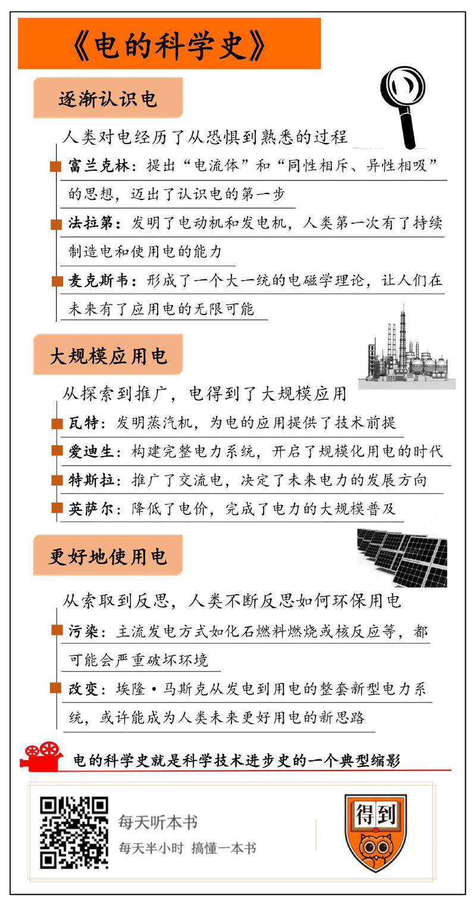

# 2019833. 电的科学史

《电的科学史》| 田牧歌解读

## 关于作者

本书作者是美国学者克雷格·罗奇，他是一位有着 40 多年从业经验的电力行业专家。罗奇本科毕业于美国约翰·卡罗尔大学，后在威斯康星大学获得经济学博士学位，他曾经是北美地区监管流程和法律方面的专家顾问，之后创办了一家专门从事电力和天然气业务的咨询公司——波士顿太平洋公司，并担任总裁职务。

## 关于本书

这本书是一本回顾电的发展历程的历史科普书，通过若干位关键科学家的历史事迹，串联起人们从认识电、到应用电、再到反思电的历史全过程。与此同时，这本书还向我们展示了电的科学史中的一些典型特征，这些特征能很好地对应起来人类科学技术发展的典型路径，所以通过这本书，我们还能对人类科技进步的一般方式有一个大致的了解。

## 核心内容

在二百多年前，电对人类还是一种神秘而且带有恐怖色彩的现象，直到富兰克林提出第一个系统性的电学理论，帮助人类迈出认识电的第一步，人类才算揭开了电的科学史的第一页。从此以后，法拉第和麦克斯韦深化了对电的本质的了解，爱迪生和特斯拉创造出了今天人类电力工业的雏形，英萨尔将电推广至千家万户，马斯克则引领了未来用电的新方向。

在此期间，人类认清楚了电的本质，有了大规模使用电的能力，也有了对电力的进一步反思。从这个角度来看，人类仍然在谱写着未完待续的电的科学史。

## 前言

说起电，我们肯定都再熟悉不过了，从某种意义上来说，正是电，成就了今天的人类文明。为什么这么说呢？第二次工业革命以来，人类逐渐掌握了电能、核能、风能、太阳能等等能源形式，这些更先进的能源，带给了人类更大的生产力，驱动着人类文明大幅进步。但你发现了吗？不管是核能、太阳能还是其他能源，基本都要先转化成电能，才能被用户使用。你看，电早就已经深入到社会的每一个角落，为人的生产生活提供动力，所以我们才说，正是电成就了今天的人类文明。不过，人类的认知往往有一个特点，那就是如果对一个东西太熟悉的话，就很容易忽视这个东西的存在和由来。电就是这样，我们天天都要用电，但你真的想过，电是怎么来的吗？

《电的科学史》梳理了人类与电结缘的二百多年历史，而且还回答了一个特别本质的问题：为什么说电的科学史，就是科学技术进步史的一个典型缩影？我们都知道，科学技术的进步不会是一帆风顺的，进步的过程中经常伴随着各种困难，但这些困难往往也标志着科技进步的转折点，一旦克服，就会有巨大的突破。电的科学史也是这样，人们对电的无知、对直流电交流电的争论、对环境的担忧等，都一直左右着人对电的认识和应用。但每当人们克服这些困难之后，电就能获得更好为人类服务的能力，这其实就是科技进步的一个特别经典的路径。

这本书全书都在讲电，作者自然也对电知根知底。本书作者是美国学者克雷格·罗奇，他既是一位有着 40 多年从业经验的电力行业专家，同时也是一家专门从事电力天然气业务的咨询公司的总裁，一辈子都在和电打交道。那么接下来，我就结合作者的思路，通过三个问题，来带你回顾电的科学史：1）从恐惧到熟悉，人类是如何逐渐认识电的？2）从探索到推广，人类是如何大规模应用电的？3）从索取到反思，人类在未来应该如何更好地使用电？

## 第一部分

从恐惧到熟悉，人类是如何逐渐认识电的？要讲电的科学史，还是让我们从认识电开始讲起。如果我问，在你眼里电是什么，有什么特点？你可能有很多答案，比如电是一种能源，电能产生静电力，电也很危险，等等。这些在今天看来都是常识了，但以前的人们可不是这么想的。直到十八世纪，因为闪电的强大破坏力，电在很多人眼里还是一种特别神秘、可怕的东西。比如他们会认为，电是上帝对人类的惩罚，是地球毁灭的象征。对当时的很多人来说，别说使用电了，光想想就够害怕的。

普通人是这样，科学家们呢？也好不到哪儿去，很多科学家对电的认识也是迷迷糊糊的。在 18 世纪中叶，科学巨人牛顿的理论仍然统治着学界，牛顿提出的万有引力定律，解释了物体与物体之间的引力作用。所以当时主流学界也普遍觉得，由电产生的静电力，也应该用万有引力来解释。

可问题就出在这儿，我们都知道，引力是相互吸引的力，但是由电产生的静电力，既可以是吸引力，又可以是排斥力，带有同性电荷的物体相斥，带有异性电荷的物体相吸。所以用万有引力定律来解释静电力就说不通。于是，当时的主流科学家们就钻进了这个死牛角尖儿。

打破了当时思维的禁锢的，是美国科学家本杰明·富兰克林。他提出了一种全新的电学理论，人们对电的认识才算有了真正的进步。一听富兰克林这个名字，你可能就想到了那个著名的风筝实验，他冒着被雷击中的风险，在雨天放风筝，想要把雷引下来。通过这个实验，他证明了闪电和摩擦产生的静电，本质上都是电的一种形式，帮人们进一步认识了电。但其实，富兰克林的最大贡献并不是这个。

他的最大贡献是没有生搬硬套牛顿的万有引力理论，而是通过实验观察和思考，总结出了一套新理论。这套理论提出了「电流体」的概念，认为物质都带有一定数量的电流体。正常状态下，物体带有电流体的数量是特定的，这时候既不会吸引也不会排斥其他物体。但如果物体中的电流体数量变少了，那这个物体就带负电，反之就带正电，带有不同电的物体会相互吸引，带有相同电的物体会相互排斥。

听到这儿，你是不是觉得这个理论很熟悉？没错，虽然富兰克林的理论还不够成熟，比如他没有意识到电流体的本质就是我们现在说的「电荷」。但他的理论已经有了现代电学理论的雏形，尤其是「同性相斥、异性相吸」的思想，证明他已经看到了电的本质。所以作者认为，是富兰克林帮助人类迈出了认识电的第一步。

你可别小看这一步，其实对于科技进步来说，第一步往往就是最难迈出去的，因为人们普遍有着强大的思维惯性，这种惯性常常会阻碍我们认识新事物。比如一个很有趣的例子是，自行车刚发明出来的时候，有学者就认为自行车对人们有很大的危害，因为自行车能让人们跑到更远的地方，人见识了更多东西之后就容易学坏。现在看来，这个观点非常可笑，但人们认识电的第一步又何尝不是这样？从一开始的恐惧怀疑，到后来的因循守旧，电的科学史迈出的第一步，其实就是科技发展史典型的艰难的第一步。

1『自行车的例子很有趣，惯性思维阻碍我们认识新事物，做一张论据卡片。』——已完成

富兰克林走出了第一步，但这时候的人们对电的理解还很浅，还远远没有达到会利用电的程度。就好比我们知道一个东西有什么特征，但既不会制造它、也不会用它。就在这时候，有一位科学家一举解决了这两个难题，让人们既会制造电，又会用电，把人们对电的认识又往前推进了一大步。这个人就是英国物理学家迈克尔·法拉第，他制造出了电动机，又制造出了发电机。

1820 年，丹麦科学家奥斯特发现了电流的磁效应，也就是说，电流会影响磁场。法拉第意识到，既然电流能影响磁场，那磁场反过来也一定能影响电流。在这个思路的指引下，法拉第把通电导线放到磁场里面，成功地让导线动了起来。根据这个原理，他成功制造出了人类第一台电动机。

听到这儿你可能会有疑问，怎么还没发电机就有了电动机呢？电是从哪儿来的呢？其实，人们很早就发明了化学电池，通过化学反应来产生电，但电池的化学反应一旦停止，发电过程也就没法持续了。所以这时候的人们就特别需要一种能持续发电的发电机。你看，在电动机里面，是电让机器动起来了，那么是不是有一种装置，可以反过来，让动起来的机器可以产生电能呢？

法拉第很给力，他在发明电动机之后十年，通过实验证明发电机的原理也是可行的。他发现，磁铁在金属线圈里面移动可以产生电流，然后就根据这个原理，制成了人类第一台发电机。在法拉第的努力下，人类第一次有了持续制造电和使用电的能力，所以可以说，法拉第把人类对电的认识，往前大大地推进了一步，让人类真正拥有了应用电能的理论和技术基础。

到此为止，人们有了对电的基本认识，也有了利用电的技术能力，就可以说完成了对电的认识过程了吗？其实还差一步，你看，不管是富兰克林还是法拉第，他们在电学方面的工作，其实主要都聚焦在电的外在特征和功能上，而没有去探索电的本质到底是什么。人们对电的认识就还不够透彻。爱因斯坦曾说过，自从牛顿之后，物理学的公理体系发生的最大变化，就是法拉第和麦克斯韦对电磁现象的研究。他口中的麦克斯韦，就是完成电的最终理论的科学家，也是让人类彻底认识电的本质的人。

英国数学家、物理学家詹姆斯·麦克斯韦，在前人工作的基础之上，通过严谨的数学推理，做出了一系列的发现。比如他推断出，电场和磁场会以波的形式以光速在空间中传播，光本质上是一种电磁现象，他还预测出了电磁波的存在，等等。在麦克斯韦的努力下，电、磁和光被结合到一起，形成了一个大一统的电磁学理论，让人们彻底地弄清楚了电的本质是什么。正是这种对电的本质认识，让人们在未来有了应用电的无限可能。

## 第二部分

从探索到推广，人类是如何大规模应用电的？人们这时已经造出了发电机和电动机，但其实还不算是真正地会应用电。电的应用历程，应该从哪儿算起呢？本书作者认为，应该从英国发明家詹姆斯·瓦特和他改良的蒸汽机算起。你可能觉得很奇怪，我们明明在讲电的科学史，为什么要提蒸汽机呢？毕竟蒸汽机又不是电驱动的。

其实，如果我们从一个宏观的历史视角来看问题的话，就能发现蒸汽机和电力应用之间的密切关系。比如你看，目前在全世界的发电量中，有 75% 以上都来自化石燃料或者核能发电，而这些发电方式都是通过制造蒸汽，用蒸汽机驱动涡轮进行发电的，所以可以说，蒸汽机为电的应用提供了技术前提。而且，第一次工业革命让蒸汽机获得了大量的应用场景，这就培养了人们使用机械动力的习惯，这也为未来电动机取代蒸汽机提供了社会基础。所以作者认为，电力应用的起点应该追溯到瓦特。

瓦特为电力的应用打下了基础，那么接下来，就该轮到电力工作者登场了。要说起电的应用，你可以思考一个问题，电的规模化应用，最早是用在哪儿的？或者说，电最基本的用途是什么？答案不难，其实就是照明，具体来说就是灯泡。你应该已经猜到了，开启电力规模化应用时代的人，就是大名鼎鼎的发明家托马斯·爱迪生。

我们都知道，爱迪生拥有包括灯泡、留声机和电影摄像机等在内的两千多项发明。但在电力应用方面，爱迪生的伟大之处，远不仅仅在于他发明了这些用电设备，他对后世更重要的贡献是，他设计和推广了一整套电力系统，从发电机到电力线路再到用电器，一应俱全，而且他还成功地把这套系统推向了市场。

毫不夸张地说，是爱迪生和他的团队，从无到有地建立了整个电气行业，让人们第一次有了大规模用电的可能。而爱迪生能做到这一点，关键是因为他兼具天才发明家和天才商人的智慧，他不仅擅长发明，还擅长营销，擅长从商业的角度来思考如何推广他的发明。比如在发明灯泡之后，爱迪生为了打开销路，先是设计了配套的全套电力系统，然后又专门在纽约华尔街最繁华的地带开展了一个电灯照明项目，吸引了很多人的注意力，大大地打开了市场。

而且，在这个项目的筹备过程中，爱迪生还成立了好几个公司，来分别制造电气线路的各种设备，这些公司在日后被重组为通用电气公司，直到今天，通用电气仍然是世界上最重要的电气公司之一。这也是爱迪生留给后人的一个重要遗产。可以说，正是爱迪生的天才发明和天才营销，让社会规模化的用电成了可能，爱迪生开启了一个时代。但值得注意的是，爱迪生电力系统所用的电是直流电，而我们今天家里用的电基本上都是交流电，我们说爱迪生开启了规模化用电的时代，可为什么我们用的电和爱迪生的不一样呢？

其实关键问题是，直流电只适合小规模推广，不适合全社会范围的大规模推广。原因很简单，电如果要长途运输的话，应该用比较高的电压，这样可以减少输电线路的电能损耗。而交流电的优点在于，它可以根据需要，很方便地升高或降低电压，低电压适合平时家用，高电压适合长途电力输送。所以如果使用交流电，人们就可以用一个发电站来为很大一片地区供电，这就很适合大规模推广；而直流电变压很麻烦，不适合远距离输电，所以就很难大规模推广开来。

交流电的发明人，美国发明家尼古拉·特斯拉很早就意识到了这一点，所以他没有走爱迪生直流电的老路，而是另辟蹊径，努力推广交流电系统。这样一来，原本的行业领袖爱迪生就不服了，自己开创的江山怎么能让别人占领？所以爱迪生和特斯拉，就展开了一场直流电和交流电的对决，中间一度闹得满城风雨，出了很多丑闻。最终的结果我们都知道了，特斯拉凭借着交流电的技术优势获得胜利，让交流电成了社会用电的绝对主流，直到今天，我们都深受这场对决的影响。

直流交流之争，是电在应用推广的过程中遇到的一个重要波折，它直接决定了电力应用在未来的发展方向。在其他新技术发展推广的过程里也有这样的情况。比如我们都知道，飞机的发明人是莱特兄弟，但其实今天的绝大多数飞机，都是从美国工程师格伦·柯蒂斯的飞机方案上演化而来的。在飞机的应用过程中，两种方案也进行过交锋，虽然最后莱特兄弟打赢了一时的官司，但时代还是选择了柯蒂斯的那个更加实用的方案。不管是电还是飞机的应用史，都经历过这么一种技术路线的竞争波折。从历史的角度看，没有竞争，不同的技术进步路径就很难分出个高下。所以波折和竞争看似是走了弯路，但实际上是科技进步史中不可或缺的一个环节。直流交流电之争，其实就是科技进步中路线竞争的一个缩影。

到这儿为止，电已经开始有了实际的应用，爱迪生创造了完整的电力系统，特斯拉提供了更优秀的交流电方案。这样一来，电力就能大规模普及了吗？这还差得远呢。其实他俩只解决了「从 0 到 1」的问题，让人们用电成为可能，但并没有解决「从 1 到无穷」的问题，也就是让更多的人用得起电。举个例子，爱迪生最开始发明的电力系统，只有当时的富家豪门才用得起，比如美国金融大亨J·P·摩根就在自己家里安了一套电灯，他为了让这个电灯系统正常运转，还专门雇了工程师进行维护。所以这时候的电，显然不是普通老百姓用得起的。之后随着交流电系统的推广，用户的用电成本虽然有所下降，但电仍然属于一种奢侈品，用的人还是很少。那这个局面是怎么改变的呢？这就要提起一位美国商业天才了，他就是塞缪尔·英萨尔。

英萨尔年轻时曾当过爱迪生的秘书，但他觉得电力行业的未来方向不是电力生产，而是电力销售，所以他就去了芝加哥开展了自己的电力销售事业。当时的芝加哥有 100 万人口，电能用户有多少呢？只有 5000 户。可见，用电的人还是太少。那该怎么办呢？没错，推广用户最好的办法就是降低电价。英萨尔认为，发电厂和输电线路的成本是固定的，所以电能用户越多，平均每个用户分摊到的成本就越低，电价就可以压得越低，这样就能吸引更多的用户，形成良性循环。所以英萨尔采取的策略就是大幅度压低电价，同时寻找大量的用电客户和使用更先进的发电技术来降低发电成本。

在多重措施之下，英萨尔成功地实现了规模经济，把电价降低到普通人也能接受的水平，让原本为有钱人服务的电力行业，变成了一个重要的、为所有人服务的公用事业。有一组数据可以体现美国的电力普及速度：1907 年的时候，美国只有 8% 的家庭用得上电，而仅仅 40 年之后，全美已经有 90% 的家庭用上了电。在这个电力迅速普及的过程中，英萨尔功不可没，正是他大力推广的经营策略，让电力从奢侈品变成日用品，从而有能力造福千家万户。

## 第三部分

瓦特把人类带入了机械时代，爱迪生构建了完整的电力系统，特斯拉推广了交流电，英萨尔给了临门一脚，完成了电力的大规模普及。不过我们也要认识到，电力在造福我们生活的同时，也带来了相当多的环境问题，而这些问题的存在，也在提醒我们应该逐渐改变使用电的方式。所以最后一部分，我们就谈谈第三个问题，从索取到反思，人类在未来应该如何更好地使用电？

我们在家庭用电的过程中，不会产生废水、废气污染环境，但电本质上是通过其他能源进行二次转化得来的。虽然说水力发电、风力发电和太阳能发电都比较环保，但这些发电方式算不上主流，因为目前世界上的所有电能，大多数还是通过不可再生的化石能源或者核能得来的。问题就出在这儿，不管是化石燃料燃烧产生的排放物，还是核反应之后留下的核废料，都可能会严重破坏环境。

当然了，人们也知道这些问题的存在，所以很早以前就开始采取了一些行动。比如 20 世纪 60 年代，美国就掀起了一场声势浩大的环保运动，促使美国国会陆续出台了一系列关于清洁空气的法案，让作为废气排放大户的发电厂，开始通过升级技术来进行节能减排。有数据显示，从 1990 年到 2004 年的 14 年时间里，美国的燃煤发电量提高了 25%，但空气污染的排放量反而降低了 36%。可以说，电力对环境产生的负面影响，在过去的几十年里已经在相当程度上改变了人们对电的使用情况。

但这就够了吗？单纯让发电厂减轻污染排放，就是未来更好的用电方式吗？显然不是，有两个原因：第一，保护环境不能只靠供给端改变，还需要消费端也参与进来进行相应改变，才能彻底地消除用电行为对环境的负面影响；第二，除了控制污染以外，电力行业还需要付出行动，努力去控制气候变暖。所以作者认为，未来我们的用电方式，肯定还要面临一场变革。

其实说到这儿，我们就能发现，人类从认识电到应用电，再到今天的反思电，对电的理解其实是在逐步提升的。比如原来的人们，一直在研发更舒服更快的汽车，用汽车让我们的生活变得更加便利，但今天的我们越来越认识到，汽车对空气的污染给我们带来了很大的负面影响，所以开始行动推广更环保的排放标准和新能源汽车。正是这种反思，让我们有了更好地利用科技的能力。汽车是这样，电是这样，任何典型的科技进步也是这样。只有有了反思，一种新科技的进步史才算是进入到了最后一个章节。

有了反思，就要有实际的变革行动。怎么变革呢？作者特别推崇美国企业家埃隆·马斯克，他觉得马斯克的探索，很有可能就是电力行业未来的前进方向。我们都知道，马斯克创立的特斯拉公司专门生产电动汽车。但你可能不太了解，他还投资和领导了另一家叫作「太阳城」的公司。太阳城公司原本的主营业务，是生产屋顶太阳能光伏发电装置，不过这个公司在 2015 年又推出了一款新的重要产品，名叫 Powerwall 电池，这是一组基于锂电池的家用电能存储设备。

我为什么要提起这个呢？其实，马斯克的突破之处就在这儿。他通过生产特斯拉电动汽车，培养了人们新的用电需求，这很了不起，但更了不起的是，他把创新从使用端延伸到了供给端，把家用的发电装置，和电能存储装置也一并提供给了消费者。使用马斯克的系统，用户就可以在白天用太阳能光伏发电装置发电，电能储存在家庭的 Powerwall 电池里，然后这些电就可以在晚上使用，同时给特斯拉汽车充电。马斯克的这种创新其实很有突破性，因为他相当于创建了一整套家庭微型电网，这套系统能发电也能用电，能满足很多家庭的需求，甚至有可能和现有的大规模公共电网形成竞争态势。而且，这种家庭微型电网还有两个很重要的优势。

一方面，它能影响到的不仅仅只有发电厂，而且还能影响到几乎所有的电能用户，这样就让每个人都参与到电力应用的变革中来。另一方面，太阳能发电既不会污染环境，也不会排放温室气体，这可以从根本上解决用电过程中产生的各种环境问题。所以作者认为，马斯克的家庭电力系统，很可能推动电力行业的下一次革命，成为人类未来的用电新方式。

## 总结

我通过三个问题，把全书分成三个部分。

第一部分我们探讨了，从恐惧到熟悉，人类是如何逐渐认识电的？人们认识电的过程中，主要有三位科学家做出了突出贡献。富兰克林提出了第一套合理的电学理论，法拉第让电动机和发电机变为可能，麦克斯韦则完成了大一统的电磁学理论。经过以他们为代表的科学家们的努力，电在人们心中才逐渐从恐惧变为熟悉。

第二部分我们讨论的是，从探索到推广，人类是如何大规模应用电的？电的应用历程最早可以追溯到瓦特，是瓦特的蒸汽机把人类带入到了机械时代。在此之后，爱迪生和特斯拉先后完成了电力系统的设计和突破，让人们进入了电气时代，而英萨尔则通过在商业上的大规模推广，让电力从奢侈品变成日用品，改变了我们每个人的生活方式。

最后一部分我们说的是，从索取到反思，人类在未来应该如何更好地使用电？电虽然是一种清洁能源，但依然可能造成环境污染和温室效应等问题。作者认为，埃隆·马斯克从发电到用电的整套新型电力系统，或许能成为人类未来更好用电的新思路。

这期音频的开头说过，电的科学史其实就是科技进步史的一个典型缩影。回过头看，你会发现确实如此。不管是人们认识电的过程、应用电的过程还是反思电的过程，其实都很像人类整体的科技进步路径：先是认识清楚事物的本质、总结出相应的理论，然后再把这些理论转化为实践，最后再从实践中获得思考，反过来促进实践的完善。

回顾历史是为了更好地展望未来，回顾电的科学史，能给今天的我们带来很大的实际启示。比如今天我们对人工智能感到害怕，这是不是也很像当时人们对电产生的感觉呢？再比如，科学家们正在利用基因工程技术，不断地提升我们的生活质量，那我们是不是应该多想想，未来这项技术可能会带来哪些负面影响，我们又该如何提早预防呢？这些启示，或许就是这本书能给我们带来的最大收获。