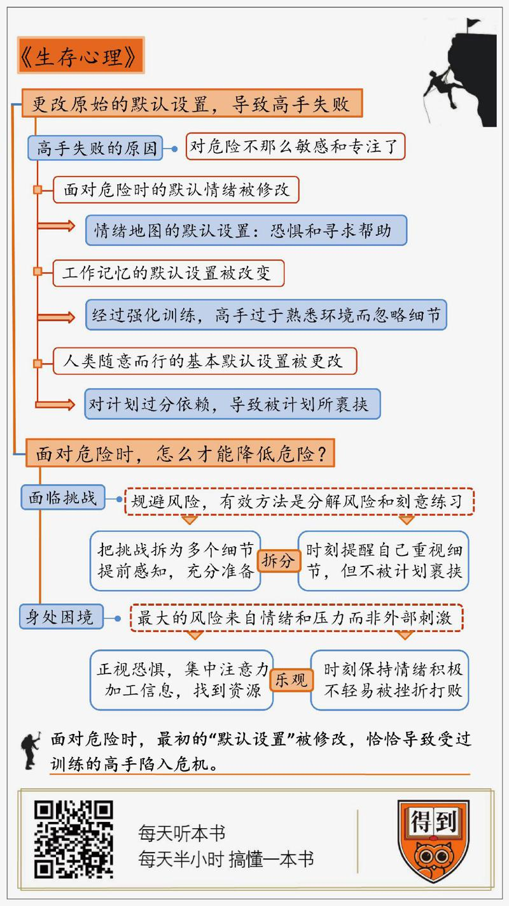

# 2019921. 生存心理
> 《生存心理》| 袁泽解读

## 关于作者

劳伦斯·冈萨雷斯，美国畅销书作家，曾两次美国国家杂志奖，以及由美国职业记者协会颁发的杰出服务奖。2016 年，他成为有复杂系统研究领域「圣地」之称的圣菲研究所第七位米勒学者，该访席通常授予那些为促进人们认识社会、科学和文化而做出巨大贡献的思想者。在圣菲研究所期间，米勒学者可以自由探索任何话题。

## 关于本书

本书是作者 30 多年来参与各种冒险活动和接触各种事故报告的研究结晶。作者将精彩纷呈的案例表述为一个又一个生存故事，穿插以神经学和心理学的知识。揭秘在极度危险的情况下，高手失败背后的心理机制。

## 核心内容

第一，在极度危险的环境下，为什么受过严格训练的高手也会失败？

第二，高手失败的背后，究竟是哪些心理机制在起作用？

第三，面对危险环境，我们普通人该怎么做，才能最大限度地降低风险？

## 首页

今天我要为你分享的这本书叫做《生存心理：野外探险家和生活挑战者的深度指南》。

乍一听这个题目，你可能会觉得，野外探险这个话题很小众。我不是探险爱好者，为什么要花 20 分钟的时间来听？其实，这本书并不是在教给你如何去野外探险，而是在讨论一个很值得思考的问题：为什么高手也会失败？

听到这个问题，你一定会觉得，大多数情况下，高手失败是小概率事件，不常发生。因为他们受过严格的专业训练，有着丰富的经验。相比于普通人，他们在危险环境下的「默认设置」，也就是人们面对危险时最本能的感受和反应，都已经被强化和调整过了。所以，面临危险的时候，一定是某些偶然的因素，才导致了悲剧的发生。

但是，这本书的作者通过研究大量的事故案例，得出了完全不同的结论：那些受过训练的高手，之所以在危险环境下没有能够活下来，恰恰就是因为他们面对危险时最初的「默认设置」被修改了。具体来说，面对危险的时候，决定人能不能活下来的因素，主要有两个：一个是生存自救的具体方法；另一个是面对危险的意识，也就相当于能够启动那些自救方法的开关。对于高手来说，他们的方法都在，之所以失败，往往是因为意识层面的默认设置被修改，导致启动方法的开关不再那么敏锐。

为了帮你更好地了解高风险环境下的心理状态，我特地采访到了邓琳老师。邓老师是全国女子攀冰冠军，同时对攀登雪山等极限运动，也有着丰富的经验。邓琳老师的观点，我会在后面为你分享。

本书的作者劳伦斯·冈萨雷斯，他是一位资深记者，长期深入跟踪报道探险事故，曾两次获得美国国家杂志奖。同时他也是美国圣菲研究所的一位学者，从事社会科学领域的研究工作。

接下来，我将分成两部分为你解读这本书。

第一部分，我们说意识，在极端危险的环境下，究竟是什么样的心理机制，指导人们做出不同的决定。为什么说高手之所以失败，是因为他们更改了原始的默认设置？

第二部分说的是，我们不是高手，面对危险时，意识可能很敏锐，但并没有专业的方法。这种情况下又该怎么做，才能降低危险发生的几率？

## 第一部分

好，我们先来说说，为什么说在危险的环境下，高手的失败是由于更改了最初的「默认设置」？这背后究竟是怎样的心理机制在起作用？

首先起作用的一项心理机制，作者在书中称它为「情绪地图」。心理学研究表明，对于绝大多数人来说，无论处于什么样的环境，处理什么样的情况，最先起作用来指导人们具体行为的，不是逻辑和理性，而是我们的情绪。

比如你是个滑雪好者，每当你全副武装，穿上滑板，站在山顶俯瞰笔直的雪道、扬起的雪浪，你都会不自觉地感到血脉喷张。总之，一站到滑雪场上，你就觉得兴奋。这个整体的感受，就是你对滑雪环境的情绪地图。而这种情绪与环境的连接，要优先于逻辑思考，会在第一时间指导你的行动。

那我们对于危险环境的情绪地图是怎样的呢？对大多数人来说，遇到危险，最直接的反应一定是特别害怕，希望马上得到帮助，这是我们情绪地图的默认设置。但是，如果让你在危险环境下反复地训练，你面对危险的这种默认设置就一定会被更改。恐惧和寻求帮助，对你来说很可能不再是第一反应。可能你会觉得，面对危险不再感到恐惧，不是挺好的吗？但是，作者告诉我们，这未必是件好事。

书中提到了这么一个案例：1997 年 9 月 6 日这天，一位叫做詹姆斯·加巴的美国陆军军官，参加了一次再平常不过的高山漂流活动。在漂流途中，他的筏子撞上了一块岩石，加巴被抛了出去，落在水中。这时他的向导想要把他拉上来，但加巴只是笑着推开了他，不慌不忙地向下游漂去。然而，意外发生了。加巴万万没有想到，他漂到了一个被巨石挡在水流正中的地方，被吸到了石头下面，动弹不得，就这么淹死了。官方报告里写道：「加巴显然没把这当回事。」

但在作者看来，事情远远没有这么简单。加巴的死亡，并不是我们通常认为的过度自信或是鲁莽。造成悲剧发生的真正原因，正是我们刚刚提到的，被修改了的情绪地图。

对于我们普通人来说，落入湍急的水流中，都巴不得有人来救。但对有过极端环境下极端经历的陆军上尉来说，这根本不算上什么，这种普通意义上的「意外」，他再熟悉不过。而且，加巴所在的部队文化里，靠人救，会让他觉得羞耻、失败。部队里有项规定，如果是迫不得已只能依靠队友救援，将会失去训练资格。所以，不管形势多么危险，加巴形成的情绪已经将救援标记为糟糕，而将自救甚至痛苦标记为好事。

所以，在我们看来，加巴是对自己的能力太过自信，或者是为了捍卫荣誉才选择拒绝被救起。但对于加巴来说，根本没有那多的思考过程，这完全是一种经过强化训练后的机械操作。换句话说，除非能够预知未来，否则就算再让加巴做一百次选择，他也还是会拒绝向导的帮助。面对危险时的默认情绪被修改，是造成高手失败的第一个因素。

高手失败的第二个心理因素和人们的工作记忆机制有关。简单来说，工作记忆是大脑里暂时存放信息的记忆缓存库，里面贴着记录你现在要处理的暂时信息。比如你在记一个陌生的电话号码，就相当于你把号码记在大脑的便条贴上。当你不再需要，就撕掉便条贴，你也就忘记这个号码了。

工作记忆有一个特点，就是能够快速抓取外界的新信息，让人快速进入专注的状态。但高手反而在这里容易出问题。因为危险的环境，对他们来说完全算不上新信息，很可能不会引起额外的注意。也就是说，经过强化训练的高手，在过于熟悉的环境中，出现细节上的疏漏，也是常有的事情。

比如说，在 1989 年 5 月，有位叫做林恩·希尔的攀岩专家，来到法国南部某处登山，这次的路线非常简单，是为很多初学者准备的，希尔只是把它当做一次热身。但是，在将绳子系到安全带上时，她分心了，没有把绳结打完。当时她在和别人聊天，这件事完全吸引了她的注意，系绳子的任务储存在工作记忆里，但却并没有做出相应的行动。

直到希尔开始攀登时，那份记忆还有少量的残存，但是没有完全凸显。她后来回忆道：「在攀登之前，我隐约想到有事情要做。」直到她爬到山顶，都浑然不觉自己设下的陷阱。在下降时，绳子承受了希尔的整个体重，没打好的绳结突然松开。她从高处跌落在一棵大树上，勉强捡回性命。

如果你是一位攀岩新手，在做准备时一定会全神贯注，仔细检查每一处细节。你的全部注意力，都会集中在和攀岩有关的事情上。这个时候，工作记忆也会帮助你排除掉其他与之无关的信息。但是希尔作为一名攀岩专家，这些步骤她已经做了成百上千遍，像是系绳子、检查装备这类活动，对她来说根本算不上什么新的信息。所以，聊天时某些感兴趣的话题会很自然地进入工作记忆中，无意中挤占掉系绳子的任务。

很多时候，我们从表面看到的是粗心大意，疏忽了细节，以为只要认真、仔细，这些意外就可以避免。但是工作记忆的运行机制告诉我们，这事没那么简单。尤其是作为一名熟手，一旦危险的信号不会第一时间进入工作记忆中加工，便会很容易忽略某些关键的信息。

因此，工作记忆是我们认识复杂世界的一项重要手段，但是它的运行机制也表明，我们的大脑只能在短时间加工有限的信息，无意盲视几乎不可避免。被改变默认设置的工作记忆，是影响行为决策的第二个因素。

说到这，不难发现，改变情绪地图和工作记忆的默认设置，都会让高手出现非理性的决策失误。但你可能会想，如果时刻保持理性，比如事先做好周密的计划，按计划一步步来，是不是就能避免灾难的发生呢？

作者告诉我们：也不会。且不说时刻保持理性这件事能不能做到，单就计划这件事本身，就非常危险。从人类社会演化的尺度上看，做计划并不符合我们人类的本性。只有当社会演化到一定程度，我们不得不处理一系列复杂的事情时，才会精确到每小时、每分钟，该做哪些事情。这也就是说，没有计划，随时根据环境做出改变，也是人类的一项最基本的「默认设置」。

在作者研究的事故中，有这么一个典型的案例：有三个年轻人，他们都是攀岩的老手，登山经验丰富。他们的这次任务，是挑战一处难度系数相当高的岩壁。在此之前，三人非常重视这次登山行动，进行了周密的计划：检查好一切装备，制定好了具体的登山路线，还明确规定了什么时间开始攀登，什么时间达到山顶。

就在登山前，他们特意看了天气公告，上面显示天气晴朗。但要注意的是，此时他们清楚地知道，眼前的这个天气预报已经过期了，给出的是前一天的内容。但是，他们却没有任何反应，仍旧理所当然地认为不会有什么变化。要知道，高海拔地区的天气可是说变就变，尤其是夏季，午后地面上升腾起温暖潮湿的空气，很容易在山顶引发极端的恶劣天气。这种情况最有可能发生在下午，而那正是他们预计的到达时间。

在爬了一段时间后，他们头顶开始出现乌云。每向上一英尺，大脑得到的氧气就少一分。爬到一半路程时，天空开始下雨。但他们仍旧认为，严格按照计划，一定可以抢在暴风雨前登顶。不幸的是，正当他们爬到接近山顶的位置时，一阵猛烈的冰雹砸了下来。突然间，他们都感到毛发竖直，随着一声爆响，其中一人被闪电击中，电流穿过身体，从右臂流出。这整个过程不超过 0.01 秒。自然地，这次的登山行动就此终止，他们拖着重伤员，被困在一块细长的岩石上，等待救援。

整个事件中，看似一切都在按照既定的计划进行，但是当意外发生时，这几名攀岩者却没有做出任何改变。其实，如果那天早上，他们等着看到最新的天气公告，就一定能够注意到雷电预警。这可不是由于一时疏忽，忽略了关键的信息。恰恰是因为过于依赖计划，才导致了悲剧的发生。

作者在书中说道：人们对于未来的想象能力是极其强大的，一旦你设想出了未来的情景，那么它便会和过去发生的事一样，储存在你的记忆中。而人们想做的，是去验证它，实现它。我曾经读过一本社会学的书，叫做《常态化事故》，对里面的一句话印象特别深刻：「因为无力应对当前世界的复杂程度，很多人往往会构建一个预期的世界，然后处理与预期世界相符的信息，却会忽略掉那些与之相悖，或者无关的信息。」这三位登山者，不是不知道之前看到的天气预报已经过期，但是「天气晴朗」这个信息，正好是他们想要看到的。

其实，对于我们绝大多数人来说，改变计划或修正思维模式来适应现实情况，是一件非常困难的事情。对于计划的过分依赖，不但是高手会失败的一个原因，对于我们每个人来说，也应该时刻警惕，自己是否正在被计划所裹挟。

## 第二部分

以上就是为什么高手也会失败的原因了。在意识层面，高手的默认设置被修改，导致启动具体方法的开关，变得不那么敏锐。我们不是高手，我们的默认设置都在。但很重要的一点是，我们没有高手的方法。在这种情况下，面对危险我们又该怎么做呢？

为了更好地回答这个问题，我特地请教了邓琳老师。邓琳老师是一位资深的户外极限运动员，是全国女子攀冰比赛的冠军，同时也对雪山攀爬等运动有着丰富的经验。

在回答之前，我想先强调一点：假如世界上真的有一种方法，能帮我们规避掉所有风险，那这个世界从此便不再会有任何危险发生了，这是不可能的事情。所有的这些建议和方法，并不能完全帮我们规避掉风险，只是在尽可能减少不幸发生的几率。

我们很难在短时间内，让自己做到百分之百的理性和镇定，捕捉到准确、有效的信息。尽管如此，风险依然是可以管控的。而最有效方法，就是分解风险加上刻意练习。

你可能会觉得，我们都没有预知未来的能力，谁也不清楚未来将会面临什么样的情况。但是，如果你把将要面对的挑战，拆分成一个个小的细节，那么未来挑战中的每一个小的风险，你一定能想办法提前体验到。

邓琳老师也提到，在从事户外运动时，要想让自己对环境有掌控感，前提一定是在力所能及的范围内接受最为完备的培训和练习。这样的目的就是在于，让你对未来有可能发生的种种风险，都能够提前感知，做充分的准备。请注意，这和我们之前提到过的被计划裹挟刚好相反。做计划，是把一个个子任务，按照特定的时间线排列组合成一个整体。然而提前分解风险，恰恰是把这个排列组合打散的过程。你可以针对每一个子任务，提前准备好解决方案。

邓琳老师说，前段时间上映的一部关于极限运动的纪录片——《徒手攀岩》，是一个特别好的例子。片中的主人公 Alex 是一位职业攀岩运动员。他的目标，是在没有任何工具和保护措施的情况下，在几乎笔直的悬崖上，徒手攀上一座高 914 米的悬崖。在前进的过程中，哪怕只要有一次失误，一定是粉身碎骨。

当然，Alex 成功地完成了这次攀登。在接受采访时，他也谈到了，就连徒手攀岩这么难，这么危险的事情，其中的风险也是可以控制的。怎么控制呢？就是我们刚刚提到的，分解步骤，然后不断练习。

Alex 为了这次攀岩，足足准备了八年时间。这八年里，他在不同的条件下练习。光是所攀登的那个岩壁，就带着绳子爬过将近 60 次，一遍一遍地考察路线。在这个过程中，他从攀登的路线，到具体哪个地方可以借力，哪个地方该做什么动作，都能做到万分熟悉，了然于胸。所以，真的到了最终攀岩的那天，根本不像是一场冒险，更像是一场大型表演现场。因为每一个动作都是事先排练过无数遍的，只要准确执行，自然而然地就不会出错。

我们都觉得，徒手攀岩这件事风险太大，难度系数太高，如果出错，后果还会相当严重。但是，如果可以把整体的风险给切分开来，分解成一个个小问题，像是该走哪条路线，哪里该做什么动作。这样一来，每个小问题，你都有办法提前去感受，去练习。到了真正面对挑战的时候，意外发生的概率也就这样被降到了最低。

当然，上面说的这种情况，前提是我们清楚地知道，将要面临着什么样的挑战，然后才可以提前分解风险，不断练习。但还有一种情况就是：困境和危机已经发生了，我们身在其中，没有时间做好充分的准备。这个时候，该怎么做呢？

很多时候，面对困境和危机，我们几乎改变不了客观环境。在很大程度上，最大的风险，也不是来自外部的刺激和挑战，而是内心的情绪和压力。最大的敌人不是眼前的困境，而是自己的内心。

这话听起来有些鸡汤，但是大量的事故案例都表明，在极端生存环境下，生死攸关的时刻，我们面对的压力相当大。如果陷入了深深的恐惧中，很有可能彻底丧失思考和行动能力。怎么保持冷静，控制好自己的情绪呢？

首先，在危险的初发阶段，我们的感知和认知功能仍然在发挥作用，作为情绪中枢的杏仁核，会首先活跃起来，会让人有强烈的恐惧感。但这时你要做的，不是逃避这种恐惧，或是去否认它；通过观察和采访那些在极端环境下得以生还的人，作者发现，他们往往能在危险发生的第一时间正视自己的情绪，勇敢地告诉自己：我现在的情况不太好，我可能遇到大麻烦了。这会帮助你集中注意力，在相对短的时间内，迅速加工周围的信息，找到一切可以利用的资源。

做到了这些之后，如果暂时的确没有好的办法迅速脱离困境。那你最应该做的，就是让自己的情绪变得积极起来。一个最基本的原则，就是要往好处想，相信自己的可以渡过难关。很多事故的幸存者，都有过在极端环境下做思维游戏的经历。比如说，一位在玻利维亚的丛林中失踪了几个月的探险者，在孤身一人的时候，曾经幻想出一位的伴侣，每天陪他吃饭、睡觉、聊天，他要做的，就是要让自己和这位精神伴侣一起好好活下去。

作者在书中总结道：那些成功生存下来的人，大多都是乐观的人，不会被轻易挫败。他们相信形势是在不断变化的。他们通常会将漫长艰辛的过程，分解成为一个个小的容易实现的目标。他们也会接受眼前的现实，从逆境中发现机会。

## 总结

总结一下：在危险环境下，高手之所以会失败，往往是因为修改了面对危险环境时的默认设置，从而对危险变得不那么敏感和专注。对于我们普通人来说，在应对挑战之前，可以尽可能地将风险细化和切分，提前体验这些风险，做好应对方案。但也要时刻提醒自己，重视细节，不要被计划所裹挟。如果已经处在危机和困境中，正确的做法，就是要正视自己内心的恐惧，尽可能做到专注，相信自己一定可以渡过难关。