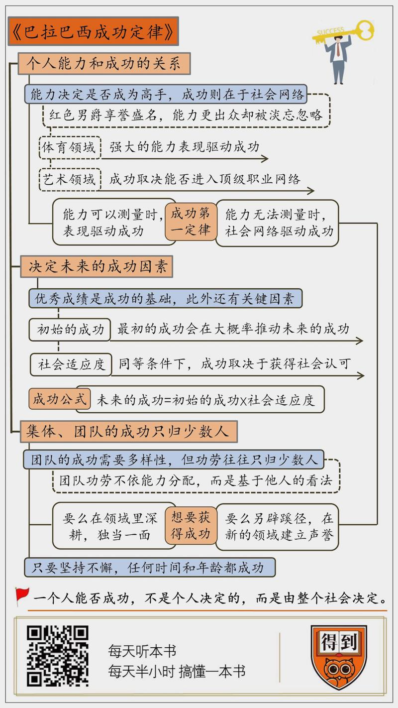

# 2019932. 巴拉巴西成功定律

《巴拉巴西成功定律》| 袁泽解读

## 关于作者

本书作者艾伯特 - 拉斯洛·巴拉巴西是当今科学界的一位巨星，无尺度网络模型的创立者，其主要研究领域是复杂网络科学，并在物理学、生物学、计算机、社会学等领域都颇有建树，是诺贝尔物理学奖呼声最高的人选。

## 关于本书

巴拉巴西的团队，非常细致地搜集了包括艺术、学术、体育、商业等各个领域中有关成功的数据，然后在一个更大的尺度上去分析它们。通过对这些数据的分析，作者发现，有些成功的模式的确具有普适性，成功确实有定律可循。

## 核心内容

第一，个人能力和成功之间是否存在必然的联系？同样都是高手，为什么有的人可以享誉盛名，有的人却默默无闻。

第二，一个人的成功到底能不能预测？是什么决定了未来的成功？

第三，我们该怎样看待一个团队、一个集体的成功？为什么多数情况下，团队的成功需要多样性，但功劳却往往归于一人？

## 前言

本期我要为你分享的这本书叫做《巴拉巴西成功定律》。特别提醒，这本书不是成功学，而是一项研究「成功」的科学。

「成功」一直是个常被提起却又模糊的话题。一说起成功，我们能联想到的原因太多了，比如说努力、运气、天赋等等。但是这本书所研究的，不是成功的个案，而是通过大量的数据收集和分析，来考察究竟是由哪些因素，推动了世俗意义上的「成功」。

什么叫「世俗意义上的成功」呢？作者在书中将它定义为「我们从所属社群中争取来的回报」。比如说，你是一位作家，你觉得自己书写的不错，有思想也有深度，但是它的销量却很差，那这不叫世俗意义上的成功。你的书能够成为热卖畅销书，拥有大量粉丝，优秀作家的身份被社会认可，通过它还能获得不菲的收入，这叫做世俗意义上的成功。也就是说，这本书所研究的「成功」，不是由个人来定义的，而是由整个社会来定义的。

说到这，就自然而然地引出一个问题：这种世俗意义上的成功，后背的因素相当复杂，真的可以用一种科学的手段来测量吗？答案是真的可以。

先来看这本书的作者，就是书名中提到的巴拉巴西，他本身就是一位研究社会网络的顶级专家。他的全名叫做艾伯特 - 拉斯洛·巴拉巴西，是美国圣母大学特聘教授，美国东北大学复杂网络研究中心的教授。他的另外两部作品《爆发》《链接》。

巴拉巴西的团队，非常细致地搜集了包括艺术、学术、体育、商业等各个领域中有关成功的数据，然后在一个更大的尺度上去分析它们。比如，他们统计了有史以来已经发表过的所有论文，追踪调查一个多世纪以来所有学者的学术生涯；统计了美国所有图书每星期的销量，分析每一本书是靠什么成为畅销书，取得商业上的成功；他们还获得了全球画廊和博物馆的展出信息，来考察当代艺术家的成长历程等等。通过对这些数据的分析，作者发现，有些成功的模式的确具有普适性，成功确实有定律可循。

那接下来，我将分成三个部分为你分享这本书。第一部分，我们说说，个人能力和成功之间是否存在必然的联系？同样都是高手，为什么有的人可以享誉盛名，有的人却默默无闻。第二部分，我们会重点讨论一个问题：一个人的成功到底能不能预测？是什么决定了未来的成功？第三部分说的是，我们该怎样看待一个团队、一个集体的成功？为什么多数情况下，团队的成功需要多样性，但功劳却往往归于一人。

## 第一部分

好，我们先来看第一部分，个人能力和成功的关系，究竟是怎样的？

首先，从我们自身的角度出发，我们平时努力学习、努力工作，在很大程度上都是在提高自己的能力。相信大多数人都认为，能力越强，就越成功。但是，真的是这样吗？能力表现对一个的成功，是否有着决定性的意义呢？回答这个问题之前，我们来看一个书中的例子：

第一次世界大战期间，德国军队中有叫做冯·里希特霍芬的飞行员，他的战斗力极强，在 3 年的飞行生涯中，一共击落了 80 架敌机。按照官方统计，这比第一次世界大战中的任何其他王牌飞行员击落的飞机都要多。

但更加令人印象深刻的，还不是他耀眼的战绩。对于普通飞行员来说，都会在执行任务时尽量隐蔽，最好做到敌在明处，我在暗处，以便最大限度地提高自己的生存几率。但是，这位冯·里希特霍芬却恰恰反其道而行之。他把自己的飞机涂成耀眼的大红色，每当飞机略过天空，都会是一道亮丽的风景线。不但自己人能够一眼认出，敌人也看得是一清二楚。由此，他获得了一个响亮的绰号：「红色男爵」。

红色男爵称霸战场的故事，流传了一个多世纪，而且范围远远不止于德国。以他为主题的书籍有 30 多本，他的人物形象曾出现在好莱坞电影、连环画和纪录片中。他的名字，从战争爱好者的书架上，一直延伸到杂货店的冷冻货柜上。如果你在国外，甚至可以一边玩着「红色男爵」飞行模拟器，一边吃着「红色男爵」牌冷冻披萨。就是这么有名。

乍一听，你可能觉得，红色男爵的例子，不是正好证实了那个普遍的假设：强大的表现会带来成功。如果你像红色男爵一样，完美地执行了飞行任务，完成了引人注目的空中特技，准确地击中目标，那么，你的能力表现在你从事的领域内就是最佳的。你就会因此被人们记住，被远隔重洋的世人尊敬几个世纪。

从小学开始，我们就被教导，让我们崭露头角的最佳策略，就是努力获得完美的能力表现。我们所崇拜的榜样，那些有名的运动员、作家、科学家和企业家们，他们的成功都好像遵循着同样的规律。但你知道吗？还有很多能力表现一样出色的人，你却连听都没有听过。比如说雷内·方克。

方克是谁？他是一战时期的一名法国飞行员。相比于红色男爵，方克的战斗力更强。红色男爵曾经输掉过三场战斗，最后一场还要了他的命。而方克和他的飞机从来没有被敌人的炮火伤及分毫。红色男爵的战术是在高空对着敌机疯狂扫射，靠着疯狂的进攻压制敌人。而方克击落一架敌机，很少超过 5 发炮弹，由他操纵的飞机，像一只蝴蝶在快速躲避捕食者时灵巧地上下翻飞。

可以说，无论是战绩还是驾驶技术，方克的能力都在红色男爵之上，至少是旗鼓相当。但是，我们对方克的了解，仅限于一本很难找到的自传，以及散落在各处的寥寥几笔描述。他被时代遗忘了。

为什么会这样呢？如果说能力表现决定一个人是否成功，那为什么同样是王牌飞行员，一个可以被后世铭记，而另一个却淹没在历史中？

通过大量的数据整理和分析，巴拉巴西教授得出了一个结论：你的成功不是由「你」决定的，而是由「我们」决定的。也就是说，你的成功不取决于你的能力表现，而是取决于社会，以及社会如何看待你的能力表现。对于成功的这个定义，是这本书中关于成功的基本前提和起点。

红色男爵的成功更多在于他所处的网络，在于战争期间发生的政治和社会事件，而不是他击落了多少飞机。很多人能够记住他，是因为它曾经对德国宣传战争机器起到了至关重要的作用。他的名声取决于那些拼命想要一个英雄来激发集体精神的人。是公众对这位红色男爵的表现作出了反应，创造了一个关于他的神话。他所处的网络发现他很有用，所以选择去放大他。

到目前为止，我们得出的结论是这样的：能力表现很重要，它决定了你是否能成为一个领域的高手。但它又不是确定你能否取得成功的最重要因素。决定你是否能取得成功的，更多是社会网络的作用。

当然了，单凭一个红色男爵的例子，想要支撑这个观点还远远不够。我们还是来看看，作者都做了哪些研究，才会得出这样的结论。

我们先来看体育领域。在体育界，取得成功的关键因素是什么？巴拉巴西的团队花了两年的时间，来研究网球领域球员竞技水平，和我们所定义的成功之间的关系。研究团队汇集了 2008 年到 2015 年间每位网球选手的成绩，记录每位球员所有的胜负场次，包括每一次比赛获得的积分。最终他们发现，球员的成绩越好，有关该球员的维基百科点击量就越多，越受公众欢迎。而且战绩的好坏几乎是决定受欢迎程度的唯一因素。也就是说，在网球领域，你的成绩越好，就越接近世俗意义上的成功。

这个研究结果告诉我们：网球运动的成功，取决于唯一的因素 —— 强大的个人能力。至少是在球场上，「苦练才有回报」这条准则千真万确。如果你是一名运动员，想要取得成功，就需要让你的运动技能日臻完美。同样，如果没有坚实的法律知识，你不会成为一名成功的律师；如果缺乏结构工程学的深厚基础，你也无法成为一位成功的工程师。强大的能力表现的确在驱动成功。

但是，如果我们把目光切换到另一个领域，比如你是一位艺术家，成功可就不只能力强这么简单了。有一个很重要的问题，就是艺术家的成绩，无法像体育比赛的胜负那样统计和测量。我们可以靠统计大量比赛的胜负去衡量一位运动员的能力，因为你的能力越强，赢得比赛的几率就越大，这没什么好说的。但是靠什么去衡量艺术家的成绩呢？判断一件作品的好坏，是很主观的事情，可能每个人的看法都不一样。这种情况下，艺术家又是凭借什么成功的呢？

巴拉巴西团队收集到了 1980 年到 2016 年全世界 50 万名艺术家的创作经历。数据包含 14000 多家美术馆、近 8000 家博物馆在 35 年内举办的上万次展览的详细资料，以及同一时期在拍卖行售出的近 300 万件艺术品的信息。他们发现，艺术家的成功，主要取决于下面几条因素，而这些因素，都与社会网络有关：

第一，如果你想成为一名成功的艺术家，你的作品需要在艺术界最有影响力的美术馆和博物馆展出。比如像是纽约现代艺术博物馆、古根海姆美术馆、纽约高古轩画廊、大都会艺术博物馆等等。一旦的你作品在上述任何一家展出，那你就如同跨上了成功的旋转木马，你的作品注定会畅销，价格会直线上升。

第二，这些一流的美术馆和展览馆，它们在内部频繁连接，构成了一个封闭的网络。如果你与其中的一家合作，那么另一家也同样会为你打开大门。但是，如果你的作品一开始是在这个网络之外的小型展览馆展出，那很不幸，很大几率上，你的整个职业生涯都只能辗转于这些小馆，再难进入世界一流的艺术网络。

第三，一旦你成功了，所有与你的成功有关的利益方都会竭力让你的成功延续下去。如果有人花了 100 万买下你的作品，无论是这位收藏家还是美术馆，都会极力让这幅画升值，因为这符合你们所有人的利益。

你看，在艺术领域，能否成功，很大程度上取决于你能否进入顶级的职业网络。由此，作者告诉我们，在某些领域中，那些我们习以为常的观念，像是成功要靠一步一步艰难的积累，似乎是不管用了。如果成绩在所有的专业领域里都能像网球一样的成绩被测量，那这种观念依然奏效。但是，如果我们无法证明自己的领域中是最优秀的，那对你来说最有利的办法，可能就是让自己进入那个已经形成的职业网络。

以上是我要讲的第一部分，巴拉巴西团队得出的成功第一定律：如果能力表现可以测量，能力表现驱动成功。但当能力无法测量时，社会网络驱动成功。

## 第二部分

其实，职业网球联赛和艺术是两个极端的例子。一个是能力可以被精确测量，另一个则是视觉艺术，能力无法测量。但是，多数职业都处在这两个极端之间。如果你是一名律师、一名推销员、一名教师或者是一名投资银行家，成绩和网络都很重要，只是在各自的领域，它们的重要程度会有所不同。

归根结底，在自己的领域取得优秀的成绩，是成功的基础。如果没有好的成绩，成功无从谈起。一旦你拥有了好的成绩，想要在众多高手中脱颖而出，社会网络就显得至关重要。一个人的能力和所能取得的成绩是有限的，但是网络带给你的成功却可以是无限的。看看那些超级明星就知道了，获得最多回报的，不一定是这个领域内实力最强的人，但很大程度上，却是最有名望的人。一个明星作家出的书，很大几率上会成为畅销书，但一名新人作家，多数情况下则会被无情碾压。

说到这，你可能会问，如果我不是超级明星，只是行业里初出茅庐的新手，是否有机会一举成功？又或者说，究竟是哪些因素，在对未来的成功起作用？接下来的第二部分，我们就来回答这个问题。

经过研究，巴拉巴西团队发现，能够影响未来成功的因素有两个，分别是：初始的成功和社会适应度。

我们一个个来说，先来看初始的成功。在一个项目诞生的最初阶段，能否优先得到广泛的认可至关重要。大量的数据表明，那些一问世就获得好评的作品，相比于开始时默默无闻的作品，随着时间的推移，获得成功的比例要大很多。所以，第一印象很重要。如果你是在一个领域内初出茅庐的新人，如果能够在相对较短的时间内获得行业内的好评，将会大大地提高成功概率。

作者在书中提到了这么一个例子：英国畅销书作家罗杰·埃洛里刚刚出版了一本新的小说，名字叫《默默地我相信天使》。刚刚出版没多久，就有一位叫做「琼斯」的用户，在亚马逊网站上写了书评，书评是这么写的：「我真的不需要对这本书的情节再多说些什么。书里边有些段落和章节会让我情不自禁地停下来，跟随着作者时而胆战心惊，时而陷入沉思。你得读上两三次，才能真正欣赏到语言的深邃。真是一本了不起的书。」

这对一本新书来说，是相当高的评价，而且是第一篇评论。这种初始的肯定，对小说未来的成功有很大帮助。在人们还没有读到小说的时候，这位叫做「琼斯」的用户，已经在告诉其他读者：这是一本好书，你也应该来读。而现在，这本新书在全世界已经连续售出了 100 万册以上，成为了埃洛里最成功的一本书。

听到这，如果故事是，埃洛里靠着最早的一篇书评，在第一时间取得了优势，为后边的成功奠定了基础，那就太简单了，也不足以具备很好地说服力，来证明初始成功的重要性。但是，如果我告诉你，这位叫做「琼斯」的用户，和作家埃洛里是同一个人呢？没错，「琼斯」是埃洛里的一个笔名，一个他用来赞美自己作品、贬损竞争者的名字。其实，这种伎俩，不仅仅是埃洛里一个人在用，它普遍存在于各个行业，还有专门的一个词，来描绘这种道德上不正当的行为 —— 马甲。

马甲真的有效吗？当我们做任何决定时，从在网上买一件衣服，到入住宾馆酒店，我们都会下意识地看看评论。我们理所当然地认为这套系统是准确、公正和可靠的，但「马甲」这种行为对此提出了质疑。靠操纵最初的评价系统，真的能够大幅度提高一本书的成功率吗？

专门有科学家，为此做了实验，来考察这种现象。这位科学家操控了一个大众新闻综合网站中评论的「上行票」和「下行票」。如果你给一条评论投了「上行票」，就说明你认为这条评论很有用，或者富有远见；如果你给一条评论投了「下行票」，那就说明你觉得这条评论很多余，没有价值。研究结果发现，如果在最开始的时候，连续给一条评论投出「上行票」，毫无疑问，这条评论的随后会获得越来越多的认可。实验的确表明，初始的成功很重要，成功能能够自我繁殖。初始的成功，是影响未来是否成功的第一个因素。

但是，作者也在提醒我们，千万不要夸大了最开始成功的价值。它很重要，但绝不是决定你能够一直成功下去的唯一因素。

我们还是就这上面提到的实验往下说。刚刚说到，如果最开始连续给一条评论投出「上行票」，那么这条评论在很大几率上，会收到越来越多的认可。但是，如果在最开始，给出一条很有价值的评论连续投出「下行票」呢？这条初始的负面评价，会让该评论迅速沦为垃圾吗？或者说，如果在开始的时候，刻意对其他竞争者给出负面评论，会达到扼杀竞争者的目的吗？

答案是不会的。实验人员用同样的方法，给出有价值的评论「下行票」时，并没有看到持续的负面评价。恰恰相反，在一段时间之后，网站的其他用户仍旧会为这条评论投出「上行票」。理智占了上风，负面反馈被消除。实验结果告诉我们，起初的优势在很大程度上是成功的重要推力，但它拒绝为那些专门搞歪门邪道的人服务。一个初始的好印象对成功至关重要，但就算没有初始的成功，也不代表你会就此沉沦。

决定未来是否成功的，还有一个更加重要的因素，那就是「社会适应度」。所谓「社会适应度」，指的就是一件作品、一家公司的内在品质，也就是说，在同等条件下，它在多大程度上能够击败竞争对手，获得社会的认可。

比如说，谷歌公司在 1997 年刚刚问世的时候，并没有很高认可度，但是绝大多数人使用的还是 Altavista 和雅虎公司的搜索引擎。但是短短 3 年之后，谷歌就远远地超过了其他产品。你会发现，在互联网搜索引擎这个领域，谷歌并没有最初的优势，但又是什么决定了它现在的成功呢？

事实上，答案非常简单，它们之所以获得成功，是因为产品独一无二的内在品质，这帮助它们克服了产品因默默无闻而带来的障碍。不但是谷歌，作者也在书中说道，一个能引导用户找到更多相关网址的搜索引擎、一架更有效率更为可靠的飞机、一种疗效更好地药物、一款口味更好的啤酒，它们不仅能够和庞大的对手竞争，而且还能在竞争中胜出，因为它们更具活力，能更好地适应当前的挑战。这就是「社会适应度」所带来的优势。

针对究竟是哪些因素决定着未来的成功，巴拉巴西团队给出了这么一个公式：未来的成功 = 初始的成功 X 社会适应度。初始的认可度，是成功重要的推力。但决定你能否一直成功下去的因素，更多则是社会适应度。

## 第三部分

上面的两个部分，我们重点说了影响个人成功的因素。但是，我们平时的工作，有很大一部分都不是在单独行动，我们需要和其他人的合作。一个伟大的产品，一家成功的公司，背后往往是一个团队的付出。我又该如何看待一个团队的成功呢？接下来的这部分，我们就说说这个问题。

首先，巴拉巴西团队通过研究发现，一个成功的团队，大致有下面几个特点：有一个强有力的总负责人，对团队成员负责；同时团队成员要各有所长，体现差异性；还能够面对面地平等交流。相信这些特质你在以前或多或少也听过，这里就不再过多讲述了。

这部分我们重点来讨论一个问题：为什么多数情况下，团队的成功需要多样性，但功劳往往却归为少数几人，甚至是一个人？

1984 年诺贝尔物理学奖的获得者有两位科学家，分别是卢比亚和范德梅尔。但是，这篇论文的作者一共有 137 位科学家，而卢比亚和范德梅尔分别排在第 105 位和第 126 位。为什么是这两位排名靠后的科学家，最终拿到了诺奖呢？

为了回答这个问题，巴拉巴西团队开发出了一个算法，可以轻易地从一长串做出贡献的科学家名单中，准确定位每一位诺贝尔奖获得者。这个算法背后的机制其实很简单，它关注的是论文引用的方式，以及论文合作者的署名。大量数据表明，最后的荣誉和谁做的什么工作，几乎没有关系。一个科研团队中的「功劳获得者」，通常总是这个领域中持续工作的科学家。也就是说，团队的功劳在大多情况下，并不根据能力表现来分配，而是基于他人的看法。那些功劳获得者之所以能够赢得多数人的青睐，是因为他长期占据了这个领域。

听到这，你可能会问，如果我是这个领域初出茅庐的新手，面对这种情况，是不是几乎就没有出头之日，我的努力都是在给别人作嫁衣呢？作者的回答是：是，也不是。

当你刚刚迈入这个领域，与一位名头响亮的人在一起工作，是有助于你的经验积累和获得行业内初步认可的。刚进入一个领域，给行业内牛人作嫁衣，是有必要的，这是在初级阶段最好的方法。

但是，在某个时候，你也需要独立出去。作者在书中说道，如果一直在别人的阴影下，从事零敲碎打的项目，或在多个不同研究项目上四处奔波，我们将会逐渐被边缘化。所以，更好的方法是：要么在一个领域里深耕，能够在这个领域里独当一面。要么在无人涉足的领域圈一块地，在该领域为自己建立声誉。

这部分，我们说了巴拉巴西对「团队成功」的看法：团队的成功，需要多样性和均衡性，但功劳往往归于一人。

## 总结

最后简单说说成功与年龄。相信很多人都听过爱因斯坦那条著名的论断：「如果一个人在 30 岁之前没有做出重要的科学贡献，那么他可能永远也不会有什么贡献了。」这话听起来有些悲观，但是也很现实。大量的数据报告告诉我们，很多科学家的突破性工作确实是在职业生涯的早期。这也许证实了人们的一个普遍观念：创造力是年轻人的特权。

但是，巴拉巴西团队告诉我们，事实好像并非如此。通过对科学家职业生涯的考察，他们发现，一个人的创造力，并不会随着年龄的增长而下滑。因为研究表明，对于每位科学家来说，在人生的每个阶段，取得重大成就的概率是相等的。随着年龄增长，成功概率降低的原因不是创造力，而是产量。年轻人一直在不断努力，不会因为失败或者不受重视而气馁，所以成功的概率也自然会高一些。

好了，《巴拉巴西成功定律》这本书的精华内容，就为你分享到这里。总结一下：

作者强调，一个人能否取得世俗意义上的成功，不是由个人来决定的，而是由整个社会决定的。个人能力和成绩很重要，但千万不要忽视社会网络的作用。此外，初始阶段的认可度，会在大概率上推动未来的成功，但更重要的是，提高社会适应度，也就是内在的竞争力。团队的成功需要多样性和平衡性，但功劳往往归于一人。你可以在行业里深耕，直到占据这个领域。当然也可以另辟蹊径，在新的领域建立声誉。最后，作者告诉我们，成功可以发生在任何时间和年龄，只要你坚持不懈。

