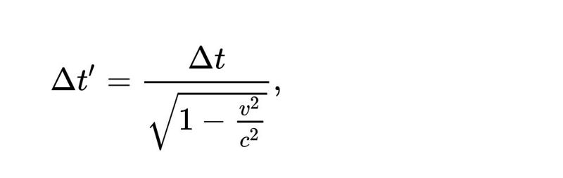

# 0104. 相对论4：刺激1905

万维钢·精英日课³

2018-11-21

只要你活得足够长，见识足够广，你就会发现所谓「平凡的日子」，其实是一个假象。我们生活的这个世界非常喜欢搞事情，其中有一些不可思议的大事件。

纳西姆·塔勒布在《随机生存的智慧》这本书里有句话说，100 个人里面，50% 的财富，90% 的想象力，和 100% 的智力勇气，都是集中在某一个人身上 —— 尽管不一定是同一个人。

这个世界就是这么喜欢不均匀的分布。

1905 年这一年，全世界的智力勇气，大约都集中在爱因斯坦身上。

## 4.1 奇迹

现在我们一般把 1905 年称为「爱因斯坦奇迹年」。我记得 2005 年的时候，物理学家们还专门组织活动纪念爱因斯坦奇迹年的一百周年 —— 别的名人都是纪念诞辰或者逝世多少周年，而爱因斯坦应该按照奇迹年纪念。

伯尔尼瑞士专利局的助理鉴定员阿尔伯特·爱因斯坦，利用业余时间开展科学研究，于 1905 年发表了六篇物理学论文。其中四篇，用物理学家杨振宁的话说，引发了人类关于物理世界的基本概念 —— 时间、空间、能量、光和物质 —— 的三大革命。

1905 年 6 月 9 日，爱因斯坦发表《关于光的产生和转变的一个启发性观点》。当时物理学家认为光是一种连续的波动，而爱因斯坦在这篇论文里针对「光电效应」这个现象，提出一个解释，说光的能量不是连续变化的，而是一份儿一份儿的 —— 是「量子」化的。这篇论文开启了量子力学。

7 月 18 日，爱因斯坦发表《热的分子运动论所要求的静止液体中悬浮粒子的运动》，解释了布朗运动。人们一直都在猜测世间的物质都是由分子和原子组成的，但是因为分子原子的尺度太小，显微镜根本看不到，一直没有直接的证据。而在将近 80 年前，英国植物学家罗伯特·布朗用显微镜观察到水面上的花粉颗粒一直在做永不停息的不规则的运动。爱因斯坦这篇论文说，花粉之所以会动，那是水分子的热运动在不停地推它的结果 —— 而且他能据此准确计算水分子的性质。这篇论文是人类第一次实锤证明了分子和原子的存在。

9 月 26 日，爱因斯坦发表《论运动物体的电动力学》，这篇论文就是狭义相对论。

11 月 21 日，爱因斯坦发表《物体的惯性同它所含的能量有关吗？》，这篇论文用狭义相对论推导出现在尽人皆知的公式 —— E = mc^2，并据此说明质量和能量其实是一回事儿。

这些论文实在太革命，它们刚出来的时候都让物理学家有点儿懵。但是短短几年之后，就获得了实验上的证实，并且被普遍接受。到 1921 年，讲光电效应的那篇论文还得了一个小奖，叫「诺贝尔奖」。

我有时候就想，如果把一个现代物理学家穿越到 1905 年去，他敢不敢用这个速度发表那些论文，敢不敢一个人独占这么多革命的荣誉 —— 我觉得小说都不敢这么写。

没错，爱因斯坦是专门来改变世界的。

## 4.2 爱因斯坦的断言

不要被爱因斯坦的光环所吓倒！我们一开始就说了，狭义相对论是个简单的理论。

到现在这一步，一切的危机就是一个问题：麦克斯韦电动力学解出来的光速，到底是相对于谁的。实验证明光速与光源的速度无关，而以太不存在，地球上哪个方向的光速都一样。那这件事儿你到底怎么面对。

现在爱因斯坦出手了。

我不知道你小时候学物理的时候想过没有，既然物理定律都能用数学表示，数学如此重要，那所谓物理学，是不是无非就是数学应用题呢？对做题的学生来说，物理题的确很像数学应用题。但是物理学家可不是拿着定律做题的人，他们是提出定律的人。

物理学家做的事情，是你敢不敢对这个世界是怎么回事儿，提出一个假设。然后你再去验证这个假设。

做这件事，除了数学，你还得有智力勇气，你还需要「物理直觉」。爱因斯坦的天赋就在这里。

爱因斯坦提出相对论的论文题目叫做《论运动物体的电动力学》，直接说的就是光速危机。爱因斯坦的解决方案是一个拨云见日的断言 ——

一切匀速直线运动或者静止的坐标系下，物理定律都是一样的，句号。

这句话叫做「相对性原理」。它是伽利略相对论的推广。伽利略说「力学」在一切匀速直线运动和静止的坐标系中是一样的，而爱因斯坦现在说不用非得是力学，一切物理定律 —— 包括电动力学 —— 都是一样的。

这其实就是我们一开头说的那个物理学家的简单信念。而有意思的是，光速不变，可以说就包括在相对性原理之中。不管你是哪个匀速直线运动的坐标系，电动力学都一样，所以解出来的光速自然也都一样，光速：

```
c = 299,792,458 米/秒. 
```

光速是相对于谁的？答案是不管相对于谁，它都是同一个数。物理学家用英文小写字母 c 来代表光速，它不是一个变量，它是一个常量。

这也就意味着，不管你是站在地面静止不动，还是在飞奔的高铁上，还是在以接近光速飞行的宇宙飞船上，当你看到一束光的时候，这束光的速度永远都是 c。

那怎么会是这样呢？难道不同坐标系下的速度不应该叠加吗？难道我迎着光走的时候光速相对于我不应该更快一点吗？

爱因斯坦说，不是。不是光有问题，是你的时空观有问题。

## 4.3 时间的膨胀

只要你坚信相对性原理和光速不变，狭义相对论的各个结论就都可以用数学推导出来。

咱们现在来做一个思想实验，看看真实时空的一个小秘密。

下面这张图中是个长条形的盒子。盒子的一端「A」有一个发射装置，它可以在垂直方向发射一个光脉冲，另外一端「B」是一面镜子。我们要研究的就是光从盒子的一端出来，到达镜子，然后再反射回来，这么一个过程。


为此，我们首先要定义两个「事件」。在相对论里时间和空间都是相对的，但是事件是绝对的，发生了就是发生了，没发生就是没发生。

我们把光离开盒子的发射端这件事儿称为「事件1」，把光经过镜子反射之后又回到这个地方，称为「事件2」。我们假设盒子两个端点之间的距离是 L。

好。现在请问，「事件1」跟「事件2」这两件事之间，间隔了多长时间呢？

如果你跟盒子是在同一个坐标系内 —— 也就是说，盒子相对于你是静止的 —— 那么答案非常简单，小学生都会算：光走的路线是两倍的 L，而光速是 c，所以时间是 Δt = 2 L/c. 

但是，如果你跟盒子不在同一个坐标系内，答案就不是这样了。我们假设你站在地面不动，而盒子相对于你，以速度 v 在水平的方向上有一个运动，如下图 —— 


盒子在动你不动，那么在你看来，从光离开发射装置「事件1」到光打到镜子上，这个路线就不是垂直的了，因为「事件1」之后盒子要走过一小段距离。现在光要走的路线是一个以 L 为直角边的一个直角三角形的斜边，我们用 D 表示。

所以在你看来，「事件1」和「事件2」的间隔时间应该是 Δt' = 2 D/c。

斜边总是比直角边长，D > L，所以 Δt' > Δt。这也就是说，同样的两个事件之间的间隔，你跟着盒子在一起的时候感觉到的时间，会比你跟盒子之间有个相对速度的时候，要短一些！

那到底短多少呢？这是一道平面几何题，考虑刚才那个直角三角形的另一条直角边长度是 v Δt'/2，你容易推导出来：



我们可以想象一个人跟着盒子走，另一个人在地面看着盒子走，那么这个公式说，在看着盒子走的人看来，自己的时间过得比较快，而跟着盒子走的那个人的时间比较慢。

用老百姓的话说，这就是「运动物体的时间会变慢！」

我们推出这个怪异的结论，唯一用到的假设就是光速不变。在寻常的情况下，比如你让一个初中生做这道题，他一定会假设时间不变，是光速要变。

所以你一定得非常相信光速在任何坐标系下都不变才行。

## 4.4 寻常不寻常

怎么理解时间变慢这个现象呢？是我们测量用的表有问题吗？不是。

根据相对性原理，物理定律在任何一个匀速直线运动的坐标系都应该一样，表根本就感觉不到自己是在运动还是静止。不但表感觉不到，如果你跟着盒子一起动，你的意识、你身上的每个细胞，组成你的每个原子，也都感觉不到任何问题。

是时间本身，变慢了。

而这个「变慢」也是相对的。运动的你完全感觉不到慢，是在地面不动的我，觉得你慢。

而且这个效应普遍存在，你总是可以假想这个有光的盒子。只要你相对于我有个速度，我看你的时间就比我慢。

为什么我们平时感觉不到这个效应？因为我们平时的相对速度都太低了。只有在 v 相对于 c 不是特别小的情况下，相对论效应才会明显。

那你马上就能想到，如果你能来一段高速的长时间的旅行，再回到我身边，你岂不是就会比我老的慢吗？是的！这个效应已经有实验证明了，咱们下一讲再说。

## 禅定时刻

如果你觉得相对论怪异，那这一切的怪异都是来自光速不变。可是光速为啥不变呢？复旦大学中文系的严锋教授，曾经有个调侃，说我们这个宇宙其实是一个计算机模拟，因为系统的计算能力有限，所以必须给光速设这么一个上限。

但是从物理学角度，我们知道光速其实是从麦克斯韦方程组解出来的 —— 它是这几个数学方程的一个漂亮的性质。你要觉得光速怪异，首先应该问为什么麦克斯韦方程组是这样的，为什么能解出电磁波来。这么想的话，答案就是因为我们这个世界本来就是这么奇妙。

你想想，为什么会有「光」这个东西存在？为什么一个带电粒子做点有变化的运动，它就会产生光呢？这难道不怪异吗？看看我们的周围。这个世界的存在本身，就已经是一件不可思议的事情！那相对论又有什么可奇怪的呢？只不过相对论是个高速效应，而我们熟悉的东西恰好都是低速的而已。

万维钢：相对论很烧脑，咱们接下来缓冲一下，穿插一点别的内容，下周一讲继续第五讲：穿越到未来。