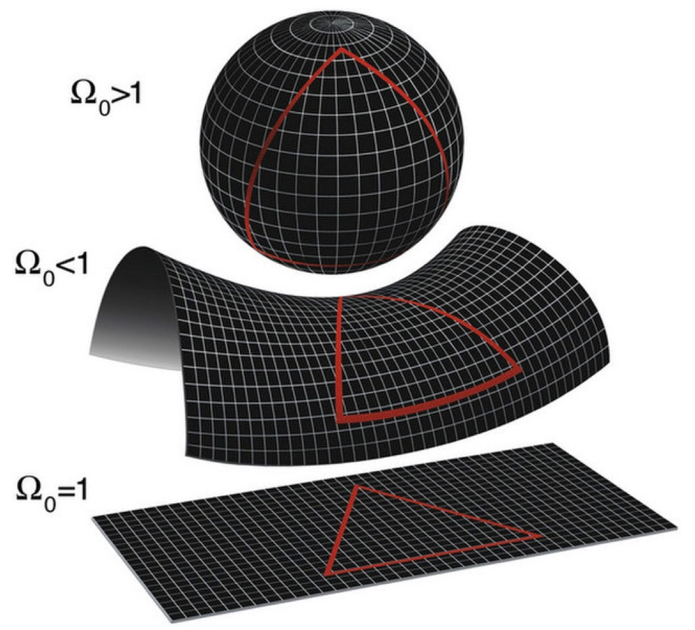

# 0112. 相对论12：爱因斯坦的愿望

万维钢·精英日课³

2018-12-11

你做没做过那种特别厉害的事儿。比如说，在一场关键篮球比赛中投入绝杀球、在公司的一次重大决策中力排众议做出正确选择、用一个充满个人风格的表演征服观众。如果你做过一次这样的事儿，你就会只想再做一次。而如果你已经做过两次，你就会认为这就是你唯一该做的事儿。

爱因斯坦用狭义相对论改变了世人的世界观，然后用广义相对论再一次改变了世人的世界观。这样的事儿他做过好几次。也许征服物理学的世界，就是爱因斯坦唯一该做的事儿。

十多年前流行的一本叫《创新者的窘境》的书，说过这么一个道理。一个因为坚持了某种理念而获得成功的公司，往往会执着于这个理念。这个理念本来是一个创新，曾经给企业带来了巨大的成功。但是到了后来，它往往又会成为包袱，会阻碍你去尝试新的创新。

所以我们到底应该坚持、还是不应该坚持理念呢？我敢说，任何号称能给这个问题提供解决方案的人都是骗子。这里面没有可以机械化操作的方法，你只能自己选择。

相对论我们快要讲完了。相对论的发现旅程，即使在物理学家中都是绝无仅有的，这是一个充满爱因斯坦个人风格的探索。总结来说，这个风格有两条 ——

第一，要统一。爱因斯坦总是想用一个「更一般」、或者说「更广义」的理论、用几个最基本的原则去统一描述看似完全不同的物理现象。

第二，要决断。只要你相信最初的原则是对的，那不管推导出来什么离奇的结果，你都只能接受。就算当时的实验条件验证不了，将来总有人能验证。

我觉得这两条简直可以叫「爱因斯坦主义」。可是爱因斯坦应不应该坚持自己的主义呢？

## 12.1 宇宙的命运问题

有了广义相对论的引力场方程，爱因斯坦就要做一件有史以来气魄最大的事情：他要对整个宇宙求解。

在广义相对论的视角下，宇宙无非就是物质和时空。我们想象一片有很多山头的地方，这里突出一块，那里突出一块，每一座山代表大质量星球对时空地形的弯曲。那这么多星球放在这么广阔的时空中，它们在整体上会有一个什么样的行为呢？

答案取决于这个宇宙中物质密度的大小。引力场方程解出来的宇宙大尺度时空，可以有三种解。

如果宇宙中的物质比较密，那引力场就会比较强，整个大尺度时空的形状就会是蜷缩着的，用数学语言来说就是曲率是正的，好像一个球面。

如果物质密度比较小，那引力场就会比较弱，时空的形状就是伸展开的，曲率为负，好像是个马鞍形。

如果物质的密度不大不小，时空的形状就是在大尺度上是平直的，曲率正好等于 0。下面这张图，表现了这三个解的时空形状 —— 

图中 Ω0 代表宇宙中物质的密度。图片来自 space.com

但是这三个解都有大问题。如果宇宙的曲率是正的，时空就会不断收缩；如果曲率是负的或者是 0，时空就会不断膨胀 —— 不管怎么说，引力场方程结出来的宇宙时空都不会是静态的。

这完全违背了当时人们的宇宙观。人们认为人可以有生有死、地球和太阳都可以毁灭，但「宇宙本身」，应该是永恒不变的。

这一次，爱因斯坦手软了。

爱因斯坦干了一件不符合自己风格的事。他为了让结果符合传统的观念，修改了自己的理论。爱因斯坦给引力场方程增加了一项。你可以看一眼，就是带有红色希腊字母 Λ 的那一项。

爱因斯坦把 Λ 称为「宇宙常数」。他也不知道宇宙常数有什么物理意义，这一项的存在只是为了提供一个静态的宇宙解。好在就算多了这一项，广义相对论在任何局部的计算结果还是一样的。

然而十几年之后，天文学家哈勃系统性地观测远方的星体，发现这些星体发出的光谱都有一个红移 —— 也就是说，远方的星星都在离我们而去！

对此只有一个解释，那就是宇宙正在膨胀。宇宙真不是静态的！

爱因斯坦后悔不已。他原本有机会提前算出来宇宙在膨胀。可是他手软了，没敢坚持做自己！爱因斯坦说，这是他一生最大的错误。

可坚持就一定是对的吗？

## 12.2 量子力学和统一理论

在广义相对论带来宇宙学革命的同时，物理学的另一个阵地正在展开一场同样重大、同样震撼、甚至可能更加不可思议的革命，那就是量子力学。

其实爱因斯坦还是量子力学的开创者。是爱因斯坦第一个提出光并不是像水流一样连续流动的，而是一小份一小份的「光子」 —— 爱因斯坦也正是因为这个学说获得诺贝尔奖，这也是人们第一次知道「量子」这个概念。

所谓「量子」，就是不连续变化的、一小份一小份的东西。物理学家玻尔一开始完全不能接受「量子」这个概念，光怎么可能不连续流动呢？但是后来玻尔接受了，而且成了量子理论最坚定的传道者。

玻尔进一步提出，原子中电子的轨道也是「量子」的 —— 电子只能从一个轨道「突然」跳跃到另一个轨道，而不经过什么「中间地带」。

这一次，轮到爱因斯坦不能接受。爱因斯坦无法相信有什么东西能在时空中跳跃。

是，相对论认为时空的尺寸可以是相对的，时空的形状可以是弯曲的，可是毕竟你得尊重时空本身的存在。你不能说一个东西本来在这里，突然又出现在那里！

但是量子力学的革命仍然在继续。物理学家又发现，一个粒子可以同时穿过两个缝隙，可以既在这里、又在那里 —— 现在连「位置」和「速度」这些最基本的东西都靠不住了。

爱因斯坦拒绝接受。

量子力学还说，世界上有些事儿是完全随机发生的，物理学再精确，也不可能对它做出预言 —— 在量子力学的世界里没有确定性，我们只能谈概率……

爱因斯坦已经忍无可忍，他说「上帝不会掷骰子！」

你大概听说过「索尔维会议」，这是当时世界上最厉害的物理学家的集会，召开过很多次。就在这些索尔维会议上，爱因斯坦跟支持量子力学的物理学家展开了一次又一次的论战。有时候爱因斯坦白天提出一个思想实验证明量子力学的结论不对，玻尔会苦思一晚上，第二天指出爱因斯坦推理的漏洞。

……

物理学的历史最终站在了量子力学一边。到 1930 年代，几乎所有主流物理学家都接受了量子力学 —— 正如他们都接受了广义相对论。爱因斯坦陷入了孤立。

可是广义相对论和量子力学存在根本的矛盾。广义相对论认为时空是连续的，只要选定了坐标系，位置和速度就都是唯一的，广义相对论认为物理定律完全可以计算一切运动 —— 而量子力学正好相反。

物理学再次陷入危机。或者，只有爱因斯坦觉得那是一个危机。毕竟广义相对论是大尺度的理论，而量子力学研究的是微观的世界。别的物理学家都认为这个矛盾可以先放着，目前是井水不犯河水……

可是爱因斯坦如果能坐视这个矛盾，他就不是爱因斯坦了。他多么希望自己能再一次看破红尘，再一次开拓疆域，得到一个统一理论，告诉世人宏观和微观其实是一回事儿……

一直到 1955 年离世，他也未能做到。

## 12.3  英雄

我以前读过一个科幻小说，说爱因斯坦晚年其实已经发现了统一理论，但是因为这个理论能带来不可思议的力量，他决定对世人保密，只告诉了自己的四个学生。后来多方势力争夺爱因斯坦的统一理论，导致四个学生全部被杀。

可惜那只是小说家对爱因斯坦的美好祝愿。

事实是爱因斯坦不可能得到统一理论，粒子物理学在爱因斯坦去世之后取得突飞猛进的发展。1970 年代，物理学家把电磁相互作用、弱相互作用和强相互作用这三个除了引力之外的自然界基本力给统一起来了。爱因斯坦活着的时候还没有这些知识，他还不知道那些微观世界的实验结果。

爱因斯坦在 1933 年定居美国，担任普林斯顿高等研究院的教授。他脱离了物理学研究的主流，把所有立功的机会都让给别人，自己坚持去做那个不可能完成的任务。

他逐渐变得离群索居，跟同事和家人都慢慢疏远。好在后来普林斯顿来了个年轻的逻辑学家，库尔特·哥德尔 —— 就是「哥德尔不完备性定理」的那个哥德尔，跟爱因斯坦成了忘年交。

爱因斯坦说他每天之所以还去高等研究院上班，就是为了拥有跟哥德尔一起上下班的荣幸。两人在上下班的路上谈论物理、哲学和政治。爱因斯坦能跟哥德尔聊到一起去，可能是因为哥德尔也相信宇宙是精密数学的产物，他同样鄙视量子力学。有同事回忆说，爱因斯坦和哥德尔这俩人只在一起聊，他们都不愿意跟我们聊。

有时候想想，爱因斯坦和牛顿大约是人类历史上最厉害的两个科学家，但是他们有个很大的区别。牛顿面对同时代的科学家非常傲慢，对谁都看不起，但是牛顿对大自然充满敬畏。牛顿说，我只不过是在海边玩耍的一个小孩子，偶尔发现了几个漂亮的贝壳，但是我背后，我没看到的，却是真理的汪洋大海。

爱因斯坦正好相反。爱因斯坦是个非常谦逊的人，从来不跟同辈的科学家争名夺利 —— 但是爱因斯坦对大自然却充满了雄心壮志，他认为自己一个人就能发现终极真理！

七十六岁这一年，爱因斯坦因为腹主动脉瘤破裂引起内出血，被送到医院。这不是什么疑难杂症，医生建议马上手术。但是爱因斯坦拒绝了。爱因斯坦说「当我想要离去的时候请让我离去，一味地延长生命是毫无意义的。我已经完成了我该做的。现在是该离去的时候了，我要优雅地离去。」

爱因斯坦去世后，哥德尔奉命整理他的办公室。哥德尔看到黑板墙上写着几个公式。那些公式不会得到任何东西，是个死胡同。