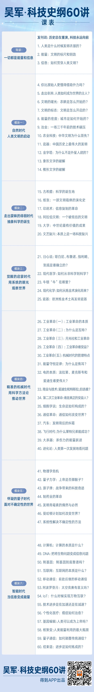

# 0000. 发刊词 | 历史总在重演，科技永远向前
> 吴军·科技史纲60讲
2019-01-14

在完成了四卷《文明之光》的写作之后，我其实酝酿了很久，来筹备这门科技史。

科技史浩如烟海，在梳理的过程中我获得了两个视角，非常受益，在这里也分享给你：一个是回望；一个是俯瞰。

回望历史，把握历史进化的来龙去脉，可以清楚我们今天所处的位置；

俯瞰历史，把握所有要素之间的联系，可以看清世界变化的规律。

拥有了这两个视角，你就可以更清醒地作出决策，这也是我在写作这门课程时，一直想要帮你达成的目标。现在，我终于完成了这门课，可以邀请你和我一起回望和俯瞰这部跨越几万年，涵盖所有人类文明中心的科技史了。

我们都知道科技史时空跨度极大，但你不用担心，我会给出两条清晰的线索：「能量」和「信息」，帮助你重新理解整部科技史，你会发现，这个世界的终极答案就是能量和信息。

我们过去说世界是物质的，其实，更准确地说，世界应该是能量的，因为物质从本质上讲就是由能量构成的。那信息又是什么呢？信息就是组织和调动能量的法则，比如语言、文字、公式、公理等等。科学的本质就是通过一套有效的方法去发现这样一些特殊的信息。

那怎么从能量和信息的视角去解读历史呢？

比如说，古代历代王朝的更替，本质上都是土地创造的能量无法满足人口消耗的能量；语言相较于基因，是更高效的信息载体，使人类的进化得到快速发展……你会发现这两条线索，在整个科技史中，都充满了解释力，人类的所有科技进步，一定会毫无意外地落在这两条线索上。

有了线索还不够，我还会为你从庞杂的科技史中，遴选出 60 个最伟大的科技进步，这 60 个伟大进步，每一个都是科技史上的里程碑，每一个都蕴含着复杂的内在逻辑，值得你拆解研究。透过这 60 个瞬间，你就可以了解整个科技史全貌，找到人类进步所共通的规律，当然我更希望你记住一句话：历史总在重演，科技永远向前。

我们总说要铭记历史，但是，在一个较长的历史阶段回望历史事件的影响力，再大的事情都显得微乎其微。

甲午战争重要吧？中国完败，日本完胜，获得了很多天赐良机，但是今天，对比中日两国的发展，你就会发现那场海战的影响力几乎衰退殆尽；

两次世界大战重要吧？但是德国在两次世界大战中虽然被打败，却丝毫没有影响它如今欧洲第一大经济体的地位；

拿破仑战争，普法战争，十月革命，这些国家兴衰、王朝更替的大事，在今天看来，影响力已经非常有限了。

但科技史却是永远前进的，科技是唯一能够产生可叠加式收益的进步力量。

直到今天，我们依然穿着 10 多万年前发明的衣服，吃着 1 万多年前驯化的水稻，用着 4000 多年前的勾股定理和 300 多年前的牛顿力学……

每一次科技的发展，都在为今天的科技大厦添砖加瓦，都让活在当今的人们享受它的恩泽。

因此，我经常说，在历史的轮回中，王侯将相比起那些推动文明前进的人，太微不足道了。历史的界碑应该以每一次科技的进步为节点，也只有科技变革的按钮，才能触发不可逆转的历史进程。你会发现，真正推动历史发展的只有科技，科技史就是一部确定的、不断向前的历史。

从科技史给出的视角去串连历史，你才能真正洞察世界变化的趋势。因此，我有必要带你完成这次对人类文明的回望和俯瞰。

学完这门课程后，我希望你收获以下三种能力：

1、看清楚自己，看清楚未来的能力：

在科技史中，它的现象和规律经常在重复，了解科技发展的来龙去脉，找出共通的规律，就能更好地把握未来。

2、掌握解决问题的能力：

学习他人的能力：对于自己没做过的事，如何学习别人的经验；

自我创造的能力：对于从来没人做过的事，如何拆解复杂问题，把未知变已知。

3、分清偶然性和必然性的能力：

科技的发展有很多历史的必然性。如果没有爱因斯坦，同时代的人也能发现狭义相对论。认识必然性能帮你摆脱错误归因；

但是另一方面，很多重大的发明发现都具有一定的偶然性。承认偶然性，对世界多一分敬畏，就可以离成功更近一步。

最后，了解历史的目的，还是为了能够把今天的事情做好。因此，这门课的重点不仅在于讲述历史事实，更在于训练思维。我会在每一节课的最后，都强调出这一讲的要点，帮你从特定的侧面理解科技。

如果你愿意和我一起重新回望人类历史，俯瞰这部不可逆的科技史是如何一步一步推进到今天的，那么我们现在就启程吧。

