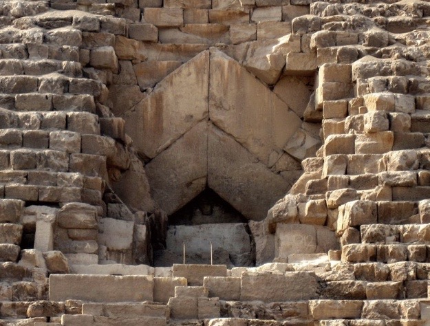

# 0109. 金字塔：为什么不是外星人建的？
> 吴军·科技史纲60讲
2019-01-23

这一讲，我要讲一个古埃及文明的伟大工程——金字塔，搞清楚金字塔是如何建造的，可以帮助我们学到很多改进认知的方法。

金字塔给世界留下了太多的谜，也给人类留下了巨大的想象空间。埃及金字塔太过巨大，本身就是一本活档案，记录了太多现在看起来都难以置信的信息，以至于它是如何建造出来的，一直都是个谜。

虽然绝大部分人，当然也包括几乎所有的学者，大家都认为金字塔是古埃及人建造的，但是一直也存在两种非主流的观点：

一种是认为金字塔是由与今天一样发达，但已毁灭的史前文明建造的，另一种是认为金字塔是外星人建造的。

于是我发现，正确理解金字塔是谁造的这件事，其实是一个试金石，能够测试出一个人的认知水平，思考问题的方法，以及是否有解决问题的能力。

先说说为什么这两种非主流的观点不太靠谱。第一种很容易驳斥，因为如果曾经有过被毁灭的高度的文明，一定有一些那种文明的动物在地球上生存的证据。

这就好像当初达尔文找到灭绝了的植被化石后，发现在进化的过程中有很多被淘汰的物种曾经统治着地球。如果有过和今天同样发达的文明，它一定能分布在地球很广的地区。但是今天地球的表面几乎已经被翻了很多遍，人们也没能像达尔文发现化石一样，发现任何史前高度发达文明的痕迹。

更重要的是，从今天的考古发现和生物基因变化来看，在过去的上千万年里，地球物种的演变是连续的，并没有中断，也就是说，不存在 5000-6000 年前人类文明曾经极高，然后又跌回原点重新开始的可能。

对第二种观点的驳斥，其实罗老师和其他老师在课程中也讲过很多了，外星人不曾到访地球已经是确定无疑的结论了，如果你有兴趣，可以在得到搜索关键词「外星人」进行检索学习。

不过我还是要强调一句，认为金字塔是外星人建造的，是一种极为偷懒的观点，这就好像早期人类搞不清楚各种自然现象的成因，简单将它们归结为神的行为一样。如果今天谁还持这样的观点，是典型的思维懒惰的表现。

但是，吉萨的三座大金字塔实在太大了，以至于人们在很长时间里搞不清楚，当时工程技术并不太发达的古埃及怎么能完成这件事情。

而人类最了不起的地方，就是有好奇心，而且愿意琢磨事情，把不懂的问题搞懂，这是我们面对未知应该有的态度。因此，围绕着大金字塔，人类不仅展开了很多研究，而且进行了一些工程模拟，最后终于基本搞明白古埃及人是如何建造金字塔的了。

芝加哥大学的古埃及学家马克·莱纳将主要的研究成果编成了一本很厚的书，叫做《金字塔大全》，里面详细破解了建造金字塔的各种秘密。我在《文明之光》中概括了这本书中的很多内容，今天我就帮你再提炼和总结一下。

首先，我们要承认金字塔的大。位于吉萨的三个大金字塔中，最大的是胡夫金字塔，在 1311 年，高 147 米的英格兰林肯大教堂建成之前，它是世界上最高的建筑，这个纪录保持了 3800 多年，非常了不起，在它建成后再过 1000 年，中国的商朝才建立，同期古希腊的迈锡尼文明才刚开始。

对于这么大的建筑，科学家们首先要搞清楚建筑材料，也就是那些巨石到底是从哪里来的，这些巨石每块平均重 2.5 吨，最大的巨石重达 80 吨左右，而且有大约 230 万块之多。最关键的是，金字塔所在地本身没有这些石灰岩巨石。考古学家们发现它们来自于尼罗河对岸，但是接下来大家就又有一个问题，那就是这些巨石是如何开采、切割和运输的呢？

古埃及当时已经进入了青铜时代，有青铜的锯子，但是青铜锯子硬度不够高，因此当地人把石英砂粘在了铜锯的表面，这就可以锯开石灰岩了。古埃及留下的一些壁画描绘了当时工人们开凿切割巨石的情景。

至于运输，由于古埃及当时还没有发明轮子，因此他们搬运这些石头确实费了些工夫，不过古埃及人远比我们想象的要聪明，他们制作了类似雪橇的运输工具来搬运石头。这件事是有证据的，在第十二王朝的法老杰胡提霍特普的墓中，有一幅壁画，就描绘了172 个工人拉着一个雪橇似的木筏搬运巨石的场景。

从画面上石头的比例估计，巨石有 60 吨重。大金字塔最大石块的重量大约 80 吨，也就证明这种方法应该是可行的。另外，古埃及人还是用了圆木铺路，相当于起到了轮子的作用。下面是那张搬运巨石的图。

接下来，一块块巨石是如何摞在一起，建成金字塔的呢？他们用的是斜坡原理。莱纳的书中给出了几种可能的斜坡。古埃及人之所以建造金字塔，而不是其它形状的巨型建筑，很大程度上是因为金字塔下面大、上面小的形状，容易一层层地摞在一起。

当然现代人猜想的方法是否管用，需要试一试。日本人做事比较爱较真，日本著名的建筑公司大林组还真按照古埃及留下的记录做了模拟试验，他们搭了一个坡度为 1∶4（高度和长度的比例）的土坡，然后用 18 个人将一块 2.5 吨重（大金字塔石料的平均重量）的巨石拉了上去，每分钟能移动 18 米，不算太慢。这证明这样的方案是可行的。

我们知道大金字塔摞起来的石头之间是严丝合缝的，连刀片都插不进去，这是怎么做到的呢？实际上石头之间是填满了石膏的，保证石头之间不留缝隙。

当然使用石膏填充又有一个问题，就是它本身是湿的，如果等它干燥需要很长时间，流动的石膏会形成缝隙，这个问题古埃及人是如何解决的呢？科学家们发现石膏中有干烧过的痕迹，证明古埃及人是用炭火（或者木柴）将它烤干的。

当然，大家可能还有一个问题，那就是巨石是如何从山体上开凿下来的？古埃及人的做法很有创造性，他们先用青铜的凿子凿出一个小缝，然后打入木楔子，然后往缝里灌水，木楔子被水浸泡后膨胀，就把有缝的石头给涨开了。总之，关于大金字塔建造的各个细节在今天都找到了答案。

另外，大金字塔一些特别的建筑设计，今天从力学的角度也能解释。比如大金字塔的入口，位于塔身距地面 13 米高处，呈三角形，由 4 块巨石砌成。

为什么它的入口要这么建，而不是建成方形门？因为从力学的角度来看，三角形的设计最能承重，其他几何形状（如四边形）的入口，都无法承受金字塔本身几百万吨的巨大重量。

大金字塔还有很多谜团，它还记录了古埃及很多文明成果，关于这一点，大家也可以参考我写的《文明之光》。

从工程上来讲，金字塔并非古埃及完成的难度最大的工程，比它难度更大的工程是巨型的方尖碑。方尖碑上那一整块重达数百吨的巨石是从遥远的阿斯旺开采出来的，然后通过水路运到卢克索等地。接下来还需要将它毫厘不差地树立在设定的石座上，这个难度比建造金字塔大多了。

今天在法国协和广场能看到的古埃及方尖碑重达 250 吨，古埃及其实还制作了一个更大数量级的，但是实在太大没有立起来。金字塔的伟大之处主要在于总量太惊人了，《金字塔大全》这本书里记载，埃及有 138 座大大小小的金字塔。

我们在前面的课程中讲了能量和科技、文明的关系，大家可以算算建造一座大金字塔要消耗多少能量。据估计，当时在金字塔工地上有 20 万平民和奴隶工作，养活这么一大群人在当时都是一个巨大的问题。

要点总结：

1. 对于我们不知道的事情，我们有两种态度，一种是设法将它们搞清楚，这就是人类积极的态度，也是科学家每日工作的目的，另一种是简单归结于神或者什么外星人，这是一种偷懒的态度。不同的态度得到不同的结果。

2. 我在之前的课程中讲过，在金融上，市场永远是正确的，如果理论和市场不一致了，不是市场错了，而是理论错了。在生活中，事实是正确的，如果理论解释不了现实，不要觉得事实错了，而是要更正我们的理论。对于金字塔，它的存在是事实。不能因为它的存在否认人类的问题，而是需要通过它的存在，了解当时的文明水平。
3. 通过介绍大金字塔的建造，希望大家进一步理解能量和文明的关系，体会为什么只有中央集权的农耕文明才能完成这样伟大的工程。
4. 要想驳倒对方不切实际的想法，我们需要提出自己合理的想法。科学家们在解释大金字塔建造之谜的问题上不是和阴谋论者吵架，而是通过研究，给出合理的解释。

思考题：

能否分享一些你了解的古代世界上的伟大工程？

预告：

接下来的两讲，我会告诉你为什么象形文字和楔形文字那么难破解。