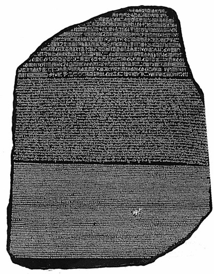
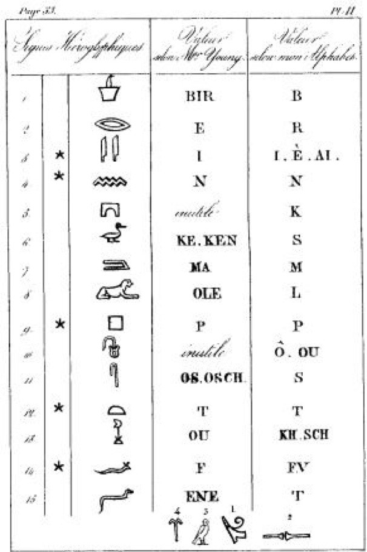

# 0110. 古埃及象形文字是如何破解的？
> 吴军·科技史纲60讲
2019-01-24

这一讲和下一讲，要说的话题是关于破解人类最早的两种书写系统，古埃及的象形文字和美索不达米亚的楔形文字，我希望通过这两节课程，帮助大家对信息的相关性和冗余度有所理解。

发现和破解古埃及文字的过程非常偶然而富有戏剧性。1798 年，拿破仑率领四万大军远征埃及，试图从背后切断英国和印度之间的贸易。他在金字塔战役中一举击败了十倍的敌人（包括 3 万英军、20 万奥斯曼土耳其帝国的军队、8 万埃及的军队以及十几万其他中东国家的军队），这样一来，就更不把敌军放在眼里了，孤军深入，一直占领了埃及在尼罗河下游的主要地区。

当时拿破仑不仅想在军事上重现亚历山大大帝两千多年前征服埃及的伟业，而且想在文化上超越前人。于是他也像亚历山大那样，带领了上百名科学家一同远征埃及。

1799 年的一天，一个叫布沙尔的法国上尉在一个要塞中发现了一块残缺的石碑，这上面刻有三种文字：除了古希腊文，还有两种他不认识的文字。

但是，拿破仑的胜利没有持续很长时间，英国海军名将纳尔逊在地中海上打败了法国海军。失去海上支持和补给的拿破仑虽然在陆上取得了一系列的胜利，但是在埃及和中东最终还是维持不下去了，于是就和英国人议和，撤出了埃及，同时包括罗塞塔石碑的很多古埃及文物也就移交给英国人，这些文物就成了后来大英博物馆最重要的馆藏。

英国人得到罗塞塔石碑后，就开始投入很多学者去进行破译，其中贡献最大的是著名物理学家托马斯∙杨。你可能在中学物理的光学部分学到过一个叫做托马斯∙杨双缝实验的课题，那个著名的实验就是他做的。

托马斯∙杨是个全才，甚至被称为英国最后一个全能型科学家，他对古埃及文字也很有兴趣。他通过研究，发现了古埃及文字和古希腊文的个别对应，特别是埃及法老托勒密和克利奥帕特拉的名字。这两个名字对于古埃及人来讲都是外来字，因此相当于今天汉语中对外国人名的音译。但是除此之外，英国人并没有取得什么新进展。

法国人虽然失去了石碑，但是保存了拓片，也一直在研究它。1822 年，法国天才的语言学家商博良通过碑文上的古希腊文，破解了石碑上的古埃及象形文字的含义，尼罗河流域五千年文明的面纱就此揭开。

讲到这里你可能会好奇商博良是怎么破解的，为什么他之前的人没有做到？这里面首先的原因是商博良本人是语言天才，不仅懂很多语言，而且学习语言特别快，因此他对语言的敏感超过任何人。在商博良之前，虽然托马斯∙杨也做出了一些研究成果，但是总的来讲，方法走偏了。

罗塞塔石碑最上面是 14 行古埃及象形文，又称为「圣书体」，是献给神明的文字，其中的句首和句尾都已缺失，很难破译。中间是32行埃及草书，相当于我们的白话文，又称为「世俗体」，是当时埃及平民使用的文字。

我们今天在埃及纸莎草上看到的文书大多是这种文字，在下面的 54 行则是古希腊文。研究罗塞塔石碑的学者，都是试图先找到第二种文字和古希腊文的对应。

以前，大家都觉得古埃及象形文字完全是表意的，但是商博良发现如果它们（像汉字一样）都是一个符号一个意思，碑文相比希腊文的就太长了，因此一定有一些是音节文字。

商博良利用托马斯∙杨已经确认的埃及法老托勒密和克利奥帕特拉的名字，确认了古希腊文和古埃及文字对应的锚定位置。然后商博良找到了 12 个古埃及文字中音节符号的含义，下面这张图是商博良制作的古埃及文字音节和希腊字母的对应表。

在完成了最艰难的一步之后，商博良一点点抽丝剥茧，逐渐破解了罗塞塔石碑上的内容。原来，这个石碑是在公元前 196 年埃及国王托勒密五世加冕一周年的诏书。在此前大约一百年，埃及已经被来自希腊北方城邦的亚历山大大帝征服，被纳入了希腊文化圈。亚历山大死后，他的部将托勒密自立为埃及法老，开始了埃及历史上的托勒密王朝，希腊文就成为了埃及的官方语言。

与此同时，埃及原有的文字也在使用，因此就出现了一碑三文的现象。无疑，罗塞塔石碑便是开启以象形文字记载的古埃及文献秘密的金钥匙。

我们今天对 5000 年前古埃及历史的了解要远比对 500 年前印第安人文化的了解多得多，这要感谢发现罗塞塔石碑的法国军人布沙尔，拓下石碑文字的科学家让∙马塞尔，当然最该感谢的是商博良。至于托马斯∙杨的贡献，历史上一直有争议，商博良自己并不认为托马斯∙杨的工作有多大的意义。

讲回到破解古埃及文字这件事，那些失传了的文字之所以能被破解，主要是因为相同的内容以不同的文字或者其他形式记录了很多遍。这在信息论上被称为信息冗余，靠信息冗余，可以恢复丢失掉的数据。对于大数据，由于它是从很多不同维度来描述一件事情，因此具有信息冗余，在丢失了一些维度的信息后，可以通过其它维度的信息补回来。

从好的方面讲，它可以避免信息的丢失，从坏的方面讲，即使我们删掉了一些敏感信息，比如和我们隐私相关的信息，也可以从其它维度补回来。因此我们今后恐怕要生活在一个没有隐私的年代了，因为机器破解我们的隐私，要比商博良破解古埃及文字容易得多。

通过这一讲，我希望你进一步体会信息在整个文明中的作用，包括我们破解历史的作用。

预告：

下一讲，我们谈谈楔形文字的破解，那是一个更加艰难的任务。

