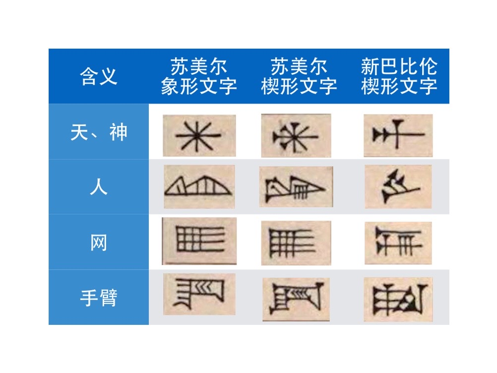

# 0111. 楔形文字是如何破解的？
> 吴军·科技史纲60讲
2019-01-25

上一讲，我们说了古埃及的象形文字是如何破解的，这一讲我们谈谈有关楔形文字的破解。

美索不达米亚楔形文字的破译相比古埃及象形文字的破译要难很多。在很长的时间里，人们一直以为古埃及是人类第一个文明中心，但是近年来大家发现美索不达米亚的文明开始得更早。不仅如此，当地的楔形文字出现的时间，也早于古埃及的象形文字。

由于美索不达米亚采用泥板记录，而泥板的制作成本极低，比古埃及用的莎草纸便宜多了，使用范围很广，因此有大量的泥板保存至今。

刻有楔形文字的泥板其实早在文艺复兴时期就被运到了意大利，但是没有人知道那些符号是什么意思，因此也就没有人再去理会它。最初研究和破解楔形文字的是罗林森。

和商博良一样，罗林森也是一位语言天才，他 17 岁时就熟练地掌握了波斯语，此外他还会古希腊语。1835 年，罗林森还是英国东印度公司的一个雇员，他被派到德黑兰去训练当地的部队。

他听说在哈马丹郊外贝希斯敦村附近的一块大岩石上有非常漂亮的雕画，于是出于好奇就跑去看热闹。在那个悬崖峭壁上，他看到了令人震撼的一幕——高达百米的巨型雕画，虽然经历了上千年的风霜，但画面依旧清晰而漂亮。

这时罗林森注意到在巨幅雕画的上部刻有很多古怪的符号，他本能地感觉那些符号隐藏着什么秘密。他想爬上去把它们给拓下来带回去琢磨，可是他爬不了那么高。后来，他找来一个能够爬高的库尔德小男孩，拿出一大笔钱请那个男孩爬上去帮他拓下那些符号。这就是著名的贝希斯敦铭文。

由于那个雕画高近百米，当时也没有什么攀岩工具，因此攀高拓（tà）片是一件非常困难而危险的事情。小男孩在岩石缝里打下了木桩，然后用绳索拴在木桩上，相当于搭了个简易的脚手架，这才得以攀到岩石的顶部把那些符号拓了下来。

那些拓片上的符号像一个个小钉子，后来那些文字在英语里就被称为钉子形文字，而在中文里被翻译为楔形文字。罗林森针对这件事，后来写道，「我当时并不知道攀登到岩顶找到那些铭文会是怎样伟大的壮举」。

也是罗林森运气好，拓片上的文字和罗塞塔石碑上的一样也是三种，那么它们应该是三种不同的文字。但是和罗塞塔石碑所不同的是，这三种文字他一种也不认识。

罗林森没有办法，只能先把这件事搁置了。后来他被作为外交官派驻到巴格达，当然同时也被安排了间谍工作。他在巴格达的大街小巷收集各种信息，有些是英国要的情报，有些是他自己想要的史料。

在他32岁那年，一件事让他后来下决心破解那些楔形文字，那一年，法国人发现了传说中的亚述帝国的都城尼尼微，欧洲掀起了研究中东地区古代历史的热潮。于是，罗林森决定专注于楔形文字的研究。但是，由于他所获得的拓片上没有任何他能够认识的文字内容，因此那些楔形文字的破译要比利用罗塞塔石碑破译古埃及象形文字难得多。

罗林森决定从其他的地方找到那些铭文的内容，最终他从古希腊人的记述中，见到了对这个古波斯雕画和碑文的描述，由此，他知道了希腊文的内容。这以后，他将希腊文的内容和拓片上的波斯楔形文字的原文相互对照，花了 16 年时间，才破解了波斯楔形文字，1849 年他发表了自己的破译成果。

美索不达米亚文明和古埃及或者中国文明都不同的是，那里不是单一文明，而是在大约 3000 年的时间里被一个又一个国家轮流统治，因此不同时期的文字也不一样，需要一一破解。在破解了古波斯楔形文字后，罗林森试图破解拓片上的第二种楔形文字，以便了解更多的历史。

当时欧洲人在美索不达米亚地区发现了大量早期文明的遗迹，大量的楔形文字泥板被发现，很多学者对此感兴趣而参加到了破译的工作中，不过他们并没有合作。几年后罗林森和其他学者们独立地破解出了新埃兰楔形文字和巴比伦楔形文字。

但是，最古老的苏美尔楔形文字却一直没有得到破译，因为它们太古老了，和其他楔形文字没有什么共同之处，从某种意义上讲，它们更像是象形文字。

下面这张图是我画的一些从苏美尔象形文字到它的楔形文字再到后来巴比伦的楔形文字演变的过程。从图中可以看出，苏美尔的楔形文字和后面的差别很大。

直至 18 世纪末到 19 世纪，其他楔形文字才一一被解读出来。解读顺序是这样的：古波斯楔形文字－新埃兰楔形文字－巴比伦楔形文字－苏美尔楔形文字。

苏美尔文字的破解非常难，是非常多科学家共同努力的结果，从 19 世纪末直到 20 世纪 40 年代，大家花了大约半个世纪的时间，才算把它基本上搞清楚了。从此，我们才得以了解地球上近 7000 年的文明。

生活在美索不达米亚的人都为人类贡献了什么呢？说到那里，大家可能第一个想到的是已经不存在的空中花园，但那其实在美索不达米亚的文明中不过是一个微乎其微的成就。

从苏美尔人开始，那里为人类发明了车子和帆船，最早的水利系统，最早的文字，最早的上釉技术，那里也是最早普遍使用铁器的地区，那里的先人还制定了最早的法律，和埃及人签署了最早的和平条约，等等。

美索不达米亚在很长的时间里是世界上几何学和天文学的中心，当时古希腊的学者都要到那里学习数学。这就是我在下一个模块第一讲要说的内容。

不过，随着气候的变迁，波斯帝国的入侵，那里的文明消失了，并最终被埋在了黄沙之下。不过，如果你到世界上那些大博物馆去，依然能够看到几千年前那里的文明。

要点总结：

1. 文字破译最根本的是利用对一件事多种文字同时记载时所产生的冗余度，找到信息之间的对应关系，即信息的相关性。

2. 记录这件事很重要，而且有时需要用不同的方式留下多种记录。不仅对于将来研究历史如此，对我们的工作也是如此。俗话说得好，再好的记性都不如烂笔头子。我们在后面的内容中会看到，记录是保证科技发展能够取得叠加式进步的条件，也是职业人士做事的方法。
3. 记录载体廉价、易获取，对于文明本身很重要，今后我们在介绍纸的发明时还会讲到这一点。
好，到这里，我们的祖先借助外力走出了非洲，开始了农耕定居的生活，创造能量的水平和能量的使用效率都越来越高；另外，依靠着语言、文字和书写系统等发明，经验、技术也得以传承，在能量和信息这两条线索的共同作用下，文明也就随之开启了。

预告：

下一个模块，我会从信息的主线出发，一是为你介绍信息源，也就是诞生科学的古希腊，二是为你讲解信息流，也就是造纸术、印刷术等传播手段，看看人类是如何走出蒙昧，又跌回黑暗，最终迎来复兴的。我们下一讲再见。

