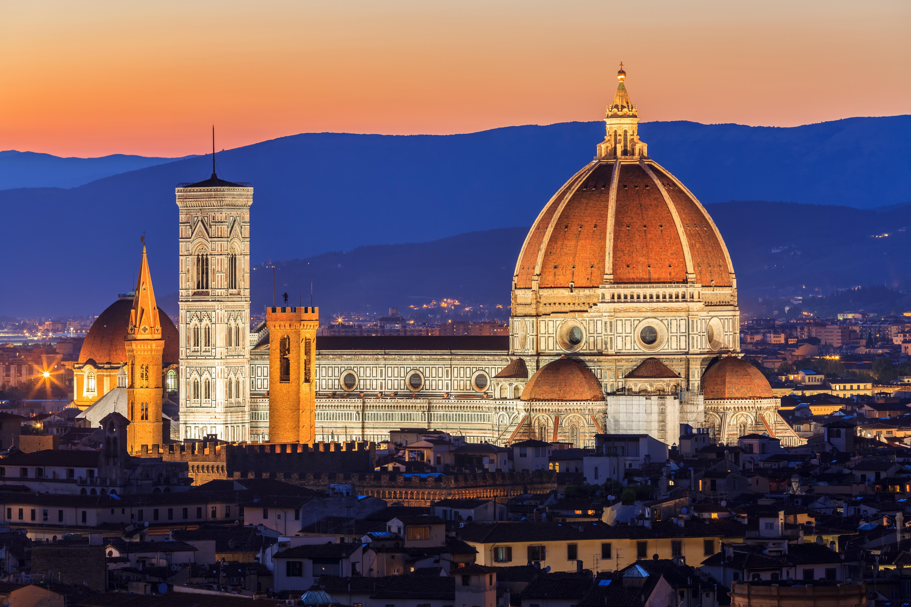

# 0206. 文艺复兴：本质上是一场科技复兴
> 吴军·科技史纲60讲
2019-01-31

关于文艺复兴的故事，特别是文艺复兴三杰的故事我们已经听得很多了。这一讲，我们就从一个与技术相关的故事开讲，从科技的视角再次理解文艺复兴。

14 世纪，意大利佛罗伦萨有一座大教堂，当地没有一个老人说得清这座教堂是从什么时候开始修建的，因为从他们的父辈甚至祖辈起，教堂就已经在那里了。

但是，这么多年来，它始终也没有完工。因为，当时的佛罗伦萨人都是虔诚的天主教徒，他们最初计划着要为上帝建一座空前雄伟的教堂，所以就把规模搞得特别大，光是大教堂四周的墙就修了长达80年的时间。

当他们努力了近 100 年，修好了墙壁之后，却发现工匠们根本没有足够的技术修建教堂巨大的屋顶，因为教堂的敞口太大了。于是这栋露天的巨型建筑就立在那里很多年。修建圆形屋顶的技术，人们其实早就发明了，在一千多年前，古罗马人就修建了穹顶内部高40多米的万神殿，但是这项技术在中世纪却失传了。所以人们一直都不知道该拿这个教堂怎么办。

这时，一个自称可以解决这个工程难题的天才出现了，他坚信自己可以为教堂修建一个圆形的穹顶。这个人就是后来西方近代建筑学的鼻祖——布鲁内莱斯基。

事实上，他曾经专门测量过罗马万神殿的穹顶，研究了大量古罗马建筑的资料，因此他对于完成圆形屋顶，非常有信心。但是当他跑到市政厅，声称自己可以解决这个教堂顶的工程难题时，大家都觉得他是一个疯子，甚至把他扔了出去。

但是有一个人始终支持他的想法，他就是科西莫·德·美第奇。科西莫是什么人呢？他是当时佛罗伦萨的大家族美第奇家族的成员，这个美第奇家族从手工业起家，后来发展金融业，为教皇管理钱财，并最终走向政治，而科西莫就是家族最早成为佛罗伦萨的大公的人（大公也就是统治者）。

说回教堂的修建，随着其他建筑师一个个地来，又一个个地走掉，这个难题最后只能请布鲁内莱斯基来解决了。

这个穹顶的科技含量在当时是很高的，布鲁内莱斯基改进了古罗马人的建筑技术，设计了内外两层拱顶的结构，后来很多圆顶的建筑都纷纷效仿。它用了足足 400 万块砖，直到今天它都是世界最大的砖石穹顶。

为了把这些砖运到高处，布鲁内莱斯基研究之前的数学资料，发明了一系列齿轮机械的起重设施，后来这些起吊机成就了很多剧场戏剧演出时的创意。最重要的是，布鲁内莱斯基还在实践中，不断完善了他的「透视法」，随后这个原理马上就被运用到了绘画中去。

布鲁内莱斯基花了长达 16 年的时间，终于完成了他的使命，教堂封顶了。从 1296 年铺设这座大教堂的第一块基石开始算起，到 1436 年整个教堂完工，前后历时 140 年，这个漫长的过程，离不开科西莫·德·美第奇不计成本的支持。

在教堂落成的那一天，佛罗伦萨的市民潮水般涌向市政广场，向站在广场旁边的顶楼上的科西莫祝贺。这座教堂不仅是当时最大的教堂，也是文艺复兴时期第一个标志性建筑。

这座教堂以圣母的名字命名，现在中文把它译作「圣母百花大教堂」。但是，在佛罗伦萨当地，它有一个更通俗的名字——Duomo，意思是圆屋顶。

好，透过这个关于建筑技术的故事，你应该能理解科技复兴的含义了。在当时，科西莫和布鲁内莱斯基就用「复兴」这个词来形容这个大教堂，因为它标志着人们终于复兴了古希腊罗马时代的文明，走出了蒙昧的中世纪。

这也解释了我们这个模块的标题：「走出蒙昧的徘徊时代」，人类从雅典文明跌回到中世纪，又通过对信息的收集，实现了文艺复兴，完成了一次在文明与蒙昧之间的徘徊。

在此之后，布鲁内莱斯基还发明了在二维平面上表现三维立体的透视画法，今天的西洋绘画和建筑草图都采用透视画法。这样，绘画的风格就非常写实，因此你看到很多文艺复兴时期的绘画，都特别逼真和世俗化，显得特别有「人味儿」。

而建筑，也因此得到了大发展，要知道，说到中世纪的建筑，一般就是指教堂建筑，市民住的房子其实构造很简单，并没有应用什么建筑原理精心设计过，但是文艺复兴之后，技术开始普及，私人住宅的设计需求就被激发出来了，建筑技术不再仅仅服务于神和宗教，而是回归到了人世间。

这些都要归功于人们对古希腊、古罗马科技文化的再次学习和二度创新。你会发现，人们掌握了更先进的科技知识，也就顺理成章地创造出了不同于以往的文艺作品。可以说，文艺复兴只是科技复兴的外化结果，对科技的探索才是这场运动的本质。所以，我说文艺复兴也是一场科技复兴。后面的达·芬奇、伽利略也会印证这一点。

接下来的问题是，这场技术复兴是怎么被推动的？这就必须要介绍美第奇家族的贡献了。

在刚才的故事里，你有没有好奇科西莫为什么能成为布鲁内莱斯基的伯乐？因为对于布鲁内莱斯基是否能完工，科西莫其实是心里有底的。科西莫推崇古典文化的复兴，四处收集古代的手稿和文献，他的私人藏书馆最终成为全欧洲最大的藏书库。

他很早就接触到了古希腊罗马时代留下的一些经卷和手稿，里面有很多机械和工程方面的图纸，所以他知道，按照古罗马人的做法，教堂的顶是有可能完成的，也就义无反顾地支持了布鲁内莱斯基。

科西莫不仅成就了建筑大师布鲁内莱斯基，他还模仿公元前 4 世纪末的柏拉图，建立了 14 世纪的柏拉图学园，这个研究机构后来成就了一大批科学家。科西莫到处收集古希腊、古罗马文物和资料的行为，引发了市民的纷纷效仿，人们学习求知的欲望都空前强烈，好奇心和创造力被极大地调动起来。

可以看出，科西莫可不仅仅是一个政治家，他的格局和眼光已经超越了时代。科西莫用于资助艺术、建筑和科学的资金，相当于同期佛罗伦萨税收的六倍。他曾经发出这样的慨叹，美第奇家族被驱逐出历史可能只要 50 年，但是文化却会永远地留下，说明对于科技进步的长期收益性，他很早就认识到了。

从科西莫开始，美第奇家族的历代成员都会出巨资供养学者、建筑师和艺术家。他的孙子「豪华者」洛伦佐·美第奇在资助艺术家和学者方面超过了他的爷爷，我们今天熟知的米开朗基罗和达∙芬奇，都是洛伦佐资助的。

今天在很多人眼里，达·芬奇是一位艺术家，其实他也是当时最优秀的科学家之一。除了在力学和机械上的成就，达∙芬奇是中世纪之后研究动物（包括人）生理结构的科学家。

他根据自己对鸟类解刨的结果设计了飞行器的模型，并且通过偷偷解剖人的尸体非常准确地了解了人的骨骼和肌肉结构，他所绘制的解剖图，可以和今天X光拍的照片相吻合。解剖学的发展为随后现代医学的诞生打下了基础。

美第奇家族的后代还资助并保护了伽利略。伽利略为了表达感激，用美第奇家人的名字命名他在 1610 年发现的 4 颗木星的卫星。事实证明，美第奇家族统治佛罗伦萨的 60 年间，佛罗伦萨迎来了文艺复兴的鼎盛期。科西莫在去世时获得了一个非常荣耀的称号——「祖国之父」。因为他开创了一个新时代，科学、文化和艺术从此在意大利乃至欧洲开始复兴。

如果说中世纪是因循守旧，一味模仿的时代，那么文艺复兴就是一个涌现天才，人人都争先恐后地去创新的时代。这样的时代一扫中世纪的闭塞和压抑，为呼之欲来的现代科学做足了准备。

到这里，你知道了文艺复兴的本质是科技复兴，而文艺复兴的发展离不开美第奇家族的推动，那么我继续追问，美第奇家族如此至关重要，那如果没有他们，文艺复兴是不是就不会发生在佛罗伦萨了呢？我想通过这个问题帮你再次理解，历史中的偶然性与必然性。

首先，佛罗伦萨处在通往罗马的必经之路上，地理位置便利，这里成为了信息交流的枢纽。其次，十字军东征后，佛罗伦萨人从阿拉伯文明那里学到了中国的抽丝和纺织技术，开始生产丝绸，随后又发展金融，非常繁荣，追逐利益的商业阶级不断打破社会的教条。

有了这样的经济基础和社会环境，文艺复兴的诞生其实是必然的事情，只不过美第奇家族的出现加速了这一进程，要知道，在美第奇家族发迹之前的14世纪末，佛罗伦萨的文艺复兴就已经悄然开始了。关于偶然性和必然性，你可以借此加深理解。

要点总结：

1. 我用圣母百花大教堂修建的例子，说明科技复兴就是对过去希腊、罗马文明的复兴。而文艺复兴的本质其实就是科技的复兴，科西莫和布鲁内莱斯基之所以能完成其他工匠无法完成的伟业，就在于他们掌握了其他人不知道的信息。从这个角度想，文艺复兴的本质还是信息的复兴。

2. 我讲了文艺复兴发生在佛罗伦萨的必然性和偶然性。如果没有美第奇家族，文艺复兴会晚很多，但最终一定会到来。

思考题：

请你试着举出其他例子，从科技的角度重新理解，文艺复兴的核心，也就是「以人为本」。

预告：

下一讲，我们对学过的「自然时代」和「徘徊时代」这两个模块进行一次复习，邀请你和我一起用学过的这些知识回答这样一个问题：「各个文明的竞争，比的到底是什么？」好，我们下一讲再见。
