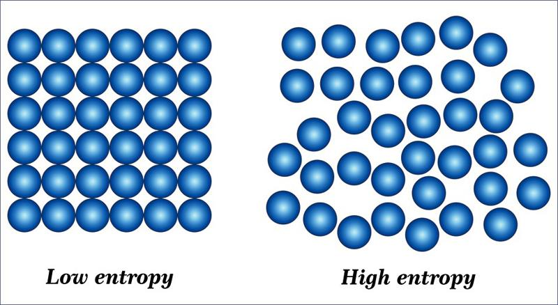

# 0203. 混乱与有序：为什么不可逆是化学反应的宿命？

孙亚飞·化学通识30讲

2019-06-06

总结：在这一讲中，我们主要讨论了四个层面的问题：1）熵就是混乱度，它会一直增长；2）熵增原理的化学本质，是微观粒子的混乱造成的；3）有些事理论上可逆，但是实际操作却很难，化学反应也是如此，这是因为虽然恢复如初，但整个系统的熵会大幅增加；4）从化学的视角重新审视热寂论的话，其实结局没那么丧，因为只要来过这个宇宙，就一定会留下痕迹；5）说到底，熵增原理其实是给我们划定了一个边界。因为熵总是要增加的，如果你想维持一个有序的体系，就要为此付出更混乱的代价。

## 3.0

今天这讲，是化学定律模块的最后一讲，我们讨论的话题是化学领域的熵增原理。

我们回想一下，前两讲，我们一直在说足球赛。听完了动态与静态，你学会了怎么看场面局势，也就是过程；又通过变化与恒定，学会了怎么看数据，也就是化学反应的结果。那么接下来，影响比赛的还有什么重要因素呢？

你或许不难猜到，还有裁判的因素。一个公正的裁判，可以确保比赛至少符合预期，但是一个会吹黑哨的裁判呢？很可能就会将比赛毁于一旦。

所以，我们这一讲所要解决的，就是第三个定律，熵增原理，讲讲熵是如何对化学过程进行裁决的。

既然化学反应的本质就是平衡过程，那么，任何一种平衡状态被打破之后，只要施加外力去扭转，它就应该能恢复原有的状态了吧？是不是就可以永远跟新的一样了呢？

这个说法就如同是，中国队和巴西队踢球，虽然技不如人，但只要我方能够把对方的人都放倒，不就赢得比赛了吗？显然这是不可行的，你当裁判的红黄牌是摆设吗？

真实世界的化学反应，也有一双看不见的手在调控着。

就比如，汽车零件生锈，让很多人都头疼，就算保养得很勤快，使用最好的防锈措施，这种情况依然会发生，汽车也会一直朝着报废的不归路行进。

人更是如此了。不管我们有多注意保养，身体的衰老依然会来临。由此可见，仅仅知道了化学反应的过程与结果的规律，我们对世界的认知，并没有就此结束，反而有可能会更加迷糊。

怎么去理解这些现象？讲到这里，我们就该引入一个概念了，它就是熵。

## 3.1

作为得到的用户，你应该已经很熟悉熵了。通俗来讲，它可以理解为混乱度，就是描述混乱程度的度量。

跟它有直接关联的还有一个定律，叫做熵增原理，说的是在一个孤立系统中，熵总是不断上升。怎么理解呢？就是一个孤立的系统，会自动变得越来越混乱。在科学界，它也叫热力学第二定律，是对所有过程的一个判定依据，其中也包括化学反应。

混乱度会不断增加，你可能会觉得，这种问题还需要研究吗？比如说自己的房间，不收拾肯定越来越乱。再说了，有序也好，混乱也罢，不就是勤快跟懒惰导致的吗？难道说，科学家们还要兼职劳动委员，管起我们的日常起居吗？

这话有一定道理，因为科学意义中的「混乱」，的确包括了室内杂乱的情况。但是，它的范畴大得多。

往大了说，它决定了宇宙未来的走向。往小了说，它涉及到饮食起居的方方面面。房间乱不乱，并不只是生活习惯的问题，背后也有着科学性。

左为熵减，右为熵增

比如，一个房间里有几瓶好酒，瓶塞没有打开的时候，每种酒的气味都藏在各自的瓶子里。这就是一种有序的状态。

但当瓶塞开启以后，不同酒的气味就自动挥发出来了。甭管是 1982 年的拉菲，还是20年陈酿的茅台，气味混到一起之后，怎么分都区分不开了。这时候的房间，其实处在一种混乱的状态。而气味挥发到房间的这个过程，就是熵增过程。

正因为熵增原理的普适性，我们才会对它情有独钟。而且，在一些社会行为中，我们能获得一些有意义的推论。

比如下面的这个问题：要是想把一座城市治理得井井有条，城市管理者是采取开放的态度，还是孤立的态度呢？

乍一看，好像过于开放的城市会吸引很多闲杂人员，让城市变得越来越乱。但是通过熵增原理，我们又能清楚地了解到，孤立地治理这座城市，它的混乱度也会增加。比如，仅仅是人口老龄化的问题，就足以压垮一座不开放的城市。

## 3.2

说了这么多，熵是一个物理名词啊，我们不是化学课吗？这跟化学研究有什么关系呢？

针对这个问题，我先告诉你答案，再接着慢慢讲。简单来说，熵的本质，是微观世界混乱度的体现。

19 世纪中期的时候，化学家们陆续建立起一些化学模型，比如原子、分子、元素等等。不久以后，有个叫玻尔兹曼的科学家，敏锐地猜测到，物质的宏观表现或许是建立在原子及分子运动的基础上的。

于是，他一生的心血，都在根据原子模型，研究热力学问题。直到最后，他终于证明了熵和微观状态之间存在着直接联系。

我们在第二讲也说过了，化学是从微观维度来认识这个世界的，玻尔兹曼借鉴的就是典型的化学思维。

你看，熵是微观粒子行为的体现，而化学反应也是微观粒子之间发生的作用，自然也满足熵增原理。换句话说，化学反应虽然是可逆的，但是这样操作之后的熵，却不可避免地增加了。

比方说，氢气和氧气反应后，可以得到水，并释放一定的能量。而水在特定条件下，又可以吸收同样的能量，重新变为氢气和氧气。

乍一看，前后状态好像没有变化，但是整个循环却无法自行完成。说得更具体一些，就是氢气和氧气反应所释放的能量中，一定有一部分会成为无法利用的热量。如果没有外界干预，它们就不可能恢复原状。

熵增原理的本质，是因为微观粒子运动的混乱程度不断增加。基于这一点，同样的逻辑在我们已知的任何场景下都成立。

「破镜难圆」和「覆水难收」，体现的也是这个原理。玻璃材质的镜子打碎了之后，我们收起所有碎片，要是重新烧制熔化，还可以做出一个完好的镜子。镜子呢，经历了从有序到混乱，又重新变得有序的过程。

但是，这个过程不可逆，镜子也付出了很大的代价。怎么理解呢？我们可以把破镜子恢复如初，看作是一个熵减的过程。工匠为了修复它增加的熵，远远高于镜子减少的熵，代价自然就体现出来了。

我们还可以把人体，看作是一个低熵的系统。五官、四肢、心肝脾肺肾等等，都位于特定的位置。新陈代谢让身体始终处在有序的状态。但是，为了维持有序，我们就不得不向环境中释放更多的熵，并且，人体越有序，人体与环境构成的组合系统，就越混乱。

从这些例子里面不难看出，因为熵增原理，局部有序并不能阻止整体变得混乱。而熵就像时间一样，只会单方向流动。

这个原理，还有着非常现实的意义。

刑侦学中，有一个很著名的「罗卡定律」，大意就是凡有接触，必有痕迹。

乍一看，这句话好像说不通。假如犯罪嫌疑人细心一点，把所有痕迹都清理干净了，不就可以实现完美犯罪了吗？但从熵增原理的角度来理解的话，我们能看到，嫌疑人的一切对抗都没用，反而是越挣扎，就越容易留下更多的痕迹。

这么看起来，侦探和化学家可以算是半拉同行了。他们都是从一些蛛丝马迹中寻找规律，再得出答案。

其实，福尔摩斯的人设，就是化学专家。中篇故事《四个签名》里，讲到一个军人把财宝从印度带回了英国，但最终被暗杀的故事。福尔摩斯和华生前去破案，福尔摩斯刚看到尸体的状态，就判断出这是生物碱中毒，比身为医生的华生反应还要快，甚至提醒华生别去触碰毒刺。

你看，学好化学，就有了救命的本钱。

## 3.3

目前来看，熵增原理是人类无法破解的定律，这就引发了一个问题，如果裁判的权限过大，会不会毁了比赛？

正因为如此，关于熵的一个话题，我们总是绕不过去，那就是著名的「热寂论」。它是对宇宙终点的一种猜想。

简单点说，就是宇宙很可能也是个孤立系统，所以，宇宙也会从有序变得混乱。在这个过程里，可利用的能量越来越少，取而代之的，是无法利用的热能。到了最后，宇宙将达到一种再也无法变化的热平衡状态。

这就很让人绝望了。意思不就是说，就算我们付出努力，留下丰厚的遗产，都没办法扭转宇宙最后的结局。既然万事皆成空，那我活着还有什么意义？

这种情绪，其实大可不必有。

从化学角度来看，每个人活着的时候，都会和各种原子、分子打交道。而正是因为可恶的熵增原理，不管是自己还是别人，谁都没办法消除自己存在的痕迹。微观粒子会忠实地记录下每个人的行为，这足以让人变得不朽。

换句话说，只要你来过这个宇宙，就一定会留下痕迹。在时间的长河里，还有什么比留下物质痕迹更让人心潮澎湃呢？哪怕，它们只是一些不起眼的微观粒子。

所以，就算真有热寂到来的那天，也不意味着一切成空。

## 黑板墙 

思考题：为了打扮得光鲜亮丽，很多姑娘会提前一到两个小时起床，听完这一讲以后，你会怎么来分析和看待这种现象呢？

下一讲开始，我们将开启新模块，化学模型，谈谈化学是如何借助模型来认识世界的。

许多女孩子，每天会提前一到两小时起床，精心打扮自己，总是希望把自己打扮得漂漂亮亮的，想让自己维持十八岁的容颜。但是，事实上，人体的新陈代谢是时时刻刻都在发生的，人的衰老是一个不可逆转的必然趋势，所以任何漂亮的女性，最终都必然会面对容颜的衰老。如果希望通过精心的妆容打扮，维持自己的容易，其实只是一个制造熵增的过程；同时，随着时间的推移，需要花费在打扮上的时间会越来越多，那就很有可能要提前更多的时间来准备，那么反而会造成新陈代谢的不规律，进一步增加熵增，加速衰老的过程。所以，对于衰老这件事情，我们需要有一个清醒的认识；对于所有女性而言，都需要正确的看待容颜的衰老，保持良好的心态，而并非通过化的方式增加熵增，这样做只会适得其反。作者回复：是的，所以当我们知道了什么是熵，就不难理解什么是「适可而止」。2019-06-06

个人理解感觉熵增原理和动态平衡原理、质能守恒定律有点矛盾呢？我理解熵就是和时间一样的东西，单向的，趋势越来越混乱的过程，总体来说不可逆的。熵增原理发生的情比熵减要大的多，比如一个人不小心骨折了，骨折发生时就是用了一秒钟的事，为了恢复到骨折前的状态，打石膏保持接上骨头的状态得 100 天才能长好如初，而且花医药费，用了医生的资源和药品材料，这虽是熵减的过程，但是去花了比熵增过程多得多的时间或额外的能量，

作者回复：没错，熵和时间都是单向的，现代物理有很多模型，就是关联了熵和时间。但是，熵增原理和动态平衡原理以及质能守恒都不矛盾。动态平衡本身就是一个熵增过程，试想一下，如果平衡是「死平衡」，那么它的任何物理参数都不会変，熵也不增长。但是动态平衡，它本身就是混乱度的体现。继续深入思考，在这个过程中，因为是平衡，那么能量和质量都保持不変，我们怎么判断出它是动态的呢？这不就是熵的意义了吗？我再说一个最简单的例子，帮助理解：两瓶气体放到一起，自动就混合了，它没有发生化学反应，没有能量和质量的変化，那么是什么原因促动它们混在一起了呢？2019-06-06

1-3『熵和时间是单向的，想起了电影《信条》。（2021-05-28）』