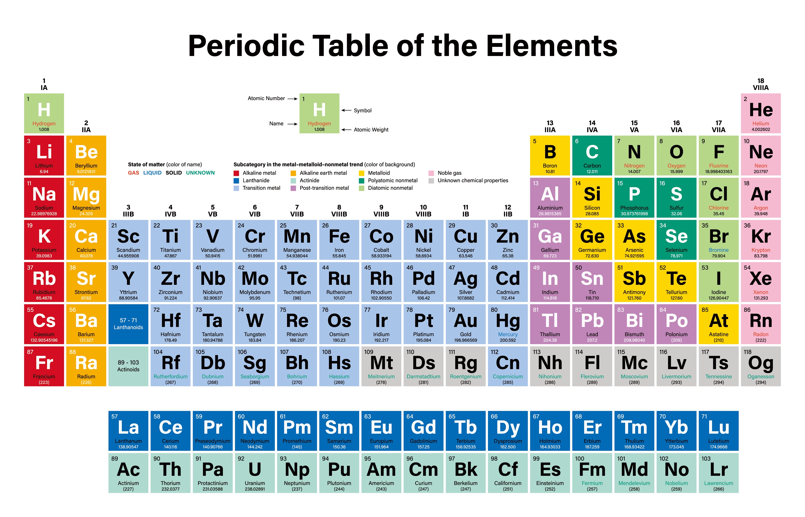

# 0303. 周期与渐变：化学世界的基本关系是什么？

孙亚飞·化学通识30讲

2019-06-09

上两讲，我们讲到原子模型和分子模型的时候，知道了原子能够构成分子，那么，原子构成分子，遵循了什么规律呢？这就引出我们这一讲要说的，元素周期律模型了。

原子、分子和元素周期律模型，是我们认识物质结构的基础，了解了这三个模型，恭喜你，终于真正迈进化学的门槛了。

你可能会有些泄气，这都第九讲了，怎么才刚刚跨入门槛。难道化学里，就没有什么事半功倍，可以让人迅速掌握诀窍的巧办法吗？还真有，这就是我们这讲要说的主题。

要说巧，擅长演绎的物理学大概是自然科学的翘楚，一些顶尖的物理学家，往往可以通过纯粹的思维实验，直接推测出各类现象，免去了很多盲目的探索。

远一点的，有伽利略对两个铁球同时落地的思考，近一点的，有爱因斯坦提出，光会因为引力而弯曲，这在后来的一次日全食中，明确地被观测到了。

精准预测未来，可以比肩伽利略和爱因斯坦的天才，化学界也有，门捷列夫就是其中之一。

1869 年，他编制了元素周期表，还特地在表上留下了四个空位，预测了四个还没有被发现的元素，推测了这几种元素的性质。

那么问题就来了，门捷列夫凭什么预测未知世界呢？这就是元素周期律的魔力所在。

## 01

牛顿曾经说过一句名言，如果说我看得比别人更远，那是因为我站在巨人的肩膀上。这里面当然有谦虚的成分在，不过，在自然科学领域，任何成果，都不会是一个人的功劳。

早在门捷列夫之前，就已经有过不少人在编制元素周期表了。

在这些人看来，元素周期表的内核，是元素性质变化的周期性。周期是什么意思呢？就是将不同元素按原子量升序排成一串，那么它们就会像音符一样，每隔几个元素，性质就会十分接近。

我在文稿里附上了元素周期表，我们一起对着表来说。

你看，第一列的钠和钾，第二列的钙和镁的化学性质很相似，而且，钠和钾之间，钙和镁之间，还都隔了 7 个元素。这个规律，有点像是音乐中的音调，每隔一段，就会出现相似的音符，呈现出明显的周期性。

所有的元素排下来，就跟钢琴的 88 个键一样，整齐地排列在一起，演奏出动人的乐章。

这么看起来，门捷列夫究竟做了什么，反而后来者居上，一说起元素周期表，就想起他呢？

原因一共有三点。

第一，门捷列夫把元素的周期性上升为普遍规律。他认为，元素之间的关系不是巧合，而是互相之间存在着内部关系。这就相当于，前人只是说猫和老虎很像，但门捷列夫把这一点总结为两个动物都属于猫科动物，存在生物学的关联。

第二，门捷列夫揭示了元素周期性的核心特征，渐变。每个元素的性质，都在前一个元素性质的基础上，发生了细微的变化，当变化积累到一定程度时，这种渐变就成了突变。比如，从 11 号的钠元素，到 17 号的氯元素，化学性质一直是渐变，但是从氯元素到 19 号的钾元素，化学性质就成了突变。

第三，门捷列夫还发现了异常的现象，也就是，某些元素性质的变化既不符合周期性，也不符合他估测的变化幅度。所以，他认为，在这些元素之间，一定还存在没有被发现的元素，这就是他预测的根据。

门捷列夫之所以伟大，在于他不仅把一堆杂乱无章的元素排列起来，还坚定地认为它们之间的关系是自然界的规律，不是巧合，更不是人类自作多情。

听过上一讲的话，你会知道，在门捷列夫的那个时代，科学家们连原子是否存在都不确定，所以，元素周期律是他蒙出来的吗？

当然不是。这是因为他掌握了海量的参数。他能发现元素周期律，可以说是源于大数据的采集。另外，他处理和分析数据的能力，也远超一般人，所以才能画出精确的元素周期表。

## 02

画出元素周期表，只是个开始，怎么让人相信，才是更大的难题。自然界的规律，不是人类说有就有的，所以，就需要一些应用案例来证明。

门捷列夫是个俄国人，俄国当时的科技还比较落后，在欧洲的科学圈被边缘化了，他的成果就没有得到重视。更何况，门捷列夫还有些狂妄，就更不讨喜了。

转机发生在周期表出现的四年后，有人发现了镓这种元素，测试了相关数据，公布了结果。门捷列夫看到这个消息之后，幽幽地给发现者去了封信，说你的发现很好，就是我留白的四个元素之一。但是，你的论文里，有个氧化物密度的数据，跟我的预测不一样，你肯定测错了。

发现者一开始不以为然，但出于礼貌，还是按照门捷列夫的意见重做了一遍数据。没想到，真被门捷列夫说中了——重新测定的结果，跟门捷列夫的数据一样。

这件事轰动了整个欧洲，科学界这才真正注意到门捷列夫的元素周期表。

对于整个化学界而言，门捷列夫绘制的周期表，就好比是一本武功秘籍，掌握了它，就能够做事时事半功倍。

你看，周期表上，每一行都是一个周期，每一列都是一族，各个周期的元素性质逐渐变化，各族内的元素性质非常相似。

这样一来，只要知道几个主要元素的性质，就能举一反三，把元素性质的基本脉络搞清楚了。比如铍镁钙锶钡镭属于同一族，你可能只知道钙，充其量还听说过镁。但是看到这个「口诀」，就能对其他元素的性质猜个八九不离十了。

对专业人士来说，元素周期律的作用就更大了。很多人都知道，做半导体的元素一般都是硅、锗等；作为气体反应催化剂的，通常都是镍和铂；做 LED 材料，一般都离不开钪、钇和镧系元素这些稀土。

化学家们是怎么未卜先知的呢？翻开周期表，就能发现玄机了。

周期表就好比是一台分类摆放的工具箱，熟悉它的人，可以很轻松地指出，这个区域摆的是锤子，那个区域摆的是斧头。

当然，这还不是最神奇的地方。

周期律，是根据大量数据，形成的一套模型，所以，已有的数据，加上周期律的算法，基本就可以自检元素的 bug。比如，我们刚才说到的，门捷列夫指出氧化镓密度数据不正确，就是依靠这一手段。

## 03

不过，只要是人设计的模型，不可避免地，就会和现实世界存在着差别。比如我们在第三讲说到黄金颜色的问题，就不符合周期律，得靠相对论来修正。

因此，要是没有及时更新信息，单纯依靠元素周期律，还可能犯错。门捷列夫自己都中过招。

19 世纪末，电子和质子相继被发现，科学界确定了一个事实，那就是，影响化学元素性质的关键，不是原子量，而是质子的数目。在这个基础上，科学家们对元素周期表进行了修改。

这之前，门捷列夫编制元素周期表的依据，是原子量的变化。原子量和质子数目基本成正比，所以新表比起旧表来看，只是调整了两三个元素。调整之后，元素周期表显得更顺畅了。

但新表调整完后，门捷列夫又拿出了当年的质疑精神，用同样的理由反驳道：周期表需要调整，和质子没关系，而是因为原子量测错了。不过，这一次，是门捷列夫错了。

周期律是他的得意之作，所以我们不难理解，他对自己产品的维护，是非常执着的。但是在证据面前，他这么做没有什么意义，反而错失了改进的机会。

周期律的本质，是物质的内在联系，并不是一种线性、单一的数学运算方法。所以，周期律不可能是完美的，它必须要符合真实世界。

我们从第一讲就一直在说，化学是一门对现实复杂性有敬畏的学科。所以，苛求周期律的完美性，就像是质问，为什么地球上的河流都是歪七扭八的一样。

现代的周期律，还有很多不完美的地方，但和现实之间，不存在巨大的偏差，只是需要我们在考虑问题的时候，多想几步就行，但每一步，都将是科学上的巨大发现。

比如，我能看到一个高频话题，就是元素周期表上限会排到多少号。

这个问题，周期律目前还没办法解答，但猜测还是五花八门的，其中有个热门的猜想，叫「幻数」。意思是说，当原子的质子数和中子数，刚好是 2、8、82、126 等数字时，就会是稳定的同位素，由此可以推测出，164 号元素或许能够存在。但现实是，人类目前只探索到 118 号元素。

其实，你听听「幻数」这个名字就知道，这个说法对非专业人士来说，太不友好，太魔幻了，还显得不科学。所以，如何优化现有的周期律，路还很长，要慢慢走。

把元素周期律发现和改进的过程，放在我们现在所处的大数据时代，还是很有借鉴意义的。你看，它是基于大量数据得到的结果。

因此也证明了一个自古以来就有的道理：大巧不工。意思是说，越是巧妙的模型，它背后的原理，往往就越笨拙。

## 总结

1. 元素周期律的发现过程虽然有诸多巧合，但它的本质还是自然界中元素内在的渐变规律；

2. 元素周期律之所以得到广泛认可，是因为它能应用到很多方面，并且事半功倍；

3. 元素周期律的模型，现在仍然存在很多不足，这些不足看似不起眼，但背后的解决方案却可能成为科学界的一大进步。

思考题：

你在上中学的时候，元素周期表最后背到了多少位？元素周期表对你现在的生活和工作，有没有什么帮助？

下节预告：

我们用 3 讲内容，带你认识了化学领域中，构成物质的三个基础模型。从下一讲开始，我们将进入关于物质性质模型的学习。第一个模型，就是氧化与还原模型。
