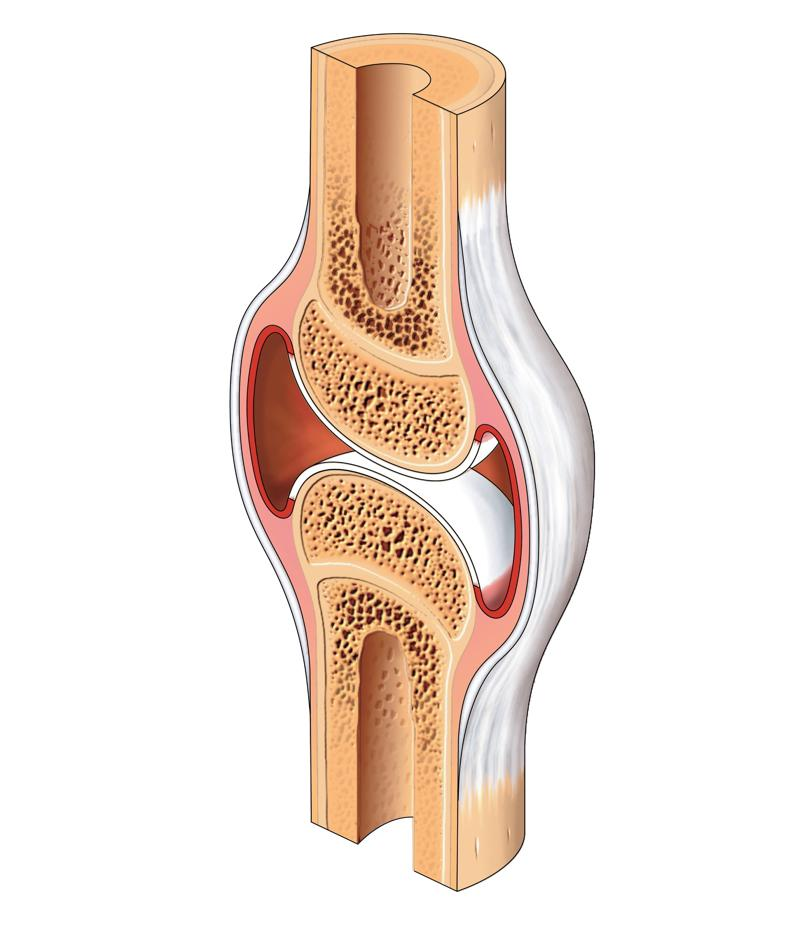

## 0502. 天然与人工：为什么复合材料是化学能力的体现？

2019-06-19

总结：1）复合材料出现，是因为单一材料有着天生的弱点，而复合材料能够根据不同材料的特性，扬长避短；2）人工复合材料能够做出来，是因为天然存在的复合材料，教会了人类复合的基本规律；3）如果原材料结构特别复杂，我们就得从微观层面出发，依靠合成的化学方法来生成复合材料了。

### 2.0

上一讲，我们开启了新模块 —— 化学材料，首先讲到了化学家设计材料的第一个原理，材料属性。这一讲，我们就要说说第二个设计原理，也就是材料的构成。

如果你还记得，我们在上一讲特别提到一个趋势，那就是生活中无处不在的钢铁、铝合金等等材料，现在正在被复合材料替代。复合材料，就是我们这一讲要说的主题。

要说最能直接体现化学材料使用趋势的，那就一定是飞机制造业了。2017 年 5 月，国产 C919 飞机完成首飞，受到特别多的关注。在过去，飞机的主要材料是铝合金，但现在就不一样了。不少航空和材料方面的专业人士，都把焦点放在了造飞机使用的「复合材料」上。

C919 大飞机里面，复合材料的使用占比达到了 12%。这个数字，让人喜忧参半。喜的是，C919 采用了非常成熟的设计理念，在未来的航行中，稳定性得到了保障。忧的是，C919 上，12% 的复合材料占比，跟欧美同行的先进机型比起来差得有点远了。比如说，空客 A350 新机型，复合材料用量达到了 52%；波音 787 机型的复合材料也有 50%。

在材料业内，复合材料本身就是一个公认的、重要的高科技指标，甚至还被看作是一个国家化学能力的体现。为什么复合材料这么受重视，它在多大程度上改变了世界的发展呢？我们接下来，就分三个层次谈谈这个问题。

### 2.1

首先，我们得搞清楚，复合材料为什么会产生，为什么会存在。光听字面意思，你就能明白。

复合材料，就是多种化学材料，通过复合的方法形成的材料。复合的方式有很多，既包括物理上的混合，也包括发生化学反应。和它相对应的是单一材料，也就是只有一种主体化学成分的材料。

单一材料有着天然的、致命的缺陷。2001 年，美国「9·11」恐怖袭击事件中，两架飞机分别撞向了纽约的世贸大厦双子塔，400 多米高的大楼，很快就出现了整体坍塌。

相比于大楼来说，飞机实在是太小了，所以双子塔倒塌，就好像是一只麻雀把一个壮汉给撞倒了。当时，很多人觉得这事挺不可思议的。

其实，这种现象跟双子塔的建筑材料有很大关系。这两座大楼的承重结构，主要是钢材做的，而钢材的导热性非常好好。飞机撞击大厦引发爆炸，两座楼很快就着火了，火焰的温度一下子超过了 1000℃。持续不断的升温中，钢材慢慢接近熔点，逐渐软化。当它没办法再支撑整座大厦的重量时，双子塔就倒塌了。

不光是钢材，很多其他的单一的材料也都有弱点。建筑业里，混凝土是最常用的结构材料，它强度大，倒不至于出现钢材那样的问题，但它不抗震。木板材料造的房屋倒是抗震，但防火防盗能力一般。

再比如，在未来的太空探索和海洋探索中，钛合金材料被寄予厚望。科学家们认为，它是建造宇宙飞船、潜艇等装备最有力的材料。因为它强度大，而且也耐腐蚀。

但是，钛合金也有个致命弱点，那就是怕氢气。钛合金遇到氢气就会变脆，材料价值大大降低。而在太空环境里，氢气又比较常见。这么一来，单纯用钛合金做的航天器，就不适合进入太空了。

这么看起来，复合材料的出现和存在，就有了必要性了。它的核心目标，就是根据不同材料的特性，扬长避短。

### 2.2

解决了复合材料存在必要性的问题，我们就要进入第二个层次，说说复合材料是怎么做出来的。

这个问题既复杂又简单。复杂的是，我们一直在强调，宏观不是微观的线性叠加，所以，复合材料虽然可以是两种材料简单拼接，但不是任意两个材料随便贴在一起组成的，就叫复合材料，而是必须要充分利用材料本身的内部结构，形成一个有机的整体才行。

这么说可能还不够形象，我们换个角度，来看看复合材料怎么做。在这方面，大自然是人类天然的导师。经过漫长的进化过程，生物体本身就形成了很多天然的复合材料。

脊椎生物都有骨头，它就是一种复合材料。骨头的结构主体，是一种叫羟磷灰石的矿物质，它和胶原蛋白生成了复合材料。如果你喜欢喝骨头汤，或者吃鸡腿，就会发现骨头的切口很像蜂窝。胶原蛋白就是填充在这些蜂窝结构里，它们很有弹性，就像是给羟磷灰石安装了一种减震模式。所以，如果骨头没有进化成复合材料，你现在打个喷嚏，说不定肋骨就骨折了。

这也是为什么，石器时代的时候，什么东西都是用石头造的，但是射箭用的箭头，很多用的是骨头。这是因为，骨头箭头不像石头箭头那么容易折断。

当骨头演变成化石的时候，里面的胶原蛋白会分解掉，外界环境里的沙土填进蜂窝结构后，骨头化石就不具备骨头原有的功能了。这也是你去博物馆时，看到的很多骨头化石真的很像石头的原因。

蜂窝结构的复合材料，一般出现在特别需要强度的场合，比如航天航空领域用的复合材料，很多就是这个结构。

骨头蜂窝状的截面

利用蜂窝结构生成复合材料，只是手段之一。在自然环境下，结构上看，生物体形成的复合材料，类型非常复杂。贝壳类生物属于低等生物，没有骨头，但它坚硬的外壳可以保护自己。这种壳是一种复合材料，原料属于矿物质和蛋白质，采取的是层状复合。这种结构，现在经常拿来做防弹衣。

植物也一样。我们打家具用的木头，算不上是一种复合材料。但是，它原本的形态树干，却是一种复合材料。树木活着的时候，树干能从地下把水和养分输送到几十米高的树叶上。这是因为，树干里面既有提供强度的木质素，又有提供输送作用的维管。这种复合方式是纤维式的，和前面说到的蜂窝状、层状又不一样了。现实生活里，很多碳纤维复合材料，都是这样的结构。

从这个角度来看，生成复合材料，说到底就是一个仿生工程。

### 2.3

不过，是不是所有原料都能通过人工复合成新材料呢？这就是我们要说到的第三个问题了。

刚才我们说到，天然存在的复合材料，教会了我们复合的基本规律。那就是，1）原材料的功能要存在明显的差异；2）它们又要能够匹配，才能生成复合材料，并用在更特殊的场景。

怎么理解呢？现在的羽绒衣里面填充的，一般都是鸭绒和鹅绒的混合物。混合起来的鸭绒鹅绒虽然可以提高衣服的性能，也就是保暖，但是用途没变，还是做服装。你看，原材料差异太小，就不能生产出有其他用途的复合材料。

如果原材料存在差异，但是没有办法组合，也做不出复合材料。比如，钢铁侠特别怕冷，他想把鸭绒和钢铁复合做成羽绒战袍，八成会失败。

说到底，制造复合材料的关键技术，在于找到有差异，但能够相容的原材料，对它们的结构进行设计。

有些原材料的结构很简单，我们把两种材料直接混在一起，就做成复合材料了。比如常见的易拉罐就不是单纯的铝罐，它的内壁还涂了一层膜，这种膜材料能让铝罐不被碳酸饮料腐蚀。所以说，易拉罐也是一种复合材料。再比如，明城墙砖块之间的灰泥里混合了黏土和糯米，因此，它也是一种人工复合材料。除了黏土混糯米的配方，黏土加牡蛎汁的做法也很常见。

但有些原材料结构特别复杂，我们就得从微观层面出发，依靠合成的化学方法来生成复合材料了。

我们在开头提到，双子塔使用的钢材作为单一材料来说有缺陷，所以现在建造摩天大楼的时候，很多情况下使用的已经是复合材料了。其中一种常见的复合材料，叫作玻璃钢。乍听之下，你可能觉得这是玻璃和钢材组合的材料。但实际上，这跟钢材没什么关系，它是玻璃和塑料生成的复合材料。

玻璃和塑料都没有钢材来得结实，为什么生成的复合材料，强度居然跟钢材差不多呢？这是因为，玻璃的微观特点是，内部原子连成一体，只要有一个裂缝，原子结构就全部完蛋，反映到宏观上，就是玻璃会碎。塑料内部的分子很容易滑动，因此反映到宏观上来看，它也容易破。

这两个特征看起来强度都不高，但原理相反，结合以后，刚好各自发挥自己的长处，形成强度特别高的复合材料。你看，这就是从微观层面研究原子之间的作用力，再借助相应的模型设计出了新结构，生成了新物质。

我们在上一讲说到，化学材料是人类用来改造世界的重要工具。在这个基础上，我要再多说一句，人工复合材料的价值不止于此。它不只是利用化学方法，将原子重新排列一下那么简单。它之所以会存在，本身就是人类改造世界的结果。因为无论从设计、制造、加工还是应用，它们都是全新的。

如果还有人相信生物进化是全能的造物主的功劳，那么毫无疑问，人工复合材料可以证明，人类在某些方面已经超越了这个造物主。

思考题：你所在的行业里，用到的最多的复合材料是什么呢？

下节预告：下一讲，我们还要说到最后一个材料设计原理，谈谈材料的尺寸问题。