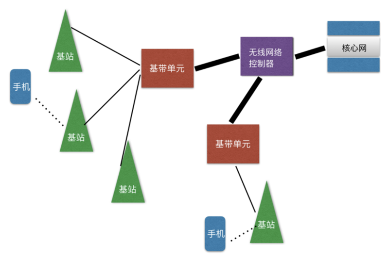

# 0208. 极简通信史：从 1G 到 5G 通信，到底经历了什么？

吴军·信息论 40 讲

2019-06-21

5G 在今天是一个非常热门的话题，但想深入了解 5G，你就得知道从 1G 到 5G 到底发生了什么，从而看出一些技术的趋势，并且知道我们对 5G 可以有什么样的期盼，这样就不会与 5G 的机遇擦肩而过。

我们还是先从 1G 说起。世界上最早的民用移动通信电话是由摩托罗拉公司发明的。当然设备要能通信还需要让它们都遵守一套大家都认可的信息编码规范，这就是通信标准，这就如同发电报有标准的电报码一样。没有标准，彼此就没法沟通，是鸡同鸭讲。

通信的标准中有两部分最重要，一个是对信息的发送和接收的描述，比如打电话时大家的电话号码；二是对信息编码的方式，比如文字就是对信息的一种编码。好的信息编码能保证信息的传输率尽可能高，接近信道的容量。在移动通信的发展过程中，每隔十多年，就会出现新一代的通信标准。当然，谁掌握了标准，谁就掌握了行业的制高点。

在早期的移动通信中，标准是以摩托罗拉为主制定的，我们后来称之为 1G。进入到上个世纪 80 年代，诺基亚等公司就开始研制新一代的移动通信设备，并且提出新的移动通信标准，它们在 1991 年开始投入使用，为了区分，我们称之为 2G。

那么 1G 和 2G 有什么区别呢？从技术上讲，1G 是模拟电路的，2G 是数字电路的。从外观上看，2G 的手机比 1G 小很多，更省电，而且收发短信方便。为什么 2G 的手机小？因为数字电路可以把更多的数字芯片集成起来，用一个专用芯片就取代了过去上百个芯片。而在摩尔定律的影响下，这种技术进步的叠加效应更明显，就越做越小。于是 2G 取代 1G 就成为了历史的必然，诺基亚是那个时代的领航者。如果我们沿用《科技史纲 60 讲》中衡量技术进步的标尺来衡量，从 1G 到 2G，单位能量处理信息的能力提高了百倍。

接下来从 2G 到 3G 又发生了什么呢？我们大家可能都知道，2G 的手机只能打电话发短信，上网很困难。3G 的通信标准将信息的传输率提高了一个数量级，这是一个飞跃，它使得移动互联网得以实现，从此手机打电话的功能降到了次要的位置，而数据通信，也就是上网，成为了主要功能。

但是，从 1G 到 3G 都存在一个大问题，那就是上网用的移动通信的网络和原有打电话用的通信网络虽然能够彼此融合，但是却彼此独立。今天的人回过头来看这件事会觉得有点荒唐，但是如果我们了解了当时移动通信和以 AT&T 为代表的传统电信公司是多么地水火不容，就不难理解这一点了。这就使得独立的移动网络就无法受益于网络技术的快速进步。2G 和 3G 时代用手机打一个电话实际上经过的物理路径很长。其中的原理细节，请看下图 2G、3G 时代移动通信网络的原理示意图。

一方面基站和基站之间的通信效率并不高，使得上网速度快不起来；另一方面，由于在 2G 时代为了适合当时移动通信的特点，手机端到端的通信要经过好几级的转发。手机信号送到基站后，要经过基带单元（BBU）、无线网络控制器（RNC），才能到核心网，然后再从核心网到 RNC、BBU，最后送到基站，基站再与接收者通信。因此，由于 3G 的系统是半吊子的，虽然标称的网速很高，但是实际网速并不快。于是 4G 很快出现了。

4G 有什么革命性的进步呢？有人说是网速快。但这是结果，不是原因。4G 一方面使用了扁平的网络结构，减少了端到端通信时信息转发的次数，同时增加了基站之间光纤的带宽。更重要的是，它同时利用了互联网和电信网络的技术进步，这两种技术的融合才使得 4G 的速度比 3G 快很多。你可以认为，到了 4G，电信的网络已经统一了，但是它和互联网还没有完全统一，你先记住这个事实。

虽然在 4G 时代从理论上讲移动通信的网速可以变得很快，你今天能够想到的所有应用都是够快的。但是，如果很多人同时上网，它不仅不够快，甚至连不进去。2018 年我在杭州开全国计算机大会，参会者近万，在会场上无论是 4G 还是 Wi-Fi 都不大管用，你如果拍一张照片想在朋友圈中分享，那么能否分享成功，全靠运气。这一方面是因为总的网速不够快，另一方面是很多人要同时和基站通信，基站成为了瓶颈。

比如一个基站覆盖半径一公里的范围（基站之间的距离通常在 2-3 公里），通常这方圆一公里范围内的人不会同时上网，因此分给每个上网的人的带宽是够用的，但是当大家都要发照片时，总的传输率超过了信道的总的带宽，根据香农第二定律，出错率是 100%，于是大家都传递不了信息了。公平地讲，4G 对于我们目前的上网需求绝大部分时候是足够了，但是在未来我们有很多智能设备，它们也要同时上网，就会出现像前面说的那种「会场拥堵」的问题。

那么怎么解决这个问题呢？有人会想到继续增加带宽。这是一种自然而然，颇为合理的想法。虽然在 4G 的基础上增加 2-3 倍的带宽并非难事，但如果想增加 1-2 个数量级就办不到了。那一方面要求基站的功率增加很多，这在城市里完全不可行，因为基站周围会因为电磁波辐射太强而变得很不安全。另一方面，要想增加带宽，就要增加通信的频率范围，无线通信的频率无法向下扩展，只能向上扩展，也就是让无线电波的频率增加。

我们知道无线电波的频率越高，它绕过障碍物的能力就越差，比如说它高到可见光的频率时，你随便用张纸，用块布就能挡住它。因此在城市里高楼会严重影响通信。那么怎么办呢？最简单的办法就是在提高通信频率的同时，把基站建得非常密，这样在你的附近就有基站，它不会被建筑物所阻拦。

基于上述想法，5G 的概念就被提出来了。5G 是如何进行无线通信的呢？如果我们说 4G 是一公里的范围建一个基站，负责这方圆一公里范围内的手机和基站的通信，那么 5G 则是在百米的范围内建基站（今天的方案是基站距离平均在 200-300 米左右），负责半径为一百多米范围内的通信。

手机和基站的距离缩短，会带来三个好处。首先是建筑物干扰的问题得到解决，这是显而易见的。其次是更少的人分享带宽。我们假定方圆一公里范围里的人口是 1 万人，那么方圆百米范围内就会下降到 100 人。这样每个人能够分到的带宽就可以增加两个数量级。最后，由于基站的通信范围可以从 1 公里减少到 100 米，功率可以降低两个数量级，这样，在基站周围电磁波辐射也会大大降低，我们生活的环境反而变得安全了。

当 5G 的基站密集到两三百米甚至不到一百米一个的时候，我们家里是否还需要安装 Wi-Fi 呢？或许不需要了，Wi-Fi 或许会消失，或者会退居次要的地位。这样，就将互联网和通信网络融合成一个网络了，这无疑将是一次通信的革命。

接下来我们总结一下从 1G 到 5G 的革命性变化。

1G 的诞生。

从 1G 到 2G，是从模拟电路到数字电路，由于采用了专用集成电路，单位能量传输和处理信息的能力提高了两个数量级。

从 2G 到 3G，实现了从语音通信到数据通信的飞跃。

从 3G 到 4G，实现了移动通信网络和传统电信网络的融合，将云计算等互联网技术用于了移动通信，使得不同区域之间的流量能够动态平衡，大大地提高了带宽的使用率。

从 4G 到 5G，可以实现移动互联网和有线的互联网的彻底融合。当然，万物互联才会成为可能。需要指出的是，由于网络基站的密度非常高，每一个基站的功率非常小，因此单位能耗传递信息的效率会进一步大幅度提高。

最后我们看看未来会是什么样子。我们做什么事情是顺应技术发展的趋势，做什么则是逆流而动？

首先，如果基站的距离缩短到 200-300 米，单位面积的基站密度比 4G 就要增加 100 倍，这是一个巨大的国家级的基础架构建设，因此从事基础架构建设的企业都是受益者。你或许已经听到这样的消息，5G 的传闻一出，制造电线杆子企业的股票已经开始疯涨了。其次，任何致力于将各种网络融合的努力都是顺势而为，任何试图搭建一个独立的，单纯基于无线技术的努力都是逆流而动。几个月前，一些国家决策部门的领导问我，以现在的技术再开发类似于铱星的通信系统，是否可行？我说完全没有必要，因为那是逆流而动。从 1G 到 5G，将各种网络融合是一个大趋势。再次，由于网速极大地提高，很多需要高速互联网的应用可以开展起来了，包括 IoT，这个题目我们明天会仔细讲。最后，让我们一同来思考一个问题。有了 5G，光纤通信是否还需要？答案是，不仅需要，而且还要大幅度提高。

我们不妨从相反的角度思考这个问题，就很容易得到答案。假如没有光纤，只有移动网络，那么基站和基站之间的通讯就不得不用移动网络实现，这就要占据很大的带宽，就会影响我们每一个人和基站的通信。因此光纤依然是必要的，不仅必要，而且要增加，因为我们和基站通信的速率增加了，又有很多 IoT 的设备连进来，总的通信量就增加了。从这里我们还可以得出一个结论，从事光纤通讯产业的人，将是 5G 的获益者。

## 要点总结

我们先介绍了半个多世纪以来移动通信的发展历程。对于这段技术发展的历史，你只要记住四个要点即可：1）单位能量的信息传输率越来越高；2）网络不断融合；3）设备的辐射越来越小；4）每一代都会有新的主导型公司出现，1G 是摩托罗拉，2G 是诺基亚，3G、4G 是苹果、谷歌和高通，5G 是华为。关于摩托罗拉、诺基亚、高通、华为等企业的发展历程，大家可以读我的《浪潮之巅》一书。

思考题：如果说从 1G 到 5G 所有的网络都整合为一体了，那么 6G 将会往哪个方向进步？预告：下一讲，我们结合另一个热门的话题 IoT，再谈谈 5G。

## 黑板墙

### 01

我是一名无线通信算法工程师，听了吴老师的信息论，给我最大的感触是，老师把我们工作中所用的理论知识用到了生活中，把工程思维用到了接地气的日常之中。比如，我近一年读了很多书，阅读之中难免存在很多的困惑和理解偏差。同一件事情或者知识的表述会有不同，传达到我自己的知识体系中有时候还会存在矛盾，但是多看几本类似的书，有些东西就越来越明晰了。

用吴老师的观点来说就是增加信息的冗余（多读书）来降低干扰和噪声，以达到提高信噪比的目的。这让我想起来陶渊明的《五柳先生传》中的一种学习方法：好读书，不求甚解，每有会意，便欣然忘食。多读书会提高解调自然规律和人生哲学的信噪比，当信噪比达到一定國值，便豁然开朗。世事洞明皆学问，人情练达即文章。

### 02

我不懂通信领域中 3G、5G 的具体工作原理，今天主要谈谈自己的感受。2G 代表对我来说意识着短信时代，那个时代 100 字要分成两条信息发的；3G 以图片与小视频为主，互相聊 QQ 和发语音成为了可能；4G 则让看直播、大视频变成现实。通信技术的发展，使得手机集成了越来越多的功能，几乎所有人，生下来就上了「网」。

这 20 年来，手机改变了什么？比如家庭电话，现在已经几乎没有了；比如民用的百元相机画，除了专业人士与摄影爱好者，平时也很少用到；比如 MP3 音乐播放器，比如掌上游戏机（Game Boy），比如北京的交通卡、钱包；我想移动互联网时代让门户网站、博客成为了过去；让许多人都失去了读长文章的能力。

对未来，我的思考是互联网还是会一如既往地提供一些服务，围绕着那些事情：社交、游戏、学习、购买、出行、饮食这是人类的本能。但在追求通讯速度的路上，我想快到头了。想要打破常规，就需要互联网科技公司推出更强大的智能引擎。速度、人工智能是我对未来的展望。

吴军老师近期接受 36Kr 有篇采访文章，我建议大家搜索去看。

[少数派的未来猜想 | 技术带来的弊端，一定会有更好的技术来解决_详细解读_最新资讯_热点事件_36 氪](https://www.36kr.com/p/1723826520065)

2『去研读这篇文章，并作为本专栏的附件。（2021-02-01）』——未完成

### 03

我是做海底光缆通讯的。大容量长距离的信号传输，都在使用香农定律：目前单纤传输容量已经接近香农极限，海缆行业的下一个发展趋势是采用多纤对，目前多为 4-8 纤对系统，未来会 16-32 纤对，再往后可能会使用多芯光纤。这就是用更多信道来扩容整条海缆的通信容量。

我们在定位海缆系统故障时，会无意中使用正交信息，一个维度的信息确定不了故障原因，会寻找其它维度的信息。比如海缆故障，要知道准确位置是不容易的，因为在海底，无法直接检。我们会使用欧姆定律计算断的电阻从而知道缆长和故障位置。如果因磁暴导致电流电压检测不准，会使用 COTDR 光探测，确定具体断缆位置。

### 04

作为一个通信人，我对 5G 是持积极态度的。5G 除了需要新建基站外，根据 3GPP 的标准，可以利用原因 4GLTE 基站升级，来达到 5G 应用，比如 NB-OT，这个吴军老师在下节课应该会讲到。5G 在应用中最大的影响就是所有设备泛在网，而由于采用密集基站布局，为了泛在网的平滑切换，采用边缘计算的算法，搭配原有 4G 中密度更高的 MMO 天线阵列，实现大容量高速传输。

吴军老师也提到，5G 时代，光纤行业是发力点，这点我赞同，不光是嘴上说的，而是用真金白银来真正赞同。因为我之前就已经买入光纤生产企业都股票，那些拥有光纤预制棒核心技术的上市公司，将会迎来大爆发。关于 6G，除了速度再提高一个数量级，我觉得靠谱的方向是 5G + 太空覆盖。利用到卫星通信，实现空间高速全覆盖。

另外，业内一直有一个「无线光纤」的技术构想，不知道 6G 能不能有突破。除了这些，我觉得从 6G 开始，整个网络应该把更多的计算能力从云端下沉到终端，这样，单纯传输结果计算处理后的信息，可以大幅提升传输效率。如果是这样，因为高速网路的到来，终端可以把很多计算放到云端来做，从而促进数据中心的大规模建设。但成也告诉，败也高速，随着传输速度再提高的需求加大，云端的很多计算就不可避免再被重新放回终端，56 的边缘计算就这这么干的。

所以，未来很可能数据中心的爆发将会结束，终端智能化被不断加强。6G 之后很可能进入「无 G 时代」，那时，网络不再有时代和版本的严格区分，而是类似微软的 office360 那样，动态不断更新。

### 05

6g 脑洞：人体每个器官都加传感器，开展跟踪医疗大数据；生物学家恨不得把每个动植物身上都装上传感器实时跟踪计算，BBC 的动物纪录片也可以颠覆式创新。说不定大数据直接从动植物身上发现某某成分可以搞定人类疾病，相当于用新技术把古人试草药或者现代人化学组合药的方法再做一遍。

谷歌在网上搜索文档比在 windows 在本机上搜索还快，类比一下，6G 传输速度每秒 100G 快赶上主板里的 PCIE 5.0 速度了，从光纤到网卡到 CPU 内存，PCE 应该还绕不过去。不过我看 PC 厂商都没啥动力推进 PCIE 4.0。

### 06

如果说从 1G 到 5G 所有的网络都整合为一体了，那么 6G 将会往哪个方向进步？我觉得如果 5G 的搭建完成了，那只意味着我们完成了这个网络，而还不是最优。要知道 5G 即使搭建完成之后，由于带宽的限制，我们的上网速度并不会有理想中那么快，那么如何提升我们的上网速度还是一个重要的话题。6G 的传输能力可能比 5G 提升 100 倍，网络延迟也可能从亳秒降到微秒级。当这出现之后，它会给我们带来更多更新奇的体验。比如说你用 4G 打王者耀，运行速度很快，没有任何影响。而到了 5 G，你可以用虚拟现实、物联网。到了 6G 你或许可以直接制作精准场景的增强现实游戏。当然对于 6G，我有仍然抱有一些疑虑。他可能并不是像 5G 一样的，一种革命性的创新。更多的应该是属于把路修宽一点、修大ー点，是在 5G 的基础上进行完善。当然，这种情况可能会因为基础理论的「颠覆突破」而改变。

### 07

从 4G 到 5G，移动互联网与光纤传输到优先互联网实现了融合。万物互联 loT 就是这种融合的外在表现，相互连接的设备中，既有作为人机交互界面的手机、电脑，又有各种联网设备作为原有网络的扩展。到此，现有数据网络的融合就已经基本完成了。那么如果接下来发展到 6G，它将会是什么样子呢？我猜测它会有三个趋势：其一是计算互联，其二是信号融合，再有就是脑机联动。

早在互联网刚刚普及之时，一些科研机构就会将研究的计算部分拆分、封装并放到网上，供一般用户下载、计算，借此实现了性能媲美超级计算机，成本却低得多的大规模计算，这也是分布式计算的维形。比特币「挖矿」也是分布式计算，只不过对设备的算力要求很高，需要专门的「挖矿机」。

未来信息网络达到了 6G，这一分布式计算过程将更加大众化，也更加快捷。科研需要的大型计算，或者交通疏导、金融交易之类的日常性计算，都可以在整个社会内充分展开，全社会的总体算力将会达到一个前所未有的水平。到那时像是淘宝之于商户那样，为社会提供算力平台的公司，将会成为时代的家，「侵犯他人算力资源」可能将会成为新的社会问题。

另一个趋势也许是「信号融合」。今天我们判断一条路是否堵车，需要借助 GPS 信号分析、路面传感器、交通系统拍照等数据，再用算法进行分析，得到的结果颗粒度大，想要真正做到实时性也比较困难。未来 6G 的「信号互联」，也许能更便利地获得更多的数据，除了传统的几种数据外，普通用户的设备，甚至是人的感官信号（需要脑机接口等技术支持）都能成为数据源，再结合计算互联实现真正细致、实时的路况推送。有了「信号融合」的需求，脑机接口技术将有更大的用武之地，因为这会让信号融合真正达到个人的层级，将传统意义上不便于编码的信息，也融入到通讯网络中。那时基于脑机接口和信息网络的增强现实技术，可能也将得到普及。

### 08

今天下午开会，用的是思科的仿真视讯会议设备，4K 摄像头和 70X3 液晶屏，7 方同时通讯，传输速度很快（有线），语音和视频都很清晰，虽然是网上会议，感受上，跟面对面开会一个效果。我想，马上到来的 5G，未来的 6G，可以让我们随时随地用手持设备就可以达到这样的效果，加上投影技术，裸眼 3D，科幻片和星球大战里面的主线虚拟会议场景 10-30 年内完全可以实现并广泛应用。

无线通信未来的发展方向，除了速度和延时低等，还有可能进行能量传输，无线充电，以后移动运营商会不光收取网络通信费用，还要收取一部分能量费用，这跟 2G 语音通信过渡到 3,4G 数据通信一样的。华为公司也有可能转型成能源设备提供商。

通信技术未来仍然是增长最快的行业之一，物联网，万物互联都需要，更重要的，还有太空中如何通信，火星上如何通信，宇宙里我们如何通信，这是未来需要思考的问题。

### 09

之前任正非接受采访的时候曾经提到过，「随着逐步逼近香农定理、摩尔定律的极限，面对大流量、低延时的理论还未创造出来，华为已感到前途茫茫，找不到方向。」这几十年来通讯领域发展迅猛，但是实际上还是在吃老本，面临各种物理极限的挑战，比如 5G 号称延迟 1 亳秒只是终端到基站的延迟，成都到北京的通讯延时至少几十亳秒，因为光速只有 30 万 km 每小时，来回跑几干公里需要这么长的时间，这是目前无法突破的。无线传输的带宽是有限的，5G 已经增加了基站覆盖数量到 200 米一个来提升带宽。所以在 6G 可能无法在取得很大的技术进展了，更多的是偏向于应用场景的优化，例如更低的功耗满足 loT 设备需求，雾计算，边缘存储等新型领域可能会蓬勃发展，针对新需求进行优化。华为等公司面向 6G 的研发，也不仅仅是纯面向技术的研发，还是面向未来商业场景的研发。

### 10

我是做新能源汽车电机结构设计的。

1、跟燃油车相比，电动汽车的噪音相对小了不少，但是由于电机的噪音太尖太刺耳，其噪音问题相对燃油车反而更突出了，所以解決汽车电机噪音问题也是目前电机厂家热门研究的一个方向。汽车噪音，从人耳就可以凭经验判断噪音是从哪个部件发出的，再用专业的设备量噪音（利用正交信息），通过频谱分析，就能完全确定噪音源就是电机，从而获得了信息量，降低了信息熵。在不断和电机噪音的斗争中，我相信在将来的几个月内会把电机噪音明显降下来。

2、作为传统的研发制造企业，既要重视数据收集，又要重视数据研究，利用现有的数据发现有价值的规律。比如电机为了达到更好的冷却效果，有时会把定子绕组用环氧树脂等材料塑封起来，以提高其导热性能和防护性能，在经过充分验证其工艺性和可靠性能后，有了这些数据的积累，又可以利用其特性做派生应用，比如机壳冷却水道密封，还申请了专利。所以一个企业踏踏实实做事情很重要，更重要的是要善于记录信息，并用已知信息进行总结归纳。实际情况是现场很多技术人员都略了记录数据信息，做过的事情短时间内能记住，时间久了就忘记了，又要重新花时间精力去做，这是得不偿失的。此外，质检部门拥有海量的检验数据，都作为陈旧档案束之高阁，太可惜了。

3、很多互联网车企没有自己的工厂，无法长期从直接的信息源获取信息，找工代工，又会出现信息不对称性，这是不能颠覆传統车企的一个重要原因。互联网车企应该和传统车企互相合作，取长补短，才是正确的发展道路。同样，有些整车厂不断从零部件供应商那里索取技术，自称「掌握核心技术」，但是要自己建厂做零部件，却也难在短时间内发展起来，因为没有长期的数据积累，在生产制造过程中遇到的很多客观问题，他们难以预知。事实上我们的客户就自己成立电机公司，以后发展得怎样我不知道，反正到现在三年多了，项目一拖再拖，产品八字还没一撇。这个问题吴军老师在谷歌方法论第 186 封信就已经讲过了：「那种凡事都由自己来做，想把所有核心技术掌握在自己手里的想法，在信息时代之后就完全要不得了」。

4、最近中美贸易战也把华为推向了风口浪尖。我在这里浅谈华为造车，华为明确表态不造车，但是招聘网站上华为直在找新能源汽车方面的专家。从信息论角度看，做车汽车中的电子部分相信华为会做得很好，但是要做动力系统（电机、減速器、控制器）集成这样的「重工业」，华为的供应体系、生产流程、管理流程、成本控制等方面都没有数据（信息）积累。在边界外做事，最好还是收购电机厂、齿轮厂、控制器厂家才比较靠谱。话是这么说，如果华为肯录用我，我肯定也会去，因为我敬重华为这样的公司。