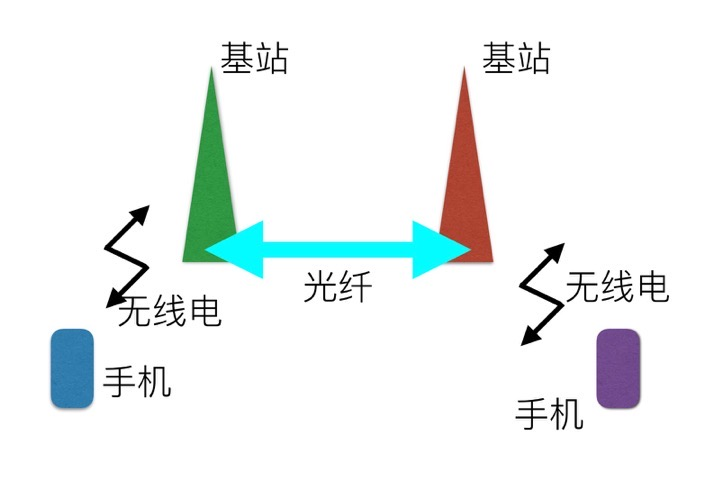

# 0801. 推演与预测：5G 之后的通信又是什么样？

前沿科技之吴军讲5G

2019-07-24

在之前《信息论 40 讲》的课程中，我让大家想想 5G 之后下一代移动通信会是什么样的，一些读者朋友说，会不会是马斯克搞的那个第二代铱星系统啊，也就是由 11000 颗小卫星组成的全球星。除了马斯克，中国也有个别人在鼓吹甚至在融资要做类似的东西。那么新的通信到底会是什么样？我们来一起剖析一下马斯克的星链计划和 Google 通信气球到底是不是靠谱。

今天我想告诉大家的是，一个由上万颗卫星组成的通信系统不能说没有用，但是至多只是辅助作用，而且作用非常小。当然，我知道很多马斯克迷未必同意我的这种说法。今天很多人已经成了马斯克的脑残粉，以至于别人对这个偶像说不得。不过，我更喜欢俄罗斯的一句格言，「一种表述不因为提出者的身份就成为真理」。很多事情靠谱不靠谱，不在于谁讲，而在于它是否合乎基本的科学法则。当然，什么事情不可能因为马斯克说了，就由原来的不靠谱变成靠谱的了。

对于一种未来的无线通信技术方案，我们如何分析它是否合理呢？解决这个问题的钥匙还是能量和信息的效率。我们知道，无线通信的信号要想接收得到，需要保证信号的能量和噪音能量之比，也就是所谓的信噪比足够高。而信号能量是和传输距离的平方成反比的，而噪音却是恒定的。你可能有过这样的体会，当你的手机远离家里的 Wi-Fi 路由器时，就会经常断网，或者网速特别慢，那是因为距离远了以后信噪比太低，噪音太大的原因。

那么马斯克的卫星和我们的 4G 基站相比，距离差多远呢？我们知道根据 4G 的标准，基站之间的距离是 2-3 公里，也就是说手机和基站之间最远的距离大约是 1-1.5 公里，在大城市里可能还会密集一些。目前马斯克等人发射的近地距离卫星的飞行高度大约是 200 公里以上，也就是说，大约是手机和基站距离的 100 倍左右，这样远的距离，即使不考虑云层对信号的阻碍，到地面上的信号，强度也只有同样发射功率的万分之一左右。因此，卫星和手机之间的传输率高不了。

事实上，20 多年前，铱星一路电话通信的速率只有 2.2-3.8Kbps，这是什么概念呢？我们今天用手机看高清视频，下载的速率在 5Mbps 左右（按理说需要达到 22Mbps 的传输率，才能无损地观看 1080P 的电视，但是在移动设备上收看，其实都是高度压缩后的节目，清晰度会有所损失）。也就是说，需要是铱星和手机之间传输率的 1500-2000 倍左右。

当然，可能有人会说，20 年过去了，技术进步了。但是无线通信的传输率是受到香农第二定律限制的，同样带宽的传输率不会因为改进编码技术就有本质提高。要想增加设备和卫星之间通信的传输率怎么办？首先要增加发射的功率，这样才能保证 200 公里后，信噪比足够高。当你要增加下载速度时，就要增加卫星的发射功率，而这件事是做不到的，因为卫星不可能像基站那样有线供电，所以它的发射功率很有限。当你要增加上传的速度，就要提高你的手机的发射功率，今天一般的手机都达不到要求。如果你见过铱星手机，你会发现它和大哥大一样蠢笨，那时只是传输一路语音数据，数据量极小。

如果你想上传视频怎么办？你只要看看今天在演唱会现场外的转播车的体积就可以知道了，它们巨大无比，那也只是一路电视信号。即便你想传递的视频清晰度没有电视转播高，恐怕也要骑一个三轮车上街，至少也要推一个婴儿车上街。在整个移动通信的过程中，我们的手机和基站或者卫星实现了通信，才只是其中的第一步。基站之间或者卫星之间还需要建立通信联系，才能让我们连接远方的朋友。我把移动通信点到点的通信过程简化成下面这张图：

从图中，可以看到，你给你朋友打电话或者微信聊天时，手机到基站之间是无线通信，但是基站到基站之间是光纤通信。基站之间光纤通信的带宽要比它和我们手机通信高得多，因为成百上千路的通信，都汇集到基站，然后从一个基站传送到另一个基站，或者是上一级通信的枢纽。

但是，如果用卫星取代基站，这就极其麻烦了，因为各路手机的通信流量汇聚到卫星那里，卫星还需要想办法传到地面的基站上，或者在卫星之间传输，不论是哪一种，都要再额外耗费一倍无线电带宽，这比基于基站的做法，至少浪费了一倍的带宽。要知道空间的带宽是很贵的。

2008 年，Google 参与了美国大约 60MHz 带宽的竞标拍卖，最后没有中标，中标的是 AT&T，花了 200 亿美元。任何电信公司都不会浪费空中的带宽。如果我们不采用上述的通信方式，使用卫星取代连有光纤的基站，通信的效率就要大打折扣。就算每个小小的卫星总的功率能达到连有电源和光纤的基站的水平。这样的卫星在和我们的手机通信时，传输率的总和只有基站的百分之一到万分之一左右。要知道全中国有将近 500 万个基站，马斯克那一点点卫星（一万个），只能提供 4G 时代中国移动通信量的几百万分之一左右。当然，如果非要说他的计划有用的话，在塔克拉玛干沙漠中央可能有用。

今天我给大家算这道题目，也是告诉大家一个甄别信息的方法。1 万在不少人看来是个很大的数字，大家听到后就觉得技术高深得不得了。但是，这相比中国的基站数，实在是少得可怜。之前，我们在《科技史纲60讲》中反复强调了，未来科技发展的总趋势是，用更少的能量传输、处理和存储更多的信息。5G 取代 4G，符合这个规律，用卫星取代 4G，违背这个规律，所以它不可能代替 5G。

更关键的是，我们在前面几堂课中讲了，未来无论是互联网还是移动通信的发展，都是朝着融合方向前进的，而不是另搞出一套独立的通信系统。我们讲到 5G 发展步骤时说，要经历一个依托于现有的 4G 基站过渡性发展的时代，这是最大化地利用现有资源，这才符合商业规律。

我们否定了马斯克的这个计划，就不得不说说 Google 在 2013 年前后搞的平流层气球通信，看看它是否符合规律呢？它的原理是这样的：

首先，将一大批热气球送入大气平流层，也就是离地面约 20 公里的地方，这是飞机飞行高度的两倍。平流层的风通常比较稳定，在每小时 5 到 20 英里之间。坐过热气球的人会有这样的体会，大气层中不同的高度风速和风向不同，因此通过上升下降到特定高度，可以决定气球的位置，这样很多气球就构成一个巨大的通信网络。

Google 通信气球的材质是非常轻的聚乙烯泡沫，完全充气后高 12 米，宽 15 米，非常大，因此上面的太阳能面板可以完全提供通信用电。这样气球就成了飘在天上的基站。相比卫星到地面的距离，气球离地面的距离只有 1/10，因此和手机通信信噪比要高很多。

Google 在南纬 40 度的太平洋上空用了 300 个气球试验了通信，从南美洲连到了澳大利亚。气球之间的距离大约是 20 公里，网速可以达到 3G 网络的水平。Google 做这件事的初衷是，全世界当时还有 2/3 的地方没有被无线网络覆盖，Google 希望通过这种方式让世界各地都能上网。这个脑洞大开的尝试，当年被《MIT科技评论》评为了年度 10 大科技成就。

但是，Google 随后就打了《MIT 科技评论》的脸，因为它很快放弃了这个计划。根据我从 Google 内部对这件事情深入的了解，Google 放弃的原因有这样四个：

1、天上的气球非常难控制，一开始能够控制得很好，从南美洲一直排到澳洲，但是不多久位置就乱了，而调整过来非常难，唯一的解决方案是发射四倍的气球，这样才能保证基站的密度足够高。

2、气球坏得很快，不是气球有了问题，就是上面的太阳能板有了问题，或者是通信系统出了问题。气球一旦坏了，就要开启上面的降落伞将它落到地面，但是它掉到哪里，完全没有控制，在方圆几十公里的范围内，什么地形都有可能出现，虽然有 GPS 定位，但是真掉到沟里、森林里，回收很难。

3、由于气球基站的发射功率不够大（100瓦左右），就要求地面上接收天线特别大，在接收信号时，要在气球下方的用户的房屋上安装一个特殊的网络天线，收到信号后，再通过类似 Wi-Fi 的设备和移动设备相连。即使这样，最高只能保证 3G 的速度。今天浏览网页还可以，但是看不了视频。因此，没有什么用。

4、全世界基站建设的速度远比想象的快，而且成本比搞这种气球低。所以这是一件吃力不讨好的事。

可以讲，相比建基站，Google 气球的方案不符合更少能量传递更多信息的要求，因此 Google 放弃它，是非常理性的决定。顺带说一句，亚马逊和 Facebook 也曾经有类似 Google 的想法，但是都放弃了。这些公司在做这种前瞻性项目时，很注意保密，没有到媒体上大肆宣传，这是大公司通常的做法。如果一家公司对于完全不成熟的技术大肆宣传，你可能要想想背后是否有别的原因了。

要点总结：

1、最后我希望你牢牢记住，用更少的能量传递更多的信息，永远是来判断一种移动通信方案乃至新技术是否靠谱的标准。以及，在目前我们所知道的各种有效的移动通信方案中，老老实实建基站是最靠谱的行为。

2、我知道你可能对我没有给出 6G 的畅想感到失望，但是在 5G 还没有真正来临之前，在它还需要建设 10 年这样一个前提下，我们先考虑好 5G 时代的生活更有意义。

## 结束语

到此我们的课程就结束了，祝贺你听完了这一门专业性较强的短课。在课程中我们通过能量和信息的关系，阐述了 5G 的必要性和当前实现的可能性。我们又通过网络融合这个趋势，说明了在未来 IoT 和 5G 会同步发展，形成一个大市场。最后我们通过对产业的分析，说明了未来这个产业收入的来源。