# 0102. 到底怎样用好 Excel?

Excel 是职场人的必备技能，几乎每个人的求职简历里，都会写上一句「熟练使用」，胆子大的还写「精通 excel」。工作中也的确人人都会用到，尤其是公司的财务部门，运营部门，人力资源部门，那都是使用表格的重灾区。不过 Excel 人人都在用，但很多人觉得自己没用好。这场讲座的目标，就是教会你一套 Excel 的核心方法，让你可以快速用好这个工具。

你肯定知道，Excel 里的核心工作是由两部分组成的，一是收集数据源，也就是把数据录到表格里去，二是统计数据结果。它们俩的关系，就像大米和米饭的关系，数据源是米，数据结果是饭，你是不是得先有米才能做出饭来了呢？但很多人却怱路了这个重要的逻辑：对于 Excel 而言，你给它越好的数据源，它才能给你越好的数据结果。

为什么很多人觉得，使用 Excel、学习 Excel 很辛苦，原因就在于，大家往往在做表的时候犯了错误，于是不得不学习越来越多的复杂技术，才能完成最终的数据统计和分析工作。这场讲座我要帮你从根源上，解決 Excel 难用难学的问题，我会从数据源入手，教你如何做出一张好表，然后你只需要通过非常简单的分析工具，数据透视表，就能让你快速获得，各种数据统计和分析的结果。

建议你下载这场讲座涉及到的表格素材，然后拿出电脑和我一起操作，你亲自上手，收获会更大。

好了，我们首先就来学习，一张好的数据源表应该怎么做。好的数据源表，是由两个部分组成的，一是正确的表格样式，二是单元格里规范的数据内容，那么我们首先来了解一下，表格样式的设计，也就是，如何设计一张表？

## 01. 如何设计一张表？

在表格样式设计规则里，第一条也是最核心的设计规则：只要做一维表，而不做二维表。

### 1. 只做一维表，不做二维表

你可能听着有点懵，什么一维表二维表，完全不知道我在说什么，别急，很简单，我举个例子你就明白了。比如说有这样一项工作：设计一张表，记录 2018 年 10 月的每一天，各种规格产品的销售数量，产品大类是各种饮料酒水等等，例如 Soft Drink, Water, Tlea，产品的小类有 Soda, Coke 有不同的经销商，例如恒启和敏捷。拿到这个任务，你想想看，你会设计出一个什么样式的表格呢。

我们不绕弯子，直接说正确的做法：我们先列个表头，每一列对应一个数据属性。比如说，所有的日期在一列，所有的产品大类在列，所有的销量也在一列，以此类推。然后将每一条数据信息，逐行填入对应的单元格，把它填得满满的。这样一张表，就是一维表，对于 Excel 来说也是标准的数据源。

你看，它只有一个标题行，下面的全是数据。

那么怎么做出这样的一维表呢？你需要记住条关键的设计规则：同属性字段要放在一列作记录。

这句话什么意思，你看，在我们的表格里，日期都在一列，产品大类也在一列，这就是「同属性字段要放在一列」。其实我们生活中有很多数据源，都是这样的一维表，和表格里的逻辑模一样，例如银行流水单，你能看到它左边这一列，是交易的日期，后面是我们交易的类型，第三列是交易的金额，你看这是不是和我们一维表一模一样。还有微信零钱的明细，虽然在界面上看起来它不像一维表，但其实就是列，在 Excel 里面，你完全可以理解为，它有一列叫做日期，还有一列叫做转账类型，还有一列叫做金额，所以它也是我们的一维表。

但是我们日常工作中所做的表格，很多时候都不是这种一维表，而是二维表，你看看是不是这种，表格左侧和上方，都有字段标题。这种表格，就是二维表。这种表其实会给我们的工作，帯来很大的麻烦，你可能都没有意识到。我们来比较一下，你就明白一维表的优势了。

比如这张表就是一个典型的二维表，我们在这张表里填写，任何一个单元格的时候，都要先找到它的横坐标，再找纵坐标在两个交叉处我们才能填写一个值。你想想看，在这样的表里，如果我们要填写 200 个数据，是不是非常困难。

而在一维表里操作，我们只需要另起一行，然后在这里写 2018 年 10 月 5 号，然后记录它是软饮、敏捷、Green Tea、200 件就可以了。你看在一维表里录数据的时候，我们根本不用去查找数据录入的位置，只需要一行一行，逐行添加就可以了，是不是简单很多了。

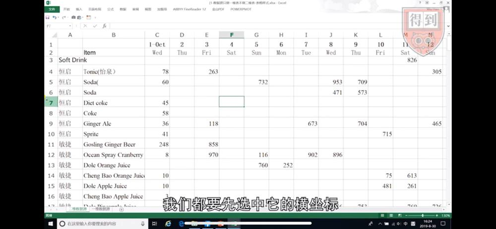

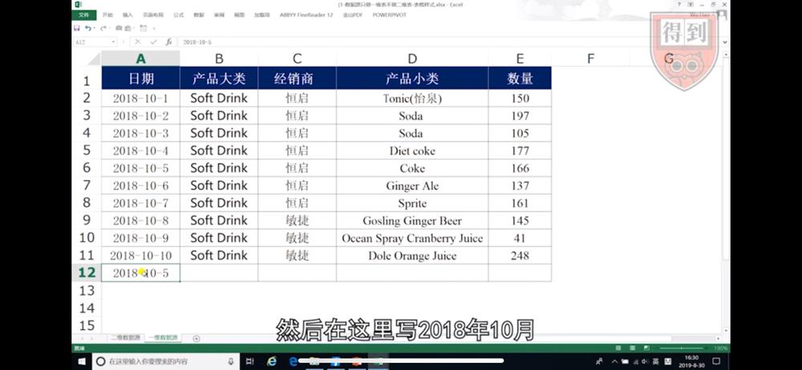

一维表的填写规则，非常简单清晰，也就是不管三七ニ十一，只要来一条数据，你就傻傻地给它记录一行，那这就和二维表的逻辑，完全不一样。

所以如果有一天，你把你的工作要交接给别人，来做的时候，一维表是很容易交接的，因为你只需要告诉他，你按照这个表格的样式，把数据一行一行，逐行记录就可以顺利交接了。但是你想想看，如果你要交接给别人的是个二维表，那可就困难很多了。

要知道在职场里，如果你能培养出你的接班人，教会别人来做你的工作，那么你就有机会往上走，得到更大的发展空间，但如果这个工作只有你自己能做，那你可能天天就得跟这张表去死磕了，因为你根本没有办法交接给别人。

### 2. 数据源和数据结果要分开

好，这是第一条设计规则，那么表格样式设计的第二条规则是：不把数据源和数据结果混在一起，要把它们分开做。

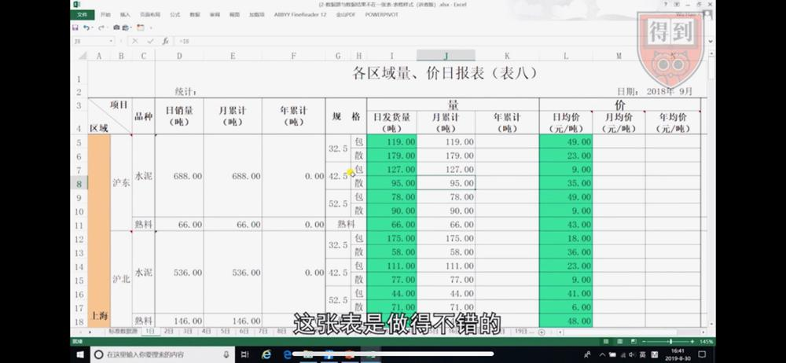

我给你举个例子，你可能有这么一项工作要做，你需要把公司每天，所发货的这些货品的发货数量，和每天的单价给记录下来，并且在表格里，还要按照月和年去统计它的销量。

根据刚刚的任务描述，我们这张表设计成这个样子，看起来是很合理的，而且很多人都会觉得，这张表是做得不错的。但是你仔细看看这张表，这就是一张典型的二维表。我们说过，二维表是很难操作的，因为你依然得通过行列，然后去选到固定单元格，你才能做填写。并且在这张表里出现了，一个新问题，这个问题是：我们把数据源和数据结果混在了一起。你可以看看，我们的数据源头要在这边，需要一个单元格去填写，但是我们又要，把数据结果填到这边。一个最直接的困难就是，你怎么在这些要填数据结果的单元格里写公式呢？这个问题就很难解決。

所以我们前面就说到了，数据工作是分两块的，第一是我们要去收集数据源，然后我们通过数据源去获取数据结果。那么在这样一张表里，由于我们把数据结果，和数据源混在了起，所以导致表格非常难操作。所以我们表格设计的第二条规则，就是：把数据源和数据结果，分开来做。我们应该先做张数据源，然后我们通过这个数据源去获取你要的数据结果。

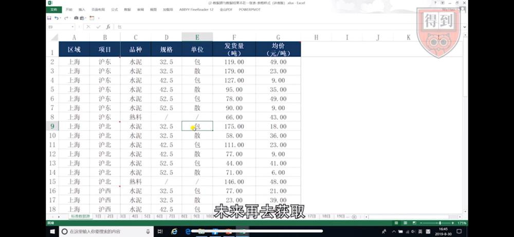

所以，好的表就只记录数据源，不和数据结果混在一起。

小结一下，我们刚刚学习了，两条重要的表格设计规则，第一，只做一维表不做二维表，第二，不把数据源和数据结果，混在一起，应该分开做。做好这两点，你就能设计出一张，正确样式的表格。

## 02. 如何正确填写单元格內容

可是只有好的样式是不够的，我们还需要确保单元格里，填写的数据内容是规范的，所以接下来我们来讲一下，单元格内容填写的四条重要规则。

### 1. 一个单元格只对应一个数据属性

第一条规则就是，一个单元格只对应一个数据属性。这句话是什么意思呢？我们来看这张表，在这张表里有这么一个数据，「68 个」，我们在小学的时候学过一个概念，「68」这个叫数，「个」这个是量，在表格里，我们一列只能有个属性，「数」和「量」应该分开，所以这里只能记录「68」。而「68 个」它是个文本，「68」才是一个数字，表格才能做计算，所以「68 个」是一个错误的填法。

好，这个例子你可能觉得很简单，我们进阶一下，你来看看这个文本，应该怎么来拆分：以会员价购买了 70 寸液晶电视。可以把他拆分成什么样呢？第一我们可以写它是「会员价」，我们还可以把它拆成「购买」，它是「电视液晶 70 寸」，你看「70」和「寸」，最后我们能把这个字段，变成一个六列的数据。

那为什么要这样做呢，很简单，如果我们把它记录在一起，我们再做筛选的时候，筛选结果没有任何的价值。但是如果，我们把数据变成多列的话，我们就有很多的数据，可以进行分析了，而且你可以想想看，其实你把所有的文字，写在一个单元格，和你把它写在多个单元格，你花的功夫是一样的，但最终你得到的这个数据的品质，是完完全全不一样的。所以我们要记得在表格里，我们一定需要，把数据拆分得细一点，做成多列。

### 2. 相同数据的填写要完全一致

好，刚刚是第一条规则，一个单元格只对应个数据属性，那我们再来看第二条规则：相同的数据，应该填写为完全相同的内容。这句话什么意思？我们来看这张表，在这张表里，我们这一列 B 列，需要填写的是省份，有些四川省、贵州省、云南省，但是有的单元格填写成了四川、云南、贵州。这在我们工作里面很常见，你如果去做一个信息收集的工作，你让每个人，去填自己是从哪里来的，那他给你填写完全不同样式的数据。其实在这一列里面，应该把它写成完全相同的样子，否则我们在筛选的时候，你就能看到，表格把云南和云南省认为是完全不同的数据内容，这就没有办法在未来去做归类分析了。

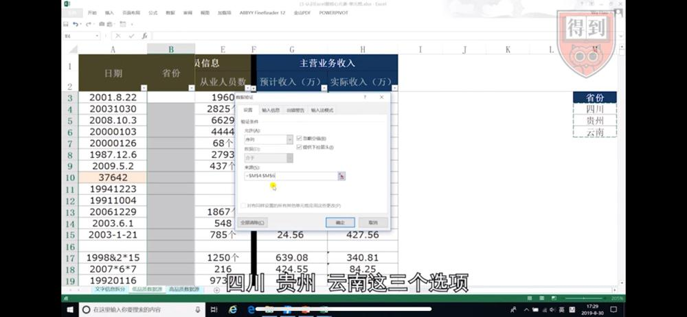

那这样的事情，我们要怎么去避免它呢？我们其实应该在这张表录入之前，对它进行一些设置，来控制单元格里录入的内容的。我们选中这些要录入的单元格，然后点数据菜单，选中「数据验证」，有的版本叫「数据有效性」选好它之后，我们在这个允许的条件里面，把它改成序列，然后来源，我去选我已经准备好的数据，也就是四川贵州云南这三个选项，接下来点确定。现在你就能看到，在我的这些单元格里，出现了一个下拉选项，那么我们未来在录入的时候，我们可以不用输入，直接在下拉选项里面去选择这些内容。这样我们就能保证，每一次录入的内容都是一致的。你要记得这个功能，它叫做「数据验证」，它是我们表格里，用来控制单元格录入的，一个非常重要的技术。

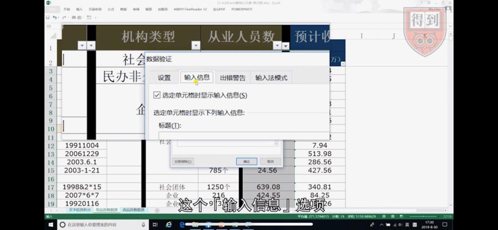

这个「数据验证」还有什么引申功能呢？比如说我们在这里要规定我们这一列的收入的填写，应该在 0 到 1000 之间，怎么做呢？我们先选这个「数据」，选好了之后呢，我们依然点「数据」-「数据验证」，好在「允许」这里面，我们可以选「整数」，你看「介于」这里，我们写「介于」0 到 1000。但是当你这么写了之后，别人并不知道，你这里做了什么规定，所以我们可以点到它旁边的，这个「输入信息」选项，这里就可以让你去写一些字，提醒这个需要录入的人说，这个单元格我到底应该写什么，所以你可以在这里写说，请输入数字，下面写 0 到 1000, 当然你也可以写一个么么哒，写完之后点确定。这时你就会看到，当你的鼠标，选中这个单元格的时候，会自动出现一个提醒，这个是我们「数据验证」里面的「输入信息」功能，它能帮助你去提醒，要在这里做录入的人，说这个单元格到底应该录入什么。这样的方法，比平时大家用的插入批注的方法，要好很多。

### 3. 特殊的日期格式

那么接下来再讲第三条规则，单元格里日期，是一个很特殊的数据，所以我们有必要来了解下，关于日期的一些填写规则。

首先我们来看这张表，在这张表里 A 列有很多日期，比如说这种「2001.8.22」，这样的日期在表格里是完全错的。因为在表格里，我们只有两种日期的写法是对的，第一种是「2001/8/22」，第二种是「2001-8-22」。表格里只有这两种方法，可以录入正确的日期，那其他的都是错的，尤其是我们经常写的这个 2001.8.22。

但是有的人会碰到这样的问题，他说我不管按照 2001/8/22，还是按照 2001-8-22 录入，它都只能得到一种日期的样式，这是为什么呢？给你讲一个很冷门的知识，我们在单元格里所显示的这个日期样式，它是和我们右下角的，这个系统时钟的样式一致的。如果你想让单元格里，显示成什么不一样的样式的话，你需要去修改右下角的，系统时钟的样式，这是一个很冷门的知识。

好，现在你知道了单元格里，只有这两种正确的录入样式，但是不管用哪一种方式做录入，你看我们都要写 2001-8-22，这个操作是不是很繁琐，所以介绍一个表格里，日期快速录入的快捷键，叫做「CTRL+；」，如果你按「CTRL+；」，它就能立即录入当天的计算机日期，用这样的方法，就比你用键盘慢慢去敲，效率可能一下就提升十倍了。

好，那关于日期，我们还会看到一种很常见的情况，比如说这个单元格，我们经常会看到这个日期，变成了一串数字，那么很多人看到这样的一个数据，就觉得很可怕，觉得是不是我的日期就做错了，其实并没有，这里有一个规则，我们表格里单元格是有生日的，单元格的生日，是 1900 年 1 月 1 号，所以表格把这一天，当作是单元格的第一天，如果你把 1900 年 1 月 1 号，改成「常规样式」，你会看到它的数字就是 1，所以平时你看到的这个 37642，它代表什么意思呢，代表这个日期，是单元格里的第 37642 天。所以你不用担心，它只是表格的种记录方式，你只要把它在单元格格式设置里，把它设置为日期样式就可以了。

但是关于单元格格式的设置，很多人是这样做的，选这个单元格点右键，去选设置单元格格式，但这个操作是非常没有效率的，你学会一个快捷键，选中需要设置的单元格，按「Ctr+1」，你就能瞬间调用出，我们单元格格式设置的对话框。你一定要记得这个操「Ctr+1」这个快捷键，会在你未来工作里面，频繁地被用到。

好刚刚你知道了，在表格里录入正确日期的方法，所以未来你在工作的时候，你录入的日期是没问题的，但是你会遇到另外一个问题，就是别人给你的表格，里面的日期都写错的，当你拿到这些错误的日期的时候，你有没有办法，快速地把它变換成正确的日期呢？关于这一点，我们就有一个新的技术要告诉你，你用这个方法，一秒钟就能把一整列的错误日期，全部都变对。

我们来看看这个操作，是怎么做的，我们先选中，这个需要转换的 A 列的日期，你看到了这里有很多错误的日期，有写点的，有一个八位数，它中间都没有分隔符的，那这样的数据，我们应该怎么转换呢，我们选中这一列，然后点数据菜单，在数据菜单里面，我们选择的是「分列」这个功能，点开它以后，第一步和第二步我们都不用操作，直接点下一步，到了第三步里面，我们直接选到日期这个选项，那么它后面有一个 YMD，就是年月日，你要根据你自己的单元格里的，那个年月日的先后顺序来确定你在这里应该选哪一个，设置好以后我们直接点完成你看到了吧，一整列的错误日期，全部变成了正确的日期。这一招很厉害，未来当你遇到不好的日期数据的时候，你可以试试看，选中一整列点「数据分列」，直接在第三步选日期，就可以把它整体地都转换过来。

那说了这么多，我们为什么要做一个，正确的日期呢，因为在表格里有大量的，日期处理的方法和函数的。比如说如果我们想要计算，这两个日期之间相距的工作日，你知道该怎么做吗？我告诉你一个函数，这个函数叫做 NETWORKDAYS。我们在这里写一个函数，叫做「= NETWORKDAYS」，然后我们按「Ctrl+A」，就可以打开这个函数的，设置对话框，这里一共有三个参数，一个叫开始的日期，一个叫结束的日期，你先不管这个。我们就直接选开始的日期，我们选 A3，结束的日期我们选 A4，这两个选好之后你就能看到，在预览的这里，有一个结果叫做 4703 天。这个就是除去周六周日，这两个日期之间相距的工作日，所以 NETWORKDAYS 这个函数能快速的帮你统计这样的一个日期关系，但是它的要求是什么呢，是你需要拥有正确的日期，这就是我们在 Excel 里，要把日期数据填写正确的一个非常重要的意义，因为只有当日期数据，是正确的时候 Excel 里的各种日期分析方法才能发挥作用。

### 4. 文本型数据转换后才能用

最后一条规则，它叫做文本型数字有风险，要先转换之后我们才能用。

什么是文本型数字呢？你看在这个单元格里它的左上角有一个这样的三角形，这样就意味着这是文本型数字。那这样的数据是从哪来的呢，通常是两种，第一种是我们在录入的时候，这个单元格设置就已经是文本了，所以你录进去，就变成了文本型数字。第二种是我们从企业系统里面导出的时候，会产生文本型数字。因为企业系统后台存储，是按照文本去存储的，所以导出它也就是文本型数字。

那像这样的文本型数字，是有风险的，因为对于 Excel 来讲，它压根就是一个文本，而不是数字，所以在我们做一些，数据处理的时候就会出问题。比如说我们在这里写一个公式，叫做等于 SUM 这个函数，它对文本型数字区域，进行引用的时候，它求出来的结果为零。因为 SUM 函数对文本型数值，是不做计算的。

再比如说我们在工作里面，可能有时候会做对账，像这样子我们有两列数据，我们需要知道它们是否一样，所以我们可能会写一个，最简单的公式，叫做「=G3=H3」，你看这样一个公式，我们问表格一个问题，说这两个单元格，是一样还是不一样，点确定之后你会得到一个答案。你看我们双击往下做复制，它全都写得错的，但是你能看得出来，其实这两个单元格是一样的，那为什么表格认为，它们是不一样呢，就是因为其中一个是数字，另外一个是文本，而表格以为文本是大于数字的。所以对于你来讲，通过这样的一个公式判断，但得到了完全错误的结果，这种风险是很大的，所以我们需要对它进行转换。

但是很多人是这样去转换它的：首先选中这些数据，然后我们点这个感叹号，选转换为数字。这很多人都用这一招，但是这一招有一个问题，因为当你要转换的数据越多，你要选择的区域就越大，你就会越累，第二个是如果你容易选遗漏了，那么是不是有一些单元格，它藏在这后面，那你依然会遇到，数据处理上的问题，你也会算错数据的结果。

所以我来教大家一个方法，我们可以快速地对它进行转换。我们先选这一列，然后选到「数据菜单」，点「分列」功能，「分列」功能共有三步，但是我们在做这个转换的时候，我们直接点「完成」就好了。但是现在你看到我这里出错了，无法对合并单元格执行此操作，为什么呢，因为我这上面有一个合并单元格，我现在把它拆分掉。这一点就提醒大家说，我们在数据源表里，如果你有大量合并单元格也会给你造成很大的麻烦，所以也尽量少合并单元格。

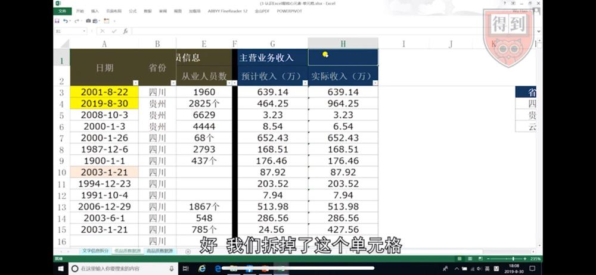

好，我们拆掉了这个单元格，再来做一次。选 H 列，然后选中数据这个菜单，点「分列」功能，这里一共有三步，我们不管它，直接点完成。你看，整个就都转换过来了，现在我们在验证一下，在旁边写ー个公式，叫 G3=H3，表格就认为它是对的。所以未来你就记得，用「分列」这个功能，去转换文本型数字，是非常常用也很好用的，你可以忘掉用鼠标点转换为数字这一招了。

## 03. 用好最强大的数据分析工具：透视表

好，你已经学习了，两个表格设计原则，也掌握了四个单元格录入规则，现在你已经可以做出一张，优质的数据源表。

这张表大概是长这个样子的：只有一行标题行，每一列都对应一个数据属性，然后在日期这里，每个日期都是正确的，相同的数据文本也是一致的，包括数字的部分，也没有文本型数字，那这就是一张非常好的表了。现在你就拥有了一张，优质的数据源表了，坦白讲，其实你的工作做到这里，就差不多做完了，你只需要用一个工具，接下来你就可以点点鼠标，在表格里快速地获得，各种你想要的数据分析结果。

那这个工具是什么呢？它就是我们 Excel 里面，最最强大的分析工具，数据透视表。别担心，数据透视表的操作非常简单，是个地球人就学得会。接下来我们就看看，我们利用数据透视表这个工具，怎么样快速获取，各种各样的数据分析结果。既然是最强大的分析工具，透视表能干的事是很多的，我在这里挑出三种最常见的应用讲给你。

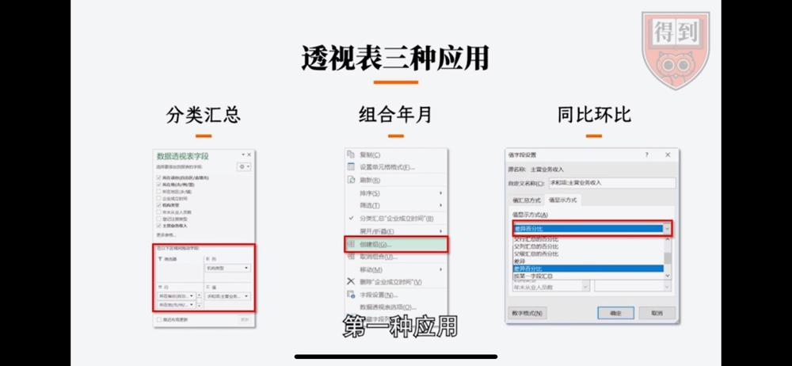

### 1. 应用一：分类汇总

第一种应用，是我们通过组合字段的方式，去做分类汇总。

我们来看这张表，这张表是一个标准的数据源表，在这张表里有省份、地市、地区，还有收入的数据。我如果在这张表里，我们要统计不同的省份，不同的地市，不同地区，我们再加一个条件，不同的机构类型，我们去求主营业务收入总和，应该怎么做呢？

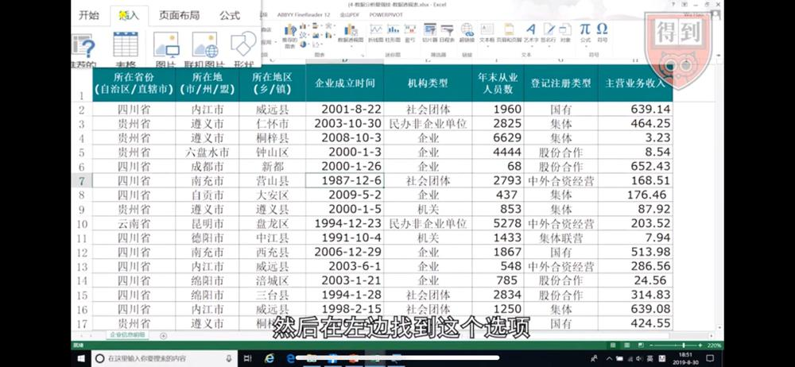

我们选中我们单元格，任何一个单元格（因为数据是连续的，我们选中任何一个单元格都可以），点「插入」这个菜单，然后在左边找到这个选项，「数据透视表」，我们要用的功能就是它，点开它，我们会看到表格帮我们自动地选择了这个位置，也就是 A1 到 H8437。你看，在你的数据源标准的情况下，它能自动帮你选中数据区域。接下来点确定，现在我们进入了一个界面。

可以换一个界面，点右键，点「数据透视表选项」，点「显示」，点「经典数据透视表布局」。现在的显示方式是 2003 版的显示方式，但更直观。

这个界面左边是透视表功能区，右边是透视表的字段列表。我们可以看到，我们的数据源里的，这些字段的名称，都在这个字段列表里，我们的数据透视表功能区，它其实分四个部分，在我们的左边有一个叫行字段的，上面这里叫列字段，再上面叫报表筛选字段，然后这个地方叫值字段。我们的字段如果放到行字段里，它是从上往下排列的。我们的字段如果放到列字段里，它是从左往右去展开和排列的。

那我们要统计的什么呢？我们要统计的是，不同的省份、不同的地市、不同地区、不同机构类型的主营业务收入总和。那么由于省市区他们是从属关系，一二三级的从属关系，所以我现在把所在省份，用鼠标左键把它往下拉，拉到字段列表里的这个行这个区域里放手，你会看到在我们的界面上，我们的省份就已经被归类了。那我们再把地市，添加到行字段，那么它就会一级一级展开，我们现在把所在地放到行字段，你看它从上往下展开了。

那这个汇总的分类，我们什么时候把字段放到行，什么时候把字段放到列呢？因为表格是一个行数很多，但是列数很少的这么一个工具，所以我们把分类多的往行上放，分类少的我们往列上放。接下来我们这个所在地区，你看它和我们的省市有也从属关系，所以我们就把所在地区放到三级行字段，然后机构类型放到列字段，因为它和这三个字段没有关系，我们把它放到列字段，它就从左往右展开。

你可以试试，如果你在列上放多个字段的话，这个列就会非常地宽，你的表就会长得像一个《清明上河图》一样。

好，最后我们把主营业务收入，把它放进值字段数据项。

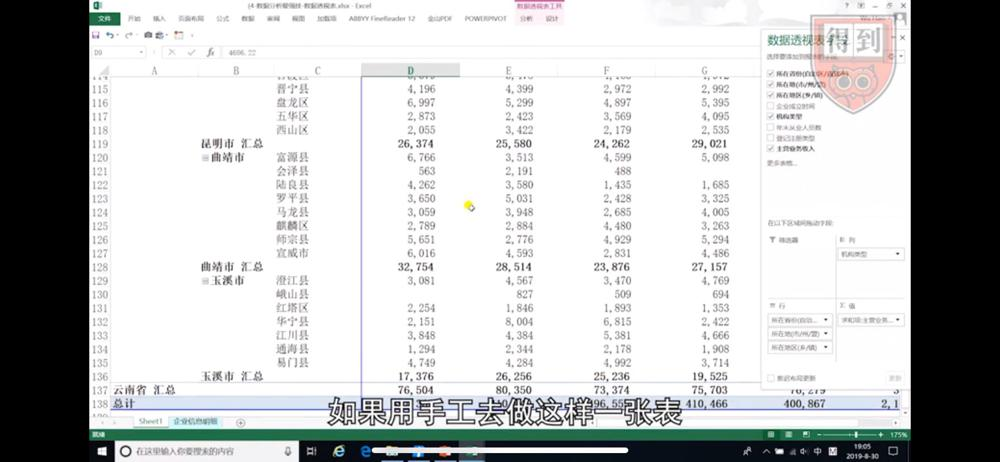

你看现在我们就得到了，这么一个分析结果这么多数据，如果用手工去做这样一张表，你可以想象，可能做一个星期也做不完，但我们用数据透视表，你看其实我们做得快的话，十秒就能做完了。

这个就是在数据透视表里，我们通过组合字段，我们能得到的数据分析结果。

那么当你得到了，这样的统计结果之后，你在工作里面可能会，面临另外一个挑战：你的老板可能会问你，这个地方，为什么汇总数是 5826？

换做以前，你手工做的汇总表，你就得满大街的去找数据，最后给他一个数据的明细，但是如果我们是用透视表，做出的一个统计结果你想看到这一条汇总数的明细，只需要把你的鼠标放上来，左键双击它，你就能直接打开个数据明细。而这里的所有数据，就是组成我们刚刚那个，汇总数的数据，所以如果你还想看其他的数据，你只要依次去双击就可以了，这个就是我们数据透视表里的，另外一个功能，叫做双击显示数据明细，你想看任何汇总数，双击它就可以了。

### 2. 应用二：年月季度汇总

数据透视表里的基本操作，通过调整字段的位置，去获得各种分类汇总，这个技术我们就讲完了，你可以对你自己的表，去做一些操作，去交换这些字段的位置，就能得到相应的值。

那接下来我们来看看，透视表里的第二个常见的操作，就是我们可以对表格里的日期，进行特殊的处理，让它快速的被汇总成年月，甚至季度，得到你要的另外的数据统计，和分析结果。在我们工作里面，其实对于年月日进行汇总，是一个非常常见的需求，对于表格来讲，你只需要提供给它这一列数据，它就能给你快速地分析出，按照年月甚至季度的一些数据。

它的做法是这样子的，我们在数据透视表里，你看企业成立时间，这个字段里面是我们的日期，我们把企业成立时间这个字段，放到行字段，拖进来就好了放手，然后我们把主营业务收入，这个字段，因为我们要统计它的和求和，把它放到这个值字段放这里，然后在你的界面上，你就得到了两列这样的一个数据，这个数据没有什么好看的，接下来你在 A 列这里面，选到任何一个单元格，然后点右键，找到「创建组」这个功能，有的版本里这个叫「组合」，点开它以后，你会看到这个功能，在我们的透视表里，它的分析功能强大到，甚至可以按照每一秒钟去统计，但是我们在这里选月季度和年，你看我们把日期，给它归类成月季度年，去获得一个统计结果，我们点确定看看最后的效果。

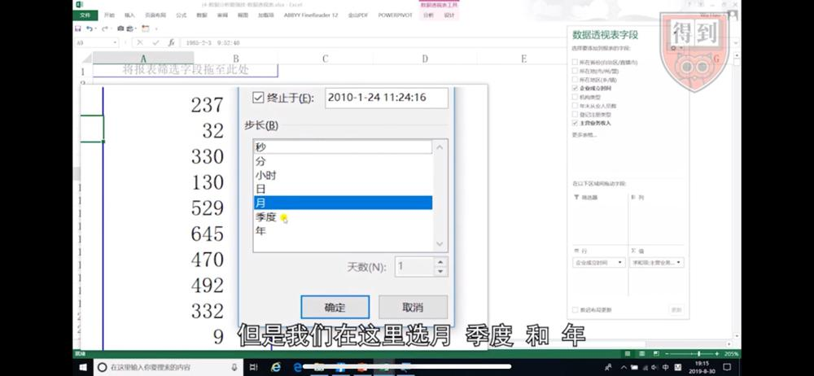

你看，透视表帮助我们，非常快地统计出了每一年，每一个季度，每一个月的收入总和，现在这张表还不是我们最终想要看的汇总表的样子。

我们再来做一个变化，我们在这个字段列表里，我们把年这个字段，放到筛选器里去，再把季度放到筛选器里去，然后我们把这个企业成立时间，放到列字段，它就会从左往右列然后我们把所在省份，添加到行字段，再把所在地添加到二级行字段，最后这里是这个样子的，筛选器里有年和季度，列里面有企业成立时间，行里面有所在省份和地市，这个值字段里面，依然是主营业务收入总和，我们来看我们的界面，在界面里，我们的表格就被汇总成了，这个样子，这其实是我们经常要看的，1 到 12 月的汇总数，然后年和季度这两个字段被放到了报表筛选字段里面去，这就是我们通过日期组合，然后再对字段进行位置的调整，能得到的按照 1 到 12 月分析的，收入总和的张表。

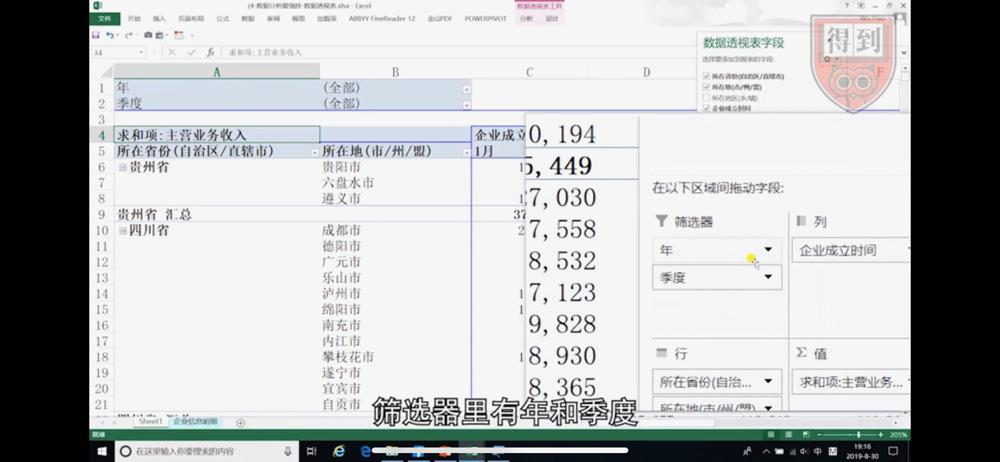

### 3. 应用三：各维度的同比环比

来看我们透视表里的，第三个应用：我们可以通过一些很简单的设置，快速地去分析，我们数据的同比和环比。

我们在工作里面，什么时候要做同比、环比呢？比如说我们经常要看 2 月份比 1 月份的销量增长了多少，3 月份比 2 月份増长了多少，这种算增长比率其实是很难算的，因为你得求两个数据的和，再减再除，但在数据透视表里，我们只需要做一点点小的设计就可以让它实现这样的数据统计。

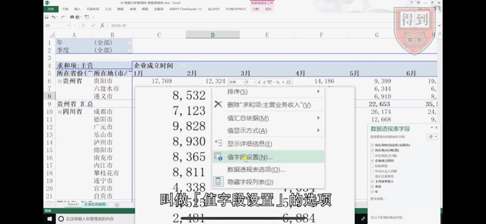

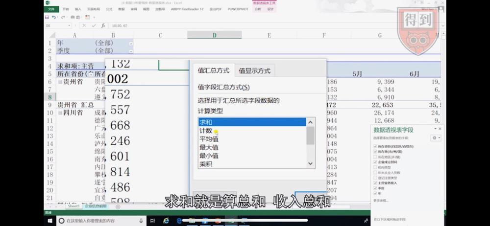

在我们已经做好的这个透视表里，我们在数据区域的，任何一个单元格，我们在这里点右键，点完右键之后，我们找到这里的一个，叫做「值字段设置」的选项，点开它，左边这个叫值显示方式，这里你下来也可以用，这里是求和计数，求和就是算总和收入总和，计数就是它发生了几次，就是有几行数据，这通常用来我们做什么，算有几份合同之类的，所以在这里的选项你都可以点。

但是真正厉害的，我们要去做同比环比的在这里，「值显示方式」，你点到这个标签里，现在这里写的是无计算，我们打开它，然后在这里找到一个，叫做「差异百分比」的选项在这里，好，点它，点完这个差异百分比之后，它需要你设置一个基本字段，还需要你设置一个基本项，什么叫基本字段呢，你记得我们要求的是，2 月份比 1 月份的增长比，3 月比 2 月的増长比，那么这个 123 月，所属的这个，叫做企业成立时间的字段，这个就是我们的基本字段，那未来你有经验了你知道，通常我们数据是后面比前面的，所以基本字段我们通常是列字段。

好，选中我们的企业成立时间，那基本像这里，如果你选的是 1 月，那就 2 月比 1 月 3 月比 1 月，但如果你是和上一个月比，你就选上个，你看我们这里只有三个选项，第一我们把值显示方式，选成差异百分比，第二设置它的基本字段，就是我们的这个列字段，横向的这个字段，然后跟上一个比。

好，现在点确定。你看现在我们得到的这个表，就是差异百分比的一张分析表，这里分析的是贵州省贵阳市，2 月份比 1 月份，降低了 30.65%，3 月份小幅下降，4 月份有回升，5 月份又下降了，6 月份大幅回升，你的老板这时候可能问你，这里为什么它就大幅回升了，你用另外一个技术，鼠标左键双击显示数据明细，你就可以跟他讲，你看我们所有的数据在这里。

刚刚通过一个，值字端设置这个功能，我们就可以快速的，变更我们数据透视表的统计维度，那现在我再变一个给你看，我们在值显示方式里面，把它改成列汇总的百分比，你看这个时候，这下面这两个设置是灰色的，不用管，直接点确定就完成。

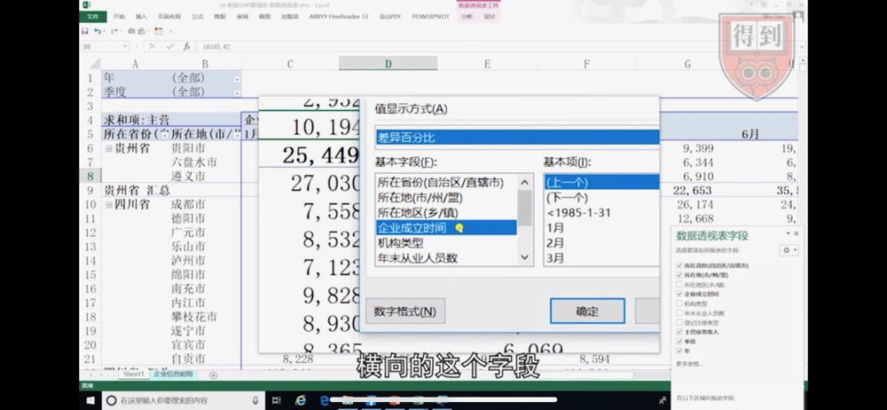

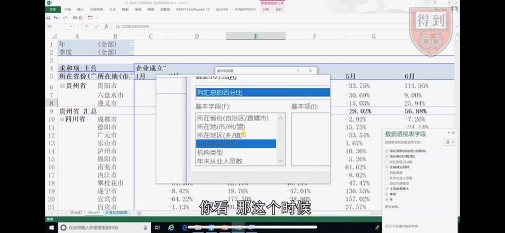

好，现在这张表，立即就变了一个统计的维度，列字段的百分比什么意思呢，你看它是把每一列的数据，作为百分之百来做计算的，那它相当于統计的是，贵州省贵阳市 1 月份的收入，占全国收入的多少，相当于，它是一个数据和别的数据比，一个分公司和别的分公司比，一个产品和别的产品比。

好，我们再变一下，你看这些操作都很简单，我们在这里点右键，「值字端设置」还是它，值显示方式，我们改成行汇总的百分比，也不需要做任何设置，点确定就好，那么你只花了 10 秒钟，我们換了一下它的选项，你就能看到行汇总的百分比，什么意思呢，它是把每行，作为百分之百为份额，那么这张表统计的是什么，这张表統计的是，贵州省贵阳市 1 月份的收入，占自己全年总收入的 10.79%，它是和自己的一年 12 个月去比。

好了，我们刚刚看了，在数据透视表里的操作，我们都只是通过点点鼠标，就快速的得到了数据的结果，我们一共讲了三个重要的应用，第一个是我们做分类汇总，我们组合字段就得到了它的结果，第二个是我们可以把日期，拿来做特殊的处理，让它快速汇总出年月季度这样的数据来，第三个是我们可以快速地做出同比环比，你只需要通过设置值字段显示，那里面的选项就可以了。

好这就是我们数据透视表里的，三个重要的应用，当你学会了数据透视表里的，这些操作，你未来在做数据分析工作的时候，你的效率就会变得非常之高，但是你要记得这一切都来源于，我们给 Excel 提供了一张，非常好的优质的数据源，只有有了它，我们的数据透视表，才能发挥出它真正的作用。

好，以上就是这场讲座的全部内容，通过这场讲座我希望你知道，你的数据工作，一切的努力都应该做在前端，你只需要做好一张表，再学会一个强大的数据分析工具，你未来的数据工作，就会做得非常爽。
