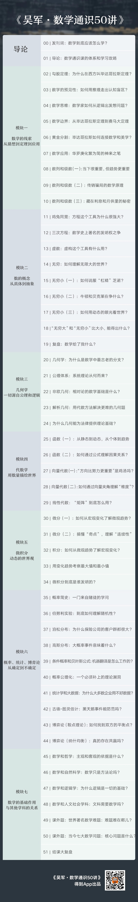

# 发刊词｜数学到底应该怎么学？
> 吴军·数学通识50讲
2019-11-03

在上个世纪 80 年代，国内流行过一句口号：「学好数理化，走遍天下都不怕。」因为当时的教学体系还不完善，数理化这些基础学科比重大，而且容易培养出建设型人才，所以受到重视。当然，随着综合教育体系的完善，这个口号也就不再流行了。

但是，在今天来看，无论你的专业和工作是什么，你都会发现，数理化这些底层学科是不是牢固，真的决定了一个人的知识结构能搭多高，在专业上能走多远，尤其是数学。数学作为一切科学的基础，它化繁为简，直击本质的思考方式，让很多人获益。那些数学成绩好的人，做起事来总是一通百通，很容易脱颖而出。

但是事实上，很多学习数学的人会感觉自卑，并产生厌恶。这是为什么呢？

当然不是数学本身的问题，也不是我们人的问题，而是因为我们和数学之间缺失了一个桥梁。数学是一种抽象的知识体系，而我们人要靠经验感知才能认识世界，这中间需要一个桥梁，这个桥梁一旦构建起来，每一个人都能受益于数学。

那么是否每一个人都有可能学好数学呢？公平地讲，数学往深了学确实很费脑力，对大多数人来讲有点难度，但是把平时用到的、能够提升我们思维的数学学好，是每个人都能做到的。接下来我就用一个例子谈谈怎么学数学。

2017 年，一位原央视的主持人请我和中国科技馆前馆长王渝生先生，做一个有关数学的节目。在节目开始前，主持人对我说，她高考时数学不及格，是个学渣。我说，你能有今天这样的成就，显然不是学渣。数学没学好，不是你的问题，是教学的方法和考量学生的方法不对。

然后我就告诉她美国顶级的高中和大学是怎样教数学的。在美国最好的高中，把数学课由中国的一门课变为 8～10 门内容不同的课程，每门课还要开 A、B、C 三个难度不同的班。比如我们中国（从初中到高中）的几何，被分为平面几何 A、B、C，解析几何 A、B、C，等等各种难度的课程和班级。

入门的那几门数学课足够浅显，难度较低的班会讲得更浅，内容更精简。比如平面几何的 A，讲清楚几何学的原理和用途，以及推理的思维方式就好，就不让学生再做那些比较难的证明题了。像点、线、面、三角形、四边形和多边形等概念，以及平行、垂直等关系，其实对任何人都不难，都能取得好成绩。

当然，由于你选择了简单的数学，也就没有浪费时间去攻克对自己来说很难的数学内容，就可以学更多自己喜欢的文学或历史，然后申请那些更适合自己的大学。

更重要的是，虽然你所学的数学课不多，也不深，但好歹掌握了基本概念，掌握了相应的思维方式，如果将来真想再继续学，还是有可能的。否则你学了一大堆理解不了，考试通不过的内容，不仅浪费时间，而且本来能学会的简单内容也全丢掉了。

不信我问你，还记得住计算圆球体积的公式，或者方程组的解法吗？那些都不是什么很难的内容，但是因为大家做不出数学题，考不出满意的分数，就从心里彻底放弃了这门课，以至于那些本应该记住的简单内容也干脆全忘光了。可以说，结果就是早早地就把通往数学的桥梁毁掉了，从此以后，再也没有体会过数学思维的乐趣，放弃了智识生活的可能。

那么在我的数学课中，我会教什么？大家又应该怎么学？学完以后应该怎么用呢？

在教学方面，我会模仿美国的数学教学方式，为你做好三件事，也是我这门数学课的三个教学特色：

首先，我会为你重建这座通往数学的桥梁，帮你把那些熟悉的知识点各安其位，放进知识体系里。我的讲法是把一门数学课从完整的体系变成一个个的知识点，讲透之后，再还原回体系。让你能够熟练地把握知识点和课程体系的关系，这门课的体系也就搭建好了。

以最难的几何学为例，再难的几何题，其实最终都可以拆成那五个最基本的公理。这五个公理，又可以推导出几何学的任何结论。就如同几种乐高积木可以搭出任何形状一样，我会在几何那个模块介绍给大家。

至于这个体系能构建得多大，则要看学生能够接受的程度，学生接受的程度高，就搭一些复杂的，接受程度低，就搭一些简单的。但是能够拆解和搭建哪怕是比较小的体系，通识教育的目的就达到了。

其次，在介绍这些关键数学知识点的同时，我会讲清楚它们在数学上的位置，以及和各种知识体系的相关性。这样不仅能够把各种知识打通，而且能够让你在自己的行业中超越绝大部分从业者。

我的《数学之美》出版后，很多人读后感慨，原来数学对信息处理帮助这么大。但其实那本书中介绍的全部内容，不过是一些知识点。而仅仅是理解了那些知识点的计算机从业者，就已经获得更强的竞争力了。

再比如，为什么大家熟知的勾股定理，在国际上通行的叫法是毕达哥拉斯定理？因为勾股定理只是经验，而毕达哥拉斯定理却完成了数学证明，但教科书出于发明权的考量并没有说明，结果就是把数学这门课的逻辑基础搞丢了。以至于很多人大学毕业工作多年依然搞不清物理上用实验证实的定律和数学上用逻辑证明的定理有什么差别。如果基础就打歪了，以后进入工作，很可能出大错。

最后一点，也是最重要的，是通过学习数学，实现思维方式的跃进。为了做到这一点，并不需要讲述太难的数学知识，而是需要讲透。事实上，我们无论是讲透毕达哥拉斯定理，还是更难懂一些的欧拉公式，都可以在讲述的过程中将数学家超出凡人的思维方式讲清楚。毕竟对于大部分人来讲，一辈子用不到欧拉公式，如果他们不容易理解，用简单的例子把道理讲清楚就变得格外重要了。

至此，我为你搭建的桥梁就算建造好了，当然，还是需要你亲自从这头走到那头去，我们接下来谈谈你怎么做，才能跟着我学好数学：一个学好数学最重要的办法是，不断训练自己的思维方式。

很多人喜欢读侦探小说和悬念小说，喜欢解决各种谜题，这其实是人类的一种天性，也是对头脑的一种训练。学数学能够提高我们这方面的能力，让自己成为一个「深入的思考者」（Deep Thinker）。

世界上有两种所谓的聪明人，一种是反应很快的人，被称为 Quick Thinker，另一类则是 Deep Thinker，也被称为 Hard Thinker，无论是哪一种，其实都是可以后天训练的。训练快速反应最好的办法就是多听多看。但是训练 Deep Thinker，就需要练习一环扣一环解套的本事了。

用数学做这种训练的好处是，它经过上千年的发展，已经有一整套训练材料了。所以学数学，就像打游戏晋级一样，一点点往前探索，一个个击破难题。

最后，请你查看课表，当然我还是想再从不同的维度上帮你提炼一下。

首先，我们会学到虚数、极限、微分、积分等等这样的具体知识点，掌握它们之间的关联，以及它们在人类认知方面的地位。这样我们就能理解人类是如何扩展自己的认知的。如果我们把自己成长的过程和人类成长的过程做一个对标，就能通过它们扩展我们自己的认知。

再往上一个维度，你还能了解数学在人类知识体系中的地位，比如数学和艺术的关系，和法律，和经济学的关系，等等。很多时候，数学不能直接解决我们的实际问题，但是它能够给我们提供一个思路。

在更高的维度上，我会通过介绍数学的发展史，帮你理解数学思维，也就是人类的认识是如何从直观到抽象，从静态到动态，从宏观到微观和宇观，从随意到确定，再到随机，等等。

好，如果你想重新认识一下数学，和我一起感受一次数学之美，那么欢迎你加入我的《数学通识50讲》。当然，除了数学通识，我还将开设一系列的通识课程，把每个人都需要掌握的人类知识精华，整理成课程，帮每个现代人装备自己的头脑，找到最适合这个世界的思维方式。

## 黑板墙

### 01

掌握数学思维，对很多行业的从业者来说，都能让他们走得更远。数学闪耀着人类逻辑和理性的光芒，它作为ー个工具，在近现代历史上推动了无数学科的发展与进步。但是今天很多人哪怕在学数学的时候就一直在背定理、背公式，然后套公式去解题。这其是用晶体智力代替了流体智力，没能体会到数学中逻辑推导的美妙。在许多工程应用学科中，数学家推过一次的公式，工程师只需要拿来用就好了。所以今天哪怕是一些行业的资深工程师，他们的数学知识也可能忘记了大半。但是掌握数学的思想，在人生的任何阶段都会是有用的。刘润老师讲过，花一秒就看透问题本质的人和一生都看不透问题本质的人注定将过着不同的人生。使用数学思想了解问题的本质，你将成为一个如弗里德曼所说，「既写过乐谱也欣赏过音乐的人」。

### 02

我的专业背景是化学，「量子化学」又是化学中的一个分支，它的主要思想是将「量子力学」的方法应用到化学研究当中，比如研究分子、原子、电子的结构。于是，我要理解量子化学，我就要先知道什么是量子力学，而量子力学当中最核心的方程就是大名鼎鼎的「薛定谔方程」，理解了它才能理解量子力学的许多概念，オ能进一步将量子力学应用到化学研究当中，而「方程是个数学概念」。到这里，我深刻地感受到，「对一个数学方程的理解程度决定了我对量子化学这个上层学科的认识深度」，这就是这里所说的「数学決定了知识结构能搭多高，在专业上能走多远」。数学虽然从小学就开始学，但是它真的很高级。

### 03

计算机专业，学过不少数学课，数学分析高等代数离散数学组合数学概率統计随机过程，虽然当时考试结果看起来不错，但是只能算知道了 what 和部分 how，对于 why 的认知基本为 0。尤其是线性代数，学的时候做题无压力，但是并不知道很多东西干什么用的。直到之后学习机器学习计算机视觉时，再回头复习（重学，只知 what how，考完试忘一半）线性代数时，オ算是理解了一点点 why。虽然打好数学基础，有助于学习计算机。但是学习曲线比较陡，实话实说过程有些痛苦。我是很幸运碰到了好老师，周围同学也优秀，学到了不少。毕业多年，还能记得一些精彩的证明，比如实数的完备性，非非 A 蕴含 A。如果最初纯学数学的过程中，能够了解到一些概念被提出来的原因，很多是实际应用中有强烈的需求或者说痛点，或者只是一些应用的实例，相信都会显著提高数学课的效果。学校里的数学课，可能短期内不会有巨大改变，还将延续 what- how - why 很少的方式。我一直希望的数学课，Why -> What -> how -> Why。数学通识课程算是填补了巨大空白，先理解最基本的 why，消除恐惧培养兴趣，为 what how 打下基础，更深入 Why 提供原动力。

### 04

作为前端程序员，谈一下，这节课的重要性。在前端的市场上，很多人都感到焦虑，27、28 岁的大好年华，喊自己老了的大有人在。那什么样的前端工程师具有市场竞争力呢，第一是对框架源码的理解，第二是对算法的掌握。而算法的基础就是数学，很多人不具备数学思维，在理解算法时确实是面前多了座山，所以至少有竟争力的前端工程师都要打好数学基础。再往后边看，人工智能，机器学习，更是需要数学基础，预见一下这样的场景，阿里已经把算法放在云上，因为不懂如何对接而无法解決算力问题，是不是很苦恼。而这些基础都是数学。「回炉」学习对这个时代来说，是个普遍现象，这种动力就源自吴军老师的那个观点：人才市场看中人们的能力和格局，和年岭相匹配。