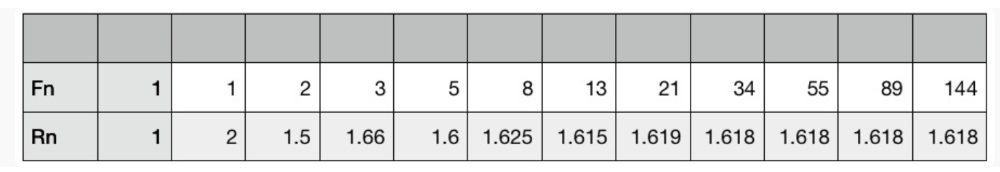

# 0107. 数列和级数 1：当下很重要，但趋势更重要

2019-11-09

这一讲的主题是：数列和级数：要知道当下很重要，但趋势更重要。有人问我，是否通过学习数学提高了见识水平？公平地讲，很难找到某一个数学知识点，学了之后让见识马上提升，这种直接产生效果的知识我是没有遇到。但是通过学习一些数学知识和方法，帮助我形成了系统的做事方法，并且改进了看待世界的角度，这却不是虚言。

今天和大家分享两点体会，第一点是我们如何举一反三，通过对单个事件，或者说对个案的研究，寻找出对一系列问题的通解，第二点是从很多孤立事件出发，看到并理解趋势和规律。

为了说明这两点，在接下来的几讲里我们用数列这个专题作为例子，练习把握从个体到群体的规律。当然，讲数列还有一个目的，就是承上启下，它会用到前面讲的黄金分割的知识，并且为后面讲极限、无穷大和无穷小奠定基础。我们先来看一个具体的数列，给你这样一串数字：

```
1，1，2，3，5，8，13，……
```

如果我来问大家下一个数字应该是什么，比较善于琢磨规律的人会指出，由于每一个数字（除了前两个）都是前面两个数字之和，因此下一个应该是 21，即 8+13。这个答案完全正确，这样一连串有规律的数字放到一起，就形成了我们要说的数列。上面这个数列，就是数学中鼎鼎大名的斐波那契数列。在这个数列中，我们是有规律可循的，根据数列中开头几个元素的具体数值，知道整个数列每一个位置元素的数值，就是提升自己从孤立事件里发现规律的能力。

数列其实在今天中国的小学已经讲到，比如常见的两种数列分别是这样的：

```
1，2，3，4，5，6，7，…… 
以及 
1，2，4，8，16，32，……
```

前一种数列由于相邻两个数字（我们称之为元素）的差距都是 1，因此被称为等差数列，后一种由于相邻两个数字的比值都是相同的（都是 2），因此被称为等比数列。在学校里，老师会讲从 1 加到 100 怎么计算，也会讲到等比数列（也被称为几何数列）会增长很快。但是为什么要把这些数字放到一起研究，其实老师们是语焉不详的。当然即使老师讲，以小学生的理解能力也未必能体会。因此今天我们就从这里入手，讲讲数列和数字的关系。

数列是一种工具。它看似是一串数字，但这里重要的是彼此的关联，以及数字的规律，而不是数字本身。那些规律和我们现实生活中一些事情的发展过程相关，于是这个工具就能够运用到我们真实的世界里了。比如我们后面要讲到的媒体转播的发散和收敛问题，以及利息问题，就和几何数列有关。以斐波那契数列为例，它其实反映出一个物种自然繁衍，或者一个组织自然发展过程中成员的变化规律。斐波那契数列最初是这样描述的：

有一对兔子，它们生下了一对小兔子，前面的我们叫做第一代，后面的我们叫做第二代。然后这两代兔子各生出一对兔子，这样就有了第三代。这时第一代兔子老了，就生不了小兔子了，但是第二、第三代还能生，于是它们生出了第四代。然后它们不断繁衍下去。那么请问第 N 代的兔子有多少对？这个数列，就是 1，1，2，3，5，8，13，21，…… 如果我们稍微留心一下这个数列的增长速度，虽然它赶不上 1，2，4，8，16 这样的翻番增长，但其实也很快，也呈现出一种指数增长的趋势。在现实生活中，兔子的繁殖曾经就是这么迅猛。

1859 年，一个名叫托马斯·奥斯汀的英国人移民来到澳大利亚，他喜欢打猎，但发现澳大利亚没有兔子可打，便让侄子从英国带来了 24 只兔子。这 24 只兔子到了澳大利亚后被放到野外，由于没有天敌，它们便快速繁殖起来。兔子一年能繁殖几代，年初刚生下来的兔子，年底就会成为「曾祖」。几十年后，兔子数量飙升至 40 亿只，这在澳大利亚造成了巨大的生态灾难。

有人可能会问，为什么不吃兔子？澳大利亚人也确实从 1929 年开始吃兔子肉了，但是吃的速度没有繁殖的快。澳大利亚政府甚至动用军队捕杀，也收效甚微。最后，在 1951 年，澳大利亚引进了一种能杀死兔子的病毒，终于消灭了 99％以上的兔子，可是少数大难不死的兔子产生了抗病毒性，于是「人兔大战」一直延续至今。从这个故事我想说的是，真遇上指数增长的事情，是非常可怕的。

接下来，我们就定量地分析一下斐波那契数列增长有多快。我们不妨用 Fn 代表数列中第 n 个数，那么 Fn+1 就表示其中的第 n+1 个数。我们再用 Rn，代表 Fn+1 和 Fn 的比值，也就是后一个数和前一个数的比值，你可以把它们看成是数列增长的相对速率。下面的表给出了斐波那契数列中前 12 个元素的数值，以及增长的速率。



大家可以看出 Rn 这个比值，很快趋近于 1.618 了，这恰好是黄金分割的比例。这个结论说明，数学的各个知识点，可能存在某种天然的联系，这似乎是数学这套系统本身浑然天成的结果，因此很多人讲这其实就是数学之美的体现。我们课程从毕达哥拉斯，讲到黄金分割，然后通过黄金分割，由此把一些数学知识关联起来。这其实就是一个学习数学的技巧了，绝大部分时候不在于题做得有多难，而在于你闭上眼睛，能够用一两条关键的线索把各个知识点串联起来。

通过上面这个比例，我们需要说明两件事情。首先，虽然这个数列最终的走向是收敛于黄金分割的比例，但是在一开始的几个数，并不符合这个规律。这在数学上不是偶然现象，很多时候，仅仅通过少数几个数字得到的所谓的「规律」，其实和采用大量数据后得到的规律完全是两回事，这一点要特别注意。

其次，上述这个比率，几乎是一个企业扩张时能够接受的最高的员工数量增长速率，如果超过这个速率，企业的文化就很难维持了。企业在招入新员工时，通常要由一个老员工带一个新员工，缺了这个环节，企业的人一多就各自为战了。而当老员工带过两三个新员工后，他们都会追求更高的职业发展道路，不会花太多时间继续带新人了，因此带新员工的人基本也就是职级中等偏下的人，这很像兔子繁殖，只有那些已经性成熟而且还年轻的在生育。

我们在谈到等比数列时，通常会想到指数爆炸，变得越来越大。但是还有另一类等比数列，它们的数字每一个都比前一个小，最终就会趋近于零。炒股的人有这样的经验，如果每次损失 10%，用不了几次就损失一半了，这就是等比数列中每一个数字都在不断按比例衰减的结果。具体讲，大约 6 次，就会损失一半，大约 13 次就会损失 3/4。

再举一个例子，今天用于测定年代的碳 - 14 测定法，利用的就是这个原理。碳 - 14 是自然界里一种天然的元素，是宇宙射线照射大气的产物，因此它会不断产生，但是它有放射性，因此过一段时间会衰变掉一部分，于是它在自然界保持着一个动态平衡。生物体在活着的时候，会吸入大气中的碳 - 14 元素（通过二氧化碳），因此它体内的比例就和自然界的比例相同。但是生物体一死，就不会再吸入碳 - 14 了，因此体内碳 - 14 的比例就会逐渐降低。根据生物遗骸体内碳 - 14 的比例，结合碳 - 14 衰变的速率（也称为半衰期），就能算出古代生物体距今的时间。所以，对于等比数列，我们一般理解的是快速上涨，但是它也可能代表不断地衰减。

数列，其实讲的就是一个趋势。很多时候，我们不仅关心当前这个数有多大，或者我们有多少钱，多少资源，还关心明天它能变得多大，变得多快，这就是数列的意义。至于等差数列，其实是缓慢上涨的，即使每一个都比前面的大，到后来的增长也很不明显。也就是说，同样是增长的趋势，我们还需要关心积累的速度。比如说，一个刚工作的年轻人，一年挣 10 万元，能存 20% 的收入，他每年的工资增长 10%。当地的房价是 300 万元，首付要 20% 也就是 60 万，那么他工作多少年能够付得起首付呢？

这就要计算数列中每一个元素之和了，这个算出来的和，被称为级数。具体到这个问题，我们知道这位年轻人第一年能存 2 万元，第二年能存 2.2 万，然后是 2.42 万、2.66 万、2.93 万…… 假如他要存 N 年才能凑够首付，这个 N 最后算出来就是 15 年。计算公式：

```
S(N) =  2(1 + 1.1 + 1.1^2 + 1.1^3 + …… + 1.1^[N-1])
```

建议你亲自算一算这道题，这样你就更能体会为什么必须进步，而且要比同龄人更快地进步了。

## 要点总结

我们通过数列（和级数），扭转一下大家对数学的认识：数学大部分时候研究的不是一个个孤立的数，而是要揭示一些规律和趋势。我们通过斐波那契数列介绍了几何数列可能会带来的指数爆炸问题；同时我们还介绍了另一种几何数列 —— 不断递减的数列。通过斐波那契数列，将它和我们前面介绍的黄金分割关联起来。让大家体会到数学知识点的关联性。在数列这个领域，我们不仅关心趋势，还关心积累的效果，这是我们接下来两讲要讲的内容。

## 黑板墙

思考题：如果房价保守估计，每年上涨 3%，那年轻人又需要存多少年呢？

### 01

斐波那契数列的 Rn：

1、首先，假设第 `F(n)` 代表数列的第 n 个数，那么数列的第 `(n+1)` 个数` F(n+1) = F(n) + F(n-1)`。

2、等式两端同时除以 `F(n)`，则会发现：`F(n+1)/F(n) = 1 + F(n-1)/F(n)`，相当于 `R(n) = 1 + 1/R(n-1)`。

3、由上面我们可以得到一个结论：2 > R (2n+1) > R (2n-1) > 1，2 > R (2n-2) > R (2n) > 1。（如果觉得不显然，可以自己推导感受一下智力愉悦）

4、由此可知，R(2n) 和 R(2n-1) 都是单调数列，一个递减一个递增，并且只在 (1, 2) 区间内。借用数学里面的定理：单调有界必收敛（「收敛」就是存在极限的意思）。

5、假设 R(n) 收敛到 k，则有 k = 1 + 1/k，该等式在 (1, 2) 区间上的解就是黄金分割比 `(sqrt (5)+1)/2 ~1.618`。

药物在人体内的半衰期：一种药物在人体内的半衰期是八小时，说的是每过八个小时，药物在人体的浓度就变为原来的一半。医生所谓的「一天 n 次」，其实是为了保证药物在人体保持有效浓度之上，这个 n 次，与半衰期密切相关。因此，用药时间尽量在一天中均匀分配。

贴现率：经济学名词「贴现率」，指的是一件事物在未来的价值相对于现在所打的折扣。如果贴现率（一年）是 0.1，那么，一年后的 10 块钱，就只值 9 块钱。不同的事物有不同的贴现率，奢侈品、外表、知识，…… 自己判断。每个人心目中也隐含了一个「贴现率」的数值，它体现了你对未来的估值。这个值越高，说明你对未来越不看好；相反，如果你的「贴现率」越低，说明你越看重未来。有人会为了未来的蓝图忍受当前的苦，有人则喜欢及时行乐。他们只是有着不同的「贴现率」而已。

### 02

增量比存量值钱，趋势比当下重要。投资股市的人，不仅担心亏损，更怕连续亏损。连续 6 次损失 10%，100 元就剩 53 元 (0.9^6=0.531441)，因此连续判断失误是投资人的警讯。那么大涨大跌的投资型态，和每年 7% 的股息比较起来，孰优孰劣呢？假设前者回报是 +20%, -30%, +40%，那么三年下来总报酬是 17.6%；而后者将股利再投入，能有 22.5% 的成绩。趋势更加重要，因此 ETF 渐成散户的首选，「定存股」也变为显学。

学习数列，对我思考人生的意义甚远。在二、三十岁的阶段，大家都会对自己的职涯或浪漫、或迷茫，小心翼翼地处理职场政治，深怕影响前途而不敢大展拳脚。但从数列的角度思考，我们更该在意自己在哪个行业 (数列)，而非身处哪个位置 (元素)，即便第一份工作非自己向往的数列，那么也不必过于担心，某 A 数列的第三个元素数值，可能是某 B 数列的第五个元素数值，人生路程的快慢只需和自己交代、不必与他人比较。硅谷来信第 355 封，吴军老师谈论先就业后择业的看法，推荐大家复习分享。每个行业领域都是个数列，理解自己身处的数列，比汲汲营营自己是哪个元素、在哪个位置还来得重要，与各位共勉。

### 03

如何利用碳断定年代。吴军老师今天提到测定年代的碳 - 14 测定法，我给大家拓展一个更「化学」的解释，帮助你理解。利用碳断定年代，主要利用的是碳的一种同位素（质子数相同，在元素周期表中位置相同的元素，称为同位素）碳 - 14。碳 - 14 是碳元素的同位素之一（普通碳元素是碳 - 12，它的原子核由 6 个质子和 6 个中子，而碳 - 14 的原子核由 6 个质子和 8 个中子组成），碳 - 14 主要由宇宙射线照射氮元素产生。宇宙射线与大气作用产生宇宙射线中子，宇宙射线中子再与大气中的氮 - 14 发生核反应生成碳 - 14，最后碳 - 14 成为 CO2 进入生态系统的碳循环中。同时，碳 - 14 会衰变变回非放射性氮 - 14，其半衰期为 5730 年，也就是说 1 mol 的碳 - 14 在 5730 年后会变成 0.5 mol 的碳 - 14 和 0.5 mol 的氮 - 14。

在自然界中，由于亿万年中碳 - 14 在不断的产生和衰变，最终达到了一个平衡值，可以认为碳 - 14 与碳 - 12 在大气中的比例不变。另一方面，植物通过光合作用吸收大气中的 CO2，碳元素（包括碳 - 14）便进入植物体内，动物最终又以植物为生，碳 - 14 同样也分布在动物体内构成了动物的躯体，而且碳 - 14 与碳 - 12 的比例同大气中一样。当这些动物或者植物死去后，便不再和外界进行碳交换，它们体内的碳 - 14 就不能够继续维持同大气中一样的平衡值了，而是每过 5730 年缩减一半，直至 4 万年后碳 - 14 的含量低的检测不出来。因此，从考古遗迹中的碳 - 14 与碳 - 12 的比例便可以知道遗迹的年代。

### 04

很喜欢吴军老师的讲法和升级呀。化学里的半衰期、生物学里的繁衍率竟然就这样用数列联系起来了。过去学数列，总是想着等比等差，却忽略了其实还有很多很多数列是「无序数列」。数学就是在这么多无序中，「嗖」地一下发现了规律。把一堆数串起来，找到了规律，这些数才组合在一起才有意义。规律找着找着，就有了函数。仿佛 get 数学观察的逻辑。关于斐波那契数列，再补充一个小例子。一株树苗在一段间隔，例如一年，以后长出一条新枝；第二年新枝「休息」，老枝依旧萌发。此后，老枝与「休息」过一年的枝同时萌发，当年生的新枝则次年「休息」。这样，一株树木各个年份的枝桠数，便构成斐波那契数列。

### 05

`0.1+0.2=?` 这个问题，让人解答，不出意外都会回答 0.3。但是如果让计算机来算呢？如果不特殊处理（后面讲），用主流的编程语言写的代码算出来会是 0.300...04。why? 把进制想象成等比数列构成的坐标系。先看 10 进制里 0.3 是什么，`0.3=0*10^0+3*10^(-1)`。计算机使用二进制，这里不赘述浮点数的具体表示规则，只从原理出发。类似十进制，二进制想表示一个小数，也是把该数字分解成 `k=a*2^-1 + b*2^-2 + c*2^-3 +...` 再看 0.3，由于它无法找到整数的系数 a b c...，所以计算机只能给个近似值。在和计算机对话时要注意「准确」。如果想用计算机判断比如 `a+b=0.3?` 时，条件直接判断等于，无法满足。改成 `|a+b-0.3| <e`（e 足够小）即可。当然，也可以使用支持 decimal 数据类型的语言，比如 python 用 decimal 类型的 0.1+0.2 会得到 0.3。

### 06

规律与趋势：视角不同，结果千差万别，找到规律很重要，判断趋势更重要。数学给了人们一双洞察一切的慧眼，但是有的人看得通透，有的人仍会被细枝末节的问题困扰。就像老师常讲的西瓜与芝麻之间的关系，数字之间的差别是固定的，再大都是同级别的，指数之间的差别是累加的，再小都是量级之间的差别。找到事物背后的共同规律，正确的判断趋势，并合理的运用规律，是数学赋予我们的能力。它就像上帝给人类打开的如聚天眼，至此人类的心灵不会再被蒙蔽，人类的一切进步都具有了指数级的累加效应。这样也进一步印证了一个问题，即「为什么自二战以后，人类社会无论从科技水平还是经济总量上观察，其发展趋势都是指数级别的。」观察事物的角度不同，思考问题的模式不同，处理问题的心态不同，总结规律的方法不同，这是造成人们发展差异的四大问题。对于现代人来说，虽然经济上的富裕和贫穷，能够带来了物质生活上的富足与匮乏，但这不是造成人们个体差距的主要方面。一个人的「见识」和「格局」上的差别，才是给人们带来的指数级差别的主要矛盾。把握住人生的关键节点，在吴军老师的指导下，更好的逼近人生发展的黄金轨迹，是《数学通识 50 讲》课程的同学需要关注的，愿每个同学都有自己的收获。

### 07

以前学等比数列和等差数列的时候，就是仅仅以解一道道题的方式来看待它们，老师没有讲解过它们的历史溯源与流变，我也从来没有去想过它们到底和我的生活有什么关系，吴军老师今天的解读真是让我豁然开朗，也给我一个重要启发：衡量一个好的知识服务，甚至说一个好的表达，很重要的一个因素，就是要想清楚、说清楚你的内容到底跟听众有什么关系，你的表达过程是不是发自内心地在关心你的听众，用心构建和经营与听众的关系，因为，每个人都是自恋的、注意力有限的，人们只会关心和记住那些跟自己有关的信息。

### 08

数学不好的我算完之后得到的结果是大致在 19 年左右（检查了好几遍，应该没错）。当时算出这个结果的时候我愣了一下，仔细在心里想了一下 23 岁开始工作（10 万年薪已经算是比较不错的工作了），经过十九年的工作打拼此时已经 42 岁人生已经步入中年，此时的我们才将将能够付得起房子的首付。但是 42 岁对于我们很多人来说人生基本已成为定局，在想要获得改变或者是突破已经是不太可能的一件事情了。

所以当初博士在讲如何选择自己的第一份工作的时候就告诉我们最好选择能提升我们的能力的岗位，而不是仅仅盯着手头的那份工资。线性增长以及无法适应我们这个快速变化的时代了，我们不要选择速度乘时间等于路程这样的进步方式，我们需要的是不断提升自己前进的速度，也就是完成可叠加的进步，这样我们这才能完成 `x=1/2at2` 的进步。

### 09

数学真的很优美。难怪吴军老师昨天的文中说的数学家是「如此清高的自命不凡」。其实想想，他们确实有这样的感觉，手握一只羽衣粉笔，在黑板上流畅地写下各种数列，并呈现出各种隐秘的关系时，是有多么自豪。我自己看着这些数列，再听着优美地旋律，想象着它们的变化和递进，真的觉得很美。不过比起手中只有粉笔，我更喜欢另一只手还握着工具。那样既能一手在黑板上写出美丽的数学公式，又能转身创造和改变世界。

数列以一种内在的逻辑变化着，呈现当前数字、下一个数字、以及它们之间的关系。有一种看着现在、又展望未来、还能发现相互变化的关系。以前学习时，就被这种变化所吸引，如果再加上老师今天的见解，用其来解释和指导现实世界的规律，那我相信我曾经的很多同学不会轻易放弃数学，反而会爱上数学。所以，以后孩子们不能只是简单的学数学本身，还要启发他们用数学来看待世界、用数学来解决现实问题的思考。这样也更能激发他们热爱数学，一手握着艺术的粉笔，一手去创造世界。