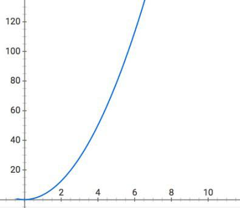
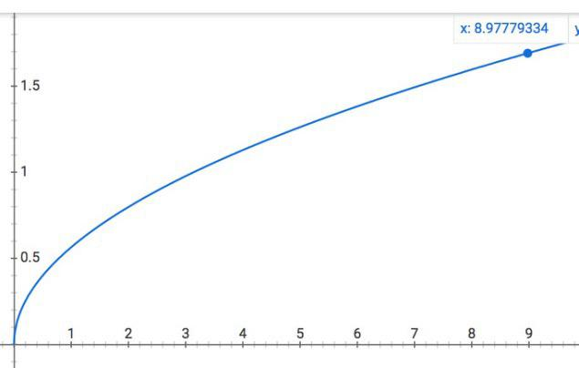
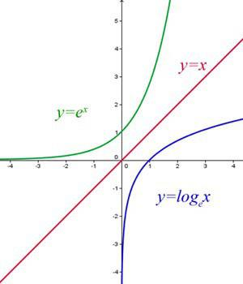
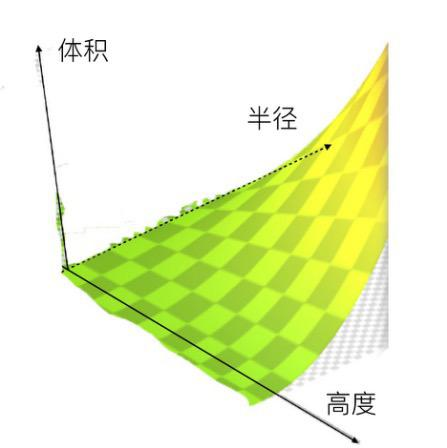

# 0402. 函数2：如何通过公式理解因果关系？
> 吴军·数学通识 50 讲
2019-11-28

我们上一讲在讲函数时说，在函数中，一个变量先变化，另一个随着它变化。比如圆的半径 R 增加一倍，面积 S 增加到原来的 4 倍，后者随着前者变化。如果我们把这个关系上升为抽象的逻辑关系，那么就是半径变化是因，面积变化是果。我们用这样一个箭头代表确定性的因果关系 R→S，用下面这样一个函数来表示：

    S=πR^2

通常，我们称 R 是自变量，S 是因变量，或是自变量 R 的函数，因变量和函数通常说的是一回事。如果把上面这种函数关系形象地用曲线表示下来，那么它就是半根抛物线：

注：这段曲线只有右半边，没有左半边，因为圆的半径不能是负数。

从这个例子可以看出，函数中的自变量，虽然从名称上来看，似乎自己怎么变都行，但其实它有一些特定的限制条件或者范围，比如圆的半径必须大于等于零就是限制条件。我们在之前讲到的几何数列中每一个数，可以表示成 2^N（或者 r^N），但是，这个 N 必须是整数，比如 1，2，3，4 等等，不能是半个，这就是限制条件。

自变量的取值范围或者限制范围，我们称之为函数的定义域。这里面的域，就是疆域的意思，它表明一个函数所描述的变化规律是有范围限制的。当一个函数的定义域确定之后，因变量，也就是函数值也就受到了相应的限制。

比如说几何数列 2^N，取值只能是 2，4，8，16…… 这些特定的整数，不可能是 2.5 这样的小数数字，甚至不可能是 3。函数值的变化范围，我们称之为值域，这个名字顾名思义，也很好理解。

类似的，我们上一讲所说的现实生活中遇到的各种函数，也能确定因果关系，定义域和值域。

比如班上每一个人的身高，因果关系就是人决定身高，也就是说「人→身高」。函数的定义域是特指班上的人，不是所有的人，他们的身高也在有限范围之内，比如从 1.5 米到 1.9 米，而不是任何的高度。你如果算出一个人的身高是 10 米，说明一定是什么地方搞错了。

对于函数，很多人常犯的错误在于没有考虑定义域，滥用函数关系，比如不能假设圆的半径是负数，然后套用 S= πR^2 这样的函数去计算面积。类似的，在生活中，很多函数使用起来也要考虑定义域。

比如对于那些平时成绩在 90 分以上的学生，如果老师每多教 10% 的内容，他们就能多学会 5%，这看似多教是有好处的。但这个函数是有定义域的，对于成绩 70 分以下的人，这个变化规律可能就不成立了，教得越多，成绩越差。因此，使用任何规律之前要看条件是否相符，不能错误地套用了公式。

讲到函数中的因果关系，有两点需要明确指出。

首先，数学上的因果关系和生活中的可能不完全相同。在物理学等自然科学上，因果关系常常是单方向的。

比如你从比萨斜塔上坠下一个球，它就以自由落体的加速度往下坠落，落地时会有一个速度，这个速度是地球重力加速度导致的，因此加速度是速度的因，而不是反过来，这是非常明确的。再比如，张三在 20 米外观看这件事，那么你先扔了球，他才看见，这也是因果关系，不可能倒过来。

但是数学函数中的因果关系未必如此。在一个函数中，自变量和因变量的角色是可以互换的。我们前面说，给定圆的半径，我们通过一个计算面积的函数 S=πR^2，算出面积，因果关系是半径→面积。

但是在现实生活中也有反过来的情况，比如一家四口人到必胜客吃午饭，需要先根据每一个人的饭量，确定面积是多大的披萨饼才够吃，然后根据 R=√（S/π）再算出半径（直径），看看是买 14 寸的、16 寸的，还是 18 寸的。这时面积就是自变量，半径就是因变量了。因果关系变成了面积→半径。

我们同样可以用 x 坐标代表面积，y 坐标代表半径，画一条曲线，就是下面这个形状，如果你对比前一图，会发现两条曲线形状相似，只是翻转了一下。更准确地讲，它和原来的曲线是相对 45 度角的对角线对称的。

为了更完整地描述和研究这种把因和果置换后的函数关系，数学家们提出了反函数的概念，比如 y =√(x/π) 和 y=πx^2 就是互为反函数。在笛卡尔坐标系中，反函数的图和原来函数的图就总是相对 45 度角的对角线对称。比如下图是对数函数（蓝线）和指数函数（绿线）的关系图，它们相对对角线红线是对称的。

为什么对数函数和指数函数会互为反函数呢？我们不妨从两个角度看同一件事情就知道了。

比如你购买国库券 10000 元，以 6% 的年息复合增长，请问 12 年后你的本息一共是多少呢？我们知道 X 年后的本息 Y 是一个指数函数：Y=10000*(1.06)^X，代入 X=12，大约是 20122 元。也就是说大约 12 年后投资翻了一番。

如果我们倒过来问这个问题，今天买 10000 元国库券，多少年后才能本息翻一番，那么这就是对数函数的问题了，我们把 X 作为若干年后的本息总数，Y 作为时间，这样 Y=log（X/10000），算出来大约是 11.896 年，也就是 12 年左右。因此，指数函数和对数函数互为反函数。

说到投资，这里给大家讲一个计算回报的简单方法 ——72 定律。假如你的投资回报率是每年 R%，那么多少年投资才能翻一番呢？基本上是 72/R 年。刚才的情况是 R=6，大约是 12 年，如果提高到 8%，只要 9 年就够了。

别看这 2% 的差异并不显大，如果我们把时间放大到 36 年，也就是一代人的时间，那么回报就是翻番三次和翻番四次的差异了。因此一个人善于理财，还是不善于理财，到退休的时候，财富很容易差出一倍。

接下来我们谈谈数学上因果关系的第二个注意事项，当一个函数的变化由两个，或者更多的变量决定时，单个变量和函数之间的因果关系，并不是函数值变化的必然原因。

比如说，我们要计算圆柱体的体积 V，它和圆柱半径 R 的平方成正比，和圆柱的高度 h 成正比，即：

V=πR^2*h

这时，如果高度增加一倍，体积一定增加一倍吗？我们只能说，有可能，但是前提是半径要保持不变。反过来从结果看，如果体积增加了一倍，我们也并不知道是否是高度变化所引起的。

如果我们把体积 V，半径 R 和高度 h 的关系画在一个三维的图中，那么大概是下面这张图的样子。从图中你可以看出，决定体积的因素很复杂。

在多变量的情况下，我们只能得到这样的结论，就是体积的变化和高度的变化是正相关的，而且相关性是 100%，也就是说，在其它条件不变的前提下，一个变大，另一个也必然变大。类似的，体积变化和半径变化也是 100% 正相关的。

在生活中，很多人经常把正相关性、因果关系和必然性相混淆。比如说，每年的平均投资回报率和最后拿回来的钱总数是正相关的，这点毫无疑问。但是在投资时，总是找那些回报率高的项目或者投资产品，20 年后拿回来的钱一定多么？

不一定，因为最后能拿回来多少钱，不仅看平均回报率，还要看投资风险，一些高回报的项目也是高风险的。也就是说，平均回报率高，和拿回来的钱多并不形成因果关系。

很多人看到别人投资高风险、高回报的项目发了财，觉得这种好事情也能摊到自己身上，可是等自己真拿出真金白银投资时，高回报没有起作用，高风险却应验在自己身上了。了解了相关性和必然性的差别，能让我们少犯错误。

在上面计算圆柱体积这个例子中，我们还只有两个变量，在很多实际问题中，影响结果的变量非常多。比如在经济学上，美国政府和研究机构公布的各种和经济有关的指标有上万个，试图根据几个指标就预测今后的趋势近乎不可能。

在生物体中，情况更加复杂。经济学上的很多指标好歹还是明确的正相关或者负相关，而生物上很多体征和指标，同我们要找的疾病、遗传，或者新陈代谢的相关性是非常模糊的。在这种情况下，我们把相关性误解为有因果关系的必然性，是非常危险的。

但是，我们也不能因为很难确定必然性，就放弃对相关性的探究。只有当我们发现了影响结果的各种变量，并且搞清楚它们和结果之间的相关性，才能对最后结果的走向有一个全面完整的了解。

比如，当我们知道了决定圆柱体质量的三个因素，即它的半径、高度，以及材料的密度之后，虽然每一个因素都不构成质量增加的因果关系，但是在不同场合，我们就知道该如何调整尺寸和选取材料来达到目的。

学术研究的主要目的，已经从过去那种寻找确定性，变成了挖掘尚未人知的，能影响结果的变量，并且寻找它们和结果之间的相关性。在研究某一个变量的影响时，我们通常要屏蔽其它变量的作用。

比如我们研究体积和尺寸的关系，先要假定半径是不变的，才能知道高度的影响。但这样一来，绝大部分学术研究，特别是人文和社会学科的研究，都不得不集中在几个视角，搞清楚特定变量的影响。这并非研究人员缺乏全局观，而是整个学术界其实给他们的分工就是如此。

今天很多学术专著，也是从特定视角看待问题。万维钢老师讲过一句话，人文和社会学科与自然科学领域的特点完全不同，前者更像是江湖，学者们彼此很难互相说服，这其实非常准确地描述了学术界的特点。

了解了这个特点，我们在看学术专著时，就不要把它当作对某个结论全面的论述，而把它们当成是揭示某种相关性的著作就好。

## 要点总结

只有一个变量的函数，自变量和函数值之间有因果关系，一个变化导致另一个变化。但是，函数的使用要考虑使用范围，对于任何规律其实都是如此。

由多个变量决定函数值的函数，每个变量和函数值有相关性，有些还是百分之百的正相关，但是它们没有决定性，也没有必然的因果关系，切忌把相关性和因果关系混为一谈。今天的学术研究通常只能在几个维度研究相关性，因此对于研究的结论，我们要全面看待。

函数的学习就告一段落，下一讲我们学代数模块的新内容「向量代数」。

### 黑板墙

### 01

数学助教——相关和因果

【延伸阅读】

1. 《卓克 - 科学思维课》「265｜心理：再高的相关性也不是因果性」

2. 《为什么》（电子书，每天听书解读，万维钢精英日课 2 解读）

【数学定义的相关性】

统计分析中，会用「相关系数」来衡量两个变量之间的相关性。

- 这个系数在 [-1, 1] 之间，绝对值越接近 1，说明两个变量越相关；越接近 0，则越不相关。

- 最常用的是「皮尔森（Pearson）相关系数」，当然还有其他不同的定义；但是它们都有一个共同的思想——「同涨同跌」正相关，「反涨反跌」负相关。然而「相关系数」只是一个量化的指标，给人参考罢了。

- 有时候，可能两个变量很相关，但是算出来的相关系数并不大，甚至是 0 —— 可能是选错了相关性的「指标」，可能是复杂的「非线性相关」，可能是没有「控制变量」。总之，「指标」是会骗人的。但是，有一个指标，也好过没有指标的瞎猜。

【相关不等于因果】

然而，我们却无法用数学的纯理性，来定义「因果关系」—— 尽管我们本能地认为因果性更有意义。

哪怕「相关系数」绝对值为 1，也可能毫无因果关系。最常见的情况，就是两个「变量」受着同样的「潜在因素」的影响。「冰淇淋的销量」和「被水淹死的人数」存在很大的相关性，其实是背后的「季节」、「气温」作用的结果。两个水平相当的学生，考试成绩会有很大的相关性，难道要说他俩作弊？哪怕存在因果关系，我们还有可能「因果倒置」。学习富人的一些行为只会让我们「显得有钱」，而不会真正变得有钱；很多行为只是有钱的结果。同样的，总结自己或别人的成功「经验」的时候，我们得到的原因，可能是成功的结果。

【用函数理解相关和因果】

「人是一切过往经历的总和」，说的是，此时此刻的你，就是之前你所有的经历的「函数」。「人如其食」（You are what you eat），你的身体状态，就是你所吃进去的所有食物的「函数」。而食物之于身体，就如信息之于大脑；正如「人如其阅」（You are what you read）—— 你大脑中的想法，就是你接受的所有信息的「函数」。昨晚上写完代码之后，脑子一片空白…… 难道要说，代码看多了，脑子要变傻？但我更愿相信只是困了 —— 看吧，其实「因果」更是一个主观的东西。

### 02

数学助教：

1、数学中的 x，y 是平等的。我们时长定性地认为 x 是自变量，y 是因变量，先有了 x 才能推出 y，实际上，x 表示自变量，y 表示因变量只是数学表达中的一种习惯而已，究其本质，x 与 y 是完全平等的。x，y 都是变量，两者的变化都会引起对方的变化，它们的变化是一一对应的，这也是上一讲我们强调的「对应关系」。稍微拓展一下，一个函数 y=2x 和另一个函数 x=2y，甚至 z=2t，w=2v 等等，全都是完全相同的。函数和它用什么字母表示没有关系，表示方式只是一种显性的工具，只要对应关系相同，他们就是相同的函数。

2、控制变量法。相信「控制变量法」这个词大家都是熟悉的，我们在中学物理课程中经常听到这个词。它和我们今天讲的「因果性和相关性」有着紧密的联系。比如：水的沸点（烧开的温度）与气压和其中盐的多少（浓度）都有关系。那么我们就说「水的沸点与气压和浓度都是相关」的。控制变量法是科学研究中最常用的研究手段，它的本质就是将相关性变成因果性。比如，控制气压这个变量为一个定值，改变浓度，这时浓度的变化直接会带来沸点的变化，浓度改变是因，沸点改变是果；相反，控制浓度不变，只改变气压这个变量，沸点的变化就可以归因到气压变化。但是试想：如果浓度变化的同时气压也变化了，这是沸点的改变到底是因为浓度还是气压呢？我们就说不清楚了。所以说，控制变量，也就是本节课说的学术研究只能集中在某几个视角，就是在将相关性变成因果性，只有这样的研究才能归因，才有意义。

### 03

因果性与相关性区别有以下八点：

1）因果性是确定的函数关系，因此只能有一个自变量；

2）当函数可逆时，因变量和自变量可以互换。在具体场景，因果性也可以互换；

3）在一些条件下还可以互为因果，如鸡与蛋的关系；

4）当变量很多时，只能说自变量与因变量具有相关性；

5）相关系数是描述相关性的量度，位于 0 和 1 之间，相关系数越大，相关性越强；

6）但是，相关系数为 1，也不能说明二者存在因果关系，① 如啤酒销量与纸尿裤销量；② 因果关系是逻辑先后的；

7）采用机器学习，人工神经网络，可以对多因素，非线性关系进行学习，训练，从而实现预测，这是大数据的贡献；

8）但要实现人工智能，还是要找到因果性，多变量的定量化的影响概率，条件概率等等，从不确定性中发现确定性，即主控因素，并量化它。

### 04

数学助教：

有句老话，「最了解你的人是你自己」，10 年前说，问题不大。现在再说，可能无法成立。对于一个正常使用互联网的现代人来说，在某些方面，计算机比一个人更了解他自己。借鉴一下海森堡不确定性原理 (ΔxΔp>=h/2)，生活便利x个人隐私 >= 某个值，在享受科技进步带来的便利同时，也泄漏出一些看似「无关紧要」的信息。但是，仅凭这些信息，就能计算出一些对个人来说很「敏感」的特征（比如性别、年龄、种族、智力、团队协作能力、暴力倾向、有无特殊嗜好等）。

说个流传比较广的早期例子，根据 facebook 上的点赞准确预测一个人的特点。其中关于智力的预测，和高智力相关度高的几个点赞的标题：Thunderstorms（雷暴） The Colbert Report（一个电视节目）Science（科学）Curly Fries（卷状炸薯条）。如果问一个人，听到高智力最先联想到的几个词，科学可能还能说出来，剩下几个，尤其是薯条的，概率基本为 0。很显然，喜欢薯条卷和高智力不存在因果关系，但是它们之间为什么会有很高的相关性？简单说，相关性来自点赞的「行为」而不是「内容」。人更倾向于和那些与他们有相似特性的人在一起。高智力人的朋友一般来说智力也比较高。最初发起「Curly Fries」页面或者最初喜欢的可能是某个高智力的人。人点赞行为的原因不一定是真喜欢内容，有可能是为了表达关系或者别的。随着社交媒体的传播，薯条卷在高智力人群里被喜欢的比例高于其它人群。例子里的相关性很显然不是因果关系，但是有些事情就没那么明显。如果仅凭相关性就做决定，可能会南辕北辙。

例子的论文，「Private traits and attributes are predictable from digital records of human behavior」，只有 4 页，有兴趣的可以参考下。

### 05

自变量与函数之间存在着紧密的相关性，并且一方改变通常也会引起另一方的变化。这种强烈的「牵连」关系，有时候就被我们视为因果关系。但函数里的因果，与现实中又有很大的区别。函数的因果关系通常取决于我们的定义，到底是 y = e^x 还是 y = ln (x) ，要看我们想把谁当成自变量。但现实中的因果关系往往是单向的，比如很多动物在晨昏时分都会异常活跃，但反过来你却不能说，它们的活跃让太阳「移动」到了地平线附近。然而现实中因果关系的制约，又不仅仅是「方向性」这么简单；它往往不是直观的、必然的。就我观察，因果经常会以这样几种形式呈现：

1. 概率的因果：即函数影响的不是结果，而是结果出现的「可能性」。例如癌症，我们用概率去描述其发生的可能性，并且评估不同的「原因」对这个概率的影响。比如吸烟、饮食不健康等会提高患癌概率，但提升概率最显著的，却是年龄的增长。

2. 多重因果：核电站会有多道安全措施，出现安全事故，就肯定是所有的措施全都失效，原因不是单一的，而是复合的。现实中「概率」与「多重」经常一起出现，上述癌症的例子就是代表。

3. 不同环境下因果的差异呈现：万维钢老师刚解读完《行为》这本书，里面一个例子就很有代表性：催产素通常被人和慈爱联系在一起，但催产素浓度高，有时却也会呈现更高的攻击性 —— 实际上，催产素能让我们更加区分敌我，在「自己人」这里展现慈爱，对待「敌人」则大胆攻击。实际上，因果的差异呈现，更应该被解释为若干不同层次的因果关系的叠加，有些层次是简单因果，有些则是多重的或概率的因果。

此外，在一些领域，我们甚至还需要评估，因果关系本身的可靠性，或者说是「函数关系」本身存在的概率。比如国际癌症研究机构（IARC）就将各种可能的致癌物，按照证据强度来分级。这个分级描述的，就是我们对「这东西能致癌」这件事有多么确定，至于致癌物到底能提升多大的患癌概率，则不在这个分级的讨论范围之内。
