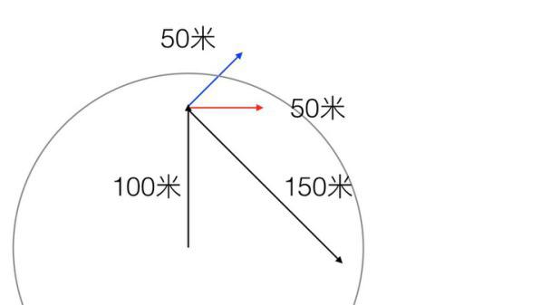
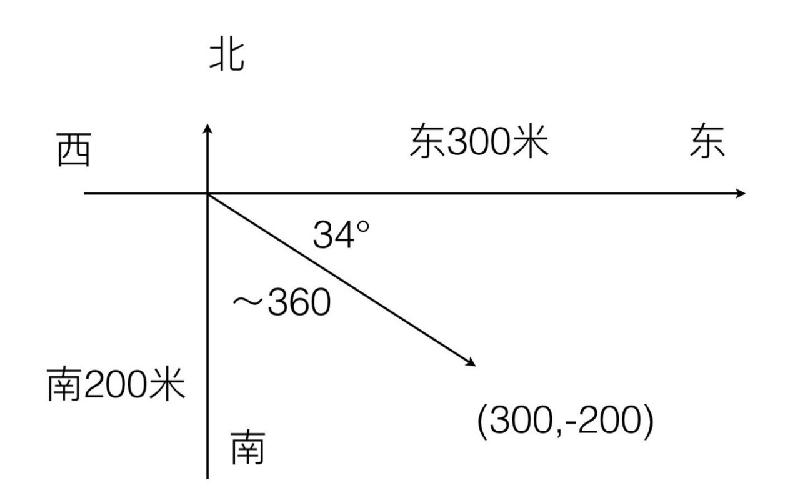
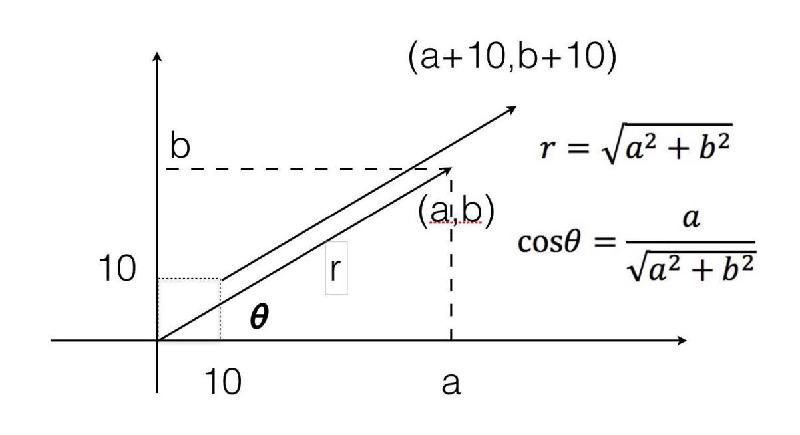
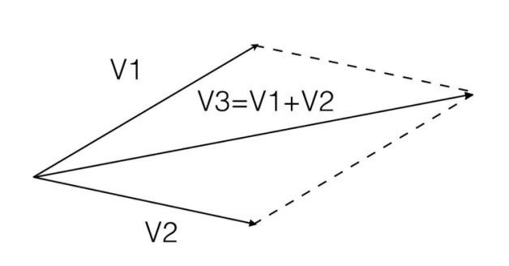

# 0403. 向量代数1：「方向比努力更重要」是鸡汤吗？
> 吴军·数学通识 50 讲
2019-11-29

代数学除了给我们带来了方程和函数这两个工具，还揭示了世界上关于数字的另一个规律，就是数字的方向性。大家可能会说，数字怎么会有方向性，我们不妨先看两个例子。

第一个例子。假如你用 40 公斤的力来拉一个箱子，你的同事用 30 公斤的力来推，那么箱子受力是多少？你可能会说是 70 公斤啊，这是小学生学习完加法后给出的答案，但是如果他学习了减法，可能会想到如果两个人用力方向相反，那么就不是 70 公斤了，而是 10 公斤。但是如果两个人用力方向正好呈直角，或者 120 度角呢？这时合力既不是 70 公斤，也不是 10 公斤，具体是多少则取决于彼此用力的夹角。

第二个例子。某个建筑工地要实施爆破，爆破的半径是 120 米，你要赶快逃离。当然能走的道路未必是一个笔直的方向，你有几种选择。一种是先向北跑了 100 米，又向东跑了 50 米，这时你能逃离到安全区吗？如果你只考虑自己跑的路程，你跑了 100+50=150 米，超过了 120 米，但是由于你跑动的方向并非一个方向，你其实离爆破中心只有 118 米，还在危险区内。在另一种情况下，你先往北跑了 100 米后，再往东北跑了 50 米，这时你就离爆破中心 139 米，你已经安全了。最后一种情况，你先往北跑 100 米，再往东南跑了 150 米，这时一共跑了 250 米，却只离开爆破中心 106 米，可以讲是吃力不讨好。

我把这几个情况画在了一张图里，图中圆圈的半径是 120 米，三种情况分别用红线、蓝线和黑线表示了。可以看出，只有第二种情况，即先往北跑，再往东北跑能够跑出爆炸的范围。

这两个例子虽然是我虚构出来的，但在现实中类似的情况非常多见。我们常说，一个组织，必须形成合力，才能把事情做好，我们还说，一个人如果跑错了方向，再努力也没有用，就和上面两个例子所描述的情况相一致。因此，在这个世界上，对于大部分物理量和在生活中遇到的数量，我们不仅需要关心数值的大小，还需要关心方向。

物理中的力是如此，生活中我们行驶的路径是如此，一个人、一个企业做事的目标和所投入的努力，也是如此。当我们的知识和阅历增加时，认识水平也要相应地提高，特别是如果我们读完了大学，每次看到数字时就必须想一想，「是否考虑了方向？」否则我们就还是停留在小学生对数字的理解程度。

当然，相应的，在数学上也要有工具，来描述带有方向的数字，这种工具被称为向量。类似的，那些只需要关心数值，不关心方向的数量被称为标量。那么在数学上向量是怎么表示的呢？通常有两种表示法。第一种是用所谓的极坐标的表示方法，比如我们常说「前面 100 米，11 点钟的方向」，这就是在极坐标中对向量的一种描述。100 米代表向量的数值，我们通常称之为长度。11 点钟的方向，我们通常称之为向量的方向。在没有参照系的空中或者海上，通常采用这种方法。在世界上一些自然发展起来的城市里，也经常使用这种方式来描述方位，比如在巴黎或者莫斯科，就会以凯旋门或者红场为中心，往某一个方向行进一定的距离。用这种极坐标表示向量的方式在一些城市就不那么方便了。比如在北京或者纽约这种完全是规划出来的城市，街道是横平竖直的，高楼也挡住了视线，没有人会说往 10 点钟的方向走 400 米，因为你要去的点根本没有直通的道路。

实际上，北京和纽约横平竖直的街道本身就是一个笛卡尔坐标，人们通常会这样说：「往东 300 米见到红绿灯往南拐，再走 200 米就到了。」我们如果以所在地为原点，按照上北下南左西右东的概念来确定方位的话，往东 300 米，往南 200 米，目的地的坐标就是（300，-200），也就是说，我们直接用终点的坐标表示向量更有效。而那个目标点离我们的距离可以根据勾股定理算出来，是大约 360 米，和 X 轴的方位角是斜下方 34 度，这和我们用长度与角度的组合表示向量是一回事。我把这两种表示法画在了下面的图中。

通常我们在坐标系中用一个有长度、带箭头的线段表示一个向量。一般来讲，在笛卡尔坐标中我们喜欢将向量的起点放在原点，终点就是坐标系中的某个点，然后我们从原点往那个点画一根带有箭头的线段。不过向量的起始点不重要，重要的是起始点的相对坐标。比如从原点出发指向（a，b）点的向量，和从（10，10）这个点出发，指向（a+10，b+10）的向量，其实是一回事。

接下来，在给定坐标后，向量的长度和方向怎么计算呢？从图中你可以看出，从原点出发指向（a，b）的向量，其实就是以 a，b 为直角边的直角三角形的斜边，因此根据毕达哥拉斯定理，我们很容易计算出这个向量的长度 r 是 a 的平方加 b 的平方后开根号。当然，还可以用余弦三角函数的定义，算出这个向量和 X 轴的夹角。这两个值我也体现在上图中。

如果我们对比一下极坐标和直角坐标对向量的表示方法，你会发现它们其实是一回事。不过在多维空间中，直角坐标常常更方便。比如三维空间中的一个向量，我们把起点定为原点，它就应该对应一个三维坐标（a，b，c），如果是 N 维空间的向量，就会对应 N 个坐标，我们不妨假设为（k1,k2,k3,……,kn）。

任何数量都可以做加减乘除的运算，向量也可以。向量的加法实际上很简单，如果一个向量是（k1,k2,k3,……,kn），另一个是（j1,j2,j3,……,jn），两个向量加起来，就是（k1+j1，k2+j2,k3+j3,……,kn+jn）。但是由于向量有方向性，向量的长度和角度，并不是原来长度和角度简单相加。

下面我们就用二维空间的向量，说说向量相加后的长度。我们假定有两个向量 V1 和 V2，它们相加后的向量是 V3，即 V3=V1+V2。那么 V3 的长度是多少呢？它遵循一个平行四边形法则，为了说明这个法则，我画了一个简单的图：在图中，V1 和 V2 是两个向量，我们以它们为两条边画一个平行四边形，平行四边形的对角线就是这两个向量之和。

平行四边形对角线的长度，我们可以用余弦定理算出来，这里我们就把公式省略了，转而讨论几个特例情况，这样大家更容易有直观的认识。为了方便起见，我只给出 V1 和 V2 长度相等的情况，而且假设它们都是单位长度，这时当 V1 和 V2 有不同夹角时，V3 的长度如下：

1. V1 和 V2 方向相同，那么 V3 的长度正好是两个向量长度的总和，也就是 2，这是最长的情况。

2. V1 和 V2 呈 30 度夹角，那么 V3 大约是 1.93，也非常长。

3. V1 和 V2 呈 60 度夹角，V3 是 1.73，就已经有点短了。

4. 如果 V1 和 V2 垂直，那么它们相加，V3 的长度正好符合毕达哥拉斯定理，大约是 1.4。

5. V1 和 V2 呈 120 度夹角，那么 V3 的长度只有 1，也就是说等于 V1 或者 V2 本身，这样两个向量叠加后在长度上并没有产生什么效果。

6. 如果 V1 和 V2 呈 150 度夹角，那么 V3 的长度只有大约 0.5，也就是说等于原来 V1 或者 V2 的一半。

7. 最后，如果 V1 和 V2 方向相反，也就是呈 180 度夹角，V3 等于零，也就是说 V1 和 V2 抵消掉了。

从这个结果可以看出，要形成合力就必须方向一致，即便方向不能完全一样，彼此之间方向的夹角也需要尽可能地小。如果两个向量的夹角超过了 120 度，那么两个力加起来还不如一个力的作用。理解了数量的方向性，我们就可以得到一个自然的推论，那就是做事情要聚焦。如果不聚焦是什么结果？你往三个方向使劲，每一次努力其实都是有成本的，但是很多时候努力相互抵消掉了。

一个单位里，特别是那些规模不大的创业公司，如果什么事情都想做，力量不仅分散，而且彼此会产生矛盾，作用就抵消了。即使没有太多矛盾，只要用力的方向不一致，效率就低。比如说如果两个人用力的方向是 120 度，也就是说有时候合作，有时候闹分歧，结果就是两个人工作只产生了一个人原来应有的产出。一些企业迷信把几个牛人堆到一起就能产生好的效果，这其实是小学生的思维方式。如果找来的人不能配合，有时越牛越有副作用。不仅多个人合作会因为方向不一致出问题，一个人自己努力，如果方向总是摇摆，也会出大问题，比如我们前面举的逃离爆破现场的例子中，方向来回换，特别是动不动拐大弯，其实最后是在兜圈子。

既然向量之间的夹角这么重要，它们又是怎样计算的呢？其实也是用余弦定理。计算向量的夹角有一系列非常重要的应用，这些我们下一讲再讲。

## 黑板墙

### 01

数学助教：

今天聊点儿数学之外的事…… 但与今天的主题有关：速度和方向。

奇葩说选手艾力有句名言：一艘船在海中航行，如果没用方向，那么任何方向吹来的风都是逆风。今天这个世界，我们经历了太多追赶，看到了太多的年轻有为，造成一种三十岁还不成材这辈子就完蛋了的误解。知识城邦金句大王张潇雨老师说：「要记得，这个世界上并没有什么同龄人，平均值，社会标准。只有我自己，眼前事，脚下路。」

在我看来，每个人必然是不一样的，我们不能要求每个人都以同样的节奏和速度去趋于成功，如果你发现自己比别人慢，千万不要过分苛责自己，谁也没有规定非要在什么年龄干成什么事。在人生的道路上，比速度更重要的是找到自己的节奏和方向。确定了目标，就有了方向，剩下的就是按照自己的节奏，坚持下去！

任何人的成功经验都只能是借鉴，不能照抄，因为它不可能被复制一次。能评判我们对错的，只有我们自己。埋头追赶的时候，请不要忘记时常抬头调整节奏，修正方向。时常问问自己的内心，这是不是我想要的？我有没有被什么东西带跑偏了？一个不能自己掌舵的人生，跑得再快都是随波逐流。欲速则不达，就是因为没有停下来，好好看看方向。

### 02

数学助教：方向与目标

【向量的内积】

向量的「加减」可以理解成位置的移动，那么，两个向量「相乘」会得到什么？在「内积」的意义下，会得到一个没有方向的数值。（公式见文末）

那么这个数值代表什么？如果你还记得中学物理中的一个知识：一个「外力」对物体「做功」的大小，就是代表「外力」的向量与物体的「位移」向量之间的「内积」。只有这两个向量之间的夹角小于 90 度，外力才对物体的移动起到了「正面作用」（做功为正），否则，看起来在使劲，实际上可能起了反作用。

【我们需要目标】

同样的，如果眼下努力的方向，和真正的目标方向不一致，甚至「夹角」超过了 90 度 —— 你在消磨你自己。很多时候，焦虑来源于，将目光放在了「与他人的比较」上，而不是你真正的目标。为了克服这种焦虑，「别人会的我也要会」，拼命地学习各种「技能」，最后耗散了自己宝贵的精力，却可能完全偏离原先的轨道。疲于奔命，却从不停下思考：自己的努力，是因为「饿」还是因为「馋」。

我们需要一颗「北极星」。时不时地抽身出来，计算一下自己努力的方向和「北极星」方向的夹角；同时，给自己的努力，打上一个「进度条」—— 它足以驱散我们的大部分焦虑和迷茫。

    a*b = |a|*|b|*cos<a,b>，其中 |a| 和 |b| 分别代表两个向量的长度，cos<a,b> 代表 a 和 b 的夹角的余弦值。

### 03

合力最大需要同向，信息最大则需正交。

通过今天的内容，对照复习信息论中，谈《信息的正交性》，两者不同的性质，帮助理解、连结相关知识。力学上，当两作用力 (a 与 b) 的夹角为 0 度，也就是同方向，合力的量值才等同相加 (a+b)；夹角为 0-90 度，合力则介于 (a+b) 与 (a^2+b^2)^0.5；夹角为 90-180 度，合力则介于 (a^2+b^2)^0.5 与 |a-b|。

信息则不然，相同的信息使用两次，不会产生两倍效果，信息要找彼此垂直的。那么什么是正交的信息呢？信息能对应成某空间的一个 vector，两个信息代表的 vector 若是正交，则能提供最多信息、克服最多不确定。我们可以记住三个原则：不同信息要来自不同信息源；避免反覆使用相互包含的信息，别做无用的功；看问题要刻意从不同角度观察，若能找到相互垂直、不重复的角度最好。

未来，当孩子们学习到向量的概念时，我会将力学与信息论这两者同时比较，让他们能做到横向学习、启发多元思维。

### 04

数学助教：

【从各种角度理解向量】

1. ​一个向量是包含大小和方向的量。它在空间里可以表示成一个有确定长度的箭头。比如你打羽毛球时候击球那一瞬间对羽毛球作用的力，就是个向量。

2. 如果引入坐标系的话，在三维空间的笛卡尔坐标系里，一个向量就可以写成​三个分量的形式。比如一个和 x 轴平行的单位向量就可以写成 (1,0,0)。你也可以把像这样随便并排列出来的三个数字当成一个向量。

3. 向量其实不用坐标系它就可以在空间中存在。我们人为的规定了一个坐标系以后，向量才在这个坐标系下有了三个分量。​那要是换个坐标系呢？它又有了不同的分量。这就是坐标变换了。所谓横看成岭侧成峰，转一个坐标系，同一个向量就变得它妈妈都不认识。

4. 那有啥是不变的呢？它的长度是不变的。这种在坐标变换下保持不变的东西，是我们认识向量的抓手。可以叫它长度，也可以叫它「向量的模」，或者「范数」。(准确来说是 2 - 范数)

5. 如果一个量不止包含大小，还包含两个以上的方向呢？那这样的量就叫「张量」​。机器学习里很多人听说过的 tensorflow，那个 tensor 就是张量。这可以认为是向量概念的一种「延拓」。二阶张量和向量一样也有不变量，区别在于向量的不变量是一个，而二阶张量的不变量有三个。

6. 那还有没有别的延拓方法呢？当然有。两个数字用括号括起来是个二维空间里的向量，3 个数字就是三维空间的向量；那 4 个数字并排呢？5 个、 6 个呢？延拓一下，n 个数字并排写在一起，也可以看成是「n 维空间中的向量」。这个东西别看它抽象，它已经在推荐算法里用了十好几年。

一个向量概念，简直打开了一扇新世界的大门。大门的另一端有无数美丽的世界，什么线性代数、矩阵论、人工智能、张量分析与场论、连续介质力学（…… 后面几个是不是硬核过头了），而向量就是这些世界里基础中的基础。​

### 05

凡是能提到方向的一般都不是鸡汤，其主要差异在叙述角度的不同。比如在实际管理工作中，总会存在着几种带有方向的力量，即管理的矢量性。他们一方是管理主体发出的正方向的「管理力量」。而这部分力量传导到下面被管理者时，就会变成了两部分。一部分是管理客体的「服从力量」，另一部分则是管理客体的「非服从力量」。

理论上这几种矢量对立统一，影响着管理活动的绩效、管理组织的和谐。但如果相互关系不和谐时：管理者就被会称为「没人性」；「服从力量」就会被称为「被洗脑了、打鸡汤了」，而「非服从力量」就是会被称为「不合群、破坏者」。

所以，任何时候的观念差异，其实只是不同力量方向上对立。所以，人们需要改变的不是道德观，而是看问题的角度。

### 06

想起吴伯凡老师以前讨论过惠普:

惠普曾是硅谷的象征，曾一度是 IT 产业创新的代名词。但如今的惠普正变逐渐变成一家越来越无关紧要的公司，根据管理学家的分析：惠普的创新能力和创新体系之间有一个非常大的冲突，一方面，惠普是一家很能创新的企业；另一方面，它也是一家没有创新体系只有创新行为的公司。

虽然惠普一直在进行各种各样的创新，但它是一种「冒泡式创新」: 今天这个人冒个创新的泡儿明天那个部门又冒了一个创新的泡儿…… 整天就看见公司里在冒「创新的泡儿」，但最终，惠普没有一个创新能力。这就如同许许多多方向上向量的叠加，看起来花团锦簇，实际上互相抵消，不同向量想加的结果是 0。

这还可以延伸到很多事情上：生活中不乏那种鬼点子特别多的人，他们谈起想法和创意来滔滔不绝，但没怎么下地做过实事儿，结果是想法很多并没有带来真正的认知增量；我们看到一家公司上上下下忙活得不亦乐乎，但大家的努力并没有往一处使，而是各自心怀鬼胎，最终公司倒闭了。

### 07

昨天和朋友讨论企业的困境，两人的观点很一致，企业最大的麻烦不在外部，而是在内部。外部市场带来的挑战，都是有办法来应对的，只要内部能够团结一致，向同一个方向努力，总有办法找到出路 。但是团结一致这个前提，特别难实现。企业发展到一定阶段，人多了，想法也就多了。当企业没有一个能够凝聚众人的价值观时，大家就都会认为自己的想法更正确，都想按照自己的方向去努力。结果就像今天吴军老师说的例子一样，努力了半天还在原地打转。更有甚者，一些人能力虽然不小，但是所做的努力是有利于自己而对企业有害，这样的人一旦占据了关键位置，企业的前途就更渺茫了。不过昨天的聊天还是让给我看到了希望，在企业的里，总还是有一些人，有着正确的价值观，坚持做正确的事。有这样的人不断努力，并且越来受到重视，就还有希望。

