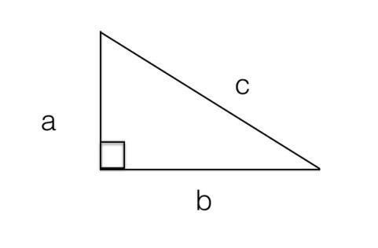
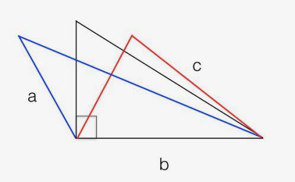
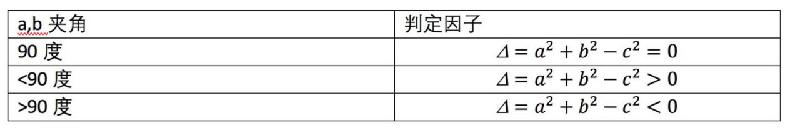
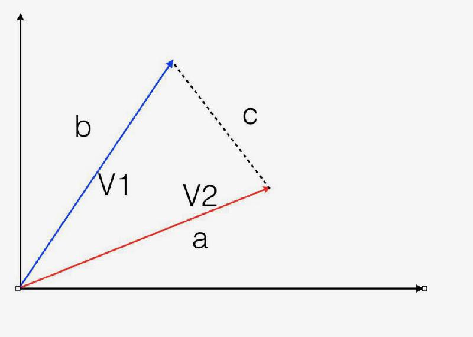
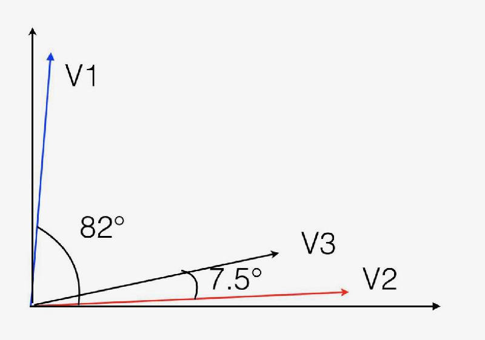

# 0404. 向量代数2：如何通过向量夹角理解不同「维度」？
> 吴军·数学通识 50 讲
2019-11-30

上一讲我们讲到，要形成合力，就需要力的方向一致。类似的，要走得远，也需要前进的方向不经常出现偏差，这些都涉及到向量之间角度的计算。而这个计算是依靠余弦定理完成的。

余弦定理大家在中学都学过，但我估计绝大部分人都忘了，因为你恐怕一辈子也没有用一次。这也不能完全怪大家，因为在中学里，我们教余弦定理时，主要是为了让大家知道在三角形已知两条边的情况下，如何计算第三条边的长度，而这件事在我们生活中几乎用不到。我们的教科书中，对于余弦定理其它的应用根本没有讲。今天，我们就从毕达哥拉斯定理出发，给大家定性地讲讲余弦定理是怎么一回事，看看它除了算三角形的边长外，还有什么用。

我们先来回顾一下毕达哥拉斯定理。假如三角形的两条直角边是 a 和 b，那么斜边 c²=a²+b²。为了加强你的感性认识，我把之前我们画的图又画了一遍，然后把这个公式写在了图的下方：

c²=a²+b²

接下来我问大家一个问题，如果 a 和 b 的夹角是锐角，也就是比 90 度小，那么 c² 和 a²+b² 哪个更大？如果是钝角呢，也就是比 90 度大的角，情况又如何呢？这个问题其实我们画一下图就一目了然了。

从图中很容易看出，如果 a 和 b 的夹角超过 90 度，也就是图中蓝色的部分，所对应的斜边比较长，c² 超过了 a²+b²。如果不到 90 度，那么就比较短，c²<a²+b²。也就是说，对比一下 c²，以及 a²+b²，就知道夹角是什么样的角了。为了进一步方便起见，我们把毕达哥拉斯定理重新写一下，变成这样一种形式：a²+b²-c²=0，我们将等式左边的部分，也就是 a²+b²-c² 作为一个判定因子使用，我们用 𝚫 表示它。根据 𝚫 和 0 比较的大小，就可以判断夹角。具体的判别如下：判定因子小于 0 为钝角，等于 0 为直角，大于 0 为锐角。

如果我们回顾一下函数的概念，就会发现 𝚫 是 a，b，c 三个变量的函数。对于同样一个角，如果三角形边长都比较长，那么 𝚫 的动态范围很大。如果边长很短，𝚫 的动态范围就很小。为了消除边长的影响，我们将 𝚫 再除以夹角的两个边长（a 和 b）的积，这样可以保证处理过的 𝚫 的动态范围就在 - 2 到 + 2 之间。如果 𝚫=-2，那么夹角最大，就是 180 度。如果是 0，就是 90 度。如果是 2，就是 0 度角。当然我们还可以再除以 2，将这个值的范围规整为 -1 到 1 之间，事实上它就等于夹角的余弦。

这样一来，我们就从毕达哥拉斯定理出发，建立了角度判定因子 𝚫 和具体角度的关系，然后我们将这种关系称作余弦定理。余弦定理的思想最初出现在欧几里得的《几何原本》中，但是由于当时并没有成体系的三角学，因此并没有把这个判定因子和角度的函数用余弦表示出来。到了 15 世纪，波斯数学家贾姆希德·阿尔卡西正式提出了余弦定理。

今天，我们之所以花了不少篇幅讲解余弦定理的来龙去脉，是让你再次体会数学体系的重要性，因为它可以从已知的定理推导出新的定理。由此，我们可以体会各种数学概念之间的关联。当然这只是我们讲述余弦定理的附带目的，主要目的是介绍向量夹角的计算。回到向量夹角计算的问题，当两个向量确定之后，我们可以把它们的起点都挪到原点，它们各自的终点和原点之间，就构成一个三角形，如下图所示。这个三角形的三条边显然是确定的，由此我们可以算出判定因子 𝚫，然后根据余弦定理计算两个向量的夹角。

接下来的问题就是，算出两个向量的夹角有什么用？它其实有很多的应用，比如可以对文本进行自动分类。这两件事情看似不相干，怎么会联系到一起呢？下面我们就大致介绍一下计算机进行文本自动分类的原理。

我们知道一篇文章的主题和内容，其实是由它所使用的文字决定的，不同的文章使用的文字不同，但是主题相似的文章使用的文字有很大的相似性。比如讲金融的文章里面可能会经常出现「金融」、「股票」、「交易」、「经济」等词，讲计算机的则会经常出现「软件」、「互联网」、「半导体」等词。

假如这两部分关键词没有重复，那么我们很容易把这两类文本分开。假如它们有重复怎么办？那么我们就要看这两类文章中，各个词的频率了。根据我们的经验，即使在金融类的文章中混有一些计算机类的词，那么它们的词频不会太高，反之亦然。

为方便说明如何区分这两类文章，我们就假设汉语中只有「金融」、「股票」、「交易」、「经济」、「计算机」、「软件」、「互联网」和「半导体」这八个词。假设有一篇经济学的文章，这八个词出现的次数分别是（23，32，14，10，1，0，3，2），另一篇是计算机的文章，这八个词出现的次数是（3，2，4，0，41，30，31，12），这样它们就各自形成一个八维的向量，我们称之为 V1 和 V2。

如果我们能够在八维空间中将它们画出来，你就会发现它们之间的夹角非常大。我算了一下，大概是 82 度，近乎垂直，或者说正交。由于这些向量每一个维度都是正数，因此它们最大的夹角就是 90 度，不会更大了。这说明两类不同文章所对应的向量之间的夹角应该很大。

如果我们再假设另有一篇文章，八个词的词频是 V3=（1，3，0，2，25，23，14，10），那么它和上述第二篇文章对应的向量的夹角只有 7.5 度。我用二维的坐标将这三个向量的关系大致示意如下。

从图中可以看出第一个和第二个向量的角度很大，而第二个、第三个的夹角很小。由此，我们大致可以判定第三篇文章应该和第二篇主题相近，也属于计算机类的。

接下来我们需要思考一个问题，什么样的向量之间夹角会比较小，什么样的会几乎正交呢？如果你对比上面三个向量，就会发现这样一个特点：当两个向量在同样的维度上的分量都比较大时，它们的夹角就很小。反之，当两个向量在不同维度上分量较大时，就近乎正交。

比如第二个、第三个向量，它们在后四个维度分量值都较大，因此它们的夹角就小。而第一个向量在前四个维度的分量较大，在后四个很小，和第二个向量的情况正好错开，因此就近乎正交。关于向量的夹角，有两个特殊情况大家需要留心一下：

1. 如果两个向量在各个维度的分量成比例，则它们的夹角为零。

2. 如果一个向量在所有的维度都相等，比如像（10，10，10，10，10，10，10，10）这样的向量，它可能和任何一个向量都不太接近。这个性质我们后面还要用到。

当然，在真实的文本分类中不止这 8 个词，有 10 万这个数量级的词汇，因此每一篇文章对应的向量大约有 10 万维左右，这些向量我们称之为特征向量。通过利用余弦定理计算特征向量之间的夹角，我们就能判断哪些文本比较接近，该属于同一类。

向量不仅可以对文章进行分类，而且还可以对人进行分类。今天很多大公司在招聘员工时，由于简历特别多，会先用计算机自动筛选简历，其方法的本质，就是把人根据简历向量化，然后计算夹角。具体的做法常常是这样的：首先，它们会把各种技能和素质列成一张表，这就如同我们在做文本分类时会把词汇列成一张表一样，这个表有 N 个维度。对于不同岗位人员的要求，体现为某些维度权重很高，某些较低，一些无关的就可以是零。比如说对开发人员的要求主要是六个方面，权重如下:

1. 编程能力 40

2. 工程经验 20

3. 沟通能力 10

4. 学历和专业基础 10

5. 领导力 10

6. 和企业文化的融合度 10

对销售岗位的要求会有所不同。这样每个职位都对应一个 N 维的向量，我们假设是 V。接下来计算机会对简历进行分析，把每一份简历变成一个 N 维的向量，我们假设是 P。然后我们就计算 P 和 V 的夹角，如果夹角非常小，那说明某一份简历和某一个岗位可能比较匹配。这时简历才转到相应的 HR 部门，HR 人员才开始看简历。如果某份简历和哪一个岗位都不太匹配，这份简历就石沉大海了。这种做法是否会有误差，让一些好的候选人永远进不了 HR 人员的视野呢？完全有可能，但是这种概率并不高，因为计算机做的只是初步筛选，标准是比较宽的。

要知道今天像 Google、Facebook 或者微软这样的公司，一个职位常常有上百个求职者，最少也有十几个，合格的多则有十个、八个，少则有三五个，漏掉一两个合格的人，对公司来讲没什么损失。但是这对于求职者来讲，就是 100% 的损失。因此，除非有非常强的推荐，否则简历写得不好经常连第一关都过不了。

很多人在写简历时常犯的一个毛病就是重点不突出，他们所对应的向量其实就是一种每个维度数值都差不多的向量。我们在前面讲了，这种向量和其它向量的匹配度都不高。很多人喜欢在简历中把自己有关或无关，所有的经历都写进去，然后把自己描绘成全能的人，其实在计算机匹配简历和工作时，这种简历常常一个职位都匹配不上，因为这就像我们前面说的每个分量都是 10 的向量，和谁的夹角都小不了一样。很多人觉得多写点东西没坏处，这种认识是错误的，这些画蛇添足的内容其实稀释了求职者的竞争力。

那么好的简历应该是什么样的呢？如果你在求职单位有熟人，不妨问问他们对某个职位的要求，然后根据这个要求写简历，这样在他们看中的维度你的得分就高，在他们根本不在意的维度，你也不需要强调。

今天我们讲了向量之间的夹角是如何计算的。通过它，我们回顾了毕达哥拉斯定理，介绍了余弦定理。然后我们用一些实例说明了向量的用途。下一讲我们看看，很多向量放到一起，会变成什么。

## 黑板墙

### 01

数学助教# -「判定因子」的规范化

【为什么要用 𝚫 除以 2ab ？】

简单说是为了将「判定因子」𝚫「规范」到 [-1, 1] 区间内。可是为什么偏偏要除以 2ab 呢？

1. 按照文中的符号表示，并且假设 a>b，c 为三角形的第三条边，它的长度范围只能在 a-b 到 a+b 之间。（可以由「两边之和大于第三边，两边之差小于第三边」得出）

2. 那么 c^2 的取值范围就是 (a-b)^2 到 (a+b)^2 之间，展开就是 a^2 + b^2 -2ab 到 a^2 + b^2 +2ab 之间。

3. 于是「判定因子」𝚫 = a^2 + b^2 - c^2 的范围就在 -2ab 到 2ab 之间。

4. 将 𝚫 除以 2ab，这个范围自然就「规范」到了 -1 到 1 之间。

本质上，判定因子的规范化，就是将不同的事物放到同一个尺度下进行比较，防止「作弊」。

### 02

数学助教# - 一切皆数

【用「投影」理解余弦值】

想象面前有一个桌面和一支笔，桌面正上方有一盏灯，发出垂直向下的平行光线。将笔的一头固定在桌面，用手将笔的另一头慢慢提起，你会发现，这支笔在桌面上的影子逐渐变短，当笔与桌面完全垂直的时候，笔的影子变成一个点（长度为 0）。在笔头逐渐抬起的过程中，这支笔在桌面上的「投影」从它的「原始长度」变化到 0；而数学上，它与桌面的夹角逐渐从 0 度到了 90 度，对应的「余弦值」从 1 变到了 0。

事实上，对于两个长度均为 1 的向量，二者夹角的余弦值（绝对值），就是一个向量在另一个向量方向上的投影长度。由于「余弦值」只与向量夹角有关，与向量的长度无关，因此对于任何两个向量，我们都可以想象它们的长度为 1，然后再应用上一句结论。

【从真实世界到向量空间】

事实上，向量的概念不只是「有长度和方向的箭头」，它更是「对现实事物的一种数字化编码」，是对真实世界的数学式刻画。除了文中提到的文本和简历，任何一类事物，都可以从中抽取合适的「特征」，表示成 n 维向量的形式。因此，每一个事物，都可以看成是 n 维空间中的点。（当然这个过程可能会损失很多信息）

为什么要将现实事物表示成向量？因为计算机只认「数」。而一种合理的「向量化编码」，正是实现人工智能的第一步 —— 它相当于 AI 的「食物」。我们看不到的 n 维空间，却时时刻刻环绕着我们。假如我是 AI，那么我会看到一个怎样的世界？一切都是向量！

### 03

数学助教：

今天的课听得很兴奋！感到自己对数学的理解又加深了一丢丢。

以前学习数学，将数学学习和数学应用是割裂开来的，学余弦定理时，觉得它的用处就是「知道向量长度求向量夹角」或是反过来「知道向量夹角求向量长度」，却从不知道「夹角的大小」可以作为两个向量「匹配程度」的度量。而世界上的一切事物，都可以由一个或几个特征维度构建成「向量」。这样，世界万物统一于向量，向量与向量之间靠夹角相关联，简直有一种「大一统」的感觉。

我甚至感到，专门研究「向量空间和 n 维矩阵」的线性代数即将发挥的重要作用。这种冲动，让我想要再学一遍线性代数，重新认识一下这个学科，它一定不是原本那个教会我「怎么求行列式，怎么解线性方程组」的线性代数，而是一个可以「联系世间万物，研究各种事物之间关联性」的有力工具。

对计算机科学知之甚少，但是吴军老师通过讲数学课，让我明白了一些计算机的工作原理，这就是数学这个基础学科在专业领域学科中的基石作用，也是为什么吴军老师在本课程最开始就说：「无论你的专业和工作是什么，数理化决定了知识结构能搭多高，在专业上能走多远，尤其是数学」。

相信你随着课程的深入，对这一点的体会也会越来越深刻！

### 04

老师在《数学之美》一书中，也详细介绍了如何通过运用余弦定理来判断新闻的特征向量之间的夹角，从而让计算机能够确定新闻的类别。

一篇新闻里会有很多词，像「之乎者也的」这种虚词，对判断新闻的分类没有太大的意义。而像「股票」「利息」这种实词，是判断新闻分类的重点词。科学家精选了一个词汇表，这里面收录着 64000 个词，每个词都对应一个编号。他们先把大量文字数据输入计算机，算出每个词出现的次数。

一般来说，出现次数越少的词越有搜索价值，比如「爱因斯坦」「数学之美」；而出现次数越多的词，越没有搜索价值，比如「一个」「这里」等等。根据这个标准，把词汇表里的 64000 个词都算出各自的权重，越特殊的词权重越大。然后，再往计算机里输入要分类的新闻，计算出这 64000 个词在这篇新闻里的分布，如果某些词没有在这篇新闻里出现，对应的值就是零，如果出现，对应的值就是这个词的权重。这样，这 64000 个数，就构成了一个 64000 维的向量，我们就用这个向量来代表这篇新闻，把它叫做这篇新闻的特征向量。

不同类型的新闻，用词上有不同的特点，比如金融类新闻就经常出现「股票」「银行」这些词，所以不难判断，同类新闻的特征向量会有相似性。这样的话，只要算出不同新闻特征向量之间夹角的大小，就可以判断出它们是不是同一类新闻。这时就要用到余弦定理，来把两则新闻的特征向量之间的夹角算出来。科学家可以人工设定一个值，只要两个向量之间的夹角小于这个值，这两则新闻就可以判定成同一类新闻。一个简单的数学定理，通过科学家们的巧妙应用，再次举重若轻地解决了一个难题。

### 05

数学助教：

余弦相似度算法简单实用，但也有局限性。向量有长度和方向，余弦相似度算法关注的是 2 个向量方向间的差异，而不去管长度。这个直观上应该比较容易理解，随手画 2 条线（向量 a b)，使得它们的长度差不多，夹角很小。从几何上理解，向量 a b 很接近。按照余弦相似度，ab 也比较接近。如果把 b 的长度放大 100 倍呢？这时，它们的余弦相似度还是很高。但是从几何上看，a 和 b 就差得有些远了。

这样会导致什么问题？比如，针对不同的产品，不同的用户会打出不同的分。假设分值从 0-10（越高越好），用户 a 对产品 (i,j) 打分是 (1,2)，用户 b 对产品 (i,j) 打分是（9,10)。那么 a 和 b 在针对 (i,j) 的偏好上相似度是多少？按照余弦相似度的定义：

    相似度 = (1*9+2*10)/(sqrt (1^2+2^2)*sqrt (9^2+10^2)) = 0.964

只看这个数值，a 和 b 应该是很接近的。但是实际上，a 和 b 的喜好是相反的。如何解决？考虑长度的影响。余弦相似度公式：

            Σ(xi*yi)/(sqrt(Σ(xi^2))*sqrt(Σ(yi^2)))

只需要用 xi yi 分别减去对应的平均值，xi'=(xi-avg (x)) yi'=(yi-avg (y))，用 xi' 和 yi' 替换掉原来的 xi yi 即可。这种算法，叫调整余弦相似度。按照这种方式计算 a b 的相似度，假设 i j 在不同用户间的评分平均是 5，a 和 b 的相似度为 -0.968。

### 06

向量化 —— 数字化的再一次升级

近两天您用两课的篇幅，为同学们介绍了向量代数的基本逻辑，从余弦定理的诞生和历史沿革的角度，为同学们展开了一幅精彩的向量代数应用的画面。讲述的内容不仅深入浅出，而且精彩深刻，使我们很受触动。

过去在老师讲过的几门课中，我能够理解到，伴随着计算机和应用数学的出现，进半个多世纪，人类科技的发展实际上是一个万物数字化的过程，一切的物品只要用「0」、「1」编码成一串具备物品信息属性的代码，计算机就可以将这些他能够识别的信息进行加工，产生出人们需要的任何维度的结果。记得在《信息论 40 讲》中老师带领我们系统梳理了一些信息处理和应用的方法逻辑，比如矢量化、信息的正交化和交叉熵等。但有时知识的缺失，让我们并不能从根本上理解其中的底层逻辑。

今天老师从向量代数的角度讲透了余弦定理的应用，让我有了豁然开朗的感觉。原来老师经常提到的向量的正交和夹角的计算，就是初中基础知识的延展，对于多维信息之间的关系的判断，在数学上早就有现成的定理。曾经听老师讲过，计算机系的同学想要学好编程，数学基础和思维是关键。一些精妙的模型和算法无不脱胎于具有普遍性的数学规律，在计算机科学中很多具有普遍性的数学模型可以直接转化为特定的应用，它们可以在不同的维度上对信息进行数字化、向量化、模型化和系统化，进而在现实与虚拟中找到更多的联系。

今天，老师之所以不厌其烦将数学这一最基础的学科，根据结构划分和历史沿革，系统全面的呈现在同学面前，一方面当然是为了完成更广泛的通识教育；但更重要的是为了培养大家的数理逻辑的素养，让我们能够在日常工作和生活中广泛的思考和应用。曾几何时，我们走在未来数字化的街道上，随手带上「钢铁侠」同款的眼镜，惊诧于系统数据分析的强大时，我们是否会想到时隔数千年前的毕达哥拉斯定理？我们都知道，现代知识体系的发展就像人类大脑的褶皱一样，不断的折叠和弯曲，处于其中的我们是否在宏观的统览和精细的研学中自由切换，决定了我们事业的基线和顶点。

### 07

面对一个人、一篇文章，或者其他种种事物，我们经常会遇到一个难题，就是如何通过量化的方法，来对不同的对象进行科学分析。这个问题的难点就在于，研究的对象往往包含多维度的信息，而我们的选择决策，又要同时兼顾多元化与特定偏好。比如组建团队，既保证各种能力搭配均衡，也要让成员的性格能够相互协调。这时候，特征向量就是个很好的工具。

打游戏的朋友可能见过，一些游戏里，尤其是在运动类与某些 RPG 游戏中，球员、角色、赛车等等，除了用丰富多样的参数来描述特点，也会给一张更加直观的「玫瑰图」。比如某款足球游戏里，就是以盘带、传球、射门、速度、身体、防守六个基本维度画了一张图，每个维度的能力，又是根据几个具体的能力值加权算出来的。想要某方面出众的球员，哪怕不去看具体的能力参数，看一看玫瑰图就能做出最初的判断。听完这一讲就知道了，其实在这两种工具之外，玩家对球员的筛选，还可以加入自己的偏好，去算一算具体球员与玩家需求之间的「夹角」。

但是这里的玫瑰图也有缺陷 —— 更准确的说，这其实是我们在使用特征向量时应该注意的地方。比如还是这款足球游戏，六个维度的参数对不同位置或风格的球员，描述能力是不一样的。比如中场球员很容出现「六边形战士」，就可能看不出具体球员之间的差异；前锋的「防守」一栏基本没必要去看；对于门将，这张图更是几乎没有任何参考价值。这其实就提醒了我们，实用特征向量，选择关键的特征参数，并给出一个相对公平的标度至关重要。比如招聘的时候，明明想招一个文字编辑，却偏偏要对人家的颜值打分并纳入考评，这就是多此一举，反而会筛掉本来更可靠的应聘者。

### 08

信息与能量的不同，以及如何找到正交的信息。那么信息与能量的区别在哪儿？首先，相同的信息使用两次，不会产生两倍的效果。而能量可以，比如你反复撞门，门会被撞开。但是，你使用同一条信息后，第二次使用它就没有用了，你使用一万次，结果还是一样。其次，我们在做机械运动时，为了获得最大的加速度，用力的方向要一致（向量重合），而在利用多种信息消除不确定性时，所采用的信息是正交的（垂直的）时候，效果最好。

什么是垂直的信息呢？任何一种信息都可以对应到某个空间中的一个矢量，如果你把上述两种信息在空间中画出来，就会发现它们之间的夹角是 90 度，也就是说两种信息是正交的。也就是文中金融学和计算机科技的例子。比如：语音识别。语音识别问题其实可以被看成是一个 N 选一的问题，就如同猜测世界杯足球赛冠军那样。比如说汉语里大约有 1260 个左右的拼音读音，对每个音节的识别就是 1260 选 1 的问题。要消除这其中的不确定性，用到的最有效的信息是两类，第一类是所谓语音的信息，也就是说每一个读音和各种语音之间的相关信息。第二类是语言信息，也就是一种读音在上下文中出现的可能性。这两种信息就是正交的。

还有就是是名片的识别。就是把纸质打印的名片扫描一下，储存成电子信息，今天市面上大部分的软件识别率在 98% 左右，这其实已经很高了。但是总有 2% 左右的错误会发生的话，还是让人有点烦，因为总得手工更正。如果遇到懒人不检查就直接放进通信录，有时会搞错对方的电话或者邮箱。以前大家解决这个问题的思路比较单一，总是想着提高图像的识别率，虽然各种办法都想了，总是有些情况难以通过图像识别解决。2012 年，加州大学洛杉矶分校的一位华裔教授通过大数据的方法解决了这个问题。她能够将名片识别的准确率提高到 99.9%。她是怎么做的呢？说起来非常简单，就是把互联网上能找到的各个单位的信息找到，然后用那些公开的信息验证图像识别的结果。之前人们通过图像扫描得到的信息，和她从互联网上找到的信息，不仅属于不同的维度，而且是彼此近乎正交的。

那么怎么才能找到正交的信息呢？有三个原则。首先，不同的信息要来自不同的信息源。比如医生给你看病，会让你做血项检查和医学影像扫描，因为这两种也属于不同的信息来源。它们放在一起使用，信息带来的好处就可以叠加。第二个原则是，避免反复使用相互嵌套或者相互包含的信息，即使它们来自不同的来源，因为那些信息即便不完全相同，但是可能一个覆盖了另一个，或者相似性太高。比如简历中提供的都是相互覆盖的信息。比如最重要的两段工作经验本身已经证明专业能力了，还罗列了一大堆无关紧要的工作经历，以及可有可无的专业证书。这些对别人了解自己不会有更多的帮助。最后一个原则，看问题要刻意改变一下观察的角度，从几个不同的角度看。

### 09

余弦定理是揭示三角形边角关系的重要定理，直接运用它可解决一类已知三角形两边及夹角求第三边或者是已知三个边求夹角的问题。事实上，理解了余弦定理以及夹角的重要性，对我们的人生其实也有非常重要的意义。首先，我们应该认识到，每个人都有长处、也有短处，与其想尽一切办法补足短处，不如将自己的长处发挥到极致。对于大多数人来说，补短是一件难事，虽然有句老话叫做「勤能补拙」；但是，在现实世界中，勤奋和努力并不一定能够弥补短处。相反，发挥长处则是要容易得到。一个人做五件事都能得到 80 分，另一个人做其他事情都做得只有 60-70 分，而唯独在自己擅长的一件事情上能做到 100 分。后者往往比前者更能够在特定领域取得更高的成就。其次，理解了人需要扬长避短，我们在做人生规划的时候，就要找到那些和自身特长相关性较高的领域。在社会分工已经如此精细的今天，什么事情都想自己做、认为自己能够把每件事都做到做好的思维方式，已经注定是行不通了。对于个人而言，要做自己擅长的事情，也就是你所要做的事情和你的特长，两个维度之间的夹角要尽可能的小，这样才能够将自己的长处运用好、发挥到极致，从而提高成功的概率。

### 10

在医疗界有一种医生叫做全科医生，当时觉得这种医生非常厉害，但是我们老师给我们讲全科医生就是什么病都不能治的医生。我们一生的经历是相当有限的，之前有一句话「如果我们一辈子能够做好一件事情也足够聊慰一生了」。

其实这一点也可以从之前的做事的线条线原则中看出来，那个三角形的面积就相当于我们一辈子能够做出的努力，我们的基线上的起点战线拉的越长我们所能够达到的高度就越低；相反如果我们能够把自己的注意力专注于几件事情当中就相当于缩短了我们极限的长度，我们能够达到的高度也就可能越高。

有的时候在我们看来我们不经意间学到的东西会在意想不到的时候帮助我们，但是我们在选择去做一件事情的时候就要全心全意，专注的人不管干什么都会获得比别人更多的收获但是却花费了更少的时间。有规律可循的方法加之极高的专注度最好还有一点兴趣，事情就会被办的完美无瑕，艺术也可能随之产生。
