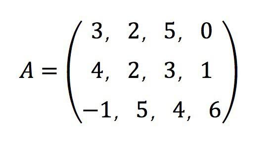
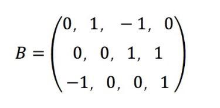
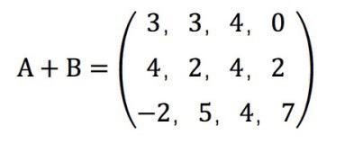
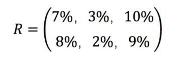
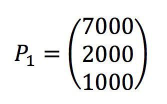
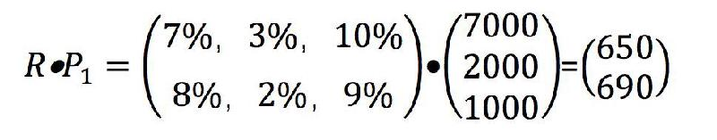
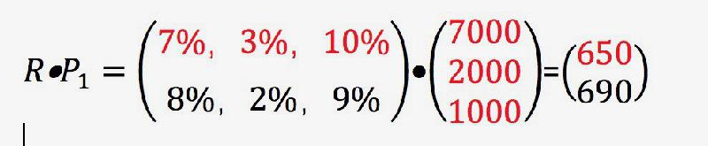
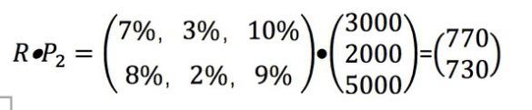
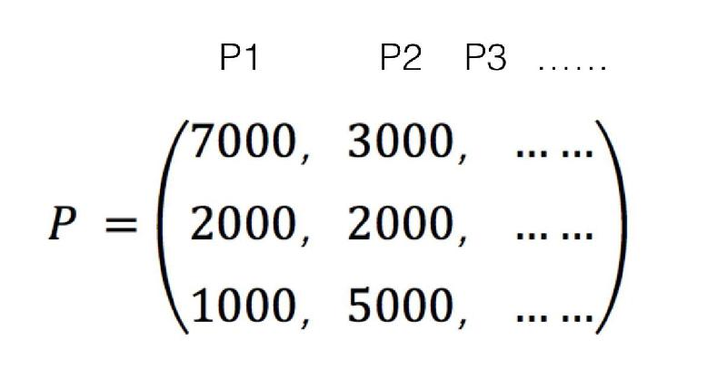
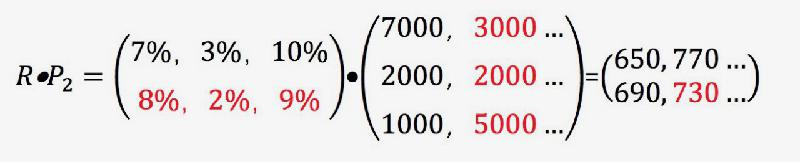

# 0405. 线性代数：「矩阵」到底怎么用？
> 吴军·数学通识 50 讲
2019-12-01

如果你问一个大学老师，什么是高等数学的基础课？他可能会和你说，微积分和线性代数。对于一个非理工专业的大学生来讲，如果在大学里只学两门数学课，恐怕就是这两门了。微积分主要是训练我们的思维方式，而线性代数，大家在工作和生活中真的用得上。

关于线性代数，我们其实已经讲了两讲了，只是我没有用这个名词罢了。我们讲的都是向量代数，它其实就是线性代数中最基本的内容。在线性代数中，用到的最多的概念是矩阵。矩阵是怎样一回事，它有什么用途呢？让我们先来看一个具体的矩阵：

从这个矩阵中你可以看出，它无非就是把数字按照横竖排起来，每一行、每一列数字的数量都相等。比如上面一个矩阵有 3 行，每行有 4 个数，我们称这种矩阵为 3x4 的矩阵。了解了矩阵的形态，你可能紧接着就有一个问题：把数字这么横平竖直地排列起来有什么用？事实上，把数字这么横平竖直地排列不是原因，而是结果，矩阵产生的原因是向量的扩展。

我们在前面讲了，向量是横着的一排数字，每一个数字代表一个维度的分量。比如一个企业在招聘员工时把所有考核的项目总结为 N 个维度。每一个岗位对各种能力的侧重点就是一个 N 维向量，比如办公室部门对人的要求是能力、沟通、协作、健康四个维度，写成 V1=（3，2，5，0）。

我们上一讲讲了，可以用它来算算和某个候选人的相似性。当然公司不仅仅有办公室一个部门，还有比如销售部门、研发部门，等等。每一个部门可能又有不同的岗位，每一个岗位的要求就是一个向量。于是，我们就会有 V2，V3，V4，……，VM。

这么多向量如果把它们放在一起，怎么表示比较好呢？显然最直观的方式，就是把它们一行行排起来，这形成了一个有 M 行 N 列的矩阵。这就是矩阵的由来。

今天「矩阵」这个词无论是在数学上还是生活中都经常用，但是它在数学史上出现的时间非常晚，直到 1850 年才由英国数学家西尔维斯特（James Joseph Sylvester）发明，而构成它的向量其实出现的时间也很晚，是 1835 年才被提出来的。

当然，你如果读一些文章会提到早在 3 世纪的时候，中国数学家就发明了矩阵的原型，类似的话日本人、意大利人和阿拉伯人也都这么说，但是那些所谓的发明和今天的数学发展没有半点关系。

因为对于一个矩阵，不仅仅是把数字一行一列地排起来，更重要的是每一行、每一列需要能够被赋予特殊的含义，而且需要发明出一系列相应的计算，让这个工具能够解决很多问题。西尔维斯特所提出的矩阵则满足了这些要求。关于矩阵的运算有很多，我们接下来就介绍两种最简单的，即加法和乘法。

首先讲讲矩阵的加法。

我们可以把一个 M 行 N 列，或者说 MxN 的矩阵想象成一个公司的 M 个岗位，每个岗位有 N 种技能。我们假设这个公司是一家跨国公司，它会对人员有一个总体上的要求，但是对于不同国家的员工在要求上也会有不同的调整，比如对英语水平的要求。

我们把总体要求用矩阵 A 来表示，某个国家相应的调整用矩阵 B 来表示。那么矩阵 A+B，就是在某个国家具体的要求。为了直观起见，我们就假设矩阵 A 是上面那个 3x4 的。矩阵 B 也需要是一个 3x4 的矩阵。我们随便写一个 B 矩阵，比如像下图这样：

当我们进行 A+B 时，只要把两个矩阵中相应位置的元素逐一相加即可，也就是说矩阵 A 加矩阵 B，会得到下面的结果。

今天在生活和工作中，经常需要有相对固定的大的原则，以及针对各种情况的小的变动，这时候就需要有一个相对固定的核心，再加上一个增量，而不是复制一大堆，拷贝以后逐一修改。

相比矩阵加法，用途更大的可能是矩阵乘法。我们先来说说一个矩阵和一个向量是如何相乘，然后再扩展到矩阵和矩阵的乘法。

我们来看一个实际的例子，假如第一家投资银行的股票基金、债券基金和高风险基金的回报分别是：7%、3% 和 10%，第二家投资银行三类金融产品的回报分别是 8%、2%、9%。当然，这些都是历史数据，只能作参考。

你现在有 1 万元要投资，你是找第一家投行，还是第二家投行给你管钱呢？我们不妨把这两组数放到下面这个矩阵中：

然后我们根据自己对各种投资的喜爱和对风险的承受能力，分别测算在不同情况下的回报是多少。

比如在第一种情况下，1 万元按照上述投资类型的分配方式如下：7000、2000、1000。因为这 1 万元分到了三个维度中，我们把它写成一个向量，不过为了等会儿方便做乘法，我们将向量竖着写：

这时，如果把钱交给这两家公司，总的回报就是矩阵 R 和 P1 相乘的结果，我先把结果给大家看看，然后再说说是如何计算的。

我们可以看到，第二家投行带来的投资回报更高。那么这两个数是怎么计算的呢？抛开矩阵和向量，这个问题其实也能算清楚。

就以第一家投行为例，7000 元 7% 的回报是 490 元，2000 元 3% 的回报是 60 元，1000 元 10% 的回报是 100 元，加起来是 650 元。我们把这个式子列一下：

    7%x7000+3%x2000+10%x1000=650

你如果注意一下上面的矩阵和向量，你会发现这就是矩阵第一行每一个数字，分别和向量的每一个数字相乘之后再相加。为了清楚起见，我把矩阵和向量中参与运算的数字用红颜色标了出来：

类似的，第二个结果 690，就是矩阵第二行和向量各个元素相乘后再相加的结果。

当然，可能有朋友会说，这不就是算术中加权相乘后的连加吗，为什么要搞出矩阵这样一个工具？如果只有三个维度，可能不需要用矩阵，但是如果是 1 万维、1 百万维，人通常就想不清楚了，矩阵就非常直观，使用它既方便又不容易出错。

我们可以这样理解矩阵和向量相乘，它是批处理解决问题的思路，而过去我们学的乘法和连加是单个解决问题的思路。

接下来我们再看另一种情况，假如你这时对风险的承受力比较强，愿意将更多的钱放在高风险、高回报的基金中。比如你按照 3000、2000、5000 来分配投资，我们把这个向量称为 P2，这时哪家的回报更高呢？

我们再用矩阵和向量的乘法做一次，得到下面的结果。

你可以看出，这时第一家投行给的回报更高了。当然，你还可以尝试其它的投资方式，对应的向量就是 P3，P4，P5……

今天，你如果带着一大笔钱找到高盛或者摩根士丹利，问它们会打算怎么帮你投资，它们为你做的第一件事情就是根据历史数据，帮你推算出在不同的投资配比情况下，回报是多少，也就是做我们刚才做的事情。因此，如果你想在投行找工作，用到最多的数学工具就是线性代数中的矩阵运算。

下面，我们把 P1，P2, P3…… 这些向量一字排开，其实就得到一个矩阵 P。我们可以写成下面的形式。

注意，矩阵 P 的每一列，就是一个个向量 P1，P2, P3……

接下来，我们就可以定义矩阵 R 和矩阵 P 的乘法了。我们把矩阵 R 和 P 中的第一列，也就是向量 P1 相乘的结果，放在结果矩阵的第一列，把矩阵 R 和 P 中第二列向量 P2 相乘的结果放在结果矩阵的第二列，以此类推。

我们就得到了两个矩阵相乘的结果，它也是一个矩阵：

在图中，我特意标红了第一个矩阵的第二行，和第二个矩阵的第二列，以及结果矩阵第二行、第二列的数值，因为红色的行和红色的列，元素两两相乘再相加后，就是结果矩阵中的那个结果。对于一般的情况，第一个矩阵中的第 i 行，和第二个矩阵的第 j 列，相乘相加，结果就是结果矩阵中第 i 行、第 j 列位置的数值。

那么从矩阵和向量相乘，到矩阵相乘有什么好处呢？前一种情形我们可以理解为小批量处理，后一种则是大批量处理。

## 要点总结

我们讲了矩阵这个人们虚构出来的一种工具，利用这种工具，我们能够让计算从单个的，变成批处理的。矩阵有很多用途，我们只讲了一点点，从它的加法，我们可以理解核心矩阵和增量的关系；从它的乘法，我们看到了它在金融中的应用。要再次强调的是，将单个计算变成大批量处理，这是我们今天在信息时代要有的思维方式。

在结束本模块之前，我们要回答最后一个问题。为什么讨论矩阵运算这样问题的数学分支被称为线性代数？我们回顾一下矩阵和向量的乘法就知道答案了。在运算时，左边的那个矩阵里的数字可以被看成是一组常数系数，右边竖着的向量中的数字则是未知数变量，这样矩阵和向量的乘法就变成了一组线性方程。如果把它们画在空间中，就是直线、平面或者立方体，都是线性的，不会有任何曲线。因此涉及到这一类的代数运算被称为线性代数。

当然，自然界中很多数学问题并非线性的，但是我们在解决它们的时候经常将问题近似为线性的问题，这样可以利用很多线性代数的工具来解决。有了解析几何以及代数的基础，我们就可以正式开始讲高等数学中最为重要的微积分的问题了。

## 黑板墙

### 01

数学助教——「打包」思维

将多个数字排成一行或一列，我们得到「向量」。将多个「相同长度」的向量排列起来，我们得到「矩阵」。

1. 当我们考虑向量的时候，会用一个粗体字母（例如 a b）来「打包」向量里的所有「数字分量」。它们之间的运算，就好像是一个个「数」的运算一样，不过是遵循着另一套计算规则。

2. 同样的，当我们考虑矩阵的时候（通常用大写字母表示，如 A B），也会将它们看成一个个「数」，遵循着「矩阵世界」的运算规则。

有什么好处呢？当数据被一层层「打包」的时候，我们的注意力，就会更多的集中在「打包」后的「整体」上，而更少的注意每个数字分量之间的作用。这不仅仅有利于计算机的「批处理」，也更方便数学推导，排除细节上的干扰之后，数学家们就更容易纵观整体。

程序员写代码的时候，也是将一个个小的功能「打包」成一个更复杂的功能，再将多个复杂的功能「打包」成一个更复杂的功能，层层封装…… 直到最后的一行命令，实现千万行代码 —— 这感觉像是，推倒了第一块多米诺骨牌。

当我们欣赏一幅图片的时候，不会关注每一个像素点；当我们观看一部电影的时候，不会纠结于每一帧画面。当我们研究天体运行的时候，不会关注上面的尘埃；当我们探索星系的时候，不会关注执着于每一个天体；而当我们回答「宇宙起源」的时候，我们更在意的是，物理公式的推导……

层层「打包」，让我们暂时忽略上一层的细节，关注当前的「局势」。

### 02

数学助教——矩阵 ABC

【矩阵运算】

1- 矩阵的加减，就是简单的「对应位置的元素相加减」；

2- 矩阵乘法满足结合律：A (BC) = (AB) C；

3- 矩阵乘法不满足交换律：AB 通常不等于 BA；

4- 不是所有矩阵都可以相乘，只有「左边矩阵的列数」=「右边矩阵的行数」，二者才能相乘；

5- 矩阵的「除法」（其实严格意义上不能叫除法）条件更加苛刻，不是所有矩阵都可以当「分母」的，除非它「可逆」。

【用矩阵刻画「关系」】

有什么事物，是矩阵可以表示，而单用向量却很难刻画的呢？矩阵可以更方便地表示各个「对象」之间的「相互关系」。

一个典型的例子，就是网络：每一个人就是网络中的一个「节点」，对两个相互认识的人，在他们之间连接一条「边」，于是形成了一个「社交网络」。如何表示？由 n 个人组成的网络，可以用一个 nxn 的方阵表示：先给每个人标上一个固定的序号（从 1 到 n），如果第 i 个人与第 j 个人相互认识，那么矩阵的「第 i 行，第 j 列」的位置就是 1，否则就是 0。从人类的角度，看到这样一个由 0 和 1 组成的矩阵，毫无感觉；而矩阵的表示对计算机却更加友好。AI 看不懂你画的思维导图，但它能读懂矩阵。数学世界里，矩阵只是一个个整齐排列的数字而已；它们能代表什么，就看我们的想象力了。

### 03

不得不说，矩阵有用最多的就是我们行业了，因为我所处的机器人行业，机器人运动学就是建立在矩阵的基础上。很多人问我，矩阵在机器人学到底有什么用，实际矩阵之所以有用，是因为它可以直观去表示机器人所处笛卡尔坐标系下位置和姿态（角度）。我们知道机械手负责搬运就是需要知道被搬运物体的空间位置和角度，所以翻译在机器人这里就表示机器人的位置矩阵和姿态旋转矩阵。所以矩阵在工程行业是一个很重要的数学基础！同样，游戏开发也会用到矩阵，一个角色的姿态和位置，也是通过矩阵去表示。

### 04

线性代数可以说是大学最重要的必修课之一，而理解矩阵则是学好线性代数最重要的一把钥匙。事实上，绝大多数人在学习线性代数的时候，只是掌握了矩阵的加法和乘法的运算规则，目的只是为了通过考试。其实，矩阵在我们每个人的工作和生活中一直扮演着不可或缺的角色，影响非常深远。比如说，对于制造业企业来说，需要对生产过程中产生的很多数据进行统计、处理、分析，而这些原始数据不仅纷繁复杂，更有可能涉及好几个维度。比方说某个企业生产三种产品，每种产品的单位成本都涉及原材料费用、人工工资、其他费用三个维度；这三种产品在春、夏、秋、冬四个季节的销量又各不相同。这个时候，我们就可以引入矩阵对这些数据进行批量处理；我们可以把三种产品的单位成本设置成一个 3×3 的矩阵，而把三种产品在四个季节的销量设置成一个 3×4 的矩阵。通过对两个矩阵做乘法，就可以 3×4 的矩阵；把每一行的数字相加，就是每一类成本的年度总和，而把每一列的数字相加，就是每一个季度的成本总和。当然，也可以非常方便的计算出企业一年的所有成本总和，企业的成本费用情况就一目了然了。同样，矩阵还被广泛应用于经济和军事领域，1929 年，希尔通过矩阵理论对信息传输进行加密处理，提出了在密码学历史上有重要地位的希尔加密算法。同样的例子在现实世界中还有很多，由此可见，数学应用的领域确实遍布我们生活的每个领域。可以说，掌握数学的思维方式，学会运用数学的工具，是我们每个人的必修课。

### 05

数学助教：

矩阵是个工具。一方面，对于大量需要进行相同操作的数据，考虑对数据进行向量化，利用矩阵来批量处理，效率比用循环的方式单独处理每一个要高。另一方面，如果一个矩阵非常大，运算和存储的成本（时间和空间）比较高，可以对矩阵进行化简。这里不得不提的是，SVD（Singular Valve Decomposition）奇异值分解。

对一个 mxn 的矩阵 A，找到 mxm 的矩阵 U，mxn 的矩阵 Σ，nxn 的矩阵 V'（转置），使得 A = UxΣxV'。其中 U 和 V 是正交矩阵，也就是 UxU'=I VxV'=I，Σ 除了对角线上的，其余都是 0，对角线上的值被称为奇异值。这些奇异值在对角线上是从大到小排列的，并且减小的速度很快。一般来说，前 10%，甚至 1% 的奇异值之和，就可以达到全部奇异值之和的 99% 以上（可以对应下前几讲关于无穷小的思路）。

根据这个，能做什么？既然奇异值很快就接近 0，那就可以只用一小部分奇异值来近似。比如取前 r (r 远小于 m 和 n) 个奇异值，那么 Σ1 就变成了 rxr 的矩阵，取 U 的前 r 列 (mxr) V' 的前 r 行 (rxn), 用近似的 U1xΣ1xV1' 就可以得到近似的 A。

举个例子，图片可以用矩阵表示，比如一个 800x600 的灰度图，对应一个 800x600 的矩阵 A，每个元素是相应位置的灰度值（rgb 图同理，800x600x3 可以对应一个 800x1800 的矩阵）。矩阵 A 占用的空间是 800x600=480000 份。我们对 A 进行 svd，[U,Σ,V']=svd (A)。取前 50 个奇异值 (大概前 10%)，只需要保存 U1 (800x50) Σ1 (50x1 因为除了对线线都是 0) V1'(50x600)。加起来是 70050，只占到原来的 14.6%。如果觉得不够，就增大 r 的数值，用更精确的近似。

### 06

三门数学分支：微积分、线性代数和概率论。数即一维的研究对象，向量即多维的点，矩阵则是由点组成的面。面则代表了现实世界，如影像由像元组成，视频由多帧影像组成，电路板由元器件组成，二维码由黑白块组成，等等。矩阵是现实的数学表达，也是研究现实的数学工具。一旦组成矩阵，就可以研究其特征：行列式、秩、迹、范数、特征值、奇异值等等，由此更能看到世界的本质。

简言之：方程组求解、图像变化检测、视频压缩等等都离不开矩阵这一工具。对我们的启发是：当从整体看待一个个目标时，要借助矩阵思维，每一个成员，每一项任务都有其坐标，不能孤立来对待。要从矩阵的特征值分析其特性，要从其特征向量看其方向。要抓住主要特征，要调整正确方向。看其平凡的数字，一旦排列在一起便赋予新的功能。对于每个人如何找到有价值的矩阵？即人生定位不仅仅看自己，还要看与你组成矩阵的其他人的排列。

### 07

想起谷歌方法论中的计算机思维之一，就是大数思维，这种批量处理的方式也只有计算机能完成，小批量，小维度，的确由人完成很简单，但是大数，大批量就不是简单想想就行了，回到无穷大无穷小那几讲，高低阶的无穷对于算法的影响也是巨大的。

补充一些小知识：

1. 矩阵是一个表格，行数和列数可以不一样；而行列式是一个数，且行数必须等于列数。只有方阵才可以定义它的行列式，而对于长方阵不能定义它的行列式；

2. 两个矩阵相等是指对应元素都相等；两个行列式相等不要求对应元素都相等，甚至阶数也可以不一样，只要运算代数和的结果一样就行了；

3. 两矩阵相加是将各对应元素相加；两行列式相加，是将运算结果相加，在特殊情况下（比如有行或列相同），只能将一行（或列）的元素相加，其余元素照写；

4. 数乘矩阵是指该数乘以矩阵的每一个元素；而数乘行列式，只能用此数乘行列式的某一行或列，提公因数也如此；

5. 矩阵经初等变换，其秩不变；行列式经初等变换，其值可能改变：换法变换要变号，倍法变换差倍数；消法变换不改变。

### 08

谷歌 PageRank 网页排名算法就包含了矩阵相乘的具体运用。谷歌 PageRank 网页排名算法的核心思想，是一个网页获得链接越多，可信度就越高，那么它的排名就越高。具体思维过程如下：整个互联网当做一个整体来看待，就像一张大的图，每个网站就像一个节点，而每个网页的链接就像一个弧。用一个图或者线性代数的矩阵来描述互联网，这就将无从下手的网页相连问题变成了一个二维矩阵相乘的问题，并通过迭代，算出了网页排名。

### 09

将数字排成「方阵」，或者将线性计算引入这个数字方阵，看上去只是换了一种展示的形式，似乎「并没有什么不同」。但这种观点的背后，实际上是对「量级」的感知不够。像是矩阵运算这样的操作，实际上是在将一个简单的规则，套用到大量有规律的数据中，是一种对简单数据处理的批量操作；如果引入更复杂的规则，还能够实现更加丰富的数据处理。工作和生活中，一个很容易想到的用法，就是进行批量的加权运算与比较。我试着在 Excel 里做了一下，像是这样的矩阵乘法，如果用 MMULT 这样的矩阵函数，出来就是一下子的事情，但如果要手动输入线性计算的公式，不仅操作繁琐，大量操作还可能「手滑」出错。看似原理非常简单的一个工具，放在计算机处理大批数据的场景中，就能够实现计算机替代人力重复操作的过程。虽然发明矩阵工具的时候还没有计算机，但这个工具的确给当今的人类社会，带来了更多的便利。

### 10

线性代数在数学、物理学和技术学科中有各种重要应用，因而它在各种代数分支中占居首要地位。在计算机广泛应用的今天，计算机图形学、计算机辅助设计、密码学、虚拟现实等技术无不以线性代数为其理论和算法基础的一部分。线性代数所体现的几何观念与代数方法之间的联系，从具体概念抽象出来的公理化方法以及严谨的逻辑推证、巧妙的归纳综合等，对于强化人们的数学训练，增益科学智能是非常有效的。随着科学的发展，我们不仅要研究单个变量之间的关系，还要进一步研究多个变量之间的关系，各种实际问题在大多数情况下可以近似线性化，而由于计算机的发展，线性化了的问题又可以被迅速计算出来，线性代数正是解决这些问题的有力工具。线性代数的计算方法也是计算数学里一个很重要的内容。「以直代曲」是人们处理很多数学问题时一个很自然的思想。很多实际问题的处理，最后往往归结为线性问题，它比较容易处理。因此，线性代数在工程技术和国民经济的许多领域都有着广泛的应用，是一门基本的和重要的学科。

如果进入科研领域，就会发现，只要不是线性的东西，我们基本都不会。线性是人类少数可以研究得非常透彻的数学基础性框架。学好线性代数，我们就掌握了绝大多数可解问题的钥匙。有了这把钥匙，再加上相应的知识补充，我们就可以求解相应的问题。可以说，不学线性代数，我们就漏过了 95% 的人类智慧。非线性的问题极为困难，我们并没有足够多的通用的性质和定理用于求解具体问题。如果能够把非线性的问题化为线性的，这是我们一定要走的方向。

事实上，微积分「以直代曲」的思想就是将整体非线性化为局部线性的一个经典的例子，尽管高等数学在定义微分时并没有用到一点线性代数的内容。许多非线性问题的处理――譬如流形、微分几何等，最后往往转化为线性问题。包括科学研究中，非线性模型通常也可以被近似为线性模型。随着研究对象的复杂化与抽象化，对非线性问题线性化，以及对线性问题的求解，就难免涉及到线性代数的术语和方法了。从这个意义上，线性代数可以被认为是许多近、现代数学分支的共同基础。
