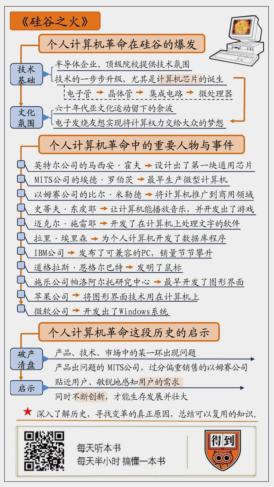

# 2020002. 硅谷之火
> 《硅谷之火》| 猛犸解读

## 关于作者

本书的作者迈克尔·斯韦因和保罗·弗赖伯格，是两位经历了个人计算机革命时代的科技记者。上世纪七十年代，他们在旧金山湾区亲身接触过那些创业公司和创业者的媒体人，是计算机产业发展的见证者。他们曾亲眼看到圣克拉拉谷从果园变成了硅谷的过程，也曾和这个时代最著名的知识英雄们面对面交谈。他们的记录，是反映那个时代的珍贵文献。

## 关于本书

这是一本历史书，讲的是上世纪七十年代硅谷个人计算机产业爆发的过程。

历史上从来没有任何一个行业，能发展得像个人计算机行业那么快。而这一切的起点，是美国加州旧金山湾区几个不起眼的小地方，和几个电子学发烧友的异想天开。从个人计算机革命的开始、爆发到逐渐冷却，都写在了这本《硅谷之火》里。

今天的这本书已经是第三版了。第一版是 1984 年出版的，当时个人计算机产业正处在早期的爆发阶段。第二版在 2000 年出版，当时个人计算机产业正方兴未艾。而在今天发行第三版时，个人计算机已经改变了形态。在这一版中添加了更多的内容，特别是介绍了从 2000 年开始出现的一些转变，例如互联网的蓬勃发展，以及手持智能设备开始登上历史舞台。

## 核心内容

这本书从英特尔公司发布的通用计算芯片开始，讲述了早期电子学发烧友尝试制造和销售个人计算机，并最终创造出一个庞大产业的的故事。这本书围绕着那段历史时期的著名企业，详尽记录了个人计算机发展史上的代表性事件，以及在这些事件中的登场的著名人物和他们的观点。从这本书中我们可以看到个人计算机革命的全景，也能够意识到，今天我们在 IT 行业中看到的种种行为和表现，其实都只是个人计算机发展历史的重现。

## 前言

今天为你解读的书是《硅谷之火》，这本书主要讲的是，上世纪七十年代，硅谷的个人计算机产业是如何崛起的。

在今天，个人计算机可以说是随处可见，就连我们不离身的智能手机，也是个人计算机的一个分支。曾经有人开玩笑地说过，如果汽车行业也能像计算机行业一样发展的话，现在的汽车应该能在一个小时内跑到月球上，而且只用一升油。

要知道，在个人计算机出现以前，历史上从来没有任何一个其他行业能发展得这么快。而这一切的起点，是美国加州旧金山湾区几个不起眼的小地方，和几个电子学发烧友的异想天开。

那么，为什么个人计算机会从一种发烧友亚文化，发展成世界上最有活力的行业？为什么是那些人、在那个时代、在那个地方创造出了那一切？以及，这种对世界带来巨大影响的变革，是可以复制的吗？

这本《硅谷之火》，将会带给我们一些启示。

今天我们要解读的这本书，已经到了第三版。第一版是 1984 年出版的，当时个人计算机产业正处在早期的爆发阶段。第二版在 2000 年出版，当时个人计算机产业正方兴未艾。而 14 年发行第三版时，个人计算机已经改变了形态。在这一版中添加了更多的内容，特别是介绍了从 2000 年开始出现的一些转变，例如互联网的蓬勃发展，以及手持智能设备开始登上历史舞台。

这本书的两位作者，迈克尔·斯韦因和保罗·弗赖伯格，都是上世纪七十年代在旧金山湾区亲身接触过那些创业公司和创业者的媒体人，是计算机产业发展的见证者。他们曾亲眼看到圣克拉拉谷从果园变成了硅谷的过程，也曾和这个时代最著名的知识英雄们面对面交谈。他们的记录，是反映那个时代的珍贵文献。

当然，市面上已经有一些著名的传记作品，像是像比尔·盖茨的《未来之路》和沃尔特·艾萨克森的《乔布斯传》，也记录了那段历史的一些侧面。但是有更多的人物在那段历史中扮演了重要的角色，而我们对他们和他们所做的贡献所知甚少。

历史是一张由人物和事件构成的复杂网络。对历史事实了解得越多，就越有可能找到导致变革的真正原因，继而总结出可以复用的知识。这本书为我们提供了这样的机会。

接下来，我将分成三部分，为你解读这本书：

第一部分，我们说说，个人计算机产业是如何爆发的。究竟是哪些因素，共同推动了这项伟大的产业？第二部分说的是，面对这个在当时前途未知的行业，都有哪些人毅然投身进去？他们又给我们留下了怎样的精彩故事？第三部分，我们重点谈谈，从个人计算机产业爆发的这段历史中，我们能够学到些什么？对比那些成功的和失败的企业，我们将会看到，如何才能在一个激烈变化的行业中生存下来。

## 第一部分

好，让我们看看第一个重点：个人计算机革命究竟是如何发生的？通过了解个人计算机诞生的背景，我们来说说，为什么恰恰是在那个独特的时代、在那个独特的地方，由那些独特的人，共同推进了一项伟大的技术革新。

使用机器来自动化地完成计算任务，是人们长久以来的梦想。十九世纪三十年代，英国发明家查尔斯·巴比杰就设计出了最早的机械式计算机。到了二十世纪四十年代，电子计算机终于出现了。第一台电子计算机，光体积就占满了一间大屋子，耗电量惊人，运算速度极慢，而且总容易出故障。

当时的电子计算机使用的是一种叫做「电子管」的零件，这让计算机的体积巨大而且运行不稳定。1947 年，物理学家威廉·肖克利和他的几位同事发明了晶体管，很快帮助早期的电子计算机减小了体积。到了 1955 年，集成电路诞生了。

所谓集成电路，指的是在一块硅芯片上制造出许多微型的晶体管。这种芯片可以减小计算机的体积，同时也让计算机的性能变得更加稳定。

在集成电路领域，有一个很有意思的定律，叫做摩尔定律。这是一个经验理论，是这样定义的：每过十八个月，硅片上集成的晶体管数量就会翻一番。这大概可以粗略地理解成，每过一年半，同样大小的计算机芯片，计算能力会翻一倍。

听起来好像不算什么大事，但是这种累积起来的力量十分惊人。这意味着每过十五年，计算机的计算能力就会增加一千倍；或者说，三十年后的计算机，计算能力应该是今天的一百万倍。

摩尔定律是英特尔公司的创始人之一戈登·摩尔提出的。也正是英特尔公司，在 1971 年生产出了世界上第一块微处理器。这块微处理器的诞生，意味着有可能制造出通用的、能放在桌面上的计算机。

英特尔公司的总部在圣克拉拉谷。在当时，那里还只是成片成片的果园，是世界上最大的水果生产基地之一。当时生产集成电路的企业基本上大都聚集在那个区域，因为它们都和肖克利在这里创建的肖克利半导体公司有着或深或浅的关系。斯坦福大学和其他一些著名院校也在这里，这些企业和院校让圣克拉拉谷充满了浓厚的技术氛围，「硅谷」这个名字，就是在这个时候诞生的。

在当时，电子计算机产业已经蓬勃发展了十几年，而且形成了三类产品。能占满一间屋子的叫做大型计算机，和柜子差不多大小的叫做小型计算机，能拿在手里的叫计算器。而在计算器和小型计算机之间的、能够给个人使用的计算机，当时还是一片空白。并没有人意识到，对个人计算机的需求已经出现了。

计算芯片的诞生、对个人计算机的需求，以及硅谷的技术文化，是个人计算机革命的前提条件，但并不是全部。《硅谷之火》的两位作者说，虽然个人计算机革命是在七十年代发生的，但是它的精神内核，却与六十年代一脉相承。

你可能知道，上世纪六十年代的美国是一个充满活力，甚至是有些激进的年代。席卷全国的反越战和嬉皮士运动、以及经济的迅速发展，催生了许多亚文化。出生于二战之后的年轻人们建立了一套与主流文化格格不入的生活方式，长头发和大胡子、禅修、颜色艳丽的衣服、以及摇滚和迷幻药，造就了光怪陆离而多姿多彩的十年。而距离硅谷不远的旧金山，也是这些亚文化的集中地。

这些亚文化的共同诉求中，包括了反战、反对政府对民众的控制、追求自然而愉悦的生活等等。为民众赋予更大的权力是重要的关键词，而由 IBM 这样的大公司所垄断的计算能力，往往也被视为压制民众的权力之一。

而英特尔公司通用计算芯片的诞生，让一些敏锐的电子学发烧友意识到，这也许是一个机会，让人们可以拥有自己完全做主的计算机，让人们拥有从大公司手中夺回权力的能力。在六十年代文化氛围的余波中，电子学发烧友和技术发烧友们聚集起来，开始考虑这种可能性。

所以当时的硅谷，正被两种完全不同的思潮拉扯着。一端是精密的集成电路芯片，这需要冷静和缜密的逻辑；另一端是嬉皮士和发烧友，他们狂热而胆大妄为，将世界视为巨大的游乐场。

这样彼此矛盾的技术和文化氛围，构成了个人计算机产业爆发的前提条件。有硅谷的技术氛围和经验，有六十年代的狂热和创造力，还有聚在一起的电子学发烧友们。

天时地利人和都已具备，个人计算机革命准备好要爆发了。

## 第二部分

重要的历史总少不了重要的人物和事件。接下来让我们看看第二个重点，面对这个在当时前途未知的行业，都有哪些人毅然投身进去？他们又给我们留下了怎样的精彩故事？

个人计算机是很复杂的产品，无论是芯片、电路、软件还是硬件，无论是设计、生产还是销售，都需要许多人的努力，以及一代代的不断革新。将个人计算机发展的关键都放在几个人身上，是不公平也不准确的。而在这本书里，作者详细记录了那些对个人计算机革命至关重要的人们，和他们所做的事情。

在个人计算机历史上值得大书特书的，首先应该是集成电路。英特尔公司的马西安·霍夫，设计出了第一块通用芯片，名叫英特尔 4004。两年后，更强大的英特尔 8008 也诞生了。

将英特尔 8008 变成一台真正个人计算机的，是 MITS 公司的创始人埃德·罗伯茨。MITS 公司的全称是「微型仪器遥感系统公司」，本来是销售供飞机模型使用的无线发报机的，后来又开始制造和销售计算器。但是在 1974 年，因为经济衰退和大公司纷纷加入计算器市场，MITS 快要破产了。罗伯茨想要最后一搏，于是设计出了一款叫做「牛郎星 8800」的个人计算机。

罗伯茨发布在 1975 年 1 月《大众电子学》封面上的广告，瞬间引爆了个人计算机市场。虽然用现在的眼光来看，这根本不算是能工作的计算机，顶多只能算是一块简陋的电路板而已，但是它毕竟是世界上第一款量产的、面向个人的微型计算机。

牛郎星 8800 最初只能让几个灯闪来闪去。要向这台计算机输入内容，得一次次地反复拨弄面板上的开关才行。但是这种简陋的机器并没有打消发烧友的热情 —— 毕竟这是一台可以完全自主的个人计算机。更多的微型计算机公司开始纷纷出现，这些公司和 MITS 公司差不多，往往都是在车库里创业的；而生产的产品也差不多，都是面向发烧友的简陋机器，像是牛郎星 8800 的翻版。

比尔·盖茨和保罗·艾伦为牛郎星 8800 开发了编程语言，在这个新兴领域里站住了脚。以姆赛公司的比尔·米勒德第一个跳出了发烧友的视角，开始将这些简陋的个人计算机视为商业产品，并且尝试着将计算机推广到商用领域去。另一位发烧友史蒂夫·东皮耶让计算机能播放音乐，并且为个人计算机开发出了游戏。

很快，个人计算机就变得更完善了起来。人们为计算机装上显示器和键盘，开发出操作系统的工具软件，让人们可以更容易地操纵计算机。迈克尔·施雷耶开发了一套叫做「电笔」的软件，让人们可以在计算机上处理文字，就像今天我们使用 Word 来写文章一样。拉里·埃里森为个人计算机开发了数据库程序，他创建的公司叫甲骨文，到今天也依然是世界上最大的软件公司之一。

另一家在车库里创业的公司叫做苹果，他们是最早意识到个人电脑也需要良好设计的企业。苹果公司推出的苹果 2 型计算机非常畅销，成了最受欢迎的机型。而这一切，都发生在短短五年里。

进入八十年代以后，更多的玩家加入进来。1982 年，过去只做大型计算机生意的 IBM 公司发布了 PC，也就是「个人计算机」。从此 PC 成了微型计算机的代表。

IBM 允许其他企业设计和生产计算机硬件，只要这些硬件能和 PC 兼容就可以。这一举措极大地扩张了微型计算机市场，让 IBM PC 兼容机成了个人计算机的代名词。而这些机器所使用的操作系统，往往是比尔·盖茨的微软公司所开发的 DOS 系统。随着 PC 兼容机销量的节节攀升，微软也迅速发展成了世界上最大的软件公司。

只不过，在 IBM PC 兼容机大口吞噬着市场份额的时候，个人计算机还在使用字符用户界面。计算机屏幕上显示的只能是数字和字母，没有办法显示图片，当然更不要提视频了。解决这个问题的办法在 1968 年就已经出现了，只不过一直没有被人重视而已。

1968 年，斯坦福研究所的道格拉斯·恩格尔巴特发明了鼠标。1973 年，施乐公司帕洛阿尔托研究中心，也就是著名的 PARC 发明了图形用户界面，让计算机屏幕上能够显示图标、窗口，也能用鼠标来控制屏幕上的内容。苹果公司的创始人史蒂芬·乔布斯在 1979 年参观 PARC 时看到了图形界面，很快将这种设计用在了苹果公司的 Lisa 和麦金塔电脑上，让图形界面成了今天个人计算机的标准人机接口。后来，微软也开发了相应的产品，这就是 Windows。

再后来，乔布斯回归后的苹果公司，又接连拿出了 iPod、iPhone 和 iPad。人们开始更关注手里的小屏幕，放在桌面上的个人计算机不再引人注目。持续了三十年的辉煌逐渐黯淡下去。

而世界，也渐渐变成了今天我们所熟知的样子。

## 第三部分

虽然个人计算机最辉煌的时代已经过去了，但这段历史还是给我们留下了许多可以总结经验的地方。接下来让我们看看第三个重点，就是我们可以从这段历史中学到些什么。

这本《硅谷之火》虽然想尽力做到客观，但是字里行间依然透露出作者的观点。有时候是直接说出来的，有时候则借用了别人的话。比方说，对于 MITS 公司的评价，两位作者借用了比尔·盖茨的评论，说 MITS 公司把所有的好主意都实现了一半。

的确，MITS 公司本来应该是个明星。他们率先制造出了微型计算机，引爆了这个行业，又以发烧友的狂热劲头搞出了更多产品，还组织了用户大会、巡回车队展览，甚至还出版了自己的用户简报。但是仅仅在发布牛郎星 8800 后两年，这家公司就不得不被卖掉，变成了一颗曾经耀眼的流星。

在回顾 MITS 公司历史的时候，作者认为，MITS 的主要问题在于产品上。更具体地说，他们有很好的想法，但是没有与之相称的能力。MITS 发展得太快，但是产品并没有跟上。他们尝试开发的许多新产品最终都失败了，而这些产品的立项，又往往是因为创始人罗伯茨的一意孤行。

同时，罗伯茨和其他高级员工之间的关系也不怎么好。他执意一个人面对新兴行业的不稳定要素，把压力都扛在了自己肩上。在微型计算机这样的新兴行业中，每个人都不知道未来会怎样。但是如果能够更好地沟通的话，多一双眼睛总是有好处的。

而在市场策略上，MITS 还试图独占销售渠道，这引起了零售商们的反弹。MITS 公司产品的交货期长，售后服务质量也不怎么好。虽然当时的计算机公司基本上都这样，但是作为行业的领头羊，MITS 总是会受到更多的关注。到了 1977 年，市场上已经有了数十家微型计算机公司，苹果公司还推出了大受欢迎的苹果二型。在这些竞争面前，MITS 被压垮了。罗伯茨不得不将 MITS 卖给了另一家公司，仅仅作价 600 万美元。这个价格，大概只相当于他们在 1976 年利润的一半。

MITS 可以算是一家发烧友建立的企业，关注的是技术和产品，而没有为商业竞争做好准备。在 MITS 退场后，以销售人员主导的以姆赛公司曾经一度占据了领导位置。以姆赛公司的创始人比尔·米勒德是销售出身，曾经在 IBM 做过销售代表。这家公司的文化是销售导向的，公司的成员都希望不惜一切代价占有市场，把产品卖出去。而他们的产品，大概可以算是牛郎星 8800 的仿制品。

一开始，向销售倾斜资源的做法帮以姆赛公司占据了大量的市场份额。但是很快，他们的市场定位出现了问题。以姆赛公司希望将这种不稳定的机器卖给企业，但是他们生产的那种面向发烧友的机器并不稳定，还不适合企业的使用环境。他们的口号喊得太响，而忽视了实际的人力和物资限制。

这种偏向销售的文化终于让以姆赛公司尝到了苦果。客户服务质量太差，即使是最热情的发烧友也难以接受。销售订单开始减少，而推出的新机器又因为质量问题而占据了大量的维修工作量。

1979 年 9 月，以姆赛公司终于走到了尽头。它失败的原因是因为走向了另一个极端，过分偏重了销售，而忽视了产品与售后服务。

在市场发展得太快的时候，企业总是不容易平衡发展。企业往往会迅速扩张规模，种种问题都会被在高速发展的所掩盖。但是这并不意味着问题就此消失。以姆赛公司强调收入，而忽视了客户满意度。客户的不满最终积累了起来，直到动摇了企业的立身之本。

类似的事情，也曾经在苹果公司发生过。当苹果二型计算机大获成功以后，史蒂芬·乔布斯想要开发更强大、更美观的计算机。他开始督促苹果公司开发苹果三型计算机。虽然这在当时毫无必要，因为苹果二型依然很受市场的欢迎。

紧迫的日程表让苹果三型计算机匆匆面世，还没有经过充分的测试就被推向市场。这台机器还存在缺陷，而这影响了苹果公司在用户中的声誉。为了挽回声誉，苹果公司又在接下来的几年内推出了两款计算机，一款叫做 Lisa，另一款叫做麦金塔。

而这两款机器都没能重现苹果的辉煌，Lisa 甚至可以算是一场灾难。到 1985 年，苹果公司首次出现了季度亏损。当时任总裁的约翰·斯卡利不得不联合董事会，将创始人史蒂芬·乔布斯踢出了苹果公司。

而与此同时，IBM 的 PC 兼容机正大行其道。苹果公司因为对市场的缺乏了解、对时机的判断错误而失去了个人计算机行业领头羊的位置，从此进入了十几年的蛰伏期，中间甚至一度濒临破产。

这些失败都告诉我们同样的道理。当企业因为骄傲而离用户太远、因太大而不能创新的时候，就离终点不远了。

## 总结

好了，以上就是这本《硅谷之火》的主要内容。让我们来简单回顾一下。

首先，我们从技术基础和文化氛围两方面介绍了个人计算机革命出现的背景。在七十年代的硅谷，一方面有半导体企业和顶级院校提供的技术氛围；另一方面，又有六十年代诸多亚文化运动留下的余波。随着英特尔公司通用计算芯片的诞生，电子学发烧友们能够有机会实现将计算权力带给大众的梦想，并由此产生了最早的个人计算机。

然后，我们介绍了一些在个人计算机革命中扮演重要角色的人物和事件。MITS 公司是最早生产微型计算机的企业，接下来很快出现了几十家类似的企业，其中又以以姆赛公司最为著名。而最终将计算机变成今天我们熟知的样子的，是发明了鼠标的道格拉斯·恩格尔巴特，是最早开发了图形界面的施乐公司帕洛阿尔托研究中心，是将图形界面技术用在计算机上的苹果公司，以及随后开发出了 Windows 的微软公司。

最后，我们讨论了一下从这段历史中我们可以学到些什么。个人计算机革命爆发的时间很短，只有不到十年时间。这是风云激荡、让人目不暇接的十年，技术、产品、市场与资金都以惊人的速度转变，最终大浪淘沙般留下几家幸存者，掩埋了更多得多的失败者。在飞快变化的环境中，无论是产品、技术、市场中的哪一环出现问题，都可能会导致一个欣欣向荣的企业瞬间破产清盘，只有贴近用户、敏锐地感知用户的需求，同时不断创新，才可能生存下来发展壮大。

个人计算机的革命虽然已经过去了近四十年，但是它依然影响着我们的生活。类似的产业革命后来又发生了许多次，无论是互联网硬件的竞争、互联网泡沫的破灭，还是智能手机与手持设备的崛起，甚至是搜索引擎、社交网站、电子商务、团购、直到近年的网约车、共享单车、外卖 App 的竞争，都逃不开同样的模式。

历史一次次重演，频率越来越高。但是如果我们仔细分析的话，会发现四十年前的规律依然在起作用。一开始，只是少数几个异想天开的家伙去尝试开拓一个全新的市场，他们设计出粗糙的原型，吸引了一小批铁杆用户和发烧友，同时也吸引了大量的跟风者。于是这个市场开始迅速发展起来，资金开始流入这些企业，获得了大量媒体的报道，各种各样的改进也纷纷出现，市场急剧膨胀起来。然后，或者是小企业迅速发展壮大，或者是有大企业开始下场收割，最终市场上只留下少数几个玩家，把市场瓜分殆尽。

这样的模式会一再重演。我们今天所看到的每一个激动人心的新产品，每一场媒体的狂欢，每一个崭露头角的风云人物，都是这套模式当中的固定组成部分。而这个模式，在四十年前的个人计算机革命中，就已经定型了。

毕竟太阳底下，并无新事。
