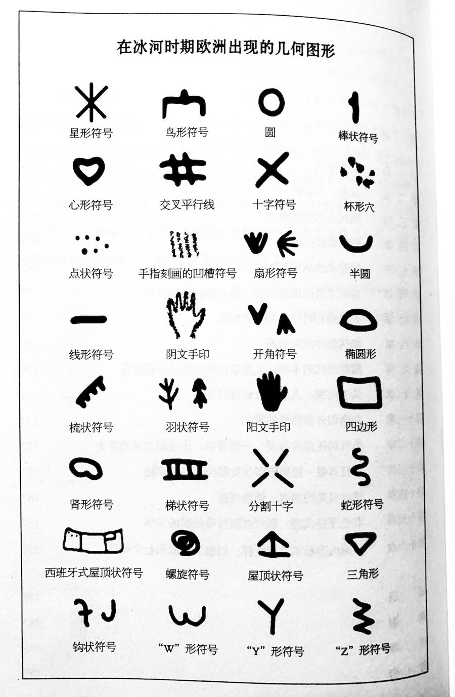
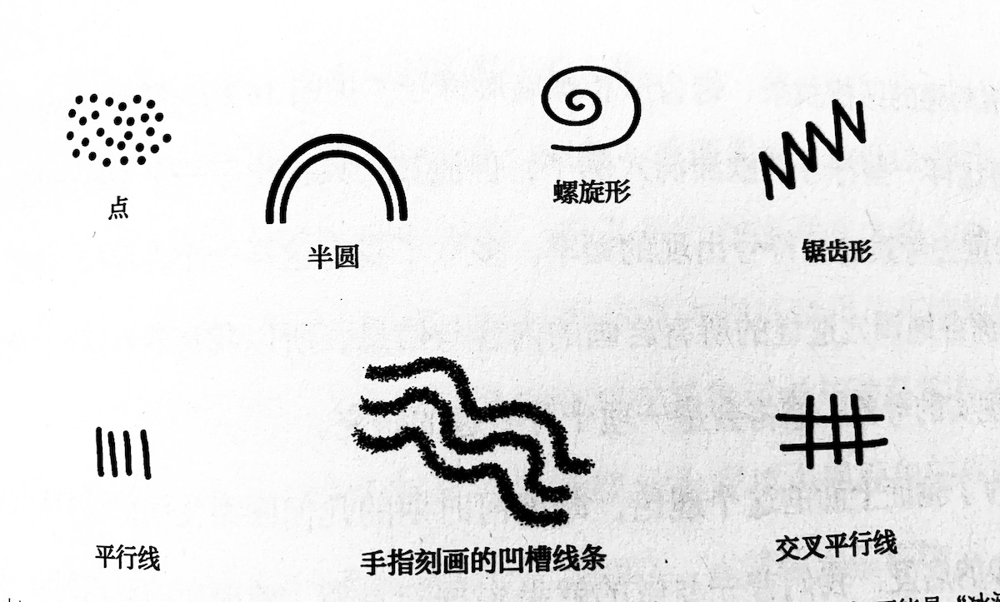

# 2020007. 符号侦探
> 《符号侦探》| 刘玄解读

## 关于作者

吉纳维芙·冯·佩金格尔（Genevieve von Petzinger）加拿大古人类学家、岩画研究专家，专注于对欧洲冰河世纪岩画遗址中抽象符号的研究，她利用从欧洲 400 多处史前遗址收集来的 5000 多个符号，建立起了一个独一无二的数据库。2015 年，她发表的 TED 演讲已有超过几百万人次观看。2016 年，她被选为美国《国家地理》「新晋探险家」。

## 关于本书

这是一本洞穴探秘手记，作者吉纳维芙既是向导，也是侦探。她研究了鲜有人注意的人类最初的图形交流工具 —— 抽象符号，并用它来解锁我们的祖先谜一样的过去。相信终有一天，我们会像解锁 DNA 那样，从远古符号中解锁人类的心智起源和文明起源之谜。

## 核心内容

本书作者走访那些很长时间都无人问津的古人类遗迹，深入到地下的岩洞，整理出这个符号的数据库就是想弄明白在距今 4 万到 1 万年的冰河时期，这些符号究竟是怎么出现的，以及这些符号到底向我们传递了什么样的信息。今天的解读，我们就来看看作者对这两个问题的解答。

## 前言

今天解读的书名字叫《符号侦探：解密人类最古老的象征符号》。听到书名你可能会想，符号侦探是干什么的？侦探的工作是通过调查找到真相，符号侦探调查的对象是原始人留下的符号，他们要探寻的真相之一就是人类文明从什么时候开始萌芽。

文明的源头可以上溯到什么时候？听到这个问题，很多人可能会先想到四大文明古国，也就是距今五千到七千多年前。过去人们普遍觉得，在这些文明诞生之前，原始人过着茹毛饮血的生活。但是近些年来的考古发现已经颠覆了这种认识，把文明萌芽的时间大大向前推进了。今天解读的这本书就是其中的一个答案。作者通过研究原始人留下的抽象符号，把人类文明萌芽的时间推到了 4 万年前的冰河时期。

这位作者叫佩金格尔（Genevieve von Petzinger），是加拿大的古人类学家，专门研究欧洲原始人在洞穴上留下的图像和雕刻。这个年轻的女学者干了一件史无前例的事情。她调查了大量的相关资料，实地考察很多史前洞穴，建立了一个有 5000 多个符号的欧洲史前符号库。更神奇的是，她发现在这 5000 多个符号里，只有 32 个几何符号使用最普遍，包括圆形、三角形和星号等等。这 32 个符号存在的时间贯穿了整个冰河时期（大约 4 万到 1 万年前），而且在整个欧洲大陆各个地方的史前遗址都能看到它们的踪影。

同样的符号，在漫长的时间、广阔的地域里不断重复出现，这说明什么？说明这些符号不像有些研究者说的，只是没有意义的涂鸦。一方面，它们是有意义的，而且可以组合成更复杂的意义系统；另一方面，我们已经可以画出其中一些符号的传播路径。所以作者认为，这些符号是人类最古老的图形交流系统之一，虽然今天我们还没有能力破译它们，但是我们可以说，它们就是人类文明萌芽的标志。

作者走访那些很长时间都无人问津的古人类遗迹，深入到地下的岩洞，整理出这个符号的数据库就是想弄明白在距今 4 万到 1 万年的冰河时期，这些符号究竟是怎么出现的，以及这些符号到底向我们传递了什么样的信息。今天的解读，我们就来看看作者对这两个问题的解答。

## 第一部分

好，第一部分我们先来看看这些符号是怎么出现的？佩金格尔的答案是，因为原始人思维能力的进化。在 4 万年到 1 万年前的欧洲冰河时期，原始人已经有跟我们相近的思维能力，比如因果和象征，所以他们能够画下这些符号。而且，这种思维能力不是突然出现的，在他们从非洲来到欧洲之前就已经开始发展了，也就是在二三十万年前。所以说，这些符号是人类思维能力进化的副产品。

如果你去博物馆看史前人类的展览，你肯定见过他们使用的石器、骨头做成装饰品，或者他们在洞穴上画的动物图案等等，这些东西向我们展现了原始人丰富的活动，但是我们很难通过这些东西窥见他们的思想。

这本书的作者认为，抽象符号可以带我们接近他们的思想，证明他们拥有和我们相近的思维能力。她有两个主要的理由：首先，要画出这些符号，需要一系列复杂活动，可以证明原始人已经有了像因果联系这样的思维能力；其次，这些符号一定是有意义的，说明原始人已经有了类似象征这样的思维能力。

先来看因果思维。作者的推理逻辑是这样的，人类之所以能够有计划地做事情，就是因为我们有因果思维。所以，如果我们能证明原始人画出抽象符号是有计划的行为，就能够证明他们也有因果思维。

作者是顺着颜色这个线索来推理的。我们知道，对红色的痴迷可以说根植于人类的集体无意识中。你可能想象不到，这种痴迷从几十万年前就已经开始了。不管是在二三十万年前的非洲，还是在四万年前的欧洲，我们都能在原始人居住的洞穴墙壁或者他们使用的器物上看到红色的痕迹。考古学家已经证实，这些红色都含有同一种化学成分氧化铁，这种成分来自同一种矿物赭石（赭石是一种有金属光泽的石头，今天它也是制作颜料的原料）。

原始人能够把赭石制作成红色颜料，就是他们能够理解因果的有力证据。不管是在冰河时期的欧洲，还是更早的非洲，考古学家都在原始人生活的洞穴附近发现过赭石这种矿物，有的洞穴附近甚至多达上百块。原始人想要获得赭石，一般需要跑到很远的山里去采集，这说明他们是刻意把这些赭石采集回来制作颜料的。那么，他们肯定事先就知道用赭石可以获得红色，这就是一种因果联系。

其次，要把一块石头变成能画画的颜料，肯定需要制作环节。在南非一个距今 10 万年的原始人洞穴，人们发现了制作颜料的工具，有石头、鲍鱼壳还有细长的骨头棒。考古学家推断，那里的原始人会用石头来研磨赭石粉，用鲍鱼壳来调制，然后用到一根细长的骨头蘸取颜料画画，有点像我们今天用笔来画画。除了这种画法，非洲的原始人他们还会有用手指画或者喷涂（就是用嘴把颜色吹到墙上）等等其他绘画技巧。这些绘画技巧，冰河时期欧洲的原始人也在沿用。难怪毕加索参观了法国拉斯科洞穴之后会说：我们在创作方面并无创新和突破。

你想想，十几万年前，人类已经有了颜料制作工艺和绘画技法，这本身就已经很让人震惊了。这说明他们知道，用某种方法可以得到某些特定的结果，而且他们还能把这些因果联系组合起来，有计划地采集原料、制作颜料，然后绘出图案。这样一整套更复杂的活动，相比只知道 A 导致 B 简单的因果联系，绝对可以说是更高阶的因果思维了。

接下来，我们来看象征思维。开头提到了，作者是古人类学家，专门研究原始人的岩画。原始人的岩画大体可以分为具象图案和抽象符号两大类。具象图案主要就是动物和人类；抽象符号，就是几何图形，比如三角形、圆点等等。相比之下，具象图案更容易理解，过去研究者主要关注的也是这些具象图案，很少有人研究抽象符号。大部分学者都觉得，抽象符号根本就没法研究，有的人甚至认为那些圆点、直线、三角形可能根本就没有特别的意义，或许只是打磨石头留下的刻痕，或者随手涂鸦。

但是，作者佩金格尔坚信，这些抽象符号是有意义的。由于过去的研究者不重视，他们记录下来的抽象符号经常不全，而且很不准确，所以作者才不得不实地一个个去考察，她建立了我们前面提到的那个有 5000 多个符号的欧洲史前符号库。她发现，在冰河时期的欧洲，几乎所有的洞穴里都有抽象符号，而且抽象符号的数量是具象图案的两倍。这其实已经能够说明这些符号不是没有意义的涂鸦。我们再来看看作者选出的这 32 个频繁出现的符号，其中有的像梯子、有的像梳子、有的像屋顶，这几种符号要比圆点、直线复杂得多，而且它们也会在不同时间、不同地点重复出现，这样一看，它们肯定是有独特意义的。

实际上，哪怕只是一个圆点，它应该也是有意义。这是因为原始人想要进入一些洞穴，带着颜料在岩壁上画一个符号，有时候非常困难。2013 年的 5 月，作者来到西班牙的一个洞穴考察。这个洞非常深，而且很狭窄，在最窄的一段通道，佩金格尔的脸距离墙壁只有 15 厘米多；而且，洞里漆黑一片，岔路很多，满是淤泥。那么，佩金格尔在这个洞里收获了什么呢？两个红点。几万年来，这些洞穴几乎没什么变化，为什么当时的原始人要千辛万苦地进来画这两个红点？作者相信，既然画下这两个红点一定是一种有目的的行为，那么这两个红点一定承载了某种特殊意义。

不管是复杂的屋顶符号，还是简单的圆点，原始人能够赋予抽象符号特定的意义，说明他们已经拥有了象征性思维。

过去古人类学家一般认为，原始人获得思维能力就像宇宙大爆炸一样是一次突破，也叫创造力大爆发。有人说是因为基因突变，有人说是因为环境变化，还有人说是文化等等各种力量的综合作用。不过，越来越多的考古发现已经证明这种观点的是错的，作者佩金格尔的观点就很有代表性。她不仅通过抽象符号和原始人活动之间的关系，证明了原始人拥有因果、象征等等思维能力，她还通过像颜色、工具等等线索，证明了这些思维能力是渐进的，是在缓慢进化中发展起来的。

大约 20 万年前，人类开始出现在非洲大陆上，他们的体型和我们一样，他们的脑容量和我们相当，他们也偏爱红色，懂得用赭石制造颜料，他们也有墓葬，也会画简单的抽象符号，比如圆点、直线等等。这说明，从在非洲的时候开始，原始人就已经拥有我们前面提到的因果、象征这样的思维能力。随着他们从非洲出发迁徙到世界其他地方，这些思维能力也在不断发展。最有力的证据，就是十几万年之后，到达欧洲之后的原始人画出的抽象符号越来越多，也越来越复杂。

## 第二部分

这些到达欧洲的原始人，不仅画出越来越多、越来越复杂的抽象符号，而且这些符号已经形成了一套相对固定的符号体系，也就是我们开头提到的那 32 个常用的抽象符号。某种意义上说，这个符号体系就是人类文明萌芽的标志。这就是我第二部分要讲的内容。

这些符号到底是什么意思呢？刚才我已经证明了，这些符号是有意义的，但是具体某一个符号，它到底是什么意思我们其实很难确定。不过作者说，我们也可以换一个思路，从功能的角度来看看这些符号的作用。

关于这些符号有什么用，主要有两种看法。第一种猜测是象征。有些符号可能象征着具象的事物，比如看起来像武器的羽状符号，可能象征狩猎场景；看起来像屋顶的屋顶符号，可能象征陷阱或者房屋。还有一些符号，我们很难从形状推测它象征什么，不过，从它出现的位置，比如石器工具上，或者洞穴的入口，可以推断它可能是一种身份标记，就像是家族徽章。第二种看法是计数工具或者辅助记忆，有点像我们说的结绳记事。它们记录的可能是猎杀动物的数量、季节性大事件、重大仪式的时间等等。

不管是哪种看法，这些符号能够发挥作用，让画下符号的人和看到符号的人都能理解它的意思，一定要建立在共识的基础上。这就像任何一个汉字或者 LOGO，图形本身都没有任何意义，但是当我们所有人都承认，「马」字可以代表马这种动物，「对勾」这个图案可以代表 NIKE 这个品牌，图形就有了意义。

所以说，如果我们从宏观的角度来看，这些抽象符号的作用就是把共识封装在一个图案里，保存下来，并且传播出去。下面，我们就从空间维度的传播和时间维度的传承两个方面来讲讲这个过程。

先来看空间范围内的传播。你想想，如果在相隔 1 万年，相隔两千多公里（1500 英里）的两个地方，都出现了某某个特定的抽象符号，它们之间就很可能存在着某种联系，尤其是那些相对比较复杂的符号。通过整理它们出现的时间和地点，就能够看到很多有趣的规律，证明那个时候的原始人部落之间有交流，甚至有交易。

比如说，前面提到的羽状符号，也有人说它可能象征着武器。它最早出现在 3 万到 2.8 万年前法国北部的一个洞穴。从这里开始，羽状符号一路向南扩散到法国东部和西部地区，然后向西抵达西班牙北部地区。过了 2 万年的时间，到了 1 万多年前，羽状符号已经遍布法国和西班牙这片地区（法国 60% 的洞穴，西班牙 30% 的洞穴）。又过了几千年，到了冰河时期末期，它还进入了当时的葡萄牙地区。羽状符号一定是跟随着某种活动，从一个点开始蔓延到欧洲大片地区，有可能是迁徙，也有可能是贸易。作者根据羽状符号移动的路径推断，它应该是沿着当时的贸易网络传播开的。因为考古学家已经证明，当时的原始部落之间有贸易往来，他们会交换像石材、琥珀、动物牙齿这样在他们看来很贵重的东西。

从这些符号传播的线路，我们还能看到其他更多有趣的事。比如说，有一种看起来很像手的符号叫阴文手印，它在非洲就已经出现过，在冰河时期的前半期很流行，但是到了 1.3 万年前在西欧就基本就消失了。这个符号是不是向我们展示了原始人从非洲到欧洲的迁徙路线呢？

再比如，屋顶符号出现的范围非常小，整个欧洲总共只有 9 个遗址有这种符号，而且其中 8 个离得非常近，集中在法国一个叫泰亚克的地区附近。在非洲，作者没有找到同样的这种符号，附近其他原始人的聚集点也没有这个符号。看起来，屋顶符号好像生活在这里的一个原始人部落新发明的，而且它也没有传播开。不过，更有趣的是那个唯一的例外，另外一个有屋顶符号的洞穴在遥远的西班牙。这到底是一次纯粹的偶然，还是有别的什么原因？作者推断，情况有可能是这样的。第一个屋顶状符号诞生在西班牙遗址的这个地方，然后它从这里被一个或者多个人带到了泰亚克地区附近，有可能是通婚的结果，也有可能是在西班牙的原始人为了躲避灾难迁徙到了法国的这个地方。

当然，像这样的问题，我们没有办法给出明确的答案。但是，这张符号的传播网络图向我们展示了符号在那几万年间传播的轨迹，每一个符号都像是一种文明的试探。有些止步不前；有些广泛传播；有些广泛传播之后，又戛然而止，这就是人类文明萌芽的图景。

接下来，我们来说说时间维度上的传承。如果我说圆点是一个至今仍然在使用的符号，说明这些符号传承至今，这个答案或许有些太过随意了。作者给出了一个明确的证据，证明了这些符号之中确实有一些历经万年，传承至今，那就是在这 32 个符号里有 7 个更特殊的符号，它们或许跟萨满教信仰有关。

萨满教信仰在人类文明史上有着悠久的历史，而且至今仍然存在。作者凭什么说那 7 个符号跟萨满教有关呢？首先，这 7 个符号非常特别，它们和人类的一种视觉现象 —— 内视幻象有关。当代神经心理学研究告诉我们，在我们进入恍惚状态的时候，眼睛能看到一特定的抽象图形。这种现象叫做内视幻象。因为在恍惚状态下，眼压会上升，视网膜上的细胞会产生那些抽象图像。在视觉功能上，原始人和今天的人类没有区别，所以原始人画出这些跟内视幻象有关的抽象符号，很可能是因为他们也曾经在恍惚状态下看到过这 7 个符号。

其次，因为萨满教跟很多原始宗教一样，都信仰一些半人半兽的神物，就像《山海经》里的那些妖怪。作者发现，在冰河时期的欧洲，只有三个毫不相关的原始人遗址有这 7 个符号，而这三个遗址同时也有人兽合体的图案。这应该不会是偶然现象。

这就是信仰的萌芽。几万年前，原始人的生活方式发生了巨大的变化。他们从洞穴出来，在兽皮帐篷里生活，能够用火烤肉（迪士尼的动画片《疯狂原始人》讲的就是原始人的这种变化）。伴随着生活方式的变化，一些地方的原始人开始形成跟新的世界观相匹配的精神信仰。

说到这里，有些人心里可能会产生一个疑问，既然这些符号是人类文明萌芽的标志，甚至跟原始信仰有关，那么这些符号能不能算是最初的文字呢？作者说，这些符号确实符合我们对文字的定义 —— 一种记录在耐久的物体表面，基于约定俗成用法，用于相互交流的可视符号体系。但是作者说，这些符号不是文字，因为那个时候它们还不能直接跟口语匹配。在十几万年前的非洲，原始人应该就已经有了简单的语言，不只是单个的词，还有句法。不过，可视符号体系和口语体系是分别发展的，只有当它们最终结合起来，文字才真正出现。

在十几万年前，某一个原始人第一次想到要用图像来做标记，这可能是人类最伟大的一次觉醒。符号作为思想的载体，让思想有了超越时空的生命力。随着原始人从非洲迁徙到冰河时期的欧洲大陆，符号逐渐成为一种能够凝聚共识，并且传播、传承这种共识的工具。在这个过程中，有 32 个符号从众多的符号中脱颖而出，构成了冰河时期欧洲的符号体系。某种意义上说，这就是人类文明萌芽的标志。

## 总结

这本书回答了一个很宏大的问题：几十万年前，非洲的原始人不管是长相还是大脑的容量都已经跟我们很接近了，但是他们是怎么一步步成为我们的呢？

作者认为，回答这个问题的线索，就是过去研究者不够重视的，原始人在洞穴、石器上画下的抽象符号，因为它们是大脑里思维的直接产物。这个线索其实不是她凭空发现的，考古学家早就发现了这些符号，只是他们没法办从中获取有用的信息。那作者是怎么做到的呢？她的诀窍是统计和分析。有了那个有 5000 个符号的数据库，她才能找到那 32 个特殊的符号，才能从中总结我们前面提到的各种规律，才能得到我们今天所讲的这个结论。
