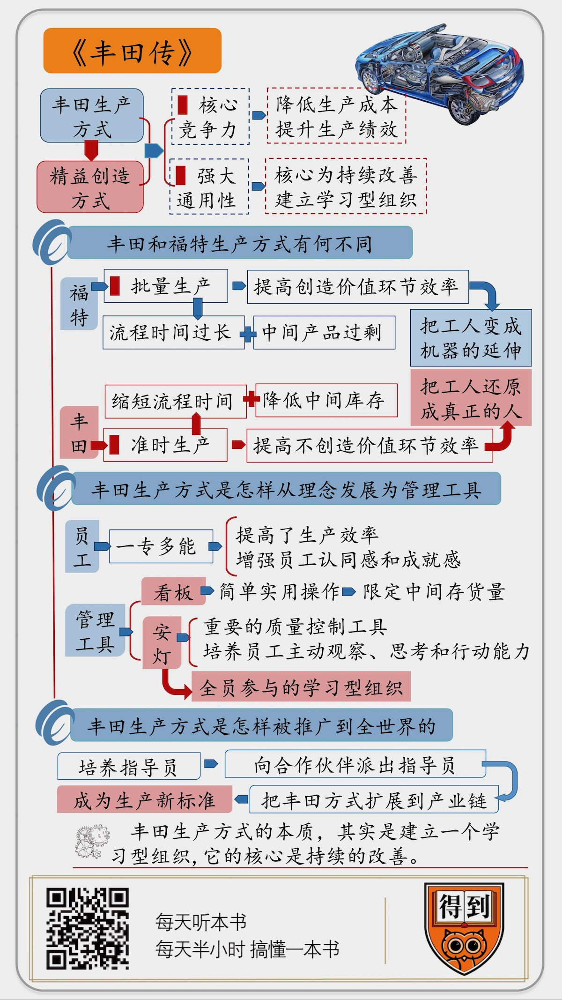

# 2020009. 丰田传
> 《丰田传》| 徐玲解读

## 关于作者

野地秩嘉，日本著名纪实文学作家。为了写这本书，他用 7 年时间对丰田汽车进行了 70 次实地走访，可以说他是用「丰田生产方式」完成了本书的写作。

## 关于本书

本书是日本丰田汽车的最新传记。对于丰田的发展路径，本书并没有面面俱到，而是把视野聚焦到一点上，就是著名的丰田生产方式，后来也被叫做精益制造方式。这本书重点讲述了丰田生产方式从一种理念发展为一整套管理工具，从丰田公司的独门秘技发展为行业新标准的过程。

## 核心内容

一、丰田生产方式和福特生产方式有什么不同？

二、丰田生产方式是怎样从一种理念发展为一整套管理工具的？

三、丰田生产方式是怎样从丰田公司溢出，被推广到全世界的？

## 前言

这期音频为你解读的是《丰田传》，也就是世界顶级车企丰田汽车的传记。在 2019 年《财富》世界 500 强中，丰田汽车排名第 10，紧挨着排名第 9 的大众汽车，在全球车企中位列第二。

我们知道，一家企业成功的因素有很多，就汽车行业来说，研发、生产、供应链、营销、售后等各个环节都很重要。这本《丰田传》并没有面面俱到，而是把视野聚焦到一点上，就是著名的丰田生产方式，后来也被叫做精益制造方式。这本书重点讲述了丰田生产方式从一种理念发展为一整套管理工具，从丰田公司的独门秘技发展为行业新标准的过程。

为什么丰田生产方式这么重要呢？这首先是因为，丰田生产方式就是丰田汽车的核心竞争力，它能够大幅降低生产成本、提升生产绩效。一个有力的证据就是，2019 财年丰田汽车的销售额比大众汽车略少一点，但净利润却比大众汽车高出将近 20%。丰田汽车连续多年蝉联全球最赚钱车企。这就是为什么最近二十年来，全球制造企业都在学习丰田生产方式，中国企业也掀起了学习丰田的热潮。

第二，也是更重要的，丰田生产方式不但可以用于生产环节，也同样适用于研发、销售等环节，它其实是一种通用工作方法，它的核心是持续的改善。产业专家认为，丰田生产方式的本质，其实是建立一个学习型组织。日本首富、优衣库创始人柳井正这样评价丰田生产方式：「今天的成功可能会成为明天的失败。（拥有）不断进化的‘现场’，这就是丰田强大的本质。」

你看，改善、迭代、学习型组织、进化，这些都是我们今天讲组织管理时最重要的概念。这本《丰田传》给我带来的最大启示，就是如何进行持续的改善，如何让每一天都比前一天有所进步。

本书作者野地秩嘉，是日本著名纪实文学作家，为了写这本书，他用 7 年时间对丰田汽车进行了 70 次实地走访，可以说他是用「丰田生产方式」完成了本书的写作。

下面，我就从三个部分来为你讲述，丰田生产方式的来龙去脉。

第一，丰田生产方式和福特生产方式有什么不同？

第二，丰田生产方式是怎样从一种理念发展为一整套管理工具的？

第三，丰田生产方式是怎样从丰田公司溢出，被推广到全世界的？

## 第一部分

好，下面先来讲第一点，丰田生产方式和福特生产方式有什么不同？

在产业界，提出一种新的生产方式，必然是要应对当时新出现的问题，不可能是无缘无故的创新。在丰田汽车公司诞生的 1933 年，正是福特生产方式大行其道的年代。我们知道，美国福特公司在 1913 年推出了汽车行业的第一条流水生产线，通过批量生产大幅提高生产效率，把汽车价格削减了 70% 以上，让美国 90% 的家庭都买得起汽车，这是了不起的成就。福特的大批量生产方式也成为汽车行业的生产标准。那么，作为新生企业的丰田汽车，为什么不直接引进福特生产方式，而要另起炉灶，搞一套新的生产方法？

这就要说到丰田汽车的创始人，丰田喜一郎。丰田喜一郎是不折不扣的富二代，他的老爸丰田佐吉是当时日本家喻户晓的「发明大王」，他发明了一种新型的自动织布机，然后抓住机会建立了日本最大的纺织企业之一，丰田纺织。在那个时代，纺织企业就是代表了最先进生产力的高科技企业。

丰田喜一郎从东京帝国大学工程学专业毕业后，直接进入丰田纺织，负责自动织布机的生产。不过，他真正感兴趣的领域是汽车。后来，等老爸丰田佐吉去世，大概是因为没人能「管」他了，丰田喜一郎随即宣布，进军汽车行业。消息一出，人们都认为这是这位有钱少爷一时的心血来潮，很有可能把「凭运气继承来的家当，最后凭实力都赔光」。

更不靠谱的是，按丰田喜一郎的计划，他不是老老实实从最简单的汽车装配开始干起，也不是从美国全套进口一条现成的生产线，而是一上来就宣布，要自主研发、自主生产包括发动机在内的所有核心部件！这对于在汽车行业零基础的丰田纺织来说，简直就是不可能完成的任务。丰田纺织上上下下都强烈反对这项计划，当然，反对无效，丰田喜一郎还是一意孤行。

1933 年，丰田喜一郎正式成立了丰田汽车公司，并于两年后下线了第一款试验车型 ——A1 型轿车。制造汽车当然没有丰田喜一郎想象得那么简单，这款 A1 型轿车实际上绝大部分零件是从美国进口的。但是有一点：它的发动机基础零件，是由丰田汽车自主生产的，这在今天看来仍然是非常了不起的成就。有几家汽车企业能做到，一上来就自主生产发动机零件？

从这段经历可以看出，丰田汽车从一开始就有着强烈的自主研发意愿，拒绝全盘「拿来主义」。尽管出于现实需要，丰田汽车后来还是引入了美国的全套生产线，但他们无时无刻不在考虑，如何优化这条生产线，如何比美国人做得更好。更何况，丰田喜一郎发现，日本车企如果全盘采用美国人的大批量生产方式，根本行不通。

为什么呢？因为当时的日本经济还远远比不上美国，购买力很有限，只有少部分企业和极少数家庭买得起汽车，和美国 90% 的家庭都拥有汽车是不可比的。狭小的市场规模就决定了，日本车企不可能进行大批量生产，而只能进行少量生产。少量生产，就没有规模效应，成本必然很高，技术又起步得晚，那日本汽车还怎么与美国汽车竞争呢？一想到这里，丰田喜一郎就有强烈的危机感。这种危机感后来成为了丰田文化的一部分。

丰田喜一郎认识到，丰田汽车想要活下去，必须找到在少量生产的前提下削减成本的方法。这个办法从书本上肯定是找不到的，必须回到工厂一线，从生产现场寻找突破口。作为创始人，丰田喜一郎经常身穿工作服泡在一线，通过长期的现场观察，他终于找到了削减成本的突破口。丰田喜一郎发现，传统的批量化生产方式，表面上效率很高，实际上存在着大量的浪费。为什么呢？

我们以铸造一个零件为例。一个零件从原材料到成品，一共需要经过 9 个环节，分别是：进度安排、铸型、运输、排队等候、调试、机械加工、检测、组装、排队等候。在这 9 个环节中，只有铸型、机械加工和组装这 3 个环节是真正创造价值的，而其他 6 个环节，即排队等候、调试、运输、检测等等，都是辅助流程，不创造价值。如果我们进一步考察每个环节所用的时间，会大吃一惊：真正创造价值的环节，只占总流程时间的不到 10%；而那些不创造价值的辅助流程，占到了总流程时间的 90% 以上。

在这里，福特式大批量生产的浪费就显现出来了。首先，大批量生产并不能提高全流程生产效率，而仅仅提高创造价值环节的生产效率。前面说了，这部分实际上只占总流程时间的不到 10%，它的效率再高，也不可能大幅缩减总流程时间，因此很大一部分效率实际上是浪费掉的。第二，也是更麻烦的，大批量生产制造出了大量的中间产品，这些产品在库房或车间堆积如山，往往要等待几个星期才能进入下一个加工环节。这样一来，一是严重占用了资金和厂房空间；二是无法及时发现质量问题，等下游环节发现问题的时候，上游环节已经生产出了大量的瑕疵品。

在丰田喜一郎看来，这种情况是极大的浪费，削减成本必须从这里突破。于是，丰田喜一郎提出了著名的「JUST IN TIME」生产方式，一般翻译为「准时生产」。它的出发点是，最大限度地降低中间产品库存，只在必要的时间、以必要的数量、生产必要的零件。最理想的状态，就是让材料和零件在生产现场流动起来，而不是堆积在原地。只有这样，才能最大程度地去除浪费、削减成本；只有这样，少量生产的日本车才可能与大批量生产的美国车一争高下。

这就是丰田生产方式与福特生产方式的不同：福特生产方式重在提高创造价值环节的效率，而丰田生产方式重在提高不创造价值环节的效率，通过去除「无用功」，大幅缩短总流程时间；福特生产方式一定会出现中间产品过剩，而丰田生产方式以「准时生产」制度，来大幅降低中间库存，去除浪费。

作为丰田汽车创始人，丰田喜一郎最早提出了丰田生产方式的基本理念。但是很快二战打响，丰田汽车被纳入日本军工体系，「准时生产」制度并没有真正落地。丰田喜一郎也在 50 多岁就去世了。战后，接过丰田喜一郎的思想，真正把丰田生产方式从一种理念发展成一套成熟的管理工具，并在全公司推广开来的，是另一个传奇人物，叫大野耐一。下面我们接着聊。

## 第二部分

在丰田汽车内部，大野耐一是确立丰田生产方式的最大功臣。丰田喜一郎只说了要准时生产、要去除浪费，但具体怎么做、采用什么方法，从理念到实践怎么落地，这些都不清楚，直到大野耐一加入丰田。

大野耐一是那种典型的铁腕改革人物。他身高 1 米 8，在当时的日本人中绝对是鹤立鸡群。再加上他脾气急躁、发起火来暴跳如雷，据说只要他一出现在工作现场，就会吓得员工瑟瑟发抖，人称「恶魔」。大野耐一原来是丰田纺织的生产经理，后来被调到才刚起步的丰田汽车。他心心念念的事情，就是要把丰田喜一郎的「准时生产」想法落地。

然而，大野耐一刚到汽车车间就发现，这里的生产效率甚至远远不及纺织车间。一个纺织女工就能照看 20 多台自动织布机，而汽车车间里的每一台设备都需要一个专门人员来操作。操作人员长时间重复相同的动作，也容易疲劳。大野耐一心想，能不能让一名员工学会多种技能，能够操作附近几台不同的机器？这种想法在当时绝对是异类，因为福特生产方式认为分工越细越好。大野耐一偏不认这个理，在他的坚持下，后来丰田生产员工都是「一专多能」，每个人能操作 5~6 台设备。不但提高了生产效率，还增强了员工对工作的认同感和成就感。

再说回到当时，大野耐一发现汽车车间还有一个明显问题，就是少数员工忙得不可开交，而大部分人都无所事事。一问原因，原来他们是在等待零件。前工序的零件没有送到，后工序当然就只能等待。这时候，大野耐一就会不管不顾地带上一帮员工，跑到前工序的工厂去亲自取零件、甚至是自己撸起袖子做零件，搞得前工序的生产经理非常尴尬。几次之后，大野耐一突然想到，这种「自取零件」是一种极好的去除浪费的方法。为什么呢？

一直以来，前工序和后工序之间生产进度的衔接，是一件特别麻烦的事情。如果前工序生产快了，就会导致中间产品堆积；而如果前工序生产慢了，又会导致后工序停下来等待，两种情况都是浪费。那前工序到底该生产多少合适呢？好办！让后工序直接去告诉前工序，自己下一批需要多少零件，不就解决了吗？

在这个思路启发下，大野耐一发明了一个重要的生产管理工具，叫做「看板」。具体做法是，由后工序给前工序送去一只空箱子，写上需要的零件数；前工序就按照这个数量进行生产，完成之后就停工，直到有新的空箱子送过来。「看板」的本质，是前工序把后工序看成自己的客户，严格按照客户的订单节奏来生产；而不是只图自己方便，把生产出来的货物一股脑塞给客户，或者扔进仓库。

按照丰田喜一郎的设想，完美的「准时生产」制度是不应该有任何中间产品存货的，所有的工序都无缝衔接，所有的零件都在生产线上流动。但这对生产管理的要求太高，一开始很难实现。大野耐一发明的「看板」实际上是对「准时生产」的一种折中，即通过简单实用的操作，把中间存货限定在一个极低的水平。「看板」一推出，很快就在丰田车间得到了普及。

除了「看板」，还有一个重要管理工具叫做「安灯」，安装的安，灯光的灯。具体做法是，生产线的每个工作台上都有一个按钮，员工在工作过程中一旦发现任何异常，就按下按钮，工作台会亮起黄灯。这时候，班长、组长会马上过来协助解决问题。如果在几十秒之内问题得到解决，那么生产线就恢复正常；如果问题无法及时解决，那么这段生产线就会自动停止下来。

换句话说，「安灯」是赋予现场的每一个员工随时停止生产线的权利。停止生产线，是福特生产方式中的大忌，生产线一旦停止就是重大责任事故，从经理到一线员工统统要追责。而丰田生产方式却反其道而行之，鼓励员工「安灯」。大野耐一规定，只要员工一「安灯」，现场经理就必须对员工真诚地说「谢谢」。这是为什么呢？

在大野耐一看来，「安灯」是一种重要的质量控制工具。员工一发现问题立即安灯，现场解决，就可以从生产源头把住质量关。而员工如果害怕被追责，发现了问题也不敢说，导致瑕疵品流入下游环节，到时候不得不返工、报废甚至是召回，损失就大了去了。这样一算账，员工主动「安灯」就是在为公司省钱，当然要鼓励和感谢了。

更重要的是，安灯制度培养了员工的主动观察、主动思考和自主行动能力，员工在工作时不仅需要动手，更需要动脑。一个全员参与的学习型组织就这样从基层开始生长出来。与此形成鲜明对比的是，据说福特汽车创始人亨利·福特曾经抱怨说：我明明只雇了一双手，怎么来了一个人？虽然这很可能只是个段子，但从这个意义上可以说，丰田生产方式和福特生产方式最本质的区别，其实是对待人的方式。福特把工人变成机器的延伸，而丰田把工人还原成真正的人。丰田生产方式，恢复了人在大规模工业生产中的价值。

有意思的是，当初发明「安灯」，并不是为了质量控制，而是为了解决现场员工的「内急」问题。当时，在大型生产线上作业的员工想上厕所时，常常找不到人来临时替代自己，又不好意思大声报告，所以就通过「安灯」来提示组长。如果灯亮后两分钟还没有人来顶替，这名员工可以自己停止生产线去上厕所。大野耐一心想，生产线上遇到的其他问题，同样也可以用安灯来解决啊，于是把安灯作为一个重要工具推广开来。

就这样，大野耐一创立了丰田生产方式的一系列管理工具，并在丰田的所有工厂内推广。但是一开始，无论是要求员工掌握多样化技能，还是在工厂推行看板等工具，都不是一帆风顺，而是引发了一波又一波的反对浪潮。

平心而论，丰田生产方式并没有增加一线员工的劳动强度，反而是让整个生产节奏慢下来，那为什么一开始还会遭到抵制呢？其实，抗拒变革是人的一种本能，大野耐一很理解员工的这种心态。他说：「人类都坚信自己一直以来的做法是最好的。我的行为就相当于推翻了他们一直以来深信不疑的东西，这可不是一件容易的事。」当然，大野耐一强硬的行事风格，也许更加深了人们的误解。

丰田公司流传着这样一则段子：公司规定进入生产现场必须戴安全帽，而大野耐一却从来不戴。这么一个整天强调规定的人，怎么在这件事上公然违反规定？有一天，终于有人忍不住问他，大野耐一回答说：「我知道大家都恨我，大概还有人想用锤子打我的头吧。如果我戴安全帽的话，岂不是不方便别人下手了嘛。为了让大家不管从哪个角度都能打中，我绝对不戴安全帽。」

你看，在任何时候，推行改革都不是一件容易的事情。

## 第三部分

大野耐一差不多花了 20 年时间，才让丰田生产方式在丰田内部落地生根，成为上上下下都一致认同、一以贯之的制度和理念。与此同时，丰田汽车也从一家从零起步的小企业，成长为日本汽车行业的领头羊，力压富士重工、三菱汽车等从飞机制造转入汽车行业的企业，创造了一个奇迹。那么，作为丰田核心竞争力的丰田生产方式，会不会作为企业机密被严格保守，就像可口可乐守着它的「神秘配方」一样？

一开始，丰田公司的确是这么想的。丰田高层一直有一种强烈的危机意识，他们担心一旦美国车进入日本市场，日本车企会被杀得片甲不留。所以才摸索多年，好不容易搞出了一套比福特模式还先进的生产方法，当然不肯轻易示人。但是，丰田的成功引起了外界的强烈关注，媒体热炒丰田公司发明了一种叫做「看板」的神秘生产方式。还有传闻说，丰田公司是通过压榨员工和上游供应商而获得了高额利润。一时间谣言四起，甚至惊动了日本国会介入调查。

为了辟谣，大野耐一不得不专门写了一本书，来向公众解释丰田生产方式。但是，他故意在书里用上大量生僻术语、写得云里雾里，就是为了不让外界尤其是美国车企来效仿。结果其他企业果然学得一知半解，照搬过去后不但没有提高效率，反而引起了生产混乱。

大野耐一很快意识到，自己这点小聪明是行不通的。你想，一辆汽车有 3 万多个零件，再强大的车企也不可能独自生产所有零件，其中 70% 的零件要向合作企业采购。如果这 70% 的采购成本降不下来，那么丰田的总成本也降不下来。所以，必须把丰田生产方式传授给上游合作企业，让它们也能大幅削减成本。同样的道理，在产业链更上游的企业，也必须学会丰田生产方式。这样一来，丰田生产方式当然就不能只是丰田一家的独门秘技，而是必须在全产业链进行推广。想清楚了这个道理，大野耐一派出自己手下的得力干将，奔赴各家合作企业的生产现场，帮助它们掌握丰田生产方式，这样的人被称为「指导员」。

很多企业以为，丰田生产方式就是看板、安灯这些管理工具，其实错了。丰田生产方式的精髓，也是最难学的地方，是持续消除现场的无用功，实现生产流程的持续改善。什么是「无用功」？就是前面提到的那些不创造价值或者存在浪费的环节，如排队等候、运输移动、过度加工等等。对此，大野耐一举了一个极端的例子。在汽车组装车间，你如果闭上眼睛，能时不时听到嗡嗡嗡的声音，那是电动扳手拧螺丝时发出的。大野耐一说，在「嗡嗡嗡」之外的所有时间，都是无用功。

指导员的任务，就是要练就一双火眼，通过在生产现场的细心观察，找出存在的无用功，并尽可能消除。这听起来容易做起来难。本书作者说，他 70 次参观丰田工厂，每次都会仔细观察生产线，尝试着找出无用功，但完全没有头绪。而有一次工厂负责人陪同他参观，负责人一眼就发现在一条新生产线上，需要费时费力地撕掉零件包装上的胶带，立即下令进行改善，换成无胶带的包装。这种功力显然是长期刻意训练的结果。

那么，这些火眼金睛的指导员，到底是怎么被训练出来的呢？这就要说到著名的「大野圆圈」的故事。话说一个叫林南八的年轻小伙刚从大学毕业，就进入丰田汽车，被分到了负责改善现场的「大野耐一学校」。上班第一天，他早早到了公司，刚在办公桌前坐下来，他的上司就朝他怒吼：「你在干什么？我们的工作是对现场进行改善。快去现场，现在还不是你坐办公室的时候！」林南八战战兢兢地站起来问：「主任，我应该去哪个现场？」主任一瞪眼：「自己去找！」

林南八没有办法，只好一个人在工厂里乱逛。看到生产现场有比较面善的员工，就凑上去说话：「请问，工作中有遇到什么问题吗？」但生产现场非常忙碌，谁有工夫搭理他？「去，去，小子别碍事。」林南八就这么连续转悠了好几天，从早到晚一直在现场泡着，终于有人肯和他说话了；又过了一阵子，林南八渐渐地和现场员工打成一片了。但是，虽然他每天都认真地观摩生产线，却仍然看不出有什么需要改善的地方，很是苦恼。

这时候，传说中的「恶魔」大野耐一现身了。他把林南八带到一边，然后掏出一只粉笔，在地上画了一个半径一米的圆圈，告诉林南八：「除了上厕所之外，你就一直站在这个圆圈里观察。就看生产线上的那一个员工，找出他动作中存在的无用功。」结果，林南八在那里一站就是 8 个小时。大野耐一绝对不会直接告诉下属该怎么改善，他只教给他们观察的方法，然后自己找出答案。培养员工的独立思考、自主解决问题的能力，一直是丰田生产方式的底层逻辑。

经过几年这样的魔鬼式训练，林南八终于出师了，他作为指导员被派往丰田的上游企业，改善生产作业。林南八一副斯斯文文的书生模样，现在要到一个陌生企业，去对人家生产线上的老师傅指手画脚，告诉人家该怎么工作，你想这得面对多大的压力？好在，现场工人们所有的白眼和冷遇，林南八早就习以为常，他也懂得该如何用诚意化解这种局面。这其实才是指导员的真正功力：如果不能获得现场人员的接纳和信任，就根本不可能进行成功的改善。林南八也终于知道了，当初领导为什么那样训练自己。

大野耐一去世后，林南八继承他的衣钵，继续推广丰田生产方式。大野耐一的徒子徒孙们一批批奔赴各家合作企业的生产现场，丰田生产方式就这样扩展到了丰田所有的合作企业，扩展到了整个汽车产业的上下游，直到成为全世界制造企业争相学习的生产新标准。

## 总结

以上就是我们今天讲的丰田生产方式的发展历程，来简单回顾一下。

第一，丰田生产方式与福特生产方式的不同在于：福特模式是通过大批量生产来提高效率，而丰田模式是通过去除「无用功」来提高效率；福特模式把工人变成机器的延伸，而丰田模式把工人还原成真正的人。

第二，大野耐一把丰田喜一郎提出的「准时生产」理念，具体化为「看板」「安灯」等精益管理工具，用 20 年时间把丰田生产方式发展为一套完善的管理制度。

第三，丰田生产方式的精髓在于现场的持续改善。丰田公司通过培养指导员、向合作伙伴派出指导员，把丰田生产方式扩展到了整个产业链，成为制造行业的生产新标准。

关于这个话题，我还解读过一本书叫《丰田模式》，那是从具体操作层面做的更详细的阐述，建议你结合起来听。

