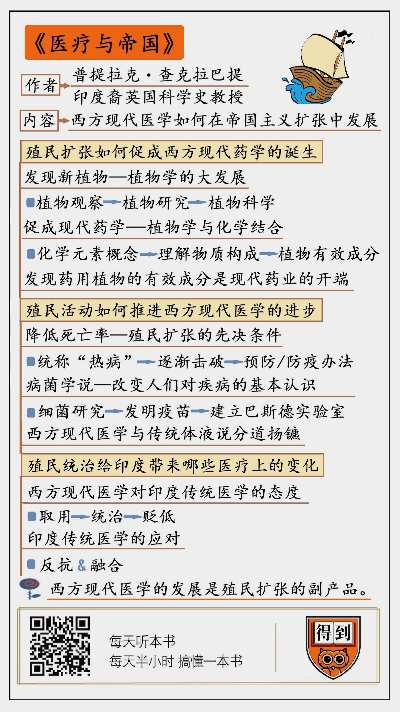

# 2020010. 医疗与帝国
> 《医疗与帝国》| 施展工作室解读

## 关于作者

普提拉克·查克拉巴提，印度裔，在英国曼彻斯特大学担任科学史教授，写过《西方科学在印度》《英属印度的细菌学》等，学术研究的重点就在印度和西方科学的关系上。

## 关于本书

这本《医疗与帝国》，写到了印度，也写到了南美和非洲。西方人通过贸易和战争向外扩张，在这个过程中，现代医学是怎么发展起来的？帝国扩张和医学发展有什么样的联系？新的植物、黑奴贸易以及高死亡率，扩张带来的问题，如何在现代医学上得到回应。

## 核心内容

不过两百年前，西方人也是相信「四体液说」的，相信放血疗法的，但他们对新世界的扩张之路，也让医学走上了从无知经过试错到达科学的胜利之路，西方医学所走过的路在文化上大获全胜。

## 前言

今天我要解读的这本书叫《医疗与帝国》，副标题是「从全球史看现代医学的诞生」。

为什么今天，西方现代医学在西方世界之外的很多地方都逐渐取代了各种传统的医疗手段，成为主流呢？今天要讲的这本《医疗与帝国》会为你提供一个更宏观的视角去看待这个问题。

作者认为，西方现代医学是在大航海时代之后，西方殖民者搞帝国主义和殖民主义，通过贸易和战争向外扩张的过程中发展起来的。某种意义上说，西方现代医学的发展就是西方人殖民扩张的副产品。所以，西方现代医学也伴随着殖民扩张和全球现代化的过程，影响到西方世界之外的很多国家和地区。

这本书的作者叫普提拉克·查克拉巴提。听名字就能猜出来，他是一位印度裔学者。他现在在英国的曼彻斯特大学担任科学史教授，写过《西方科学在印度》《英属印度的细菌学》等等作品，关注的重点就是印度和西方科学的关系。这本《医疗与帝国》，写到了印度，也写到了南美和非洲，讲的就是西方现代医学如何在帝国主义扩张中发展起来的。

我的解读会分成三个部分。

第一部分，我们讲大航海时代来临之后，殖民扩张如何促成西方现代药学的诞生。

第二部分，我们讲 19 世纪的殖民活动如何在客观上推进了西方现代医学的进步。

第三部分，我们来看看英国的殖民统治给印度的医疗带来了哪些变化。

查克拉巴提写得有点儿学术腔，我在解读过程中会为你补充一些更有意思的材料。

## 第一部分

我们先进入第一部分。西方国家在殖民南美和非洲的过程中发现了不少新植物，这些植物促进了植物学、化学等等相关科学的进步，促成了西方现代药学的诞生。这也在客观上促进了西方现代医学的进步。

我们先来看几个在西方历史上跟医疗有关的事例。公元前 323 年，亚历山大大帝临死前说了一句话，「我死在太多医生的帮助下。」时间飞速跨越了两千多年，到 1799 年，美国开国总统华盛顿，也在医生的「帮助」下死了。他感冒发烧，喉咙疼，引发了肺炎，经过放血疗法，死了。古罗马时期，西方有一位医学圣人叫盖伦，他认为人的所有疾病都是由于体液的不平衡造成的，体液分为四种，即黏液、黄胆汁、黒胆汁、血液。他最喜欢的疗法就是放血，或者服用泻药和催吐剂，把坏的体液排出来。到 1920 年，西方的一本医学教科书上还有这样的说法 —— 对于原本强壮健康、刚刚染上疾病而且病势凶猛伴有高烧的病人，放血是很好的做法。这本教科书的作者是威廉·奥斯勒爵士，他是牛津大学的医学教授。

挑这么几个片面的事例来讲，并不是要黑西医，而是想说，西方医学发展成为一门科学，是一个缓慢的漫长的历史过程。在这个缓慢的过程中，有一个重要的转折点，就是哥伦布发现美洲。人类的每一个发现都可能会相互促进，共同来形成理性的进步，大航海时代来临就促进了西方现代医学的进步。

翻看古希腊医生留下的《药物志》或者欧洲中世纪一些药用植物的手抄本，你会感觉跟看《本草纲目》差不多。比如，书里说到鸢尾花，性温和，有止咳平肝提神的效果；用七盎司和蜂蜜水同服，可催眠、治疗腹部疾病；与醋同食，可治毒蛇咬伤。杜松子对胃有好处；红萝卜利尿，但是会打嗝。

这种对草药经验主义的理解，在大航海时代来临之后发生了根本的变化。

这个变化的第一步，是植物学的大发展。随着大航海时代的来临，许多欧洲的自然学者、传教士、医生在亚洲和美洲旅行。他们到新世界旅行，发现了新的植物，也开始了新的观察。每到一地，就会有学者从博物学家的角度写下一本植物志。到锡兰，会写出《锡兰植物志》；到印度，会写出《印度植物志》。欧洲人在新世界发现了很多有意思的植物，咖啡、烟草、玉米、西红柿，以及各种香料，还有一大门类就是药用植物。到 18 世纪晚期，英国每年从新世界进口的药物价值十万英镑，跟 17 世纪相比，增长超过 50 倍。

对自然的观察带来了经验主义的积累，慢慢就有了新的研究著作，比如《牛津寰宇植物史》《植物解剖学》《植物史》等等。从书名就可以看出，植物研究向前迈进了一步，不止步于观察了。到 18 世纪中叶，植物学成了一门科学。瑞典的植物学家林奈发展出一套分类系统。他对植物的分类不是根据产地或者文化上的起源，也不是根据它们的用途，而是根据花朵雄性和雌性部位的数目和排列来分类。

这个变化的第二步是植物学和化学结合，这为药学的发展打好了基础。18 世纪，近代化学之父拉瓦锡提出了元素这个概念，化学这门学科有了巨大的进步，开始更深入地理解物质的构成。有了化学的加入，人们就能弄清楚那些药用植物到底是因为什么成分才能够治病。比如说，欧洲人早就知道鸦片能镇痛，到 1804 年，他们才知道鸦片的有效成分是吗啡；葡萄牙殖民者早就发现，巴西和秘鲁的土著用一种叫吐根的植物作催吐药，这玩意儿能治痢疾，到 1817 年法国的化学家分离出吐根中的有效成分，命名为吐根碱（一般叫做依米丁）；金鸡纳树皮能治疟疾，1820 年确定它的有效成分是奎宁。这种研究不光是集中药用植物上，咖啡里的咖啡因，烟草里的尼古丁，都是在 1820 年前后被化学家发现的。1820 年，200 年前的事。

发现药用植物的有效成分，这就是现代制药业的开端。从 19 世纪中期开始，欧洲的实验室和制药厂开始把植物的有效成分做成药物，再出口到殖民地。19 世纪还出版过一本《爱丁堡药典》，这本书就是用拉瓦锡的化学命名法，把世界各地引进到英国的各种药用植物进行了分类。这时候，欧洲人就不是从经验主义的角度去认识自然了，博物学和化学走到了一起，用元素、化合物来认识植物，化合物的名称尽可能精确地表达出其成分的性质，这是新的药学方法。药学在欧洲的医学院里也成了一门真正的科学。

以上就是第一部分的内容。在中世纪的欧洲，欧洲人对药用植物的理解也非常朴素，但随着大航海时代的各种贸易活动，欧洲人开始认识新世界的药物。欧洲人有博物学的传统，每到一地就搜集和观察当地的新奇植物，在这个基础上进行分类和研究，用化学方法分离出药用植物的有效成分。现代药学和现代制药业由此开端。

## 第二部分

接下来我们进入第二部分。在殖民扩张的过程中，欧洲人为了降低死亡率做出了很多努力，获得了很多宝贵的医疗经验。这些经验，客观上推动了西方现代医学的进步。

讲这部分之前，我们先离开这本《医疗与帝国》说说另外一本书，书的名叫《一个英国军医的中国观察实录》。它的作者叫查尔斯·戈登，是英国陆军的军医。1860 年，第二次鸦片战争期间，他随英国军队占领天津，第二年随英军撤退。他这本书记录的就是英国军队在天津的医疗卫生状况以及他观察到的中国现实。第二次鸦片战争对我们来说是一段屈辱的历史，而如果我们从戈登的视角来看，这段屈辱的历史之中还有一条潜在的线索，就是现代医疗的进步。

戈登的这本书其实就是一份军医报告，报告围绕的核心问题就是士兵的健康，其中包括常规报告，疾病分析和死亡率统计，还有就是军队卫生体系建设的建议。首先，在常规报告里，他要考虑如何把伤员撤离到香港，得到更好的治疗，他还要考虑当地医院的管理者、医生、后勤人员如何配置等等问题。其次，戈登做了疾病分析和死亡率统计，包括住院率是多少，死亡率是多少；哪一个士兵因为什么而死，和气候有无关系；甚至英国士兵怎么死的，印度锡克族士兵怎么死的，跟他们的体质有无关系。第三，关于军队卫生体系建设，戈登对营房的卫生条件提出了很多要求，比如营房要建厕所，要有独立的小便池，有淋浴房，能供应充足的热水等等。

在戈登这本书里，我们看到了英国军医为降低军队死亡率所做的各种努力，殖民扩张就是以这样的方式，在客观上推动了西方现代医学的进步。比如说他们对军营的卫生要求，就是公共卫生和防疫制度的模型 —— 通风、干燥、洁净的水源、处理排泄物，这些军营的标准后来也广泛运用在欧洲城市建设中。

下面，我们再回到《医疗与帝国》这本书。在殖民扩张中，欧洲人有武器上的优势，但武器无法对付疾病。殖民者来到非洲、亚洲之后，被各种疾病深深的困扰。他们把在殖民地遇到的疟疾、伤寒、黄热病都称为「热病」，因为他们认为这些疾病都是炎热气候的有害瘴气导致的。如果欧洲人的身体不能适应亚洲和非洲，适应热带，那有先进的武器也没用。降低死亡率成为殖民者的一个重要目标，因为这是殖民扩张的先决条件。

1841 年，英国人派出三艘船去尼日尔河探险，参加探险的 145 个欧洲人里有 130 人患了热病，其中 40 人死亡；而参加探险的 158 个非洲人，只有 11 人患热病，1 人死亡。用西方现代医学的观点来看，非洲人死亡率更低，是因为他们对当地疾病有抗体。虽然当时参与探险的医生还没有抗体这个概念，但他们已经知道，用奎宁可以预防疟疾。1847 年开始，英国海军会采用奎宁做预防药，登陆非洲的士兵都要先吃预防药。也就是说，在对疾病有更清楚的认识之前，殖民者先有了预防和防疫的概念，比如保持军营的洁净，远离蚊子，减少发病率。

1860 年代，欧洲人在非洲首次遭遇昏睡病，寄生虫侵袭病人的中枢神经系统，导致人昏迷死亡。这种病从 1900 年代开始在非洲传播，从尼罗河蔓延到苏伊士运河。英国、德国和比利时开始联手研究这种病，很快发现锥虫这种寄生虫。同一时期，美国人在巴拿马运河的工地上遭遇了黄热病，也是一位军医，发现了黄热病的传播途径。原本通称为热病的疾病一个个被辨识清楚。苏伊士运河和巴拿马运河跟英国的利益、美国的利益密切相关，当这些地方受到疾病威胁时，殖民者就会迅速做出反应，确定病原，消灭蚊虫，降低死亡率，维护自己国家的利益。

在这里，我要特别提到的一位科学家是法国人巴斯德，就是巴氏杀菌奶的那位「巴氏」。他的研究改变了人们对疾病的基本认识；他发明的疫苗，改变了人们应对疾病的基本思路。在 19 世纪早期，医生还是从体液、瘴气、环境的角度去理解疾病的成因。到了 19 世纪，巴斯德主张，细菌才是引起疾病的罪魁祸首，疾病都是有害细菌和微生物引起的，而不是体液、瘴气，更不是环境造成的，欧洲人不是不适应热带环境，而是没找到对抗细菌的办法。巴斯德找到了对抗细菌的方法，就是疫苗。1881 年炭疽热疫苗研制成功，1885 年狂犬病疫苗研制成功。1888 年，巴黎成立了第一家巴斯德研究所，在那里，法国人和欧洲其他地方的人可以接种疫苗了。

巴斯德提出的病菌学说，标志着医学和以往的体液学说、瘴气论彻底分道扬镳。他给欧洲人树立了强烈的信心：任何疾病都可以找到致病的病菌，并且用疫苗消灭。公共卫生和医学要以实验室的科学研究为核心。很快，法国人就在他们的殖民地建立各种巴斯德实验室。1891 年在越南的西贡，1895 年在越南的芽庄，然后是河内、阿尔及利亚、卡萨布兰卡、刚果等等。英国也开始在印度建立细菌学实验室。

好，我来总结一下第二部分的内容。殖民者在扩张过程中一直注意降低死亡率。他们采取的办法是预防。随着科学的进展，人们对疾病的理解发生了根本的变化，抛弃了传统的体液说、瘴气论，把关注的焦点集中在细菌、微生物、病原体和病媒上。医学的进步给欧洲人带来了信心，他们相信，人类能对付各种新环境下的疾病。

## 第三部分

下面，我们接着说第三部分，来看看英国的殖民统治给印度带来了哪些医疗上的变化。

《医疗与帝国》这本书是印度裔学者写的，他写到了殖民者科学研究带来医学进步的一面，也写到了他们破坏环境、传播疾病的一面。总体来说，西方现代医学对印度传统医学的态度可以分为三个阶段：首先是取用，然后是统治，最后是贬低。

先说取用阶段。就像我们前面讲到的，一开始，殖民者从殖民地寻找有用的药用植物，也会看看殖民地的传统医疗能够给他们带来哪些贡献。但是，在医学上取得进步后，其他地方的传统医学对他们的价值就越来越小了。欧洲人认为自己担负着「文明开化使命」，认为自己在人种上更优越，要在全世界散播文明的光。殖民者会在自己的军队里配备军医，但在进行黑奴贸易的船只上不会提供医疗救助，关注黑奴的死亡率也完全是从经济收益上考虑。他们会把非洲、中东及远东视为肮脏的、传播疾病的地方。

这时候，他们对印度传统医学的态度就变成了统治。正当细菌学取得进步的时候，霍乱和鼠疫开始在世界范围内爆发。1880 年，第三次全球鼠疫从中国开始流行，1896 年传播到孟买，1898 年传播到马达加斯加，然后是埃及、南美、南非、旧金山、澳大利亚。1899 年到 1923 年之间，霍乱开始流行，在印度导致 80 万人死亡，然后传播到了中东、北非和欧洲。在与这些疾病的斗争中，科学家不断找到致病的病菌，1893 年霍乱弧菌被识别出来，1893 年霍乱疫苗研制成功。接下来，麻风病、肺炎、结核病、白喉、破伤风、脑膜炎，慢慢都找到了治疗的路径。19 世纪晚期，印度成为细菌学实验和疫苗接种活动的热点地区。印度人和英国军队要接种在印度生产的疫苗，来对付鼠疫、霍乱和狂犬病。英国人认为，要用科学知识和现代生物医学来管理印度人的生活和行为。

在英国统治印度一个世纪之后，西方现代医学在印度逐渐确立了自己的统治地位，传统医学的声望大大降低。英国殖民者开始贬低印度传统医学，同时把它边缘化。印度传统医学主要有阿育吠陀医学和尤那尼医学。阿育吠陀医学认为宇宙由五种元素构成，以太、空气、火、水、土，很类似中医的五行说，它也有自己传承两千多年的经典文献，类似《黄帝内经》。它们的传承方式是师傅带徒弟，没有正规的学院，甚至也没有什么教材。

18 世纪，英国人开始在印度建立医学院，学生在医学院接受西方现代医学教育，毕业以后可以进入政府开办的医院或者在城市里自己开业，工作好，收入高。到 1916 年，相关法律出台，公立医院必须用公立医学院的毕业生，只有公立医学院毕业生才能使用医生 doctor 这个头衔，其他的医生，不管你是阿育吠陀医学还是尤那尼医学还是别的什么门派，一律称之为「走方医」。这些走方医被驱逐出城市，只能在乡间行医。

面对这种贬低和排挤，印度传统医学也在努力反抗。他们重新传播印度医学经典，办杂志宣传传统医学。他们会说，西方现代医学虽然有科学支撑，但不是根植在印度土地上的，不适合印度人的体质。

有一种说法很有意思，叫「传统是发明出来的」，面对西方现代医学冲击，印度传统医学一方面开始传播自己的经典，同时也开始学习西方的技术。他们会学习解剖学，学着做手术，并且用现代药物的方式来生产传统医学的医疗产品。毕竟，就算你信奉传统医学，认为传承两千三千年的东西才是经典，如果你到医院去，也不会希望医生用两千三千年前的方法给你治病。

以上就是第三部分的解读，西医对印度传统医学的态度是取用，先看你能治疗哪些特殊的疾病；接下来是统治，只有西医培养出来的医生才能叫医生，剩下的传统医生是走方医，西医要占统治地位；最后是贬低和排挤。面对这种情况，印度传统医学一方面开始反抗，另一方面也开始和西方现代医学融合。

## 结论

以上就是我对《医疗与帝国》这本书的解读，下面我们再来总结一下。

第一，西方医学原本是体液说占主导地位，也用植物来治病。但西方的博物学传统让他们认真研究植物，给植物分类。接下来，拉瓦锡的化学研究，让西方科学家寻找到药用植物中的有效成分，开创了现代药学，走上了科学的道路。

第二，欧洲人在殖民扩张过程中一直承受着高死亡率的代价。怎么降低死亡率成为当务之急，他们一边用预防和防疫手段，一边展开细菌研究，进行微生物捕猎，西方现代医学与传统的体液说分道扬镳，欧洲人探索未知世界，把笼统的热病逐渐击破，寻找病原体和病媒，不断试错，西方现代医学逐渐成为全世界主流的医学。

第三，医学不是研究室里发明出来的，也不是只在医院里进行。医学要跟最广泛的人群打交道，我们在印度传统医学与西医的互动中可以看到，文化、政治理念、信仰、医疗体系的构建，都会对医学施加影响。
