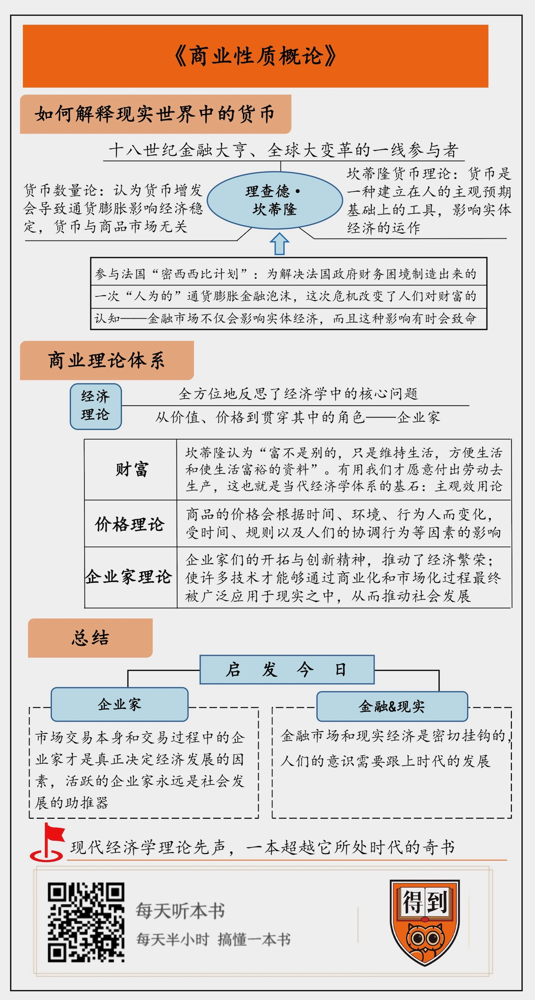

# 2020021. 商业性质概论
> 《商业性质概论》| 施展工作室解读

## 关于作者

理查德·坎蒂隆是爱尔兰经济学家和金融家。他曾长期在英国、荷兰和法国等地从事金融、商贸活动，在当时主要的三大金融市场所在地，阿姆斯特丹、伦敦和巴黎，拥有上百家贸易公司。他与英国王室的关系也十分密切。1701 年，欧洲爆发了一场几乎涉及当时所有强国的西班牙王位继承战争，而坎蒂隆在这场战争中为英国政府提供了战争经费的金融支持。可以说，坎蒂隆是一个上达天听，富可敌国的商人。

## 关于本书

《商业性质概论》诞生于欧洲资本主义在 18 世纪全面崛起的前夜，书中系统阐述了财富的定义，提出了土地与劳动创造了财富的观点，被认为是「关于经济学的第一篇论文」。

## 核心内容

本书通过对人类历史上第一次真正意义上的金融危机，「密西西比计划」事件的来龙去脉为出发点，为你解释亲历了金融危机后的坎蒂隆，根据其多年亲身商业与金融实践对财富、货币与商业运行所做出的一系列的理论贡献。本书的作者坎蒂隆紧贴自身时代的潮流，将现实经验转为系统理论。他揭示出财富的本质不是客观的，本质上是满足人们的需要。他重视市场活动的具体过程，并率先提出了「企业家」对市场繁荣和发展能够做出突出贡献。他有关财富、货币、商业运行的思想直到今天对我们理解经济活动依然具有重要的意义。

## 前言

今天为你解读的书是《商业性质概论》。这本书诞生于十八世纪，但是它绝对是一本超越它所处的时代的奇书，它颠覆了当时的人们对于商业认识，是现代经济学理论的先声。

这本书面世的时候，它的作者已经去世差不多 20 多年，人们对于他的生平、经历和背景一无所知。在之后的很长时间里，这本书和它的作者都是一个谜。直到十九世纪七十年代，经济学家又重新注意到这本书里的观点，他们很惊讶，这些当时前沿的理论早在一百多年前就被提出来了。于是，他们对原书作者产生了兴趣。经过数十年的努力，他们终于通过留存的法院诉讼档案和一些私人书信，勾勒出了作者的肖像。

让人惊讶的是，这位提出了超前经济学理论的作者，理查德·坎蒂隆，不是一个冷眼旁观的学者，而是一个叱咤风云的金融大亨。他曾长期在英国、荷兰和法国等地从事金融、商贸活动，在当时主要的三大金融市场所在地，阿姆斯特丹、伦敦和巴黎，拥有上百家贸易公司。他和英国王室的关系也十分密切。1701 年，欧洲爆发了一场几乎涉及当时所有强国的西班牙王位继承战争，而坎蒂隆在这场战争中为英国政府提供了战争经费的金融支持。可以说，坎蒂隆是一个上达天听，富可敌国的商人。直接参与金融和市场活动的经历，让坎蒂隆能够以更直接和现实的角度看待经济现象，能够发现超越他所处时代的商业真相。

在坎蒂隆生活的时代，工业革命还没有发生。但由于地理大发现，欧洲国家开始积极参与全球贸易，全球化正在升级成 2.0 版本。如果说最早的全球化 1.0 版本是殖民开拓，专注贵金属和原材料的进口，那么 2.0 版的全球化，殖民地和宗主国之间有了专业化分工，并且开始从事规模化生产。换句话说，就是从单纯的商品交易全球化，演变为商品和资本的全球化。在 1700 年前后，大英帝国在与荷兰、法国的海外竞争中获得优势地位，开始崛起，所以坎蒂隆所处的时代刚好是商品和资本全球化兴起的黎明时刻。

坎蒂隆是这场全球大变革的一线参与者，对那个时代经济、市场和金融活动有直接而且深刻的理解。他在书里直接击中了商业运行的核心，也就是财富。他认为，财富的本质是满足人们的欲求，财富想要实现它的功能，必须通过市场过程，其中既包括实体经济，也就是商品市场流通，也包括金融市场，也就是货币流通。他的观点，到今天依然没有过时，它不仅是现代商业理论的先声，对我们普通人理解今天的经济现象也很有帮助。

接下来我们将通过三个问题走进这本书：

第一，作者如何解释现实世界中的货币。

第二，作者围绕财富建构了一套什么样的商业理论体系。

第三，他的观点对我们理解今天经济现象有什么启发？

## 第一部分

那么我们首先来看第一个问题，作者如何解释现实世界中的货币。

说到商业、财富，有一个绕不过去的问题，就是货币。在中世纪晚期，由于货币短缺，社会上流行的观点认为，财富就是货币，确切来说是铸造货币的材料 —— 贵金属。但是 1500 年以后，西班牙人把从美洲获得的大量白银输入欧洲，欧洲人经历了通货膨胀的痛苦，他们才明白，原来货币不等于贵金属。

那么，当时主流的货币理论是什么呢？答案是：货币数量论。货币数量论是极富生命力的一个理论，直到今日还有许多「粉丝」。它的理论逻辑简洁明了：为什么会发生通货膨胀？因为市场上货币太多了。一切通货膨胀问题，归根结底是货币问题。反之，通货紧缩就是货币短缺。从 16 世纪起，货币数量论就成为主流的货币思想。而到 19 世纪，英国经过两次货币争论，货币数量论大获全胜，成为主导英国政府一百年之久的货币政策，也就是「金本位」。

但是，早在 200 年前，坎蒂隆就明确指出：货币数量论不符合现实，通常情况下，发行过多货币不会立刻引发通货膨胀。

坎蒂隆为什么会有这样颠覆性的认识呢？这就要从 1720 年金融危机说起。

1720 年，人类社会真正经历了第一次金融危机，波及当时两大金融市场，伦敦和巴黎。这两大金融市场分别发生了两个金融泡沫事件，英国发生的叫「南海泡沫事件」，法国发生的叫「密西西比计划泡沫事件」。在「密西西比计划」这个事件中，坎蒂隆还是主角之一。更有意思的是，在这场危机中，巴黎金融市场的商人们十个有九个破产，但坎蒂隆不仅毫发无伤，还赚了不少。当然，这也让他后来四面树敌，甚至面临死亡威胁，不得不低调行事。

下面，我要为你重点讲讲法国的「密西西比计划」。现在来看，「密西西比计划」可以说是一次「人为的」金融泡沫，本质上说，它是为了解决法国政府财务困境制造出来的一场「空手套白狼」的大戏。

在路易十四当政的晚期，法国政府遭遇了财政危机。到了路易十五时期，为了解决财政问题，偿还大笔国债，摄政王奥尔良公爵找来了当时一位非常特殊的人物约翰·劳来帮忙。约翰·劳来自苏格兰的一个银行业世家，是第一位提出国家货币纸币化，用信用工具来发展经济的人。他曾经在苏格兰议会提交一份草案，主张发行以国有土地担保的纸币。但是约翰·劳的这个观点过于超前，所以当时苏格兰议会很自然地否决了他的提案。后来由于决斗杀人，约翰·劳逃到荷兰，混迹于荷兰金融圈。但他仍然四处游说，兜售他的观点。最终，在极度窘迫的财政困境下，奥尔良公爵决定采纳约翰·劳的冒险方案。

现在来看，约翰·劳的方案可以说是一套教科书级别的金融诈骗案例。约翰·劳首先成立了一家私有银行，这个银行四分之三股本是法国政府发行的票据，所以这其实是法国历史上第一家国有银行。两年之后，政府授予这家银行发行银行券的特权，也就是说它能发行纸币，并改名为「皇家银行」。接下来，约翰·劳买下了「密西西比」公司 25 年的经营权，这家公司当时负责开发法国在北美洲的殖民地路易斯安那。不过，约翰·劳买这家公司可不是想通过这家公司做什么实业，而是因为约翰·劳知道，当时的法国人普遍认为殖民地开发很有前景，他们对这家公司的股票升值预期很高。

约翰·劳就利用人们的这种预期来卖股票。但是，约翰·劳设置了一个让人晕头转向的复杂程序：要购买密西西比公司的股票，必须先购买法国政府公债，用公债购买公司股票；卖出股票也不能直接换回真金白银，只能换回皇家银行的银行券。也就是说，大家手里的黄金白银交了出去，最后换回的只有一张纸。但是，法国政府出面，说银行券能够用来支付税款，这就相当于政府担保了。所以人们的预期得到了保证，股票价格飙升。随着大量公债卖出，法国政府不出一分钱就获得大量金银用来偿付国债，大大缓解了财政危机。

约翰·劳是个聪明人，他知道这个局要做成，还需要金融界的大佬来撑场面，于是他找到了坎蒂隆。坎蒂隆一开始就知道这是个骗局，但是约翰·劳有法国政府在背后撑腰，迫不得已，坎蒂隆就参与了。不过，坎蒂隆也很精明，在泡沫破裂前，他就偷偷把所有在法国的资产转移到英国和荷兰。所以当后来危机爆发时，坎蒂隆没有任何损失。

「密西西比计划」最终在 1720 年 9 月引发了金融危机。引发危机的直接原因是银行券发行过度，出现通货膨胀，这时法国政府又突然变卦，不再为银行券担保。一夜之间，泡沫破裂，巴黎金融市场完全失控，皇家银行倒闭，密西西比公司倒闭，无数人破产，约翰·劳承担所有责任，仓皇逃跑，只有法国政府成为最大赢家。

这次金融危机带来了很多教训，其中最重要的一点就是改变了人们对财富的认识。

18 世纪初，现代社会的经济模式初具雏形，远洋贸易网络、规模化生产都已出现，更重要的是，金融市场开始在人们生活中占据越来越重要的位置。然而，时代在进步，人们的观念并没有跟进：货币仍被认为只是交易媒介而已；所谓金融，也只不过是高利贷而已。

我刚才提到的货币数量论严格来说就是旧观念下的理论产物，它的潜台词是货币不创造价值，只是交易的工具；货币市场与商品市场无关；物价波动会影响经济稳定，所以稳定物价是最重要的。1720 年的「密西西比计划」金融崩溃给当时的欧洲人上了一课：金融市场不仅会影响实体经济，而且这种影响有时候会致命。

对于参与者坎蒂隆而言，虚拟经济、金融市场与实体经济的关系在他心里留下了深刻的烙印。根据自己对商业的理解和「密西西比计划」的惨痛教训，坎蒂隆提出了反对货币数量论的新的货币理论。

货币数量论最核心的观点就是货币增发导致通货膨胀。但问题是现实生活中，假如央行增发十三亿货币，全国人民每个人的手里立刻就多了 1 块钱吗？显然不是。真实的情况是，国家增发的货币会被一部分人先得到。通常是商业银行、大宗原材料生产厂商、大型基建建设相关的厂商以及房地产商这些位于生产环节上游产业链的人。他们拿到钱之后，会投资、扩大再生产、购买资本品，生产和消费更多的商品。只有当新增货币随着生产环节逐步往下游产业流动，一直到最终消费者，当所有人都分到了新增货币，大家手里的货币都多起来的时候，货币数量论才成立。

然而，现实经济中货币的流通并不是这样的。这就好比长江源头青藏高原上下了一场暴雨，我们能否说南京城水位一定会上涨吗？不一定。当新增货币进入市场时，市场当中很多机制都会发生作用。特别是金融市场，一个又一个金融衍生品就像一个又一个蓄水池，调节着这些货币流动。当蓄水池起作用时，新增货币就会刺激经济繁荣；当蓄水池失控时，新增货币就会导致经济崩溃。

那么，既然货币数量论不对，货币的本质应该是什么呢？坎蒂隆指出：货币不是别的，是一种工具，这种工具建立在人的主观预期基础上，服务于人的需要。这里的关键词，是预期。

即使是今天，我们许多人也仍然有一种观点，认为货币必须是有价值的东西。但是坎蒂隆在两百年前就告诉你，货币本身有没有价值不重要，真金白银可以是钱，但是今天大家领工资的时候连张纸都没有，就是电脑、手机屏幕上一个数字而已，这就不是钱了吗？如果所有人一夜之间认为黄金白银毫无价值，那么这东西还能被用作货币吗？两百多年前，坎蒂隆就认为，货币的价值是建立在预期之上的。在通货膨胀的问题上，货币数量本身不是关键，关键是货币流通过程影响了我们的预期，通过改变我们的预期，货币会影响实体经济的运作。这就是现代市场经济运行背后一系列机制，坎蒂隆在两百年前，就已经洞悉。

## 第二部分

理解了坎蒂隆的货币理论，你就能理解他的整个经济理论体系了。第二部分，我们就来说说坎蒂隆这个理论体系对有关财富和围绕财富展开的活动的三个贡献。

坎蒂隆的经济理论体系，围绕着一个核心的概念，就是财富。人类对经济现象的思考起源于两个问题：第一，财富是什么；第二，如何获取财富。到后来，这两个问题逐步集中到一起变成了「价值理论」：有价值的东西才能称为财富。但什么是价值？在 1871 年以前，人们对这个问题的普遍答案是劳动。一件东西有没有价值，要看人有没有付出劳动去创造它。所以，财富需要通过劳动获取，劳动创造价值。这就是古典经济学体系的基石：劳动价值论。

把劳动价值论发扬光大的，是 17 世纪著名的思想家威廉·配第，他也是统计学的创始人之一。配第一开始只是想找一种公平的征税标准，最后他找到了两个标准：土地和劳动。配第认为，我们可以用土地表示劳动的价值，或者用劳动表示土地的价值。配第的观点被后来的经济学家不断发展，既然劳动可以表示土地的价值，那也可以表示一切产品和服务的价值，于是劳动就成了价值的唯一标准。最终，这个观点在亚当·斯密的《国富论》里被盖棺定论：只有劳动才是价值的普遍尺度和正确尺度，在此之后的一百年间，劳动价值论成为经济学有关财富解释的主导理论。

坎蒂隆认为配第有关土地和劳动存在等价关系的论述不错，但这二者只是创造财富的手段，而不是财富的本质。坎蒂隆认为：「财富不是别的，只是维持生活，方便生活和使生活富裕的资料。」在坎蒂隆看来，财富不是客观的，而是主观的。一件产品、一项服务，对我而言有价值，是因为它能满足我的需要或者说欲望。

你想想，既然财富是主观的，那么劳动价值论的逻辑就得完全颠倒过来了：不是劳动创造价值，而是我们觉得一件产品、一项服务有用，我们才愿意付出劳动去生产它。这个观点也就是当代经济学体系的基石：主观效用论。这是坎蒂隆理论体系的第一个创造性贡献。这种观点，1871 年以后现代经济学家才开始注意到，坎蒂隆比现代经济学早了两百年。

接下来我们来看他的第二个贡献。在坎蒂隆看来，要获取这种主观意义上的财富，只能通过市场交易。交易要有统一的价格标准，但是如果按照各自的需求，同一件商品对不同的人而言价值是不一样的。而坎蒂隆不认同劳动价值论，就等于不认同价格能反映商品的客观价值。所以他必须提出一个新的价格理论，他必须回答，当人们对同一物品具有什么样的价值看法各不相同的时候，如何进行交易。

坎蒂隆认为，市场中商品和服务的价格是通过讨价还价来决定的。坎蒂隆的这个观点，在今天看来依然很有借鉴意义。如果你翻翻现在主流的经济学教科书，标准的说法依然还是用需求曲线和供给曲线的交点来确定价格，这是新古典理论的内容。坎蒂隆从自己的商人经验出发，两百年前就提出了这种供需相等的价格理论不符合实际情况。在现实市场当中，我们不可能看得到一个商品只卖一个价格，现实中商品的价格会根据时间、环境、行为人而变化。也就是说，市场活动本质上会受到时间、规则以及人们相互之间的协调行为这些因素的影响。

既然市场交易的过程决定了商品价格，那么在这个交易过程当中最重要的角色是谁呢？对于坎蒂隆来说，这个角色既不是生产者，也不是消费者，而是一个中间环节，这个中间环节就是「企业家」。这就是坎蒂隆第三个创新性观点 ——「企业家理论」。

坎蒂隆认为，市场交易中很多时候，生产者和消费者都没有直接沟通，企业家在市场中扮演重要的角色，为供给找到销路，为需求找到供应。坎蒂隆他自己就是一个成功的企业家，在他所处的时代，现代经济运行模式才刚刚初步具备雏形，真正意义上的企业家其实不多，如果没有亲身经历，根本不会意识到一点。坎蒂隆高度肯定了企业家对市场繁荣与发展做出的贡献。坎蒂隆认为，正是企业家们的开拓与创新精神，推动了经济繁荣；也正是因为企业家，许多技术才能够通过商业化和市场化过程最终被广泛应用于现实之中，从而推动社会发展。

到这里，我们可以对《商业性质概论》这本书做一个小结。坎蒂隆全方位地反思了经济学中的核心问题，从价值、价格到贯穿其中的角色 —— 企业家。这本书的价值就在于，它在两百年前就提出了一套与我们现代经济学近似的理论体系，财富的主观属性、市场过程、市场主体，这些思想不仅仅远远超越于他所在的时代，对我们今天理解商业社会和经济现象都很有启发。

## 第三部分

所以说，《商业性质概论》讨论的不是两百年前的老皇历，而是非常现实的东西。最后，我想跟你分享一下《商业性质概论》对我们理解今日经济生活有什么启发？

首先，在同时代的学者还在关注劳动、利润、地租这些问题的时候，坎蒂隆已经从新兴的金融市场中看到了无数的可能性，看到了市场交易本身和交易过程中的企业家才是真正决定经济发展的因素。现代经济学中，资本理论也好，货币理论也好，经济增长理论也好，实际上都有坎蒂隆的影响，所以说，这本书首先具有理论意义。

现代经济学应该是什么样子的？就应该是坎蒂隆这样子的，紧贴时代的潮流，将现实经验化为系统理论，而不是闭门造车，成天想着如何发表权威文章。坎蒂隆让我们回到经济过程中来，因为经济本质上就是人与人之间的交往过程。他对企业家和企业家精神的大加赞扬，实质上也是让我们认识到对任何一个社会和国家而言，活跃的企业家永远是社会发展的助推器。

第二，坎蒂隆在这本书中描述和分析的经济现象，在今天仍然是我们需要反思，依然可以从中借鉴的经验。今天，国内的金融市场发展很快，比如支付宝、微信支付等等各种的数字支付手段。在中国，这些互联网金融的应用已经超越了西方，大家都自豪我们出门不用带钱包。但是，我们的观念呢，我们听到的很多对于经济现象的认识，好像还处在上个时代。很多人依然认为只有真金白银才是真正保值的东西。再比如，很多人都在玩所谓的区块链技术，但是有多少人真正意识到这个东西到底是怎么回事？

坎蒂隆意识到，金融市场和现实经济是密切挂钩的。货币不是真金白银，货币是通过生产过程放大出来的一种信用手段，是我们为了满足我们的欲望，满足我们的欲求而采取的一个手段。货币有没有价值，不在它自己，而在于我们每个人的预期，我们期望它是什么，我们相信它是什么？而这种期望、这种想象，不能凭空而来，而是对现实经济运行状况的反映。

## 结论

到这里，我来为你总结一下坎蒂隆《商业性质概论》能带给我们的收获。第一，财富的本质在于它能满足我们的需要。所以，为什么实体经济很重要？因为实体经济满足的是我们生活之需要，你拥有的货币再多，最终还是要看货币背后能代表多少商品。有了价值，就要看商品的价格，坎蒂隆说，价格是人们在市场上讨价还价的结果，人们的交易行为，当前市场中的环境都会对价格产生影响。有了「讨价还价」还不够，市场上最活跃的主体是谁呢？坎蒂隆第一个告诉你，是企业家们的创新与进取精神，推动了我们社会经济的发展。

