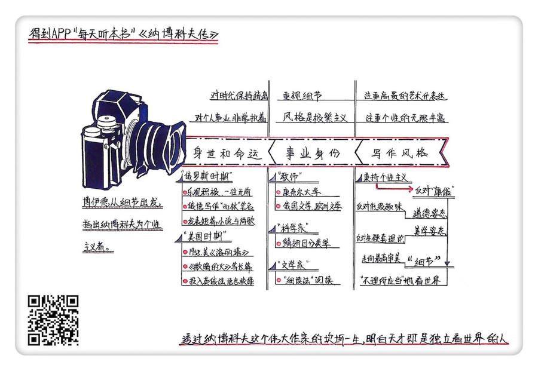

# 2020022. 纳博科夫传

《纳博科夫传》| 李迪迪解读

## 关于作者

布莱恩·博伊德，新西兰奥克兰大学英语系杰出教授，全球最权威的纳博科夫研究专家。他出版过多部研究纳博科夫的著作，在四大洲荣获多种奖项，并被译成 12 种文字。其中，四卷本的《纳博科夫传》写作历时 10 年，是其最富盛名的学术成果之一。此外，他还创办了纳博科夫研究网站「阿达在线」，编辑出版了八卷本的纳博科夫小说、回忆录、蝴蝶研究著述、诗歌翻译及诗集。

## 关于本书

在本书里，作者用准确、从容的笔调追踪了纳博科夫在俄罗斯时期和美国时期跌宕起伏的生命轨迹。作者围绕纳博科夫的三种身份来组织材料，分别是作家、科学家和教师，并注意揭示纳博科夫极具个人色彩的特征：他对细节的关注，他独特的昆虫学研究视角，教学中那些纳博科夫式的问题等等。纳博科夫的小说艺术就是细节的艺术，而作者的文本分析则是小说细读法的范例，他让我们领悟到细节之于纳博科夫小说的决定性意义。同时，作者还向我们展示了「个性主义」是如何点石成金，对纳博科夫的命运和创作产生积极作用的。

## 核心内容

无论在文学创作、科学研究还是教学中，纳博科夫都是一个反对庸见、注重细节的个性主义者，这让他成为了一个独一无二、无法模仿的艺术家。纳博科夫的天才不仅是一种与生俱来的禀赋，更多的是一种对独立思考的选择。

## 前言

《纳博科夫传》这本书的中文版有四卷近 1600 页，我会用大约 26 分钟的时间为你讲述书中精髓：透过纳博科夫这个伟大作家传奇坎坷的一生，我们会看到，所谓天才其实是一种选择，天才就是在任何时刻都能选择独立不倚地看待世界的人。

你也许对纳博科夫这个名字并不熟悉，但你很可能听过甚至看过《洛丽塔》。简单说来，《洛丽塔》讲的是一个有「恋童癖」的中年男人和少女洛丽塔的不伦之恋。敏感的题材让这本小说一经面世就一度成为禁书，而小说中展现出的精巧构思和优美语言，又让它成为惊艳世界的文学经典。而我们今天要说的纳博科夫，就是《洛丽塔》的作者。

纳博科夫是俄裔美国作家，与此同时，他还是文学教授和昆虫学家。他精通英、俄、法三种语言，审美一流，创见颇多。他和博尔赫斯、卡夫卡这些文坛大家一起，在 20 世纪文学史上留下了浓墨重彩的一笔。然而，由于《洛丽塔》表面上讲的是一个恋童虐童的故事，在当时那个保守的时代，人们关于纳博科夫的好奇一般都聚焦在他的私生活上，直到 1977 年纳博科夫去世，西方对于纳博科夫的研究才逐渐趋于成熟。正是在这个背景基础上，本书的作者布莱恩·博伊德开始写作《纳博科夫传》，这一写就是 10 年。

布莱恩·博伊德是个新西兰人，被称为全世界最懂纳博科夫的人，是纳博科夫在全球最权威的研究专家。纳博科夫去世后，他带着自己研究纳博科夫的博士论文，去瑞士见纳博科夫的夫人、也是他的文学代理人薇拉，希望薇拉能给他一些研究所需的帮助。薇拉对博伊德说，他的博士论文是她所见过的纳博科夫研究中最出色的成果。那时候博伊德只有 26 岁，而纳博科夫的研究史已经有将近 60 年了。从此之后，博伊德开始为纳博科夫写传记。10 年后，也就是 1990 年，这套传记陆续出版，迅速为人所知并大获好评，成为我们了解纳博科夫其人其作的最权威、最重要的工具。

纳博科夫的一生跌宕传奇，他的作品又非常复杂难懂，博伊德是怎么把握和提炼的呢？他按照纳博科夫写作时使用的语言，将他的一生划分为俄罗斯时期和美国时期。他抓住了纳博科夫作为文学家、科学家、教师的三重身份，提炼出了纳博科夫的一生和创作过程的关键词，也就是个性主义。那接下来，我就用三个镜头慢慢推进，层层深入，分别从纳博科夫的身世命运、事业身份和个性主义来给你说说这个传奇人物的一生。

## 第一部分

我们先用全景镜头看看纳博科夫的身世和命运。

19 世纪的最后一年，纳博科夫出生在俄国圣彼得堡一个显赫的贵族世家。这个家族有很大的政治影响力，家财万贯而且个个学识渊博。他的祖父担任过沙皇俄国两朝的司法大臣，可以说是参与建立了近代俄国的司法体系。他的父亲是一名自由派政治家、律师和记者。小时候，纳博科夫家里有 50 个佣人，他的家人会同时说英语、法语和俄语，全家人坐豪华列车去欧洲旅游是家常便饭。据说，纳博科夫在学会阅读和拼写俄文前就会阅读和拼写英语了，这让他那爱国的父亲非常懊恼。17 岁时，他继承了叔叔的房产，获得了经济独立。可是到了 1917 年，俄国爆发了十月革命，纳博科夫的家族就开始走上了下坡路。

1919 年，纳博科夫一家被迫离开俄罗斯，流亡到欧洲。他先是在英国剑桥大学读书。3 年后，他的父亲突然去世了，为了掩护自己的朋友，纳博科夫的父亲挺身而出挡住了暗杀者射向朋友的子弹，付出了自己的生命。如果再往上追溯，你会发现整个纳博科夫家族血液里都流淌着一股正义英勇之气，他的祖辈几乎清一色的都是军官和卫国英雄，纳博科夫家族世代相传的徽章就是一头狮子，上面写着「为了勇气」。这种堂吉诃德式的家族血液到了纳博科夫这里，表现为他在人生与艺术创作中乐观积极、一往无前的精神。

父亲遇刺身亡对纳博科夫打击很大，他搬到德国柏林陪伴家人，住了 15 年。几十年后，面对给他写传记的一位作家时，他仍然不愿也不能讲述自己父亲的死。在柏林，他成为一个没有国籍也没有固定收入的流亡者，靠教别人打网球、拳击和法语为生。后来，他娶了同为流亡者的妻子薇拉，两人生活艰难，有时还要靠别人接济。薇拉是犹太人，随着德国的反犹主义愈演愈烈，他们一家人又躲到了法国。

在欧洲的这 20 年，纳博科夫虽然置身在文化气息浓郁的环境里，但他没有安全感，看不到未来，与周围的环境非常疏离。作为一个语言天才，他在德国生活了 15 年，但直到离开德国的时候，他的德语水平也仅限于在街上买香肠。他说他觉得德语太难听，但真实的原因应该是他眷恋祖国。他说自己把祖国最好的东西都随身带着了，那就是祖国的语言。他生活在狭小的俄罗斯流亡者圈子里，每天都要翻看俄语词典，始终用俄语写作，以笔名「西林」发表作品，写出了一系列短篇小说与诗歌，在流亡俄罗斯作家圈里是个很受欢迎的诗人和小说家，但名声也仅限于这个圈子。因此《纳博科夫传》的作者博伊德，就把他去美国之前的这个人生阶段都称为俄罗斯时期。

1940 年希特勒入侵法国后，纳博科夫一家又被迫逃亡到美国。当时纳博科夫已经 41 岁了。俄罗斯已经成了永远回不去的故乡，他明白自己要面对现实。要在美国进入主流文学圈，就必须放弃自己的母语用英语写作，成为一个美国作家。41 岁才开始转换写作的语言，这对于一个作家来说几乎是灾难性的，但这时，纳博科夫再次展现出了那种乐观积极、一往无前的勇气。1955 年，小说《洛丽塔》在欧洲一家出版社出版，但很快就因为题材敏感而被查禁，直到 1958 年才终于在美国出版，那年纳博科夫已经 59 岁了。纳博科夫说，《洛丽塔》是在痛苦的语言转换的痉挛中诞生的。但是如果没有这种痛苦，也不会有这部杰作，他也永远只是俄罗斯流亡者圈子里的一个小作家。可以说，俄罗斯养育了纳博科夫，但成就他的却是美国。我们可以看到，纳博科夫创作的全盛期、人生的全盛期，都是在这个美国时期。

革命、父亲遇刺、纳粹迫害、60 岁才得到国际声誉，纳博科夫的命运是无常的，命运给他带来强烈的失落感，然而，也正是因为这些，他才成为写出真正杰作的纳博科夫。60 岁的时候，纳博科夫再次获得了财务自由，他辞去了大学的教职，专职写作。一家人搬到了瑞士，住进蒙特勒皇宫酒店，一直住到 1977 年纳博科夫去世。在瑞士的 18 年，纳博科夫过着隐居生活，命运戏剧化地让他重新拥有了自己年少时曾拥有的财富，但不管是他漂泊穷困的大半生，还是他富有的年少与年老时期，他都把财富看得很淡，只用财富来交换精神的自由。

虽然已经步入了老年，但纳博科夫的创造力还是很旺盛。《洛丽塔》出版 4 年后，《微暗的火》也大获成功。随后，他相继出版了《阿达或爱欲》《看那些小丑》等长篇小说，还投入了英俄法三种语言的译本校对工作中。除此之外，他还陆续把自己前半生的俄语作品译成英文，把后半生的英文作品译成俄语。他还用了整整 14 年的时间，把他最爱的俄罗斯文学作品、普希金的长诗《叶甫盖尼·奥涅金》从俄语翻译成了英语。可以说，为了留住自己记忆中的俄罗斯，纳博科夫一直在努力寻找俄语和英语之间最佳的转换方式。

晚年的纳博科夫体力进入了衰退期，一直在与疾病和衰老作斗争，没能完成《劳拉的原型》这部作品就去世了。值得一提的是，无论是在德国、美国还是瑞士，纳博科夫离开俄罗斯后，一生都没有买过房子，他觉得只有俄罗斯才是他的家，既然离开了俄罗斯，他就再也没有家，而只有住处了。遗憾的是，直到他死后，俄罗斯才首次出版了他的作品。而那些曾经指责他「毫无俄罗斯骨血」的批评家们，也开始用「浸透着俄罗斯骨血的一生」为他定名，评论家们这种态度的翻转也多少有些讽刺。

## 第二部分

刚才我们大致说完了纳博科夫的贵族身世和坎坷命运，现在我们再把镜头拉近，聚焦到纳博科夫的事业上。就像我们一开始提到的，纳博科夫不仅是个艺术家，还是个科学家和文学教授，这三种身份互相影响渗透，让他成了一个独一无二的作家。

到美国的一年后，纳博科夫进入大学，以客座教授的身份教授俄国文学。1948 年，他 49 岁了，依然很穷，所幸的是在康奈尔大学找到了终身教职，讲俄国文学和欧洲文学。在课堂上，他主要固定讲授一些西方经典文学名著以及俄罗斯文学。

虽然都是些经典作品，但他的阅读理解方式却非常独特。60 年代的美国大学文学院里开始流行一些理论，用各种主义去阐释和批评文学，但纳博科夫坚持的是「细读法」，也就是从细节出发的、聚焦于文本本身的阅读，不掺杂任何理论。比如，他会问包法利夫人的眼睛是什么颜色的？《变形记》里的格里高尔变成的是一种什么虫子？《尤利西斯》里有一个穿着雨衣的人，那个人出现了几次？如果能回答上这些问题，你就能荣登他所说的优秀读者之列。

在纳博科夫看来，优秀的文学作品是一个独立而完整的世界，每个细节都经得起推敲，如果这个虚构的世界做不到细节上的逻辑自洽，那么它就会崩塌。因此，他提醒学生们去注意包法利夫人眼睛颜色随着情绪的变化而变化；提醒读者去搞清楚格里高尔变成的甲虫的样子，以此来理解他所面临的痛苦和他的一系列行为方式；他在黑板上画出都柏林的地图，提醒读者去还原乔伊斯笔下的斯蒂芬在《尤利西斯》中的行走路线，还原小说中的时间和空间。好的文学，就是要掰碎了一小块一小块地品尝，要体会那种不仅仅来自头脑、来自心，还要「来自脊椎骨的颤栗」，一种最高级的审美愉悦。

纳博科夫认为，阅读也是一种创造性活动，一种积极的审美活动，要成为一个优秀读者，需要的是想象力、记忆力、词汇量和艺术感。其中想象力是他最为推崇的能力。他打过一个比方，大意是说文学创作就是艺术家独自在无路可循的山坡上攀援，当他终于登上山顶，迎风而立时，他还是孤独的。这时一个优秀读者用想象力还原了作家所创造的所有细节，还原了那整个世界后，就像一个气喘吁吁兴高采烈爬到山顶的游客，与作家自然地拥抱起来了。很多文坛大家都是纳博科夫的学生，例如写出了《万有引力之虹》的后现代主义大师托马斯·品钦在提起自己的老师时就曾说过，「他教会了我如何阅读。」这就是作为文学教师的纳博科夫收获的最高评价。

纳博科夫还有一个身份是昆虫学家，主要研究鳞翅目。鳞翅目主要包括蛾和蝶这两类昆虫，纳博科夫的贡献主要在鳞翅目分类学。受父亲的影响，他从小热爱收藏和研究蝴蝶，梦想成为昆虫学家。1917 年十月革命爆发，纳博科夫跟父亲跑到克里米亚的时候，全家人的财产只剩几颗珍珠，但纳博科夫却特别高兴，还生气怎么不早点来，原因是那里的鳞翅目昆虫非常活跃，而采集昆虫的大好季节已经结束了。在剑桥念书时，他选的专业也是动物学。1920 年，21 岁的他就在《昆虫学家》上发表了第一篇鳞翅目昆虫学方面的英文论文。流亡欧洲时期，生活动荡，他几乎没有时间研究蝴蝶，但 1931 年，他还是在《昆虫学家》上发表了第二篇研究论文。1940 年踏上了美国大陆后，他的第一份工作就是在美国自然历史博物馆做研究员，并最终在哈佛大学比较动物学博物馆取得了科学家的身份。

博伊德说，纳博科夫在美国难得的快乐时光，就是在夏天沿着公路开着车，穿越美国大陆，一路捕捉蝴蝶。这是一项运动，是个体力活，但也让他的大脑更加活跃。《洛丽塔》的灵感就来源于这项活动。长长的公路，诡异的公路旅馆，光怪陆离的美国，一路上形形色色的人们说的粗俗有趣的语言，对蝴蝶的捕捉，蝴蝶翅膀上鳞片的纹理和色彩，都刺激着他的思考和创作。同时，科学家讲究的精确也深深地影响着作为文学家的他，塑造着他的写作，影响着他的教学。他曾经说，创作就是要将「艺术的精确」和「科学的激情」结合起来。为什么不是「艺术的激情」和「科学的精确」呢？也许同时身为艺术家和科学家的人才能真正了解吧。

说完了纳博科夫的三种身份，那么，这三种身份给纳博科夫的写作造成了怎样的影响呢？这本书说，它们促成了纳博科夫的文体风格，那就是极繁主义。对纳博科夫来说，自然的缔造者是最伟大的艺术家。造物主创造了这个充满了细节，细节之内还有细节、世界之内还有世界的无限的世界，用细节创造了自然与命运的全部密码，这是值得所有艺术家效仿的唯一对象。艺术家不仅模仿自然，还要用想象力创造一个可与之抗衡的新世界。因为自然是无限的，因此，纳博科夫坚信文学艺术也是无限的，是永不会枯竭的。

在推崇极简主义的时代，纳博科夫的文体风格和他的思维风格一样极端繁复，是反时代潮流的极繁主义者。纳博科夫是一个连在回答记者问题时都要不断更正、修改、解释的人，因此，他从来不接受口头访问，只接受文字访问。这也就是为什么他在文学讲堂上也拿着讲稿一字不差地念下去的原因，他不是偷懒，而是害怕自己脱离了那些精心写就的语言，遗漏或弄错细节，这就不够完美了。他的讲稿手稿上有非常多的修改痕迹，每次讲课前他都要修改一遍。接受采访和讲课尚要如此，可以想象他在创作文学作品时又是怎样的完美主义。在纳博科夫笔下，一个故事从来都不是看起来那么简单，他热衷于使用引人注目的题材和形式，引诱读者来揭开谜题，让阅读和创作的联系变得更紧密。

他的个人经历，他的三种身份，他对语言的痴迷、对科学的热爱，令他创造出的小说既是前所未有的，也是后人无法模仿的。

## 第三部分

我们说完了纳博科夫的三种身份以及它们的关系对他写作风格的影响，最后我们再把镜头探得更深入些，我们来看看纳博科夫的内心世界。

总的来说，纳博科夫是一个坚定的个性主义者。所谓个性主义，就是坚持独立思考，不惧权威，与庸俗为敌。可以说，这是他成为文学大家的原因，也是他容易被人误解的原因。无论是写作、阅读，还是研究鳞翅目的蝴蝶，纳博科夫无一例外都把细节放在了第一位，而且都秉持着一种个性主义原则。也是所有这些，让纳博科夫成为了一个骨子里非常骄傲也非常孤独的人。

在博伊德看来，贯穿纳博科夫一生的是个性主义，个性主义的对立面就是他所痛恨的庸俗。每年的文学课上，他都会用整整一节课的时间来讲这个词，每年一节课的对庸俗的痛斥就像一个大家都心知肚明的节日，会吸引成群的过路听众来围观。那么，到底什么是纳博科夫所说的庸俗呢？要理解这个词，我们首先要理解纳博科夫经常会抨击的一个词，那就是「一般观念」。而所谓的一般观念其实就是常识。没错，大众眼里的常识在纳博科夫眼里就是各种不动脑子、人云亦云的陈词滥调。他说，庸俗的人就是兴趣上很物质、平庸，心智上完全臣服于自己所处的群体、时代的陈腐想法与老套观念的成年人。总结起来，他所说的庸俗就是在文化、社会、政治等现象中普遍存在的低级趣味，就是手持一般观念那破烂不堪的护照，洋洋自得地从一个无知的领域跑到另一个。

纳博科夫对庸俗的批评，不仅是一种道德姿态，也是一种美学姿态。他犀利地指出，在审美活动中，人们也经常会用一些故作高深的理论术语和套路，生硬地套在作品之上，用来掩饰自己迟钝匮乏的审美能力、感受力、观察力和想象力。这也就是为什么全世界的文学院都开始走向了千篇一律的理论崇拜，让文学距离文本越来越远的原因。

那么，怎样才能将我们从一般观念这个烂泥塘中拯救出来？怎样才能摆脱庸俗，走向更高的审美境界呢？纳博科夫给出的答案就是细节。福楼拜有句话：「善良的上帝在细节中。」按照纳博科夫的理解，现象世界也好，艺术世界也好，都包含了无限丰富的细节，而且，这些细节都隐含着丰富的意义，细节与细节之间又存在着各种隐秘的联系，等着我们去发现、去揭示。

说了这么多，你也许会有疑问，纳博科夫是一个为艺术而艺术的形式主义者吗？为什么纳博科夫从来不像其他俄罗斯流亡作家那样去写战争、革命，或者去国离乡、流亡之苦这些沉重的主题，而去写爱情、艺术、语言、美这些精巧的、轻盈的东西呢？

在这本传记中，博伊德也解答了这个广受关注的问题。他说，这还是因为纳博科夫性格中坚定不移的个性主义。纳博科夫始终是个孤独的人，他的家庭和教育背景让他拥有无以伦比的自信，他的个性主义「不容许他的鉴赏趣味或坚决的意见受到时代的调和，他讨厌集团、一般化和各种陈规惯习，讨厌独特和独立之外的一切东西」。在博伊德看来，纳博科夫并不是个「为艺术而艺术」的审美家，而是个「为生活而艺术」的乐观者。对纳博科夫来说，艺术并不是现实的庇护所，所谓艺术，就是能够从屠宰店的肉块上看到美的精神，是从忙乱的世界中超脱出来的精神，艺术不是弃绝世界，而是重新打量和品味世界。对纳博科夫来说，政治的残酷归根到底是人类愚蠢本性中的残酷，对于残酷造成的恶果，过度的悲伤是另一种恶，对痛苦的公开展示则要么是不真实的，要么是示弱的表现。

纳博科夫每年在大学讲文学的时候，会当众撕碎《堂吉诃德》，但这是因为他讨厌堂吉诃德吗？不，恰恰因为他爱堂吉诃德，热爱流淌在自己家族血液中那种温柔怜悯、豪侠仗义、英勇尚武、诗人气质和梦想家的天真，他不满的是作者塞万提斯对堂吉诃德这个人物的无情嘲弄，还有最后让堂吉诃德从骑士梦中醒来，死在自己的床上，屈服于一群可怕的庸人，屈服于平庸的、现实的残酷结局。所以，纳博科夫一生中非常多的创作都是在重构堂吉诃德这个类型的角色。在他的笔下，堂吉诃德这样一个遭遇现实嘲弄的古典英雄，虽然也遭遇种种人世的痛苦，最终的结局却是在形而上的螺旋线中得到了命运的恩赐，那就是释放和救赎。可以说，对于残酷与道德，纳博科夫只认可一种高贵的表达方式，那就是将其深埋在艺术美的纹理深处，淡到几不可见。然而，即使冲淡到这种地步，博伊德却还是看得那么清楚。

纳博科夫相信，只要我们学会不理所应当地去看待世界，生活就会充满幸福。他一生的创作都是从这一点出发的，也把自己秉持的个性主义原则做到了极致。他曾经说过，「世上只有一种艺术流派，那就是天才派。」许多人认为他骄傲自负，但实际上，当你了解了他对渗透生活乃至艺术的方方面面、无所不在的庸俗和平庸的痛恨后，你就会明白，他所说的天才并不仅仅是一种与生俱来的天赋，而更多的是一种选择，天才就是在任何时刻都能选择独立不倚地看待世界的人。

## 总结

说到这，《纳博科夫传》的重点内容就为你介绍得差不多了，我们相当于用三个镜头慢慢推进，窥探了纳博科夫的一生。

首先是个远镜头。从中我们看到了纳博科夫的身世和命运轨迹，他在乱世中与环境和时代始终保持疏离，对个人事业非常执着。然后我们把镜头拉近，定格在了他的事业和身份上。我们说到了纳博科夫为什么会成为一个独一无二的作家。他同时在写作、昆虫学和文学研究三个领域都有非常个性化的特点，他重视细节，风格是极繁主义。最后，我们把镜头拉得更近，进一步深入到了他的内心世界里。我们看到了纳博科夫是一个个性主义者。他对直接描写战争之苦没什么兴趣，他注重的是更为高贵的、艺术化的表达，更注重描绘个体无限丰富的意识，他提醒我们重新打量这个世界。

在博伊德笔下，纳博科夫是一个俄罗斯老贵族，一个少年风流的英俊男子，一个为生活而艺术、为艺术而生活的文艺青年，一个优秀的博物学家，一个追求审美狂喜与个人幸福的天才，一个温柔敦厚的道德哲学家，一只流亡的孤鹰，一个一生致力于观察世界、拆解世界、重组世界，用细节制造谜语的人。如果说纳博科夫是那个孤独地站在山顶等待优秀读者爬上来与他拥抱的作家，那么博伊德就是他等的那个人。

在《纳博科夫传》中，纳博科夫的一生变成了一部充满了精巧细节的小说。博伊德处处从细节出发，尽可能丰富地还原了纳博科夫的生命史。他破解了纳博科夫在文学创作、科学研究和教学中的个人化特征，明确地指出纳博科夫是一个注重细节的个性主义者，这也是他身为一个艺术家独一无二的风格，是他看待世间万物的一贯方式。而博伊德在这部传记中，又完美地继承了这种风格。