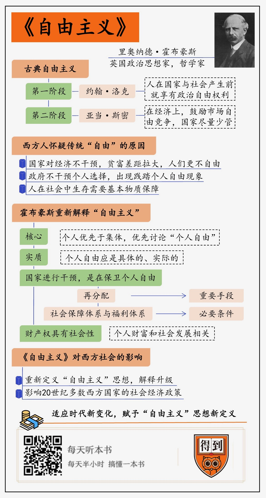

# 2020041. 自由主义
> 《自由主义》| 施展工作室解读

## 关于作者

里奥纳德·特里劳尼·霍布豪斯是英国 20 世纪著名的政治思想家、哲学家与社会学家，曾于 1887-1897 年任教于牛津大学。1897-1902 年任《曼彻斯特卫报》编辑、主要撰稿人。1903-1905 年任自由工会书记。1905-1907 年任《论坛报》政治编辑。1907-1929 年任伦敦大学教授。他针对当时出现在西方世界的一些社会问题，重新阐述了「自由主义」思想。

## 关于本书

在霍布豪斯以前，人们对于「自由」或「自由主义」的理解主要集中在不受外界干预的个人选择，只要能保证人们是自由的，那么国家与社会不应该对经济进行任何形式的干预与再分配。但是霍布豪斯看到了当时在西方世界出现的日益严峻的社会问题，认为越是保障不被外界干预的个人自由，人们的自由越是无法得到保障，基于此，霍布豪斯开始重新阐述他对「自由主义」的理解。

## 核心内容

就算国家和法律赋予了每个人自由的权利，但是在实际的经济生活中，由于市场、雇佣关系和社会经济地位的不平等，个人的自由依然会受到这些无形的束缚。在我们看来，似乎国家的干预与「自由主义」思想提倡的个人自由应该是相矛盾的两个维度。但是霍布豪斯指出，一旦在政治上、法律上贯彻「自由主义」的原则，把国家的手脚捆起来，而在经济上不加任何干预，它同样会带来严重的社会危机，侵害普通人的自由。运用国家的力量，倡导国家干预经济，要求对自由放任的市场进行限制，从而赋予了西方各国干预经济的理论合法性和正当性，只有保障人们实际的自由，才能最终捍卫社会大多数群体真正的自由。

## 前言

今天为你解读的是霍布豪斯的《自由主义》，这本书是西方自由主义思想发展历程中的重要转折点。17 世纪以来，「自由主义」的思想在西方占据主导地位，然而当「自由主义」思想在 20 世纪遭遇危机的时候，霍布豪斯通过《自由主义》这本书丰富了「自由」的内涵，从而对 20 世纪西方国家的一些社会经济层面的改革提供了理论支持。

这是一本写于第一次世界大战爆发前的政治哲学著作。在这本书中，霍布豪斯把 1910 年代以前西方发展了几百年的「自由」这一理念回炉再造，从而丰富了西方社会对「自由」的理解。

本书的作者霍布豪斯，是英国 20 世纪政治思想的主要代表之一。霍布豪斯出生于 19 世纪 60 年代，去世于 20 世纪 20 年代末，可以说霍布豪斯的一生贯穿于人类历史上最为关键的世纪之交。从 19 世纪到 20 世纪，人类的历史发生了翻天覆地的变化。自由市场不仅成为欧洲社会经济生活的主要形式，也将世界都卷入统一的市场之中。人类的生活正式进入了电气时代，而技术的变革，也使得人类的活动范围进一步的延展。同时进行的，还有人类生产组织规模的扩大，各种大型企业与工厂纷纷成立，形成了前所未有的劳工数量群体。尽管「自由主义」是西方社会的主导思想，并全面影响了当时西方社会的政治、经济与文化，然而，社会形态的变化也产生了新的社会矛盾，那就是人们在经济地位上的巨大差异，而这一新的社会矛盾，构成了霍布豪斯开始重新思考「自由主义」的动力。

而在霍布豪斯以前，西方人对自由的理解主要来自 17 世纪的英国哲学家约翰·洛克和 18 世纪的著名经济学家亚当·斯密。然而，如果比较一下就会发现，霍布豪斯对自由的理解和这两位前辈截然不同。在洛克和斯密影响下，一般人理解的自由就是不受干预的个人自由，延展到社会，就是国家不应该干预个人生活，也不应该干预社会的经济活动。但是，霍布豪斯的《自由主义》要告诉你，国家干预经济与个人自由其实并不冲突，甚至必要的干预可能反而是保障自由的必要手段。

霍布豪斯对「自由主义」以及「自由」的重新审视，改变了他之后的人们对「自由」的认识，进而影响了 20 世纪西方国家的一些经济与社会政策。

接下来，我将通过三个问题带你了解霍布豪斯的《自由主义》这本书。

第一，在霍布豪斯以前，人们是怎么理解「自由」这个概念的。

第二，到了霍布豪斯的时候，出现了什么问题让之前的「自由主义」解释力不足了。

最后，我们来看霍布豪斯怎样解决了这个问题，他的理论到底是什么。

## 第一部分

我们先来回应第一个问题，在霍布豪斯以前，人们是怎么理解「自由」这个概念的。

无论西方「自由主义」的概念如何发生变化，它的内核是始终不变的，那就是考察个人与集体、社会和国家的关系。西方「自由主义」思想发展的第一个阶段，主要解决的是人的政治自由问题，也就是说，人在国家之中，应当享有什么政治自由？其中最重要的观点，就是我们上文提到的 17 世纪英国哲学家约翰·洛克在《政府论》中提出的观点（约翰·洛克《政府论》）。洛克也因为《政府论》这本书成了公认的「自由主义之父」。在《政府论》中，洛克批判了传统的「君权神授」观点，同时研究了政府的起源。他认为，国家和政府是人们通过订立契约才出现的。在国家与政府起源以前，人们就自然享有了财产权、自由权等基本的权利。所以洛克说，人的政治自由权利是先于国家与社会产生的，不能被随意剥夺。洛克为个人与政府之间确立了一个明确的边界，同时也为「自由主义」思想的第二阶段，也就是经济上的「自由主义」扫清了障碍。

到了 19 世纪，随着资本主义经济的发展，当时的人们普遍希望能够拥有一个更加自由的经济环境，他们普遍认为政府应该更少干预社会的经济活动。刚才说了，洛克虽然奠定了「自由主义」思想的 1.0 版本，但是他解决的更多是当时社会在政治层面的自由。于是，著名的经济学家亚当·斯密进一步延伸了这套说法里「自由」的范围，使「自由」的价值从洛克说的政治领域一直延伸到当时社会的经济领域之中。斯密为当时的经济政策开出了一个方案，被后人总结为「自由放任的市场经济」。他强调，在经济上，国家对经济应该管得越少越好，他鼓励市场自由竞争，发挥个人，企业的独创性与自主性。

洛克与斯密的贡献基本奠定了霍布豪斯以前西方人对「自由」的基本理解，也构成了「自由主义」这套西方重要思想体系的基础，今天我们一般也把他们的思想统称为「古典自由主义」。简单来说，在霍布豪斯以前，也就是从洛克在 1689 年出版《政府论》以来，西方人都认为「自由」就是政府应当尽量少的介入社会事物或人们的经济活动，保障市场主体与个人的充分自由。在这样的观念影响下，人们普遍认为个人生活的好坏、贫穷或者富足完全取决于每个人自己，国家与社会不应该采取任何的社会福利或财产分配手段来侵害个人的自由。

## 第二部分

但是，到霍布豪斯生活的 19 世纪，整个西方社会其实已经暗藏危机。这个危机不只是威胁到了之前的「古典自由主义「思想，甚至有可能引发社会动荡。接下来，我们来看第二个问题，是什么新问题让西方「古典自由主义」解释力不足了？

西方「古典自由主义」倡导的就是不受外界干预的个人选择。在这种思想的影响下，当时的西方国家几乎不对社会和经济进行任何干预。因此，在当时的社会，人们一般觉得，一个人的工作、收入与生活的好坏只和个人相关，而与社会无关。也就是说，无论社会的贫富差距多么悬殊，政府都不应该进行任何的干预或提供相应的社会保障。

但是到了霍布豪斯生活的年代，随着社会经济的发展，特别是资本主义发展后造成社会的贫富差距越来越大，表面看上去，社会好像实现了人人平等、人人自由，但是现实是，越是鼓励不受干预的自由竞争，人们反而可能会变得更加不自由。

为什么会这样呢？在这里要提一下霍布豪斯之前，对西方「自由主义」思想的转变影响很大的另一位思想家，约翰·密尔（约翰·密尔《论自由》）。为了连接霍布豪斯的《自由主义》，我在这里简单提一下密尔的观点。我说了，之前的西方「古典自由主义」思想家一般认为，危害个人自由的只有可能是政府或者国家，因此主张限制政府的权力，让政府不能干预经济。但是密尔开始发现，如果只为了维护自由竞争，政府什么都不做，其实可能会反过来出现践踏个人自由的现象。你想想，假如一个人他自愿地把自己卖给别人当一个奴隶，这个交易买卖双方是完全自由的，但是最终的结果是有人成为奴隶，那么这种时候国家应不应该干预呢？

这么说你可能会觉得奇怪，怎么会有人愿意把自己卖了呢？其实，这并不完全是耸人听闻。到了 19 世纪，在自由主义市场经济的影响下，贫富分化日益悬殊，工人在面对资本家的时候往往处于弱势，在那样的时代，真的有人可能会为了生存自愿出卖自己。如果按照洛克和斯密对自由的看法，这种情况完全是符合个人自由，符合自由竞争的。但很明显，这不符合我们的常识，显然也不是一个正常的社会该有的样子。

这是因为，洛克他们没有考虑到，人在社会中生存需要基本物质条件的保障。一个人如果没有基本的劳动保障、物质保障，那么自由对他来说就是空中楼阁。然而，如果我们以西方「古典自由主义」的观点来看，如果说当时的政府和社会不应该干预个人的选择，也就同样不应该干预自由竞争导致的社会不平等问题。这就导致在霍布豪斯生活的时代，西方人对「自由」的传统解释越来越怀疑。

## 第三部分

霍布豪斯认识到了这一点。19 世纪的那个时代需要有人对「自由」进行新的解释，重新赋予西方「自由主义」思想以新的时代价值，所以他写出了我们今天解读的这本《自由主义》。下面，我们就来看第三个问题，在这本书里，霍布豪斯是如何帮助西方人重新理解「自由」的。

对霍布豪斯来说，重新解释「自由」这个概念，首先需要找到「自由主义」思想体系里「自由」的本质属性。这是因为，既然你要让人们重新理解，你首先需要证明你自己是一个自由主义者。那么，你就需要定一个标准，解释一下什么是这套说法的核心理念。霍布豪斯之前的古典西方「自由主义」思想里有一个很重要的观点，就是社会的根本组成要素是个人，而不是集体。所以，政府在对待公民的时候，必须把公民当成独立的个人，赋予他们权利或者义务。霍布豪斯在书里很明确地认可这个观点。他认为，组成社会的基本单位就是个人。霍布豪斯坚持认为个人优先于集体，讨论「自由」首先讨论的还是「个人自由」，这就是霍布豪斯把握住的「自由主义」的核心，这也体现了他对数百年西方古典「自由主义」思想体系核心特质的坚持。

找到了这个标准，霍布豪斯就开始对古典「自由主义」进行大刀阔斧的改革了。在解读的第二部分，我们分析了古典「自由主义」观念在当时社会开始受到什么样的挑战，霍布豪斯为了回应当时的时代问题，就要证明干预经济其实也能够维护个人自由。

要想解释这个问题，我们得回到密尔提出的那个假设：假如有人出卖自己，那么为了维护个人自由，是不是应该进行干预？霍布豪斯从社会经济的发展历程里证明了，干预才是合理的选择。

霍布豪斯认为，在 19 世纪到 20 世纪早期的市场上，像资本家、工厂主这些生活富足的群体总的来说还是少数，出卖劳动力的工人才是大多数。在这种情况下，表面上雇主和工人处于一个平等的位置上，工人享受的自由与雇主是一样的，但是实际上，二者的经济地位是不平等的。经济上的不平等就会决定他们在社会地位上也不平等。因此，看起来工人在面对雇主的时候有很多选择，但是事实上工人是没有选择的，因为总有人可以替代他的位置。所以说，在当时的社会，工人在雇主面前肯定处于劣势的地位。表面看起来，好像工人有拒绝雇主的自由，但是对工人来说，他实际上面临的选择是，要么接受雇主的剥削，要么失去工作机会，无以为生。

霍布豪斯指出，工人的自由选择其实并不存在，所以说，工人根本没有选择。换句话说，如果一个人要在死亡和生存之间做出选择，那么这根本就不是一个选择，他等于就是被强迫去做那个事。

到这里，霍布豪斯揭示了他重新定义的这种「自由主义」思想的实质。既然要维护个人自由，维护每个个体的价值和权利，那么这个自由应该是具体的、实际的自由，而不是抽象的自由。霍布豪斯认为，在他生活的 19 世纪的西方世界，如果「自由」在实际中不存在，那么实际上个人自由就无法保障。

顺着这个思路，霍布豪斯就提出国家进行干预，比如制定最低工资的标准，这并不是在侵犯个人自由，而是在保卫个人自由。霍布豪斯把国家的再分配手段看作是实现自由的一种重要的手段，将国家和社会建立的社会保障体系与福利体系视为保障个人自由的必要条件。因为国家不插手，那么广大的人民群众除了接受雇主苛刻的条件以外，没有其他选择。所以说，国家干预经济的想法其实反而提高了当时西方社会实现自由的可能，从而最终捍卫了社会大多数群体真正的自由。

我们再来比较一下。霍布豪斯之前，「古典自由主义」把财产权就完全看成是附属于个人的一个东西，你的这份财产它怎么运用，怎么去使用它，怎么增值，或者哪怕你怎么浪费它，这最终责任都是要归结到财产所有者自己的身上，你的生活、工作与财富其实都是你自己的事情，它与社会无关。

但是霍布豪斯并不这么看，他认为个人财富并不只是与个人相关的。表面看来，一个人的财富增长好像只与他自己的勤劳智慧相关，但财富的增长很多时候也和社会发展相关。我们举个更好懂的例子，比如说，你买了一个房子，过两年政府决定在你们家旁边这路上修一个地铁站，这个房子的价格马上就不一样了。但是在这次财富的增长里，你其实没有花什么力气。而且，地铁其实是用全体纳税人交的钱来修的，是政府组织修的，并不是买房者修的。举这个例子是想说明，尽管霍布豪斯也尊重每个人的财产权，但其实他认为个人财富的积累不只和个人的努力相关，更可能是整个社会发展的结果。

所以，财产权本质上来说是社会性的。它并不是凭空出现的，而是在社会中产生的。对财产的保护，以及创造，都不可能离开社会。要是没有一个社会，没有一个社会组织、社会结构，个人的财产权实际上是很不稳定的。

霍布豪斯的这个观点动摇了在此之前盛行了上百年的西方「古典自由主义」观点，也就是我们在前面说到的「自由主义」的 1.0 版本与 2.0 版本，从而使西方「自由主义」开始进入了 3.0 版本。

霍布豪斯的《自由主义》这本书对西方社会产生了深远的影响。

首先，他重新定义了之前流行了几百年的「自由主义」思想，实现了解释的升级。他拓宽了当时的西方人对「自由」这个概念的认识。霍布豪斯告诉我们，就算国家和法律赋予了每个人自由的权利，但是在实际的经济生活中，由于市场、雇佣关系和社会经济地位的不平等，个人的自由依然会受到这些无形的束缚。在我们看来，似乎国家的干预与「自由主义」思想提倡的个人自由应该是相矛盾的两个维度，但是霍布豪斯指出，一旦在政治上、法律上贯彻「自由主义」的原则，把国家的手脚捆起来，在经济上不加任何干预，它同样会带来严重的社会危机，侵害普通人的自由。

其次，在他之后，霍布豪斯以及一些与他持相同看法的学者的观点开始影响 20 世纪很多西方国家的社会经济政策。比如带领美国走出了 1929 年至 1933 年经济「大萧条」的罗斯福总统，他的政策一般被称为「罗斯福新政」，这个政策里就有霍布豪斯理念的影子，也就是运用国家的力量，倡导国家干预经济，要求对自由放任的市场进行限制。正是霍布豪斯赋予了西方各国干预经济的理论合法性和正当性，从而为 20 世纪的国家干预经济，提供社会保障，进行收入再分配提供了思想基础。

最后我要强调的是，任何一种解释都不是一成不变的。我们想要了解霍布豪斯升级版的解释，就必须回到西方「自由主义」思想发展的历史脉络中去看。一种哲学思想、社会思想，必然需要适应时代的发展来不断调整和完善。理论要有生命力，就要回应时代的变化，提出新的解释。霍布豪斯的《自由主义》刚出版的时候，很多人就指责霍布豪斯的思想背离了「古典自由主义」思想的核心。但是，通过今天的解读，你就会发现，霍布豪斯恰恰是在继承和发展的基础上维护了解释的核心，又让它能够适应新的时代发展需要。

## 结语

好，《自由主义》这本书我就讲到这里，我们来总结一下。霍布豪斯的《自由主义》产生于古典「自由主义」面临危机与挑战的时期，当时的旧解释已经无法适应社会和时代的新变化了。霍布豪斯重新赋予了「自由主义」新的定义。其中最关键的就是，霍布豪斯认为社会发展所造成的不平等同样也会危害个人自由，因此国家应当适度的干预经济，干预社会的财富分配。这种观点为 20 世纪西方国家大规模干预经济，提供社会保障体系奠定了理论基础。
