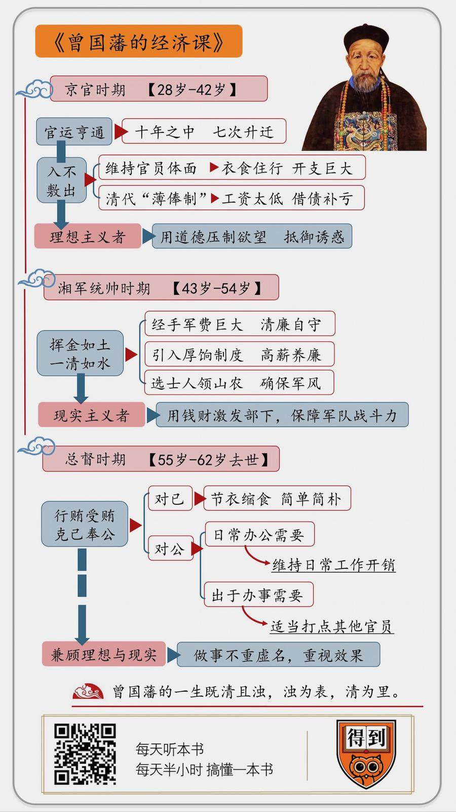

# 2020045. 曾国藩的经济课
> 《曾国藩的经济课》| 陈章鱼解读

## 关于作者

张宏杰，知名历史学者，东北财经大学经济学学士，复旦大学历史学博士，清华大学博士后，就职于中国人民大学清史所。著有畅销书《曾国藩传》《曾国藩的正面与侧面》《大明王朝的七张面孔》《坐天下》《中国国民性演变历程》等。

## 关于本书

本书是张宏杰以两篇研究论文为底本，对部分叙述语言进行了调整，变成适合大家阅读的历史读物。曾国藩生前，留下了大量的家书和日记，详细记录了他的收入和花销。但是之前很少有一本书，专门研究曾国藩的经济状况。这本《曾国藩的经济课》可以说是从一个崭新的历史角度，重新审视一位广为人知的历史人物，用客观量化的方式，展现曾国藩乃至整个晚清官场的生态。

## 核心内容

1. 在京为官的曾国藩，为什么官运亨通却入不敷出？

2. 创建湘军的曾国藩，为什么对部下挥金如土，对自己一清如水？

3. 成为总督的曾国藩，为什么克己奉公同时还在行贿受贿？

## 前言

你好，欢迎每天听本书，我是陈章鱼。今天为你解读的这本书叫《曾国藩的经济课》。

曾国藩大家都已经很熟悉了，堪称中国近代史上第一大 IP。2019-2020 的跨年演讲上，罗胖也引用了曾国藩的一句名言「躬身入局」。关于曾国藩的介绍和讨论已经很多，为什么要再为你解读一本关于曾国藩的书呢？

因为这本书，从一个完全不同的角度来为你讲述曾国藩，什么角度呢？就是曾国藩的经济生活。

曾国藩生前，留下了大量的家书和日记，详细记录了他的收入和花销。但是之前很少有一本书，专门研究曾国藩的经济状况。这本《曾国藩的经济课》可以说是从一个崭新的历史角度，重新审视一位广为人知的历史人物，用客观量化的方式，展现曾国藩乃至整个晚清官场的生态。

这本书的作者张宏杰老师，是大家非常熟悉的历史作家，罗辑思维有至少 5 期节目推荐了他的书，「每天听本书」也解读过他的《中国国民性演变历程》和《曾国藩的正面与侧面》。

但是你可能不知道的是，张宏杰并非历史科班出身，他在大学的时候学的是金融专业，毕业后在一家银行工作多年。一开始他是凭借自己的兴趣写历史，后来，张宏杰被复旦大学的葛剑雄教授破格录取为历史学博士，之后又考上清华大学历史系的博士后。他在博士和博士后期间写的论文就是《曾国藩京官时期的经济生活》和《曾国藩湘军及总督时期的经济生活》，用金融视角进行历史研究。

这本《曾国藩的经济课》就是张宏杰以这两篇研究论文为底本，对部分叙述语言进行了调整，变成适合大家阅读的历史读物。以往我们谈论一个历史人物，总是简单地定性，这是一个贪官，这是一个清官。而这本书使用大量详实的数据，用量化的方式，让「贪」和「廉」都有了标尺。

曾国藩的为官之路，大致可以分为三个阶段：28 岁中进士，30 岁进入翰林院，一直到 42 岁，他一直是一名京官；从 43 岁到 54 岁，他是一位军事领袖，从无到有创建湘军，与太平天国作战；此后一直到他 62 岁去世，他担任两江总督和直隶总督，是当时最具实权和影响力的地方官员。

我就从这三个阶段来为你解读这本《曾国藩的经济课》，在这三个阶段，曾国藩的经济状况不同，遇到的问题不同，处理的方式自然也不同。而这三个阶段合在一起看，又能回答一个重要的问题，那就是当个人的道德追求和周围的环境产生冲突时，曾国藩如何最大限度保持自己的道德标准，又能调动足够多的资源，帮助自己成事。

## 第一部分

我们先来看看曾国藩的京官时期，这个时期可以用八个字来概括，那就是「官运亨通，入不敷出」。

这两句话放到一起，你可能会感觉很奇怪。但是这确实是曾国藩京官时期的真实状态。

在别人看来，曾国藩这十几年的京官当得是顺风顺水。30 岁的时候，曾国藩被授予「翰林院检讨」的职位，也就是我们俗称的「翰林」。虽然品级不高，只有从七品，但是在皇帝眼中，翰林都是科举考试选拔出来的精英，可以委以重任。用今天的眼光看，翰林相当于是整个清王朝的「管培生」，前途自然不可限量。而曾国藩的升迁速度，更是让其他的翰林也望尘莫及。十年之中，七次升迁，不到四十岁，他就已经是正二品的礼部侍郎。

但是在光鲜的外表之下，曾国藩却一直面临一个窘境，那就是缺钱。

41 岁的曾国藩身兼礼部、工部、兵部、刑部四个侍郎，但是在给弟弟们的家书中，曾国藩说自己今年腊月过得十分窘迫，至少要找人借二百两银子才能过年。

42 岁时，曾国藩的母亲去世，按照礼制，曾国藩回乡守孝，结束了十二年的京官生涯，但是他走的时候，还欠着在京同僚、好友甚至店铺的账。这些账，一直到十多年后曾国藩当上两江总督，才有力量全部偿还。

为什么会这样呢？有个典故叫「长安居，大不易」，其实在清代，一名京官的生活也是大不易，衣食住行，都是巨大的负担。

先来说衣。对于清代官员来说，购置服装是一笔相当大的投入。按照清代的规定，官员的官服都需要自己花钱，我们常说的「顶戴花翎」，也需要官员自己添置。甚至有些情况下，皇上赏穿黄马褂，也只是授予一种特权，而那件服装，是需要官员自己花钱去做的。

官服的种类又十分繁多，按照出席场合，可分为朝服和吉服；按季节，可分为冬夏两种，按功用又分为日常服和出行服。不但种类多，更换也十分频繁，哪天穿什么衣服，不是由官员自己选择，而是由朝廷统一下命令。光绪年间任户部侍郎的王文韶，就在他的日记里记录，从正月初一到三月二十七，他三个月的时间就换了十一种官服，平均下来，不到九天就要换一次。

曾国藩在写给弟弟们的家书中也提到，自己在京城当官十几年，家里边最多的就是书籍和衣服，书籍是自己的嗜好，衣服实在是因为当差必不可少。

添置官服有多花钱呢？张宏杰在这本书中，统计了曾国藩 30 岁，也就是刚当上翰林那一年的收入和支出。这一年，曾国藩花在衣服上的钱将近 33 两白银，而他一年的俸禄是 130 两。也就是说，曾国藩这一年的置装费，就占了工资的四分之一。

再来说食。你可能会觉得，吃饭这件事丰俭由人，想省钱的话，自己吃得素一点不就行了？自己吃，当然可以吃得节省，但是作为一名京官，三天两头的请客、聚会、随份子，根本逃不掉。

清代的京官生活安闲稳定，翰林的日子更是清闲，与其说是官员，不如说是经皇帝承认的学者，他们的工作任务就是「读书养望」。一边读书，一边培养自己的声望。

这个「望」具体怎么养呢？不能在家中养，靠得就是交朋友。在当时的官场中，结交朋友被认为是在士林中树立自己良好形象的途径。各种聚会、诗社和宴请，就是结交朋友的最好机会。

除了结交新朋友，还要维持旧关系。京官本身就生活在同乡、同门、同年、同学、同僚编织起来的关系网中，为了维持自己的人际关系网，需要不停地联络聚会。

同样是曾国藩 30 岁那一年，花在聚会上的银子，就将近 40 两。

住房，更是曾国藩的一笔大花销。

清代京官不但没有分房，在住房上也不享有任何补贴。一个外地人来京做官，解决住房问题的最好方法就是租房。

但是为了维持官员的体面，他租的房子面积不能小，地段不能差，租金自然也不低。30 岁那年，曾国藩花在租房上的钱，就有 107 两。

出行对于曾国藩来说，也是一笔费用。清代汉族官员居住在北京的外城，和衙门往往有一段距离。北京的道路都是土路或石子路，交通不便，一旦刮风下雨更是难走，所以官员都是坐轿子或马车出行。

坐轿子要养轿夫，自备马车也要养马和马车夫，这都是一笔不小的支出。刚当上官的曾国藩自然无力承担，他选择租马车出门，可是一年下来，出行的费用也要 51 两银子。

衣食住行的花费，再加上日常支出、补贴老家的父母还有买书，曾国藩在 30 岁这一年，工资收入是将近 130 两，支出却高达 605 两，做官一年，竟然有 475 两的亏空。

如此入不敷出，并不是偶然现象，根据今天留下来的史料，大部分京官的正常收入，都无法维持自己的生活。一方面是因为，官员们为了维持自己体面，衣食住行的花费都要高于普通人。另一方面，则是因为清代实行「薄俸制」，给官员发的工资确实太低。

因此，很多京官开始谋求灰色收入，甚至是直接贪污。有一个例子，可以看出晚清的京官要钱是多么明目张胆：和太平天国的战争结束之后，朝廷下旨让曾国藩将湘军花掉的军费列好账目，和户部对账销账，户部的官员直接明码标价，必须要从军费的总额中拿出 1.3% 作为好处费，才能顺利销账。湘军所用的军费将近 3000 万两，也就是说，户部官员打算从曾国藩身上捞出 40 万两白银的好处费。曾国藩托人周旋，经过一番讨价还价，户部官员才同意把好处费降到 8 万两白银。

曾国藩当京官的时候，当然不愿如此贪污。大多数时候，他是依靠借债和少量亲友馈赠来填补亏空。如果说曾国藩完全安之如素，那太夸张了，31 岁时，他的一则日记写到：「座间，闻人得别敬，心为之动。昨夜梦人得利，甚觉艳羡，醒后痛自惩责。」

「别敬」就是外省官员进京办事，送给京官的红包，这在当时算是半合法的收入。曾国藩和别人聊天时听说有人拿了很大一笔「别敬」，晚上就梦到别人发财，自己羡慕不已。醒了以后，曾国藩好好作了一番自我批评，并且把这件事写进日记里警示自己。

这个故事最能展现曾国藩京官生活的经济状态和精神状态，入不敷出的生活，让他也对利益动心，但是作为一个理想主义者，曾国藩还是用道德压制了欲望，在肮脏的官场中抵御住了种种诱惑。

## 第二部分

接下来我们来看曾国藩担任湘军统帅的时期，这个时期也可以用八个字来概括，那就是「挥金如土，一清如水」。

作为湘军的统帅，曾国藩先后经手的军费超过白银三千万两。如果曾国藩稍微有一点贪念，动一点手脚，想要积累上百万两的财富，真的是非常轻松的事儿。但是曾国藩并没有因此发家致富，可支配的钱财可以说是金山银海，但是他寄回家里的钱却比京官时期还要少。

而在这个时期，他面临的最大问题，还不是如何坚持自己的操守，而是如何激励湘军的官兵。

清代对文官实行「薄俸制」，对军队也是如此，实行「低饷制」。清代一名绿营兵，平均每月的收入不到二两银子。官居从一品的提督，每年的收入也不足千两。

按照我们刚才给曾国藩算的账，你能看出来，即使军队里官居提督的收入都很难维持自己的日常开支，士兵的收入更是没办法养活一家老小。于是，清代军队产生了一种奇特的现象，就是从上到下都在搞副业。士兵们对于训练能躲就躲，平时都在忙着开茶馆、做买卖、卖鱼卖肉。军官甚至主动鼓励士兵外出经商，自己好侵吞兵饷，或者干脆把用于训练的操场租给地方使用，把战船租给商人运货，更有甚者，直接用军用物资的名义进行走私，中饱私囊。

这样的军队战斗力如何，我们可以想象，也就明白为什么湘军这样一支曾国藩自己招募的非正式武装，会一步步崛起，最终成为和太平天国作战的主力。

曾国藩兼任过兵部侍郎，深知军队里的这些乱象主要原因在于军饷太低。所以他创建湘军，在制度上最引人注目的一点就是引入厚饷制度。一名普通湘军士兵的收入是每月四到六两白银，是国家正规军的三倍，甚至高过大多数搞副业的绿营兵。这样，士兵就没有生活压力，可以专心训练，这就为湘军形成战斗力打下了基础。

对于湘军军官，曾国藩更是采用高薪养廉的政策，一名湘军中级军官，一年的收入是一千八百两白银，已经高过了绿营兵里像提督这样的高级军官。而湘军中一名统率一万人的高级军官，一年的收入更是高达五千四百两。

从上到下，湘军的平均收入，高过正规军三倍以上。以至于湘军在招募士兵时，如果想招一千人，往往有上万人来报名，如果想招一万人，往往有几万人来报名。

兵源充足，再加上专心训练，湘军的战斗力有了保障。但是投入到战争中，曾国藩发现，湘军又面临新的问题，那就是如何防止士兵劫掠百姓。

人的欲望往往是无休止的，战争的混乱，又使得人的行为缺乏有效的监管。每当湘军攻破一座城市，官兵们常常会私分战利品，甚至直接抢劫百姓。对于曾国藩这样的士人来说，投笔从戎是为了捍卫礼教，实现抱负，但是很多人选择参军目的非常直接，就是为了升官发财。怎么样管好这些人，又不让他们丧失积极性，这是曾国藩最大的难题。

除了多发军饷，曾国藩在组建湘军时，还有一条非常重要的原则，叫「选士人领山农」。

「选士人」，就是湘军的军官，大多是读书人出身，而不是传统意义上行伍出身的武官。「领山农」，就是湘军的士兵，绝大多数都是农民，而不是游民和混混。读书人有理想主义，农民有淳朴的道德，这就决定了湘军本身带有一种不同的气质，军容风貌和绿营兵大不相同。

再加上曾国藩自己以身作则，并且言传身教，湘军的军官中，很多人向曾国藩学习，清廉自守。

彭玉麟是湘军水师的开创者，在湘军将领中，彭玉麟的为人也是最清正。湘军初创的时候，军饷常常不能按时发放，于是朝廷给了湘军食盐的专卖权，这在当时是非常赚钱的生意，战争结束，彭玉麟的部队攒下了六十万两白银，这可以说是一笔灰色收入，他完全可以放进自己的腰包。但是彭玉麟一两银子都没有留下来，而是把这笔钱作为发展水军的经费。

可是道德的力量终究有限。湘军将领中，有清廉的，也有贪婪的。曾国藩 50 岁生日的时候，他手下的大将鲍超来给曾国藩贺寿。鲍超的军队，是湘军中战斗力最强，最能打的，可也是军纪最差，最能抢的。鲍超是个粗人又是个富人，别的部下不敢给曾国藩送礼，他不管那一套，带了十六包礼物，包括很多珍贵的珠宝和古玩。曾国藩看了一遍，只留下了一顶绣花小帽，其他的礼物都让鲍超拿回去了。

这两个故事，很能说明战争时期曾国藩对于钱财和部下的态度。他是一个理想主义者，虽然过手的金钱成千上万，但是努力保持自己的清廉。他也用自己的人格去努力影响部下。曾国藩也是一个现实主义者，他知道高收入是保障湘军战斗力的根基，也明白钱财最能激发部下的积极性，所以对于一些湘军将领纵兵抢劫，他也只能听之任之。

总得来说，比起当时的八旗和绿营，湘军已经是相当廉洁。与太平天国作战期间，清廷一共动用绿营兵将近十万人，两年多的时间军事上没有取得什么成效，但是花费的军费高达两千五百一十万两。曾国藩的湘军，人数最多时将近十二万人，前后十二年也仅仅花费了朝廷两千九百万两的军费。

## 第三部分

最后我们来看看曾国藩担任两江总督和直隶总督的时期，这个时期还可以用八个字来概括，那就是「克己奉公，行贿受贿」。

这两句话放到一起，显得更奇怪了，但是这就是曾国藩当总督时的状态。

不论是两江总督还是直隶总督，都是清朝最具影响力和实权的地方官员。而且因为军功，曾国藩还被封为一等侯、太子太保和大学士，封侯拜相，位极人臣。可是他的生活却越来越简单，甚至比当京官的时候还要简朴。

曾国藩的幕僚赵烈文在日记里记载，他第一次见到曾国藩时，曾国藩穿得非常简朴，帽子和鞋也旧得不行。这个记载还得到了外国人的印证，有史料记录，英国雇佣军统帅戈登与曾国藩会面时，惊讶地发现堂堂总督竟然「穿着陈旧，衣服打皱，上面还有斑斑的油渍。」

在吃的方面，曾国藩更不讲究，赵烈文的日记里记载，他去见曾国藩时，曾国藩正在吃饭，赵烈文看曾国藩菜里既没有鸡也没有鱼，就问他，有一家店给各个衙门都送火腿，您这里没有吗？曾国藩说，以前有人送，我都不收，慢慢就没人送了。现在就是想喝黄酒，也得上街一斤两斤现买回来。

赵烈文感慨，大清二百年都没有这样的总督衙门。

曾国藩虽然连火腿都不收人家的，但是任总督时却有自己的「小金库」。主要来源是两淮盐运司和上海海关，名义上是上缴的公费。实际上，这就是两个衙门孝敬给两江总督的贿赂。

为什么曾国藩要收受贿赂呢？这是出于两方面的需要。

一方面，是出于日常办公的需要。清代地方总督的权力几乎是一方诸侯，按理说，国家应该给总督设立一个完备的办公机构。可是清代的制度却非常奇怪，总督衙门里，只有总督一个人有编制，领国家工资，其他所有的工作人员，都要总督自己掏腰包来聘请。

比如曾国藩的幕僚，也就是我们俗话说的师爷。根据史料，曾国藩的主要幕僚就有 80 多位，幕僚总数更是超过 200 人，如果再算上更低一级的办事人员，曾国藩任总督时，工作人员超过 400 人。这些人的工资，都需要曾国藩自己掏钱。

另一方面，就是出于办事的需要。前边我们提到，京官的花销多，收入低，于是很多京官都想办法捞钱，比如户部官员就想利用曾国藩给湘军报账的机会大赚一笔，其实这个故事还有个插曲，就是谈好八万两的好处费之后，朝廷又下旨，湘军可以不用报账，按理说，这八万两可以省下来，但是曾国藩却坚持，说好的八万两要照给，阎王好见小鬼难搪，毕竟以后还需要和户部打交道。

你看，这就是曾国藩总督时期的复杂形象，对自己，节衣缩食，克己奉公。但是为了推动事情，他也不得不行贿和受贿。

## 总结

到这里，这本《曾国藩的经济课》其中精华的部分，我就为你解读完了。

京官时期，入不敷出的生活，让曾国藩难免对利益动心，但是作为一个理想主义者，曾国藩用道德压制了欲望，在肮脏的官场中抵御住了种种诱惑。

湘军时期，曾国藩过手的金钱成千上万，但是努力保持自己的清廉，并且用自己的人格影响部下。但是曾国藩也是一个现实主义者，他知道高收入是保障湘军战斗力的根基，也明白钱财最能激发部下的积极性，所以对于一些湘军将领纵兵抢劫，他也只能听之任之。

总督时期，曾国藩的生活十分简朴，但是同时他也有自己的小金库，一来是为了维持日常工作的开销，二来也要适当去打点其他的官员。

曾国藩的一生可以说既清且浊，浊为表，清为里。

曾国藩的清，从他去世以后，家人的生活也能看出来。曾国藩去世五年后，他的二儿子曾纪鸿因为家人病重缺钱医治，只好托左宗棠向曾国藩的老部下借钱，左宗棠心里不忍自己也拿出三百两银子接济曾纪鸿。向来骄傲的左宗棠，在给家人的信里由衷地感慨，如此一位重臣，他的儿子这样贫困，可见曾国藩的清廉，真是后人的楷模。

可是为什么我们回看清代历史，细数清朝一个个清官时，很少有人能想起曾国藩呢？

因为他的选择，远比做清官更复杂。

在当时的政治环境中，像明朝的海瑞一样的清官，不适于参与实际权力运作的，皇帝会把这样的清官当作政治摆设，当作朝廷的装饰，但是清官往往难以实现大的建树。就算皇帝支持，在失衡的制度下，也有一批底层官员只为了钱来办事，反过来，他们也会拼命阻挠清官，这样才能维持让自己获利的潜规则。

曾国藩是一个兼顾理想主义和现实主义的人。他做事不重虚名，重视效果。他知道以一己之力，无法扫除千百年来的陈规陋习，因此，为了完成自己的事业，他也只能一定程度上和势利小人「同流合污」。

努力做事的人，在做事的过程中一定会让人看出软肋。难得的是，曾国藩自己的心没有变化，无论境遇如何，他对于金钱仍一丝不染。

做事的智慧和个人的道德，如何更好地融合，曾国藩给了我们一个值得参考的范例。
