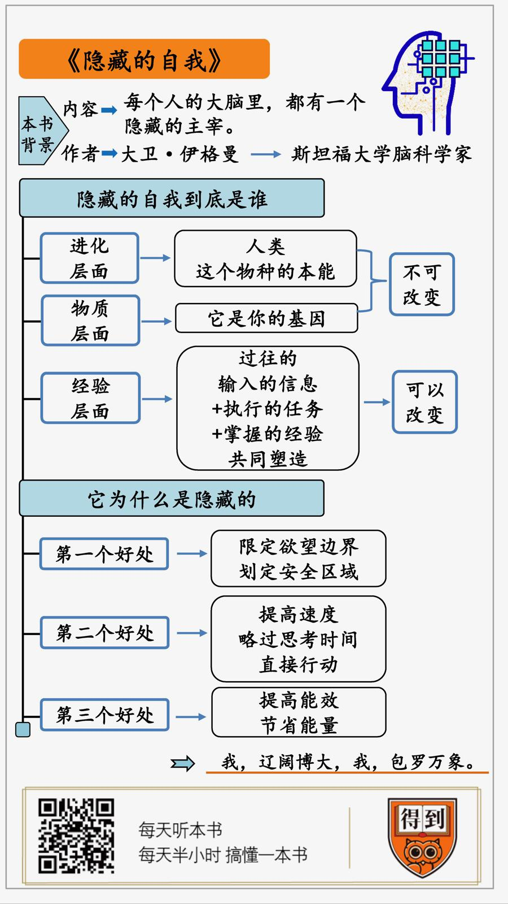

# 2020061. 隐藏的自我
> 《隐藏的自我》 | 李南南解读

## 关于作者

这本书的作者，是全球脑科学界的学术明星，任教于斯坦福大学的脑科学家，大卫·伊格曼。他也是最近几年大热的美剧《西部世界》的学术顾问。看过的人都知道，整部片子，探讨的正是自由意志。这也是大卫·伊格曼最擅长的话题。

## 关于本书

在这本才华横溢而又极富争议的《隐藏的自我》中，著名神经学家大卫·伊格曼通过深入探索潜意识大脑，揭示了许多惊人的谜题：为什么我们偏爱皮肤白的异性？一白遮百丑背后的进化原理是什么？为什么女生喜欢戴美瞳？为什么灵感往往不能再现？存在真正的自我吗？

## 核心内容

要想认识这个隐藏的自我，我们需要回答两个问题。第一，他到底是谁？也就是，到底是什么在主导着我们的思考？第二，他为什么要把自己藏起来？也就是，这个主导思考的过程，我们自己为什么意识不到？

## 前言

今天为你解读的书叫《隐藏的自我》。这本书主要说的是，到底是什么，在主导着你的行为、思考和欲望？说白了，就是你的大脑，到底谁说了算？

乍一听这个问题，你可能觉得有点莫名其妙。我的大脑，当然是我说了算啊，还能是谁？

但是，假如你听过下面这个实验，估计就未必会回答得这么干脆了。这是科学家本杰明·莱贝特做的。过程并不复杂，大概是，在受试者的脑部接上电极，然后让受试者按照自己的意愿，随意举起手指。在整个过程中，电极会监测受试者的脑部活动。

这个实验的最初目的，是记录下从思考到行动，所需要的时间。测试很顺利，我们从决定举起手指，到付诸行动，前后大概要四分之一秒。但是，这个实验真正让人震撼的地方，不在于这个数据，而是在实验过程中的一个意外发现。那就是，在受试者决定要举起手指之前的一秒钟，他们的脑电波，就已经发生了明显了变化。

注意，是在你产生，我要举起手指这个念头之前，你的大脑，就已经开始行动了。整个过程就像是，你的大脑里，先有一个声音告诉你，你想举起手指。然后，你才产生了举起手指的决定。最后，再举起了手指。

这就奇怪了。过去我们都觉得，意识是个发令员。它说什么，身体就做什么。但从这个实验看，我们的意识，更像是个传话的。好像我们的大脑里，隐藏着某种东西，是它在做决定。而意识只是把这个决定转达给身体。而且更奇怪的是，你还意识不到这个真正的决策者的存在。你还以为，一切都是自己做的决定。这个过程就好像，你的身体里，还有一个隐藏的自我。

你可以想象一下，这个实验在当年造成的震撼。它直接在科学层面上，撼动了人们对自由意志的看法。

但是，估计你也发现了，这个结论其实有点不到位。它只说了，我们体内有某些东西，在主导我们的行为和思考。但是，到底是什么呢？假如我们的身体里，真有一个隐藏的自我，那他到底是什么样的呢？显然，这些问题，都需要进一步的解释。

而今天要说的这本书，回答的就是这个问题，带我们认识这个，在背后影响我们的思考、行为和决策的，隐藏的自我。

这本书的作者，是全球脑科学界的学术明星，任教于斯坦福大学的脑科学家，大卫·伊格曼。他也是最近几年大热的美剧《西部世界》的学术顾问。看过的人都知道，整部片子，探讨的正是自由意志。这也是大卫·伊格曼最擅长的话题。

要想认识这个隐藏的自我，我们需要回答两个问题。第一，他到底是谁？也就是，到底是什么在主导着我们的思考？第二，他为什么要把自己藏起来？也就是，这个主导思考的过程，我们自己为什么意识不到？

接下来，我就从这个两个问题出发，为你解读这本书。

## 第一部分

首先，第一部分，我们说说，这个隐藏的自我，到底是谁？

这个问题，咱们先从一个实验说起。过程并不复杂，就是给一群男性，看女性的照片，然后问他们，在这些照片里，哪些女性能够让你心动？你更想跟谁有进一步的交流？要特别说明的是，照片中的女性，颜值不相上下，长得都很漂亮。

你可能会觉得，这当然是各有各的审美，各有各的选择啊。但是，结果非常出人意料。大家选来选去，选中的居然是同一批人。不管在哪个男的看来，最迷人的女性，都是那几个。

那么，这几个女性，有什么共通之处呢？这是实验里的一个小设计。这几张照片里的女人，瞳孔都被后期放大了。但是，假如你问受试者，他们选择的依据是什么？他们根本答不上来。只是莫名的觉得，这些女性很吸引人。根本没人注意到瞳孔放大这件事。

那么，你为什么会选择瞳孔放大的异性呢？这其实是一种生存本能。因为从生物学的角度看，瞳孔放大，跟性兴奋有很强的相关性。也就是，瞳孔放大，说明这个人可能正处在性兴奋期。

我们都知道，生物的最高目的是繁衍。所以，对任何生物而言，识别出那些有交配意愿，更有可能跟自己繁衍后代的异性，都是一种极其重要的能力。具备这种能力的生物，更能躲过进化的剪刀，繁衍后代。

这就是为什么，你的大脑里，会有这么一个默认设置。这其实是进化留下的一种生存解决方案。顺便一说，今天很多人喜欢戴美瞳，觉得戴美瞳之后，瞳孔变大了，很好看，这背后其实也是一样的道理。

当然，一个实验，还不足以说明全部问题。所以，作者还查阅了很多资料，结果发现，仅仅是在对异性的偏好这一件事上，我们的大脑里，就有数不清的默认设置。

比如，女性更喜欢鼻梁高、下巴饱满、肩膀宽阔的男性，觉得他们更有男子汉气概。这种审美倾向的底层，其实也是一种生理信号。在青春期之前，男人和女人的体型差不多。但是，进入青春期之后，男性体内的睾酮增加，会使得下巴变突出、鼻子变大、肌肉变多。这些外表都是在传达一个信号，我已经具备了良好的生育能力。你看，形式的背后，归根结底是功能。你以为是你在根据外表做出选择，其实，是你的本能，在根据功能做出判断。

再比如，有个研究发现，男性最喜欢的女性腰臀比例，是 0.67 到 0.8 之间。《花花公子》杂志的插图模特的腰臀比例，就常年保持在这个范围，一般是 0.7 左右。从生物学的角度看，这个腰臀比例，恰好对应的是女性的雌激素，分泌最旺盛的时期。这是最适合生育的年龄。

再比如，我们都听过一句话，叫一白遮百丑，只要皮肤白，我们就会认为这个人很好看，很漂亮。但是，从生物学的角度看，这种审美倾向，也是一种有利于繁衍的本能。因为一个人的健康状况，很多时候会反应在皮肤上。比如皮肤红肿、起疹子、长斑之类的。假如皮肤不够白，这些健康信号，就不容易被看出来。而选择一个皮肤白的异性，能让你更好的识别这些健康信号。你看，这不也是一种有利于繁衍的设定吗？当然，类似的设定还有很多，咱们在这就不多说了。

你看，过去我们都认为，看到一个人，觉得她很美，很让人心动，这是电光火石的，一刹那间的事情。但事实是，这个过程，早在几百万年前，就已经开始了。我们的祖先在繁衍的压力下，进化出了一套识别优良配偶的能力。它就像一串代码，写到了人类的本能系统里。只要你看到符合这个标准的异性，这套代码就会启动。它根本不受你的左右。

而且，请注意，仅仅是在选择异性这一件事上，我们的大脑里，就有这么多的默认设置。你可以想象一下，假如把所有的行为都算上，我们的大脑里，会有多少默认设置？

换句话说，你以为是你个人在做决定。其实，在背后主导这个决定的，是人类作为一个物种，在漫长的进化过程中，形成的一套生存解决方案。

好，回到最初的问题，这个隐藏的自我是谁？从进化的层面看，他是一整套生存解决方案的集合体。它是我们的祖先，用几百万年，甚至更久的时间，一点一点的摸索、拼凑、打包，并且最终留给我们的礼物。

说到这，你可能会说，既然大家都是人，都有着同样的本能。这是不是意味着，我们身体里，这个隐藏的自我都差不多呢？当然不是。因为这个隐藏的自我，除了进化层面上的属性，还有基因层面上的属性。

换句话说，决定你的思考的，不仅是人类这个物种层面的你，还有基因层面上的你。

你看，任何思想和意识活动，它的基础，都是物质层面上的大脑。而每个人的基因不同，就意味着，每个人的大脑构造，其实是有细微差别的。全世界没有两个完全一模一样的大脑。顺便一说，从这个科学层面严格较真的话，换位思考，其实是不可能真正实现的。你看，刨除个人经历不说，即使是在物质层面上看，每个人的大脑都是一台独一无二的机器，它不可能完全按照另一台机器的方式运行。

换句话说，一个人的基因构成，在某种程度上决定了这个人的行为倾向。比如，有研究发现，有某一组基因的人，暴力犯罪的可能性，是其他人的 8 倍，故意杀人的可能性是 10 倍，强奸犯罪的可能性是 44 倍。研究人员还专门在死囚犯中做过统计，结果发现携带这种基因的死囚比例是 98.4%。借用作者在书中的原话，我们真的不能认为，每个人都是以同样的动机，来到这个世界的。基因在每个人的身体里，左右着我们的行为。

好，回到最初的问题，这个隐藏的自我，到底是谁？咱们已经有了第二个答案。从物质的层面上看，它是你的基因。

说到这，你可能觉得有点失落。我们无论作为人类这个物种，还是作为一串遗传基因，我们的意志好像都已经命中注定。这是不是意味着，一切都是本能，或者是基因在做决定？

当然不是，因为这个隐藏的自我，除了进化和基因层面上的构成，它还有第三个层面的构成，这就是经验层面。也就是，你做过的事情、输入过的信息、接触过的人，也在无形中塑造这个隐藏的自我。

要知道，大脑是一个极其复杂的系统。一立方厘米的脑组织，神经连接的数量，就已经超过了银河系的恒星数量。当你长期做某一类事情，处理某一类信息时，就像在大脑里激起了一场微观层面上的蝴蝶效应。大脑会发生什么样的改变，我们很难预测。

你可能会突然具备一些，自己都意识不到的能力，或者产生一些，自己也不知道从何而来的想法。那些长期浸润在科学氛围里的人，更有可能灵光一现，产生出人意料的构想，从某种程度上说，就是这个隐藏的自我在工作。

比如，1862 年，苏格兰数学家麦克斯韦，发现了电磁方程式。但是，在弥留之际，他却做出了一段奇怪的忏悔。他说，不是他发现了方程式，而是他体内的某样东西发现的，他也不知道这个想法从何而来。

再比如，歌德说他在写《少年维特的烦恼》这部小说时，意识好像根本没有介入，手头的笔，就自己动了起来。

作者借用平克·佛洛依德乐队的一句歌词来描述这种体验，我的大脑里有一个人，但那不是我。

这话听起来好像有点玄。但是，从大脑的层面看，这件事并不神秘。我们的大脑在长期处理某一项任务时，神经回路也受到了改造。改造之后的神经回路持续运行，它运行到某一个时刻时，突然涌现出了某种想法。

换句话说，灵感的背后不是没有机制，只不过，我们的大脑太复杂，这个机制太繁琐，我们目前还观测不到而已。就像书里说的，人是一株长出思想的植物，就像苹果树结出苹果，玫瑰树开出玫瑰。

好，以上就是第一部分内容。这个隐藏的自我，到底是谁？我们从三个层面，做出了回答。从进化的层面看，他是作为人类这个物种的你，是人类在过去千百万年里演化出的，无数个生存解决方案的集合。这个层面上的自我，你改变不了。从物质的层面上看，他是基因层面上的你。这个层面的自我，你也没法改变。但是，从经验的层面看，他也是你过往输入的信息，执行的任务，掌握的经验，共同塑造的产物。而这些，都是你能够改变的。

## 第二部分

到这一步，我们已经回答了，隐藏的自我到底是谁，是从哪来的。但是，这就引出另一个疑问。那就是，他为什么是隐藏的呢？他为什么要在我们意识不到的情况下运行呢？接下来，第二部分，我们就说说，这个隐藏的自我，为什么是隐藏的？

在正式回答这个问题之前，咱们先讲一个故事。在《倚天屠龙记》里，有这么一段。张三丰要把自己的毕生绝技太极拳，传授给张无忌。张三丰先是自己打了两遍，然后问张无忌，你记住了多少？张无忌悟性很高，回答说，我全都记住了。按理说，张三丰应该高兴。但是，他只是点了点头。然后说，无忌，你去打几遍，但是，我不要你记住，我要你忘，把一招一式全忘光为止。

于是，张无忌把整套拳打了好几遍。打完第一遍，大概忘记了三成。等打完几遍之后，他终于跟张三丰说，我全忘光了。这时，张三丰才欣慰地点了点头。

好，故事讲完。你可能觉得有点奇怪，学武的精髓，应该是记住一招一式啊，为什么要忘记呢？这应该是小说在故弄玄虚吧。

但是，假如你看过专业的运动员比赛，你会发现一件事，当运动员发挥失误时，真正老道的教练，几乎从来不说，你好好想想，一招一式应该什么样之类的话。他们一般会告诉运动员，什么都别想，把平时练的全忘记。

你看，是不是跟小说里的情节很像？这两个场景，其实反映了同一个真相。那就是，人类掌握技能的一个完整路径。先有意识的学，然后再无意识的忘记，等你全忘光时，这套技能就内化成了你的本领。它就像本能反应一样，无需经过意识，自己就能启动。

你可以回想一下，你学打球的时候，是不是一开始，都是有意识的记住每个姿势，等你熟练了，怎么接球发球，就全都变成了本能反应。

而且更奇怪的是，一旦这些能力被内化，不仅会自己启动，而且你还不能用意识强加干预。你越干预，它反而会越乱。

比如，作者做过一个实验，怎么让一个专业的运动员失误？很简单，就是你不断地嘱咐他，仔细想想当你的发球动作，怎么发力、什么角度、怎么走位，把每个细节都想到。你会发现，这么想完一轮，他特别容易失误。

再比如，你本来打字很熟练，不用看键盘。但是，假如你打字时刻意想着，该按哪个键，这个键在哪，你反而打不好。还有更明显的例子，就是睡觉。即使是睡眠再好的人，假如一直想，我睡着了没有？我怎么才能睡着？他也很容易失眠。

总之，越你熟练的技能，你越是不能用意识干预。作者认为，这些被内化的本领，就像这个隐藏的自我的缩影。人类的很多能力，比如前面说的，倾向于选择瞳孔放大的异性，这些行为一开始都是有意识的。久而久之，才内化成了本能。从前台程序，变成了在后台默认运行的隐藏程序。

换句话说，我们跟这个隐藏的自我的关系，好像分成了鲜明的两段。第一阶段，他是你的学生，你教会他各种能力。第二阶段，反而变成了，一切都得听他的，你不能干预。

那么，这些能力，为什么一定要在你察觉不到的情况下自主运行，不容干预呢？这个设定，是不是有点不合理啊？其实，假如回到我们的生存场景中，你会发现，它非常合理。这个设定，至少会带来三个好处。

第一个好处，是严格限定人类的欲望边界。让你只能对那些对生存有利的东西，产生欲望。

比如，我们都觉得苹果和鸡蛋好吃，这是因为，里面有利于生存的糖和蛋白质。尽管每个人的口味不一样，但能引起我们食欲的，说到底是不外乎是那几类食物。

但是，你可能很难想象，对幼年的考拉来说，最美味的食物之一，是成年考拉的粪便。这是因为，考拉的主要食物是桉树叶，而桉树叶是有毒的。成年考拉的消化系统里，有一种能分解毒素的微生物。但幼年的考拉没有，它们只能通过母亲的粪便来补充。

但是，这件事在人类身上，是不可能发生的。即使一个人的意志力再强，他也不可能强迫自己对粪便产生食欲。因为通过千百万年的进化，我们的大脑里已经被刻录进了一条信息，那就是，粪便里有大量对生存有害的细菌，千万不要碰。这串进化留下的代码，严格限定了我们的欲望边界。

这个设计的作用，是为人类这个物种，限定一个大概的安全区域。我们只能产生那些，对生存有利的欲望。比如，都想长寿，都想健康，都渴望被爱，等等。这些最底层的、最生存有利的设计，是不容你的意志左右的。

好，这是把某些能力隐藏起来的第一个好处，限定欲望边界，划定安全区域。第二个好处是，提高速度。也就是，你可以略过思考的时间，直接行动。

比如，过去我们都觉得，职业运动员最大的本领是，掌握很多我们没掌握的技能。但是，假如你跟职业运动员打网球，你会发现，根本用不着那些技能，他们能用最简单的招式击败你。即使你的招式更丰富也没用。作者认为，这是因为职业运动员在整个行为中，省去了跟信息做斗争的环节。说白了，就是不用过脑子，直接行动。

这是隐藏模式的第二个好处，提高速度。当然，速度提高了，能效自然也会提高。这就是隐藏模式的第三个好处，提高能效，节省能量。

比如，你发现一件事没有，在下棋这件事上，新手跟高手的区别，不仅仅是技巧。他们下棋的状态也很不一样。新手经常下得满头大汗。而高手从来不会这样。有人曾经做过一个测试，在国际象棋冠军卡斯帕罗夫，跟超级计算机深蓝对战的时候，监测他的体温。结果发现，即使面对深蓝这么强大的对手，卡斯帕罗夫的体温，也一直维持在正常范围，前后几乎没有波动。

这个差异，其实就是因为越是高手，他们越不需要思考。很多技法已经变成了本能反应。主动思考的少，消耗的能量自然就少。你看，这就是把一个技能，转化成隐藏模式的第三个好处，节省能量。

好，以上就是第二部分内容。这个隐藏的自我，为什么是隐藏的？作者给出的原因是，从进化层面上看，这可以把那些不容置疑的，对生存绝对的有利的能力，内化成我们的本能。这限定了我们的欲望边界，让我们只会对那些有利于生存的事情产生欲望。同时，这套内化的能力，不光体现在进化层面上，也体现在个人的经验层面上。把个人经验内化成隐藏的内在能力，可以让我们提高效率，节省能量。

## 总结

到这里，这本《隐藏的自我》的精华内容，已经为你解读完了。最后，我们还有一个小问题，那就是，既然这个隐藏的自我，有那么大的决定权，那么人类到底还有没有自由意志呢？在学术界，有关自由意志，一直有几派说法。有人认为，人类根本就没有自由意志。也有人认为，自由意志存在，但是有限。你不能决定自己的欲望，但是你可以决定自己的某些想法。到底以谁为准，现在还没有定论。毕竟，人脑是现在已知的、全宇宙最复杂的东西。其中有很多我们不能理解的地方。在作者看来，虽然有些观点看起来很矛盾，但没准，它们其实都是对的。

就像诗人沃尔特·惠特曼在《自我之歌》里写的，我自相矛盾吗？那好吧，我是自相矛盾的。我辽阔博大。我包罗万象。