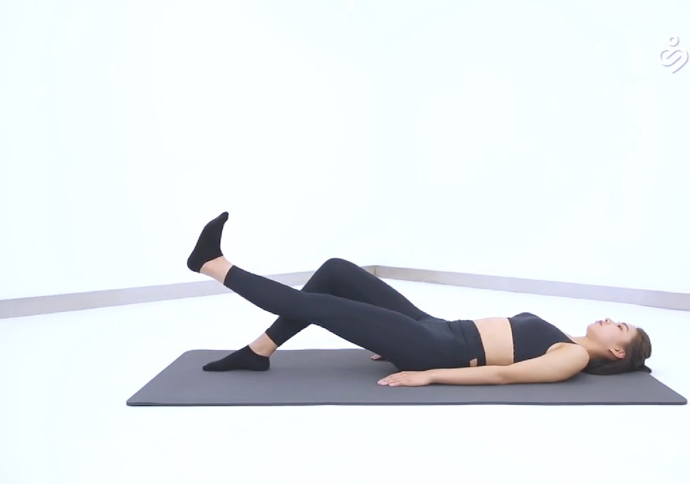
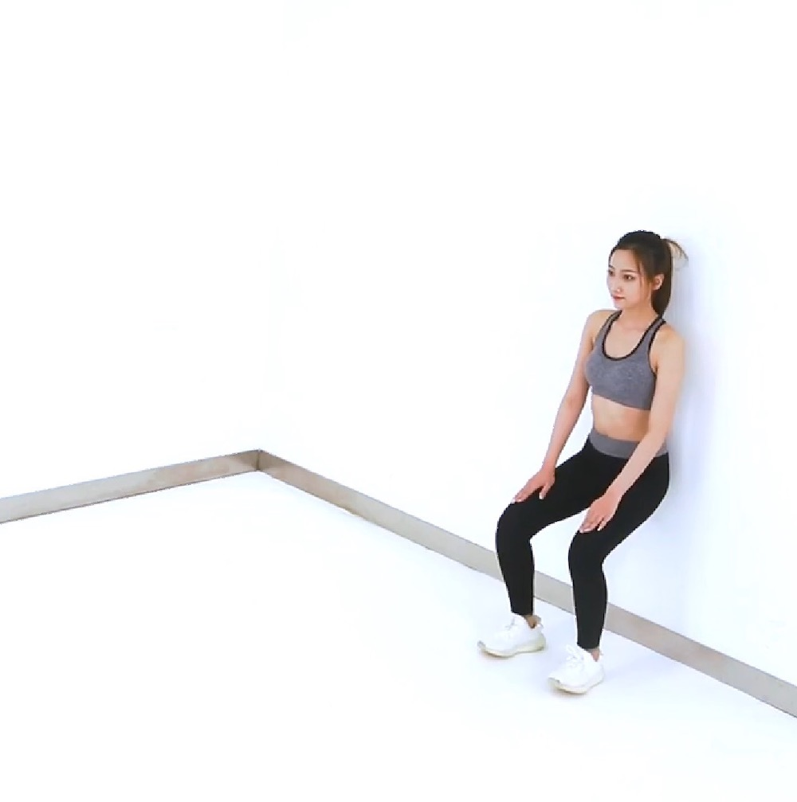

# 邵恒帮你问｜跑步会伤膝盖吗？
> 邵恒头条
2020-01-12

本期的 #邵恒帮你问 #，我们邀请了得到上《给忙碌者的骨科医学课》的主理人，赵辉老师。赵辉老师是一名骨科副主任医师，是第二军医大学的骨科博士，在骨科方面非常权威。预告发出后，我们收到了很多用户的提问。其中，跑步健身、颈椎腰椎问题、老年人运动这三类问题受到了最多关注。今天的节目，我们就请赵辉老师就这三类问题进行解答。

## 01

杨嵩旭 woody：

我喜欢跑步，平时每两天一次 10 公里，每年参加一次马拉松。但是我很担心膝盖磨损，到老年后会产生严重问题。想问赵辉老师，除了运动前充分热身，注意控制合理运动量以外，还有什么方法保护膝盖？

在我的课程上线以后，留言最多的就是关于跑步的问题，你的问题非常典型。

其实，在 2017 年 6 月，《美国骨科与运动物理治疗杂志》发表过一项对比研究。这项研究的结果显示，经常跑步的人，关节炎发生率仅为 3.5%，反而久坐不动的人，关节炎的发生率比经常跑步的人高出 3 倍，达到 10.2%。当然，如果是跑步竞技运动员，关节炎发生率比久坐的人还要高出 3 个百分点，达到了 13.3%。

所以，健身跑步对关节有益，但过量、高强度跑步又对关节有害。

那什么才是合适的强度呢？研究中提到了一个数据，每周跑步不要超过 92 公里就可以。所以，每周 92 公里就是上限，即便天天跑，每天不超过 13 公里就行。

不过，92 公里只是一个宽泛的上限，每个人的跑步上限还不一样。

有一个实用的办法判断运动上限：就是感觉自己的大腿有些酸胀，但是还没出现明显疼痛感的时候。这是因为在我们跑步的时候，肌肉会提供主要动力，维持膝关节的稳定。但肌肉会慢慢疲劳，这时软骨和韧带就开始承受更多的力。这两个部位弹性差，时间一长就容易被磨损。

当你的大腿有点酸，但是还没明显痛感的时候，这代表了你腿部肌肉力量刚刚用完，这个时候你还可以坚持坚持。一旦你觉得膝盖松垮垮的，就是明显的关节不稳定，需要马上停下来。

所以膝关节周围肌肉的能力影响了每个人的跑步上限。平时你可以刻意训练这部分肌肉，这样就能保护膝关节，让肌肉给相对脆弱的韧带和软骨「挡枪」。

要保护膝关节，我们常用的锻炼动作有两个。第一个是直腿抬高训练，非常简单。把腿绷直，抬起，不要弯曲，维持在空中 5 秒左右后放下，每组 10 到 15 个，间隔 1 分钟再做一组，每次做 3 组，可以早中晚各做一次。

第二个动作是靠墙半蹲。首先身体靠墙站好，目视前方，身体站直，向前迈出一只脚，距离大约控制在 30 厘米，然后另一只脚也做相同的动作，双足与肩同宽，身体慢慢往下蹲，手扶着墙，下到膝盖感觉有酸胀感的时候停止，就停在这个位置，坚持不要动，蹲 3 到 5 分钟。可以早中晚各做一次。这个动作的要点就是小腿一定要与地面垂直，而大腿与小腿的角度一定不要低于 90 度，最好是 100 度左右。

总之，保持适量运动，老年的时候你也可以拥有健康的膝关节。

## 02

枕霞新友：

我今年 63 岁，打乒乓球、游泳、跳广场舞是我换着玩的运动方式。最近感觉右腿膝盖总有酸胀感，跳舞不对劲，就改游泳，但有时候会有脚抽筋的现象。我想问赵老师，对于这个问题有什么解决方案？

在这么多的问题里，我特别欣赏这位用户的的运动观。虽然已经年过 60 岁，但还是喜欢各种各样的运动，而且经常「换着玩」，特别积极正面。

其实，骨骼肌肉运动系统就是为我们高质量的生活状态服务的，不能为了保护关节就拒绝丰富多彩的生活方式。所以，我希望您能一直保持这样好的心态，享受各种运动带来的乐趣。这个过程中出现的各种问题，让骨科医生来为您保驾护航。

您说的症状，主要包括膝盖的酸胀感以及脚抽筋。

先说第一个，膝盖酸胀。膝盖的酸胀感，尤其是上下楼梯、下蹲、长距离行走之后的酸胀，与软骨退变和肌肉功能下降有关。您可以从「减负」和「增能」两个方面来解决。

「减负」就是减少膝关节的负荷，通过控制体重、减少长距离的行走，减少爬山、上下楼和久蹲。很多人可能对下蹲没概念，其实我们下蹲时，膝盖上所承受的力是站立时的 4-8 倍。所以，下蹲动作也要减少。

「增能」，就是增强肌肉的强度。这和上一个问题里说到的，跑步时肌肉对膝盖的保护是一样的，您就可以用我刚刚说的两个常用动作来锻炼。

再说第二个症状，抽筋。抽筋其实需要分析具体原因。比如，低钙血症常常会导致抽筋，有可能是骨质疏松引起的，但这个概率不是百分百的。有时候，甲状旁腺功能不全或一些代谢性疾病，也会导致低钙血症。

当然了，老年女性最常见的还是骨质疏松，所以要常规补充钙片，而且还需要进行维生素 D 以及一些抗骨质疏松药物的治疗，以及适当的户外活动，才能维持骨质量不丢失。我在课里的第 7 讲，《代谢：日常补钙到底有没有用？》中有更详细的介绍。

其实，对于老年朋友来说，还有一种情况经常遇到，就是跌倒后骨折。您还需要保证良好的肌肉功能，来避免跌倒的发生。

我介绍一个简单的测试，就能评估您现在的肌肉功能。您坐在一个 40-50 厘米高的椅子上，双脚着地，背部不要靠在椅背上，双手交叉于胸前，以最快速度完成 5 次连续的起立和坐下动作。如果您可以在 10 秒内能完成 5 次起坐，就说明您下肢力量和关节活动度较好，但如果有困难或无法完成，那么跌倒的风险就增加了。

为了确保老年之后多姿多彩的生活，你需要提升肌肉功能。肌肉是运动系统的动力来源，也是避免损伤和延缓退变的守门人，您一定要重视哦！

## 03

珞珞：

办公室人员长期肩颈痛，各种中医理疗，贴敷都用过，不好使，要怎么破？

现在，颈肩部和腰背部的劳损，发病越来越年轻化。很多二三十岁的办公室白领也会出现颈肩痛和腰腿痛，甚至颈椎病、腰椎间盘突出等等。这些症状的主要原因，就是工作的时候经常长期保持一个姿势不动。因此，最重要的防治方式就是养成良好的生活工作习惯。比如：把电脑垫高，维持平视或轻度仰视，避免弓背塌肩。坐的时间过长，就要站起来做一些伸展运动。当然，适当的体育锻炼也必不可少。

如果你已经出现了颈肩痛、腰背痛，首先要做的并不是进行中医理疗、贴膏药等，而是马上进行颈肩部、腰背部肌肉的放松。

最简单的方式，就是双手叉腰，肚子向前挺出去，同时头颈仰起，肩背部展开，维持 5 秒钟左右。这个动作站着和坐着都可以。如果这个动作可以舒缓疼痛，说明肌肉劳损并不是特别严重，但是必须要重视，注意劳逸结合。如果上述动作也无法缓解疼痛，还出现了手痛手麻、腿麻无力的表现，就一定要尽快去医院检查是不是椎间盘的问题。

对于椎间盘的问题，在课程的第四讲里有详细介绍。很多人在出现颈肩痛、腰背疼痛后，会去做按摩。在短期内，按摩确实有效，但如果不从根本上改变习惯，肌肉还是会损伤。特别要注意的是，请务必找正规技师。一些不正规的「正骨按摩」有很大风险，甚至会导致瘫痪。

赵辉老师确实给出了很多权威的医学建议，并且给了好几个锻炼的小方法。希望你都能维持好习惯，适度运动，拥有高质量的生活。如果你对骨科、运动还有什么问题，推荐你学习赵辉老师的《给忙碌者的骨科医学课》。

好了，这就是本期的 #邵恒帮你问 #。我是邵恒，我们明天见。

