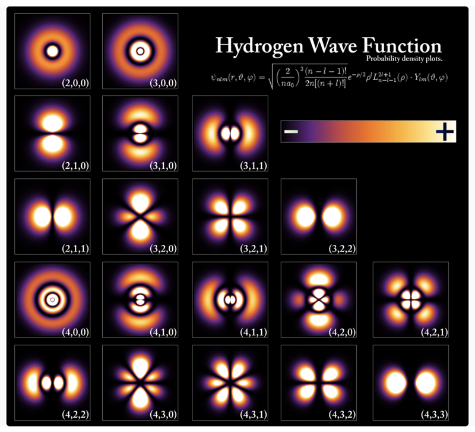

## 0109. 量子力学 9：世间万物为什么是这个样子

我们在这个系列的开头说了，哪有什么岁月静好，不过是微观的粒子们替你诡秘前行。现在我们的量子力学知识已经差不多可以解释一下，日常世界为什么是这个样子。

如果让你来设计一个电子游戏，在游戏中创造一个虚拟世界，你会怎么做呢？你要画一张大地图，在其中设定各种环境、生物、资源、法术和武器，你要让战斗中的物理和化学过程真实合理，你要精心控制游戏的平衡，你还必须把这个世界弄得非常美观可爱才行。为此你必须聘请很多专业人员，包括程序员、美工、编剧，甚至还要有经济学家和数学家。

但问题是你想过没有，我们生活的这个世界比任何电子游戏都复杂得多，可我们这个世界没有设计师！那我们这个世界是从哪儿来的呢？当然是演化而来的。

现在科学家有充分的证据说，从宇宙大爆炸一启动，这个世界根本不需要任何设计，就慢慢地、自行地演化出了万事万物，包括我们。而很多物理学家相信，只要我们把最根本的那几条规则找到，剩下的所有事情就都能用数学推导出来。

1-3『费曼的物理学讲义里也表达过类似的观点，世界本源的规则就那么几条，其余都是在这些「规则」上演化而来的。（2021-06-12）』

我们上一讲说到的量子电动力学，就是那些规则的一部分。量子电动力学是什么概念呢？我这么跟你说吧。引力，那属于广义相对论的范畴；原子核以内的东西，那涉及到更现代也更高深的物理理论 —— 不考虑引力、在原子核外面所有的万事万物，都归量子电动力学管。

掌握了量子电动力学，你就几乎把这个世界抓在了手中。

2『量子电动力学，做一张术语卡片。（2021-06-12）』—— 已完成

### 01

那你说怎么从量子电动力学理解整个花花世界呢？关键在于理解原子。

深受粉丝爱戴的物理学家理查德·费曼（Richard Philips Feynman），在《费曼物理学讲义》的一开头说，如果由于某种大灾难，所有的科学知识都丢失了，只有一句话传给下一代，这句话应该是什么呢？是「所有的物体都是用原子构成的」。

我们看看物理学家眼中的原子是什么样的。老百姓经常把原子想象成一个个的小球。你用扫描隧道显微镜观察金属的表面看到的就是排列整理的小球 —— 但是请注意，你看到的并不是真正的原子，你看到的其实是原子中的电子穿越空隙的 * 概率 *。

真实的原子，首先是一个非常、非常空旷的结构。原子核中一个质子的活动范围大约只有 10^(-15) 米，而原子核外面电子的活动范围大约是原子核的 10 万倍。如果让你画一个原子，你不管怎么画都会大大夸大原子核的大小。而电子就更小了 —— 你甚至都不能说电子有大小，最好把它想象成一个抽象的「点」，它的踪迹则是一片「云」，它在原子空旷的空间中神出鬼没。

而这就引出了一个关键事实：原子中并没有一个什么「实体」能跟你发生直接的接触。广阔空间中的两个点，怎么可能发生直接的碰撞呢？你永远都摸不到一个质子、中子和电子。

那你说我用拳头砸墙，为什么手会疼呢？我触摸各种物体为什么会有那么鲜明的触感呢？你感受到的一切，都是电磁相互作用。你手上的电子和墙上的电子都带负电，它们一离近了就互相排斥。根据不同的距离和温度，这个排斥力有时候强有时候弱，有时候密集有时候稀疏，而你的全部感觉都来自于这个排斥力。

你在日常生活中看到一根铁棍断裂了、汽车的车身被刮了一下，所有这些变化，以及所有的化学反应，都跟原子核没什么关系。化学家发明了各种理论描写这些现象，比如「化学键」之类，其实说的都是电子跟电子的对话。

1-2『这里竟然看到了「化学键」的本质：电子与电子间的「对话」。做一张金句卡片。（2021-06-12）』

用原子解释世界的关键，是理解原子中的电子。

### 02

电子在原子中是以什么样的状态存在的呢？我们已经知道，因为不确定性原理，电子并没有明确的轨道，它的踪迹是「电子云」。它如果留在固定的能级上就不会辐射能量，它不会掉落到原子核中去。而薛定谔通过解波动方程，就已经把电子的所有能级和对应的「云」都算出来了，像下面这样 —— 

1-2『上面的的电子「云」太赞了，放到微信里时常去看。一下子跟之前「重学」化学键的知识点关联上了，结构 => 化学性质，重学化学（有机化学）目前感觉是自己入门量子动力学的一个契机。（2021-06-12）』

我来给你解说一下。请注意电子云是有形状的，形状的深浅代表电子在一个地方被发现的概率大小。我们可以把云的形状理解成电子的「轨道」。描写氢原子电子的一个「轨道」状态，需要三个「量子数」。

第一个是「主量子数」n，代表电子所处的能级。从低能级到高能级，n = 1、2、3… 如此排列下去。能级越高，电子出现在那里的概率就越低。

第二个是「角动量量子数」l，代表电子轨道的形状。量子力学没有传统意义上轨道的概念，但是波函数有一定的形状，表现出来就是电子云的形状。薛定谔方程要求电子轨道的角动量是量子化的，也就是只能取有限的几个形状，l = 0，1，2, …，n-1。其中 l=0 对应的电子云是标准的球形，l 值越大电子云越扁。

第三个有时候被称为「磁量子数」，m = -l, -l+1, …, l-1, l，代表电子轨道的方向。

我们看上面图中，一说 (n, l, m) 是多少，电子的能级、轨道形状和方向就都出来了。后来有了自旋的知识之后，我们再把自旋量子数 s = ±1/2 加进去，就是四个量子数完全决定了电子的状态。

2『薛定谔方程中的这四个量子数，做一张术语卡片。（2021-06-12）』

氢原子是最简单的原子，它只有一个质子没有中子，然后只有一个电子。那么对于其他的原子，无非就是增加原子核里的质子和中子，原子核外面的电子，数学方法还是一样的，仍然是四个量子数决定每个电子的状态。

那么这就有一个关键问题。

为什么那些有多个电子的原子，它们的电子们都纷纷往外面排，为什么不是所有电子都挤在最低的能级上呢？薛定谔方程不是说越低的能级发生的概率就越大吗？

你要知道，越是大原子核，它的电量越多，它的最低能级的轨道半径就越小。如果所有电子都集中在最低能级的话，越是大原子，电子势力范围就会越小！这跟我们看到的可不一样。更重要的是，电子排列方式单一，会导致所有原子的化学性质都差不多，那就根本不会有什么复杂的化学反应，我们看到的就是一个非常没意思的世界。

那电子们到底为啥不挤在一起呢？

原因正是你在中学学过的那个「泡利不相容原理」。

### 03

沃尔夫冈·泡利（Wolfgang Ernst Pauli）泡利出生于 1900 年，是个少年天才。泡利 19 岁的时候在慕尼黑大学念研究生，爱因斯坦去做报告，他当场就敢站起来指出爱因斯坦的错误。泡利 20 岁写了一本《广义相对论》，爱因斯坦一看就说他是把相对论讲得最明白的人。

泡利给马克斯·玻恩当过助手，在哥本哈根跟玻尔和海森堡他们一起工作过一年，算是哥本哈根学派的人物。泡利听说了自旋之后，立即意识到自旋对电子在原子核之外的排布有关键作用。他在 1925 年提出了「不相容原理」。

泡利不相容原理说，一个原子的任何两个电子的四个量子数，不能完全相同。

正是因为这个原理，电子们才不得不一个一个往外排。比如说对于最低能级 n = 1，因为 l 和 m 只能是 0，电子就只剩下自旋量子数 ±1/2 这两个选择，所以最低能级上只能排列两个电子。以此类推，泡利不相容原理要求电子们一层一层地排，一直排到最外层。正是因为这种排法，大原子的势力范围才能越大，也才能有了常常是由外层电子决定的各种化学性质。

世界如此多姿多彩，多亏了泡利不相容原理。

### 04

那你可能又要问了，泡利不相容原理的原理又是什么呢？电子们又不认识泡利，它们为什么非得遵守这个规则呢？

根本原因还是自旋的数学。所有基本粒子可以分为两类。一类叫「玻色子」，它们的自旋是整数。像光子就是玻色子，自旋是 1。玻色子是「力」—— 也就是「相互作用」—— 的传播者，像胶子、介子、希格斯粒子和想象中的引力子都是玻色子。另一类叫「费米子」，它们的自旋是半整数，也就是 ±1/2、±3/2、±5/2 这种，费米子是力的感受者。像电子、质子、中子都是费米子。

而在数学上，我们可以证明，由一组玻色子组成的系统，它的波函数一定具有交换对称性。也就是说你把其中两个粒子调换一下位置，波函数不变。而由一组费米子组成的系统，它的波函数具有反对称性，你调换位置会让波函数改变正负号。为啥呢？其中的数学细节我们就不详细讲了，大致来说，交换就相当于旋转，而费米子转一圈转不回来。

因为费米子波函数的这个反对称性，它在对称中心点的取值就必须是 0。中心点是什么点？正是所有量子数都相同的点。因为波函数在这里必须是 0，所以费米子的量子数不能完全相同。

所以泡利不相容原理的本质就是，「两个全同费米子的波函数，一定是交换反对称的」。

简单来说，

之所以有化学，是因为泡利不相容原理。

之所以有泡利不相容原理，是因为费米子波函数是反对称的。

之所以费米子波函数是反对称的，是因为自旋。

之所以有自旋，是因为量子电动力学。

设定了量子电动力学，你就设定了原子核以外的世界。

### 05

那如此说来，一个海森堡不确定性原理一个泡利不相容原理，一个薛定谔方程一个狄拉克方程，量子力学至此可以说是已经大功告成啊。原子现在不是问题了！开尔文男爵 1900 年说的两朵乌云已经都解决了。万事万物再一次各安其位，那物理学家是不是应该都获得了内心的平安呢？

并没有。至少有些人没有。有些人要求，对波函数到底是怎么回事，量子世界的种种怪异行为，必须有一个让人信服的解释才行。

可是你越解释，就越觉得整个量子理论非常诡异。

泡利在物理学家中以爱给人挑错和直言不讳的批评著称，人称是「物理学的良心」。据费曼说，如果你做报告的时候泡利听着听着睡着了，你应该对此感到高兴 —— 这说明你的报告中没什么错误，泡利允许你继续讲下去……