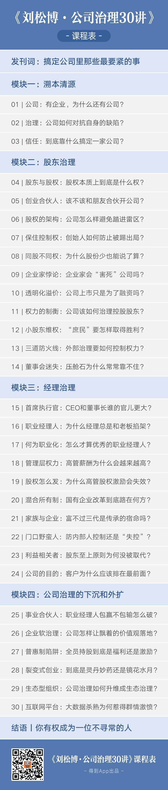

# 发刊词 | 搞懂公司里那些最要命的事
> 刘松博·公司治理 30 讲
2019-09-08

很多人第一次听到这门课程的名字，总是问我，为什么叫公司治理，不是叫公司管理，治理和管理有什么区别？

## 01. 中国制造业的十字路口的两家企业

为了讲清楚这个问题，我请你跟我回到 1995 年，那是中国制造业的一个十字路口，你会看到有两家伟大的公司在这个路口分道扬镳：在一场轰轰烈烈的权力大战后，联想彻底放弃了芯片的技术研发，总工程师倪光南被免除职务；就在同一年，华为的总工程师郑宝用，悄无声息地组建了中央研究部，开始规模化研发芯片。请问你是支持联想的柳传志还是华为的任正非呢？

在今天看，你可能会说，这没有争议啊，华为芯片取得了这么大的成绩，当然是任正非正确，甚至很多人都因为华为的成绩而去批评柳传志当年急功近利。事后诸葛亮总是很容易，我们如果只是看 1995 年那个时间点的话，其实比较任正非和柳传志是不公平的，原因很简单，因为他俩的身份是不同的。

你现在可以假设自己是当年的柳传志，你的身份其实只是一个职业经理人，联想是一家百分百股权属于中科院的国有企业，虽然你有充分的管理自主权，但是你并没有最高的权力。还是要向中科院汇报，你的职责是维护股东的利益，而倪光南的打法在市场上已经越来越吃力，前两年给股东带来很大损失，并且看不到转好的可能。你发现芯片行业需要无底洞一样的投入，又需要不断的快速应变，就算你想做，以当时国有体制的效率也根本不可能支持。加上在前一年，也就是 1994 年，香港联想上市，你还面临着资本市场对于利润要求的压力。

好，在这样的局面下，请问你还会选择继续发展芯片业务吗？倪光南出局，股东代表和董事们都是赞成的，说明柳传志是在当时是尽到了对股东的忠诚义务的，这并不是道选择题，而是你的责任。

再来假设如果你是任正非，华为的股权结构是封闭的，你不会受到资本市场的影响，作为民营企业老板，你有按照自己的意愿和理想选择战略路线的权力，但也因为公司是你自己的，如果失败你的利益损失会非常大，你要用自己的身家性命来赌，你会怎么选？任正非选择了舍命投入，这也是我们今天佩服他的原因。

这么看，柳传志和任正非是两种不同风格的企业家，一个承担股东重托，稳健发展，一个是为了实现目标，不计代价，这个不同，表面看跟两个人价值观念和风险偏好程度不同有关，但其实更重要的是因为公司股权结构的不同，还有他们两个人在其中的身份不同，一个是经理人，一个是大股东。

## 02. 公司治理的核心内容

公司治理课程核心内容出现了，简单记就是两类人和两件事儿，两类人就是经理人和股东，你所知道的董事会、监事会，还有其他的各种治理的要素，都是围绕他们这两类人存在的；还有两件事儿，就是跟这两类人相关的权力和利益的确定，简单说就是权和钱的规则问题。

治理这个词，英文叫 governance，大概有统治、支配、管辖这样一些意思在，它能用在很多领域，比如国家治理、政府治理、社会治理，具体的内容都不相同，以后你看到治理这个词，马上要反映出来，这是关系到顶层的规则设计问题的大事儿。

你看，公司治理中的两类人，股东和经理人，两件事儿，权和钱的分配规则，是不是都是一个公司最根本的了。这些人和事儿组成了公司的 DNA，它决定了一家公司的精神气质，也决定了公司战略和管理决策的制定逻辑。华为和联想在 1995 年那个十字路口一个左拐，一个右拐，背后的深层原因其实是他们在治理层面有根本的不同，这也塑造了它们这二十多年来的发展路径。

这样区分公司治理和公司管理也就容易了，一个公司的高层经理之上是治理，治理是顶层的事儿；高层经理之下是管理，管理就是在高层经理的带领下，基层、中层和高层一起为了共同的目标努力的过程，像营销、财务、研发、生产运营、人力资源这些都属于管理的范畴。

你可以记住这样一个比喻，如果公司是一棵大树，治理就是树根，管理就是输送养分的树干，而表现出来的销售业绩、股价这些就是树的花花果果。为什么很多明星企业会变成流星企业，花花果果好看，树干也没问题，但是树根烂了，树很快就会倒下，所以治理问题是公司中最要命的事儿。中层、基层再能打，架不住顶层不健康，再举个不恰当的比喻，就像岳飞带领的岳家军再天下无敌，但是大宋朝当时问题的根儿在朝堂之上，是新老皇帝这些股东之间，还有秦桧这些高管出了问题，中层再强也无济于事的，甚至中层没有深刻理解治理问题，自己把命都搭上了。

讲到这里，学习我们这门课程的意义也就出来了。在任何一个正规商学院的课程设计上，公司治理都会是最核心的必修课程。为什么说是最核心呢？因为在商业世界这个大舞台上，公司是当之无愧的主角，商科的课程都是围绕公司展开的，而如果没有我们这门课程中的这些人，这些规则，就不会有一家家具体的公司。

不管你带着怎样的角色进入这门课程，公司都是你身边熟悉的陌生人，公司治理都是你应该掌握的知识。如果你是普通的员工，你可能很少站在顶层的角度去看待公司，那就会错失更完整的公司图景；如果你是公司中层，要记住岳家军再能打，看不透治理问题也可能会伤害自己的职业生涯；如果你就是股东或者是高层经理，你更需要顶层设计的知识和能力；或者如果你是被授予了股权或者可能被授予股权的员工，你有必要从治理的角度重新认识自己的股东身份；就算你不在任何公司里面工作，你也被公司包围着，也是公司生态的一部分，你总需要了解一下公司这个深刻影响你所在社会的组织形式如何运作的，这个被称为人类历史上最伟大的制度发明是如何诞生和发展的。

## 03. 为什么得到请我来上公司治理课？

我来自中国人民大学，这所学校在商科的研究和实践方面，有着非常深厚的历史积淀。华为基本法、华侨城宪章这些著名的公司顶层设计文本，都是我们学校前辈学者的贡献。

秉承着人民大学理论联系实践的传统，我本人也是知行合一的信奉者和践行者。我已经在人民大学开设公司治理相关的课程快 15 年了，在理论上，我曾经在美国 MIT 斯隆管理学院访学，学习最前沿的学术知识，你可以经常在国际顶级的学术期刊和学术会议上看到我的论文。在实践上，这些年我辅导过的企业怎么也得上百家了，而且我辅导的企业类型很多，这里面既包括像壳牌这样的跨国公司，中建这样超大型的国有企业，也包括各种各样正在发展中的民营企业，同时我也是 A 股上市公司的独立董事。

因为我接触的企业多，所以我很清楚今天的中国正处在历史上差异化最大的年代，你能看到这边高端写字楼里的互联网公司满嘴别人听不懂的 DAU、PCU，立志上市迎娶白富美，走向人生巅峰，但是另一边是最苦哈哈的制造业，老板想的可能就是怎么多招工人，少交社保，熬过这个经济寒冬；你能看到这边大企业整天玩的是生态思维、平台战略、网络效应，但那边的小企业还在挣扎于合伙人互撕、经理人背叛、股权结构怎么设计，这些不同的公司面临的治理问题都不相同。

而我们在学校里面学习到的传统公司治理教材基本上是以介绍美国的经验为主，尤其是以股权分散的上市公司作为样本展开的，在面对中国这样独特的、复杂的治理环境的时候，往往不是太适用。

## 04. 这门课的设计

考虑到这些，我在选择我这门课程的案例时，特别做了设计，除非特别必要，主要的案例大都会是我们中国本土的案例，就是你身边可见的企业。

而且我课程的主线基本是按照公司演进的过程来设计的，力图涵盖不同发展阶段的公司，让你对公司治理有个全景的认识。具体来说，这门课程有四个模块，

第一个模块，我要带着你破除对公司和公司治理的一些认知误区，建立起你对公司治理的认知模型；

第二模块是股东治理，我会从怎么找创业合伙人，怎么搭建公司股权架构开始讲，一直讲到上市以后公司治理面对的各种难题，和你理清股东间的权力与利益关系；

第三模块是经理治理，股东自己管理不好公司了，就要找经理人来帮忙，这一模块就会讲到关于经理的选人机制和激励机制，其中也会谈到家族企业和国有企业这样一些特殊的治理问题。

第四模块是公司治理的下沉和外扩。我会谈到现在特别流行的事业合伙人、内部创业、员工股权激励等等打法，这些都是让公司内部的治理进一步下沉到中层和员工。我还会谈到公司今天正在生态化、平台化，公司治理不再局限于企业内部，而是向外扩展到生态治理、平台治理。这个模块的内容都是传统公司治理教材没有涉及的内容，但却是我特别想跟你分享的。

接下来我们课程的第一讲，我就要带你来看看这门课程的主角，公司。

得到的平台上已经有了管理学、财务、组织行为这样基础的商科课程，现在介绍公司这个主角本身的课程终于出现了。欢迎你现在就加入，跟我一起来学习公司治理，走进你身边这个熟悉的陌生人。

