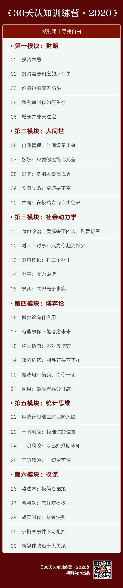

# 发刊词 | 寻找自由
> 30 天认知训练营·2020
2020-01-09

《30 天认知训练营》又跟你见面了，这已经是第三年。

学习过前两期训练营的同学，已经很了解。我向新同学再介绍一下，我是财新传媒的总编辑，每年春节期间开设这门 30 讲的认知训练营，向你交付我在这一年间的认知收获。

## 01. 实时、全面、补短板

得到的朋友们总跟我讲这门课有点特殊，我原来不甚解其意，一年一年过去，我越来越明白了：它不对应着某一个特定领域，不专门训练某一项特殊技能，它对应着的是一个人实时的、全面的认知成长，侧重于补短板，消破绽。这个人就是我自己。

所谓实时的认知成长，指的是我读一年的书，当一年的总编辑，作一年的思考、判断、决策，年复一年，砥砺磨练。

所谓全面的认知成长，是因为我的工作不容我受领域的局限，真实世界里的重要事件不是按事先规划好的领域来发生的。家事国事天下事，事事关心。很幸运，这句话在我这里很贴切。

布被秋宵梦觉，眼前万里江山。冲击每天如期而至。最触动人的现实及与之最贴近的理论，在我眼前或者激烈交战，或者水乳交融，我寻找，比对，印证，思考，结晶，用来指引自己，然后消消毒放在这里。

所谓补短板，消破绽，我曾经在过往的认知训练营里介绍过索普（Ed Thorp），那个既战胜赌场又战胜市场的人。他为什么既能又能呢？有条关键经验，就是要始终保持理性，不是只在某个科学领域里保持理性，而是在与世界打交道的所有方面都保持理性。用普通话来说就是没有短板，不是那种在一个局部是天才，却在另一个局部是傻子的人。

这经验对你我也成立。你我可能有多大的成就，固然是主要取决于你我的长处有多卓越；但你我事实上能不能充分释放出自己的长处，则主要取决于你我的短板有没有补上。补足短板，方能尽展所长；没有破绽，才是人生进阶的正途。《30 天认知训练营》能帮到你。

## 02. 学习这门课，你能收获 ——

今年这 30 讲分为财略、人间世、社会动力学、博弈、统计思维、权谋六大模块。具体讲哪些内容，你自己拉下去看目录。这里从另外的角度讲讲我关心的三个层次：

第一层，我会讲解一些好的思维、判断和决策模块。

思维总归是要模块化的。认知的成长，首先就意味着我们将无限发散的可能，在现实的刺激和理论的指引下，收束成可引用、可复制、可执行的快捷方式。

第二层，我会提醒你，好的模块只是第一步，接下来是调用问题，就是什么情况下调用哪个模块。

打个比方，我近来故意把智能手机和得到阅读器放在一起，然后有意识地在大脑中置入一个简单得不能再简单的模块：但凡我想刷手机杀时间的时候，伸手过去拿手机，那么就转而拿起得到阅读器。这肯定是个相当好的模块，但它可绝对不是普遍适用的：如果我伸手拿手机是想报火警 119 呢？

刚才讲的像是笑话，但本质不是笑话，同样的例子可以举出无穷无尽：忠诚是个好模块，但错误调用就成了盲从；同志情谊是好模块，但错误调用就成了狼狈为奸；互相帮助是个好模块，但错误调用就成了幕后交易。现实中，那些操纵人心的种种套路，往往就是用发出似是而非的信号，来激发人们在好模块中作出错误的调用。

第三层，哪怕是掌握了许多好模块，又洞察其调用机制，使得你我不至于简简单单地就被他人所操纵，但这仍然不是全部，还剩下一个更关键的问题：怎样免于被命运所操纵？我把它叫作自由。

卢梭说，人生来自由，却无往不在枷锁之中。他给出的解决方案是这样的：如果人服从自己制定的律法，即是自由。

孔夫子从另一个方向给出的回答与此相似：从心所欲不逾矩。虽然不可能获得完全的自由，但如果你我能洞察不自由的真相，却仍然能自主创造，并自主选择接受哪种不自由，那就算是获得了自由。关键词是「自主」：自主创造，自主选择。

## 03. 感性 - 理性 - 教养三元方程

你、我、他，我们每个人的自由都是个三元方程，由感性、理性与教养三个因子塑造。我们无法没有感性，不能缺少理性，又总是成长于家庭、社会的教养之中。

单个因子一个个看过去，感性本身靠不住，它往往驱使我们在激情之中做下后悔终生的事情；理性本身也靠不住，它往往使我们过于冷静算计，以至于选择猥琐，把自己也把他人锁定在陷阱之中；同样地，教养本身也靠不住，它将特定观念注入我们的灵魂，将特定行为印制成我们的肌肉反应，然后就让我们忘记这些观念和行为本来是为了什么。

感性、理性、教养，没有哪个单独而言是靠得住的。得在感性 - 理性 - 教养组合起来的三元方程中，每个人使用属于自己的参数，惟精惟一，步步惊心，寻找属于自己的自由。

《30 天认知训练营》是我在过去一年认知进阶的凝聚和记录。我在认为最迫切的地方补短板，消破绽。欢迎你加入，同路，见证，进步。

