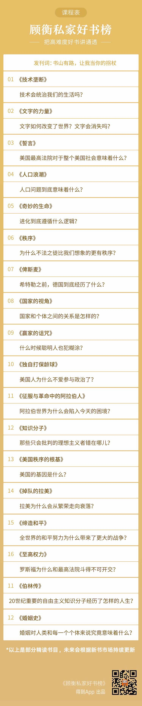

# 发刊词：书山有路，让我当你的拐杖
> 顾衡私家好书榜
2020-01-12

你好，我是顾衡。在接下来的 52 周里，我希望你能给我个机会，让我每周给你介绍一本书。

你可能有个问题，顾衡是谁啊？

不用搜了，跟你坦白，顾衡其实是一个笔名，这样我也更自由和放松一些。我更希望你关注我说了什么，关注这些有意思的书。用了笔名以后，我会毫无保留地，把这些年我思考过的问题，和我读书的经验，用最好的方式分享给你。

好，现在，咱们就算认识了吧！

接下来说重点，咱们读什么书？怎么读？

先说选书吧，标准非常简单，就三条：

都是社科类的好书，作者水平得高，要选他的代表作；

好看，你如果有时间读一读，要能体会到乐趣；

基本都是新出版或再版的。

我选的这些书啊，一方面，很好读，读这些书，本身就能给人带来快感；但另一方面，又不好读，因为它们谈的都是人类社会的大问题，文本和结构精密巧妙，要读透，可要花很多时间和精力。

我一直在想，这些好书，怎么才能更好地讲它们呢？简单粗暴的推荐，没有用，直接提炼干货，给结论，几分钟读完一本书，我更不同意。只交代信息，没有了原书的结构，就像雨花石捞出来晾干，就黯然失色了。

而且，时代不一样了，讲法当然也不一样。古时候没有纸，字要刻在竹简上，可想而知，用词就得精简啊。哪像现在你回微信，「哈哈」两字不够，起码五个「哈」字，才显得不是假笑。一本纸书，我给把它变成一段音频，也就是完全不同的两个东西了。

思前想后，我有了个办法，就是重新建立知识之间的结构性，一本书，读出五本书、十本书的内容，把知识之间的关系呈现出来。你会发现，我这个读书节目，虽然每周都围绕着一本书，但有很大比例的内容，书里是没有的。

说到这，我给你举个例子，顺便也给你做个预告，就是我要介绍的第一本书，尼尔·波兹曼的《技术垄断》。

这本书结论不复杂，说电视和互联网这些媒介新技术出现之后，大家的智力就下降了，只会坐在沙发上看着屏幕傻笑。这样的社会，在波兹曼看来，就是赫胥黎的《美丽新世界》。为了廉价的娱乐，人们放弃了严肃的思考。

按照他的逻辑，现在电视看的人都不多了，都看手机，那就更糟了。手机就是《红楼梦》里的风月宝鉴，把我们每个人都变成了猥琐的贾瑞。贾瑞老拿着风月宝鉴看，最后感觉身体被掏空，就死了。

波兹曼为什么持这个观点呢？他说，文字是符号系统，对编码解码的智力要求很高，这就培训了人们的思考能力。改成用图像传递信息之后，图像传播没门槛，所以人就变浅薄了，变蠢了。

如果只是回答「《技术垄断》这本书讲了什么」，答案差不多就是这个了。但是，你满意了吗？你不满意。因为这个答案，既不能帮你纵向理解问题的来龙去脉，也不能横向把握我们所处的时代，徒增焦虑。我们读书要是一味接受，那是不对的，只接受内容清单，那就更不对了。

所以，我要给你讲：

他这个观点是怎么来的；

反对他的人怎么说。

首先，波兹曼说的这个问题，不是新问题。信息传播，是用嘴巴说、耳朵听好，还是用笔写下来、眼睛看好，这个争论，2000 年前就开始了，苏格拉底和柏拉图就各执一词。可见，这个不是一个简单的时代问题，而是跟人类认知模式相关的大问题。

接着，我再请出波兹曼的师傅麦克卢汉，介绍他最深刻的洞见「媒介即信息」，到底是什么意思。

其实，师傅是技术乐观派，认为传播的门槛越低越好，频次和数量越多越好；而徒弟却是技术黑，认为新媒介打败印刷机之后，破坏了人的思维能力。

这就完了吗？也还没有。谈论这个问题，我们还要说一说在思想史上大名鼎鼎的技术黑法兰克福学派。法兰克福学派现在还活着，他们还担心另外一个事，就是图像和语音太多了，就会全面入侵人的生活，就不是变傻那么简单的一回事了。

把这些都交代完，才能说这个问题讲得差不多了。这个结构感比《技术垄断》这本书要大。直接给结论、告诉你「这本书讲了什么」，那是把书越读越薄；而我这种讲法，就是把书越读越厚了。最重要的不是「干货」，而是更大的视野。

如果涉及到的书你都亲自读一读，那再好不过。如果你对某些话题没啥兴趣，就想听我聊聊？也不错。至少好多事儿的来龙去脉，你会有更全面和整体的了解。

我每周用三到四期音频来介绍一本书，都会用类似的方式：比如说有本书是讲美国最高法院的，我会先跟你聊聊美国的政治体制。再比如有本书是讲进化论的，作者古尔德你可能不熟悉，但是我跟你讲他的老对头你估计熟，就是写《自私的基因》的道金斯，这一对比，脉络就清楚多了。

不过我想告诉你，我这种讲法，用大量的背景知识搭建起一种结构，也不是完美的。我无时无刻不在担心，万一我的解释不是最优，甚至还有错呢？

所以，我希望你把我的节目当作一根拐杖，只要能帮你爬到山顶，就可以了。到了山顶之后，你把这根拐杖扔掉，或者拿它来打我几下，都可以。

如果你愿意从此去登这个知识的高山，我想对你也提个要求：就是去买一张世界地图，挂在墙上。地图很重要。比如咱们要聊，为什么墨索里尼能组建第一个纳粹政党？那就得往前捯饬，介绍第一次世界大战结束后，意大利作为战胜国想要多大蛋糕，又因为什么没分到。这个时候，有张地图，对你理解前因后果来龙去脉就会很有帮助。顺便，一年下来，对世界地理你也就了解个七七八八了。

最后，我要说句抱歉。就是我普通话说得不是太好，好多平翘舌搞不清楚。我在想，今后我可能会和你们当中的某些人成为朋友，我这些毛病，就请你包涵包涵吧。

