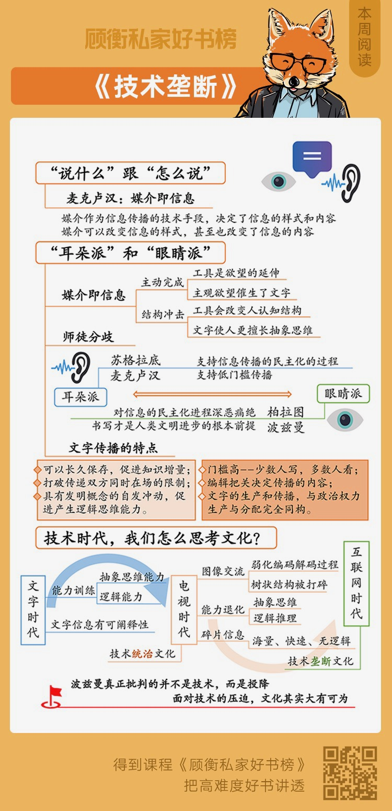

# 《技术垄断》1：说什么跟怎么说有关系吗？
> 顾衡私家好书榜
2020-01-12

我这个节目啊，按说是每周给你介绍一本新书，不过这开篇第一周，我给你介绍的其实就是一本旧书。是尼尔·波兹曼 1992 年写的《技术垄断 — 文化向技术投降》。但是 2019 年，中信出版社连同他之前写的《童年的消逝》和《娱乐至死》放在一起，作为「媒介批判三部曲」，一起再版了。

我们今天再来看，这三本书依然很重要。这三本书叫「三部曲」是有道理的。放在一起，才构成波兹曼连贯的思想体系。所以，干脆我就把三本书混在一起介绍吧。

这三本书连起来，要说中心思想，一句话也就说完了。就是《技术垄断》这本书的副标题：「文化向技术投降」。没错，你听出来了，尼尔·波兹曼这个人，就是一个彻头彻尾的「技术黑」，一辈子都在强烈批判技术的负面作用和黑暗面。

波兹曼的生平没有什么可介绍的，是一个很纯粹的学者。他在纽约出生、在纽约长大、在纽约的哥伦比亚大学读书，在纽约大学任教，2003 年在纽约去世。他一辈子都在讲一句话：小心新技术对文化的破坏。他自己也身体力行，一辈子不用电脑，甚至连打字机都不用，而只用纸和笔写作。

请注意，波兹曼这三本书都是上世纪八十年代和九十年代初写的，那会儿还没有互联网。他讲的新媒体新技术，可不是今天的互联网，而是电视。对，今天我们看起来已经是传统媒体的电视，对波兹曼那一代人来说，那可是横空出世魔鬼一般的存在。

波兹曼的担忧

我一个做电视的朋友就跟我讲，说当年他读电视专业的时候就很郁闷。电视文化理论的书，全世界也没有几本，最著名的就是波兹曼写的这几本，还都是说电视坏话的。我这朋友就说，考大学的时候还以为做电视得挺风光呢，没想到在文化圈子里，做电视的竟然处在鄙视链的最底端，连《知音》杂志的编辑都看不起他们。

但是看不起归看不起，电视还是一边被鄙视着，一边战胜了报纸杂志。电视普及之后，把字印在纸上进行传播的印刷机文化，衰落了。波兹曼是大学教授，象牙塔里的学者，当然是高度推崇印刷机文明，讨厌电视。报纸杂志书籍这些纸媒输给电视，这让他痛心疾首。

但更让他痛心疾首的是，和技术对抗到今天，文化不仅在结果上输了，心态也怂了。当年报纸杂志书籍被电视战胜的时候，输归输，心态没输。报纸杂志出版社的编辑们人倒在地，头还是高傲地抬着，倒在地上我也看不起你电视。但是面对互联网这个新技术的时候，文化甚至连鄙视技术的勇气和心态都没有了。

微博只允许发 140 个字，那我就不写长文章了，我写段子。今日头条只允许发 60 秒短视频，那我就拍 59 秒的小短片。在互联网时期，文化人对技术的心态已经从抗争走向了迎合。这才是让波兹曼最痛心的地方。

要说波兹曼有啥高的，那就不得不说到波兹曼的老师，大名鼎鼎的麦克卢汉了。我知道，说到这儿，人名有点多哈。但是如果你知道麦克卢汉，就明白，这个人不得不出场；如果你不知道，那就一定要知道一下。

麦克卢汉是一位大神级的学者，在传播学领域里，地位相当于物理学界里的霍金吧。传播学，顾名思义，是研究信息怎么从甲传递到乙的一门学问。那你说我不是搞传播的，麦克卢汉大神不大神的，关我什么事呢？

咱们还是拿霍金举例子，你不是搞物理的，你读霍金的书，可以帮助你理解宇宙的本质。而麦克卢汉呢？对于我来说，他给了我解读历史的全新视角。在我三观的塑造过程中，麦克卢汉的影响绝对是排前三的。

这就是我把一本讲传播学的书作为节目的第一期介绍给你的原因。

麦克卢汉：媒介即信息

好，咱们这一期就先说说师傅麦克卢汉。

麦克卢汉最核心的思想，或者说最深刻的洞见，就是五个字：「媒介即信息」。这五个字意思是说，媒介作为信息传播的一种技术手段，不仅决定了信息的样式，更决定了信息的内容。

我举个例子说明一下，媒介这个技术，怎么决定信息的样式和内容。

比如古时候，秀才张三要进京赶考。出门跟娘子拱手作揖，说「此去短则三月，长则半年，家里爹娘孩子和鸡鸭猪羊，就有劳娘子了」。娘子万福一个，夫妻二人就此别过。

别过之后呢，娘子就惦记啊，路上有没有遇到强盗啊？没遇到强盗遇到个崔莺莺更受不了啊！这么着，天天睡不着觉。睡不着也没办法。当时的条件，张三有良心，就写封信回家报平安。没有良心呢？没良心张三娘子也只能忍着。

搁在今天，还是张三，出差去北京，那就完全不一样了。飞机还没落地呢，娘子微信来了八条语音。「到了没？路上还顺利吧？」「北京冷不冷？出门让你带条秋裤你偏不带，冻死活该！」到了酒店房间包还没放下呢，手机又响了，「手机转一圈给我看看房间条件咋样」。张三心里明白，说是看房间条件，其实是看看有没有女人。

同样的这一对夫妻，因为媒介不一样，俩人之间的信息样式就不一样。古代张三用文字和娘子沟通，现在的张三和媳妇，用声音和图像沟通。这是信息样式发生了变化。另外，古代张三两口子，只要人分开了，信息就做不到即时回应。现在张三两口子，天南地北都没关系，通过手机，他们就可以像见面一样，你一句我一句地即时沟通。这也是一个非常重要的区别。

信息样式不一样了，那么信息的内容呢？麦克卢汉说，随着媒介的改变，信息的内容也不一样了。

写信，张三即使只是跟自己媳妇唠家常，也会前后有逻辑。比如「昨天走到徐州遇到大雨，只好在一个庙里住了一夜。孤衾寒枕，辗转难眠。想我张三，人到中年还没有考取功名，害得娘子一个人在家操劳，种地捡柴，喂猪烧饭，实在是愧疚万分啊」。你看，天气、住宿、心理活动、对妻子的思念和感激，都是层层推进，有条有理的。

要是两口子拿手机聊呢，那就完全不一样了。别说写信和手机之间的区别了，就是拿手机发微信和通电话，也会有很大的不同。比如张三娘子给张三发条微信，「下班带块豆腐回家」。这是用文字发微信。如果张三娘子是打电话跟张三说呢？内容很可能变成这样：「老公，下班带块豆腐回家，别忘了哈。啊呀家里手纸也快用完了，一起买了吧。哎，晚上想做麻婆豆腐来着，郫县豆瓣酱上次是不是用完了…… 算了算了，咱今天晚上到外面吃吧，顺便看看有啥电影。」

你看，一块豆腐的事儿，用打电话沟通，就很可能变成了 400 块的消费。家就是这么败的！

麦克卢汉认为媒介可以改变信息的样式，甚至也改变了信息的内容。这个观点，叫媒介环境论。

这个说起来好像很简单，其实是一门很深的学问。比如，麦克卢汉说的「媒介即信息」，意思是不是媒介完全决定了信息的样式和内容呢？如果不是，那媒介和信息之间究竟是怎样的关系呢？又或者，媒介新技术层出不穷，它的出现，又是被什么驱动的呢？媒介环境论，研究的就是这些问题。

在这些问题上，波兹曼和麦克卢汉是没有区别的。波兹曼是麦克卢汉的最优秀的学生嘛。不过，他又自称是麦克卢汉「不听话的孩子」，就是说他对麦克卢汉既有传承，也有修正。那么，师徒二人的分歧又在什么地方呢？咱们下期聊这个！好，我是顾衡，咱们下期见！

